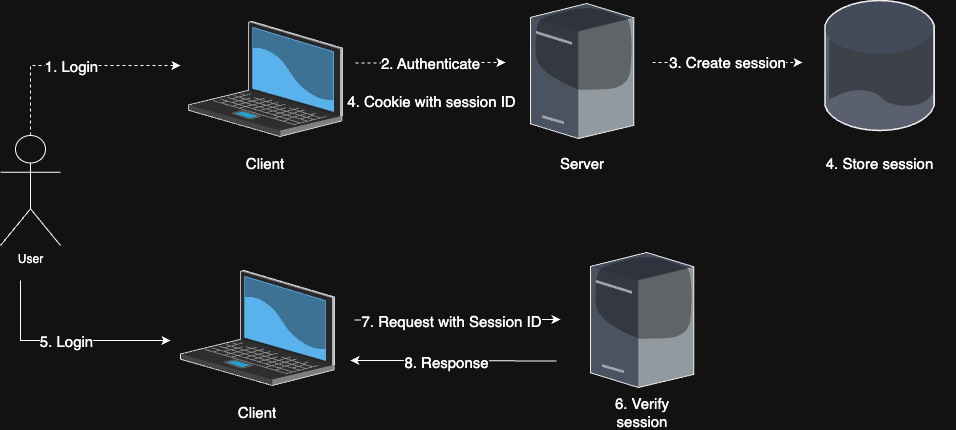

# Authentication

## Introduction

Authentication is the process to check whether user has an appropriate credentials to access data or use certain service.

> ### Difference between authentication and authorization
>
> Authentication indicates process to determine whether user officially has credentials for using service, whereas authorization indicates whether user has permission to access data or certain service.

### Stateless HTTP Protocol

HTTP protocol is [**<u>stateless</u>**](https://en.wikipedia.org/wiki/Stateless_protocol), which means server does not sustain any client state between requests, treating each subsequent requests independently.
In other words, server will forget all the information within request (including user's credentials) after it successfully sent response to client.
This is mainly due to improvement in performance, minimizing the time or bandwidth.

Therefore, we need to implement authentication methods for effectively maintaining users'

## Session Based

Session-based authentication is one of traditional stateful authentication methods with using session to keep up with user's authenticated status.

Under this method, server is responsible for creating and storing session data and uses session ID as a key to retrieve data.

### Flow

1. User sends authentication credentails to the server.
2. Server validates the credential information. If it's valid, then it creates session.
3. Created session will be stored in session store (database).
4. Server sends cookie with unique session ID to user.
5. User tries to use service where authentication is needed.
6. Each request will be sent to server with cookie.
7. Server verifies session from session store.
8. If session ID within cookie from request matches up with session ID stored in session store, server sends response with data.

### Advantages

1. Easy invalidation of session
2. Easy maintenance

### Disadvantages

1. Vulnerable to security attacks such as XSS and CSRF
   - As session-based authentication relies on cookies, it can be blocked or easily manipulated by malicious attackers.
2. Scability issues
   - As server needs to manage everything about session, there would be server strain.
   - Load balancing could be complex as sessions need to be maintained across multiple servers.
3. Some limited usage for certain cases
   - It is normally hard to handle on mobile platforms.
