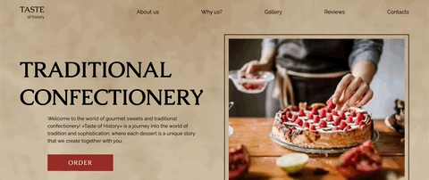
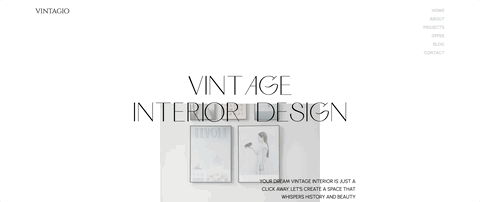
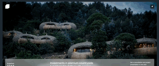

import { Cards, Image, Callout } from "nextra/components";
import { cloneElement } from "react";

# Welcome to Apensia's Devblog!

## About Me

Passionate and vigorous for learning something new and explore any new creative ideas.
Striving for building up new worlds with my one line of codes which will end up feeding for all.

## Portfolios

### Landing Pages

> Below portfolios are for demo purpose only and not used for actual commercial usage.

{/* prettier-ignore */}
<Cards>
    <></>
    <></>
    <></>
</Cards>

export default function MdxLayout(props) {
  return cloneElement(props.children, {
    components: {
      img: props => (
        <Image {...props} className="[aspect-ratio:12/6.3] object-cover" />
      ),
      a({ children, href }) {
        const { alt } = children.props
        return (
          <Cards.Card
            href={href}
            title={alt.replace(/ preview$/i, '')}
            target="_blank"
            rel="noreferrer"
            arrow
            className="!no-underline"
          >
            {children}
          </Cards.Card>
        )
      },
      p(props) {
        return (
          

        )
      }
    }
  })

}
