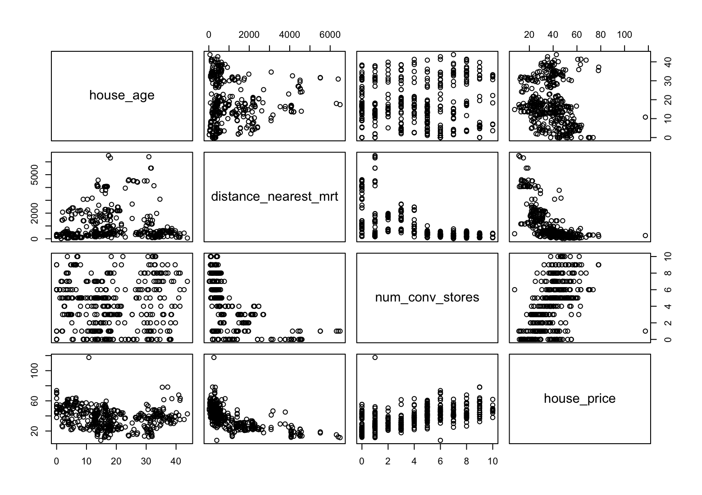
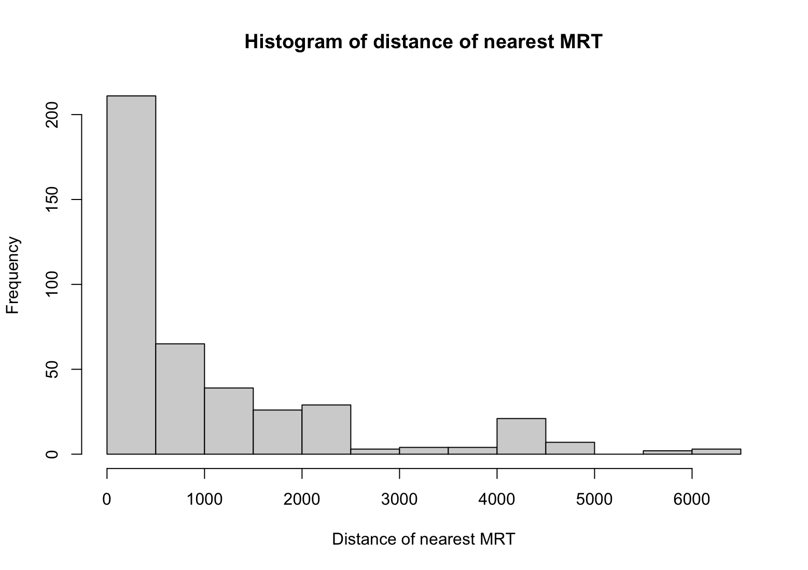
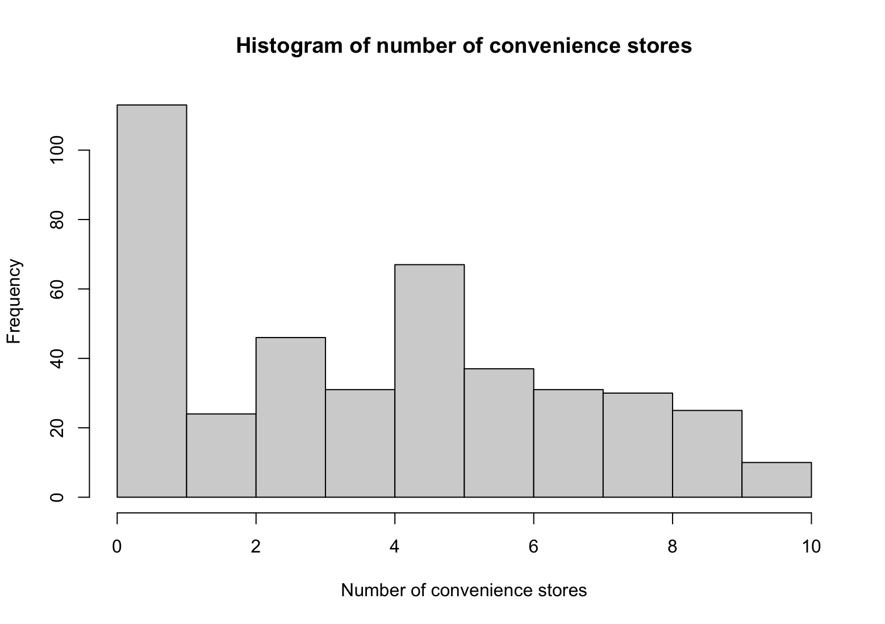

import { Code } from "../../../components/code";
import { Callout, Table } from "nextra/components";

# Multiple Linear Regression

## Definition

The statistical model to analyze the correlation between multiple independent variables and a single dependent variable.
Multiple linear regression can be written as below.

<br />

<center>
  $\LARGE y = \beta_0 + \beta_1X_1 + \beta_2X_2 + ... + \beta_iX_i + \epsilon$
</center>

where

1. $\beta_0$ indicates _intercept_, the predicted value of $y$ when $x$ is 0.
2. $\beta_1$, $\beta_2$, ..., $\beta_i$ indicate _regression coefficients_, the changing rate of $y$ according to $x$.
3. $\epsilon$ indicates _error of the estimate_, showing how much variation there is in our estimate of the regression coefficient.

## Usage

Multiple linear regression is useful when we want to analyze the relationship between multiple factors and depenent variable and figure out which independent varilables have the most influence on the dependent variable.

## Hypotheses

<br/ >

<center>
$\LARGE H_0$: **None** of the independent variables affect the dependent variable.

$\LARGE H_1$: **At least one** independent variable affect dependent variable.

</center>

## Examples

We will still be using the Real estate price prediction data used in [Simple Linear Regression](https://www.apensiablog.dev/statistics/simple_linear_regression#examples) post.

### Data preprocessing

We will be using the three following independent variables.

1. House age
2. Distance to the nearest MRT station
3. Number of convenience stores

and all above independent variables are continuous variables.

<br />

```r statistics.R
data <- read.csv("real_estate.csv")
data <- data[, -c(1, 2, 6, 7)]
colnames(data) <- c("house_age", "distance_nearest_mrt", "num_conv_stores", "house_price")
head(custom_data)
```

```txt
> head(data)
  no house_age distance_nearest_mrt num_conv_stores house_price
1  1      32.0             84.87882              10        37.9
2  2      19.5            306.59470               9        42.2
3  3      13.3            561.98450               5        47.3
4  4      13.3            561.98450               5        54.8
5  5       5.0            390.56840               5        43.1
6  6       7.1           2175.03000               3        32.1
```

### Data Visualization

#### Plot



#### Histogram



<center>Histogram of distance of nearest to MRT station</center>

We can see that most of the houses are close to MRT stations.

<br />



<center>Histogram of number of convenience stores</center>

We can see that most of the houses have at least 1 convenience stores nearby.

### Multiple Regression

We will be performing multiple regression where

1. Independent variables($X$) are `house_age`, `distance_nearest_mrt`, and `num_conv_stores`,
2. Dependent variables($Y$) is `house_price`.

<br />

```r statistics.R
result <- lm(data$house_price ~ data$house_age + data$distance_nearest_mrt + data$num_conv_stores)
summary(result)
```

#### Result

<br />

```txt
Call:
lm(formula = data$house_price ~ data$house_age + data$distance_nearest_mrt +
    data$num_conv_stores)

Residuals:
    Min      1Q  Median      3Q     Max
-37.304  -5.430  -1.738   4.325  77.315

Coefficients:
                           Estimate Std. Error t value Pr(>|t|)
(Intercept)               42.977286   1.384542  31.041  < 2e-16 ***
data$house_age            -0.252856   0.040105  -6.305 7.47e-10 ***
data$distance_nearest_mrt -0.005379   0.000453 -11.874  < 2e-16 ***
data$num_conv_stores       1.297443   0.194290   6.678 7.91e-11 ***
---
Signif. codes:  0 ‘***’ 0.001 ‘**’ 0.01 ‘*’ 0.05 ‘.’ 0.1 ‘ ’ 1

Residual standard error: 9.251 on 410 degrees of freedom
Multiple R-squared:  0.5411,	Adjusted R-squared:  0.5377
F-statistic: 161.1 on 3 and 410 DF,  p-value: < 2.2e-16
```

#### Analysis

##### Overall

1. Adjusted $R^2$ value is 0.5377. This means 53.77% of data fit for our multiple regression model.

<Callout>
  Usually the more independent variables are added, the more $R^2$ value we get.
  Therefore, it is better practice to use adjusted $R^2$ when we evaluate the
  multiple regression model.
</Callout>

2. p-value is 2.2e-16 which is way lower than 0.05. This means we can reject the null hypothesis,
   which means our multiple regression model is effective.

#### Non-standardized Coefficients

1. `house_age`
   - p-value is 7.47e-10 which is lower than 0.05. Therefore, we can reject null hypothesis and this means house age **affects** on house price.
   - Coefficient is -0.252856. This means house age and house price has **negative** relationship with house price and as house age increases by 1 unit, house price will _decrease_ by 0.252856.
2. `distance_nearest_mrt`
   - p-value is 2e-16 which is lower than 0.05. Therefore, we can reject null hypothesis and this means distance of nearest MRT stations **affects** on house price.
   - Coefficient is -0.005379. This means distance of nearest MRT stations has **negative** relationship with house price and as distance of nearest MRT stations increases by 1 unit, house price will _decrease_ by 0.005379.
3. `num_conv_stores`
   - p-value is 7.91e-11 whi is below 0.05. Therefore, we can reject null hypothesis and this means number of convenience stores **affects** on house price.
   - Coefficient is 1.297443. This means number of convenience stores has **positive** relationship with house price and as number of convenience stores increases by 1 unit, house price will _increase_ by 1.297443.

Meanwhile, coefficients for each independent variables are non-standardized coefficients. Therefore, analysis with non-standardized coefficients is as same as replying for below question:

> **What if \{variable\} is included in this model? And how does this single \{variable\} affect the dependent variable?**

In other words, we can analyze that whether or not each of single independent variables affect dependent variable, and if so, how much does it affect independent variable when included.
However, it does not allow us to take holistic view of how these all independent variables affect dependent variable in a broad sense.

#### Standardized Coefficients

In order to compare how much each independent variables has influence on the dependent variable, we would need to use standardized coefficients.

<br />

```r statistics.R
result2 <- lm(scale(data$house_price) ~ scale(data$house_age) + scale(data$distance_nearest_mrt) + scale(data$num_conv_stores))
summary(result2)
```

```txt
Call:
lm(formula = scale(data$house_price) ~ scale(data$house_age) +
    scale(data$distance_nearest_mrt) + scale(data$num_conv_stores))

Residuals:
    Min      1Q  Median      3Q     Max
-2.7417 -0.3991 -0.1277  0.3178  5.6822

Coefficients:
                                   Estimate Std. Error t value Pr(>|t|)
(Intercept)                      -4.883e-16  3.342e-02   0.000        1
scale(data$house_age)            -2.117e-01  3.358e-02  -6.305 7.47e-10 ***
scale(data$distance_nearest_mrt) -4.990e-01  4.202e-02 -11.874  < 2e-16 ***
scale(data$num_conv_stores)       2.809e-01  4.206e-02   6.678 7.91e-11 ***
---
Signif. codes:  0 ‘***’ 0.001 ‘**’ 0.01 ‘*’ 0.05 ‘.’ 0.1 ‘ ’ 1

Residual standard error: 0.6799 on 410 degrees of freedom
Multiple R-squared:  0.5411,	Adjusted R-squared:  0.5377
F-statistic: 161.1 on 3 and 410 DF,  p-value: < 2.2e-16
```

Below is the table of standardized coefficients and p-value for each independent variables.

<br />

<center>
  <Table>
    <thead>
      <Table.Tr>
        <Table.Th>NA</Table.Th>
        <Table.Th>Standardized Coefficients</Table.Th>
        <Table.Th>P-value</Table.Th>
      </Table.Tr>
    </thead>
    <tbody>
      <Table.Tr>
        <Table.Td>`house_age`</Table.Td>
        <Table.Td>-2.117e-01</Table.Td>
        <Table.Td>7.47e-10</Table.Td>
      </Table.Tr>
      <Table.Tr>
        <Table.Td>`distance_nearest_mrt`</Table.Td>
        <Table.Td>-4.990e-01</Table.Td>
        <Table.Td>< 2e-16</Table.Td>
      </Table.Tr>
      <Table.Tr>
        <Table.Td>`num_conv_stores`</Table.Td>
        <Table.Td>2.809e-01</Table.Td>
        <Table.Td>7.91e-11</Table.Td>
      </Table.Tr>
    </tbody>
  </Table>
</center>

1. To begin with, p-values for all independent variables are lower than 0.05. We can reject null hypothesis and can conclude that all factors **affect** the house price.
2. If we are to compare the absolute value of standardized coefficients of each independent variables, `num_conv_stores` has the highest value.
   This means that number of convenience stores is a factor that has the most influence on the dependent variable.
3. All of the standardized coefficients of each independent variables have _positive_ value. That means as any of independent variable increases, house price will increase as well.
