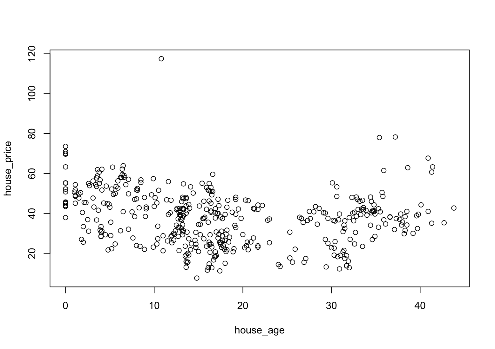
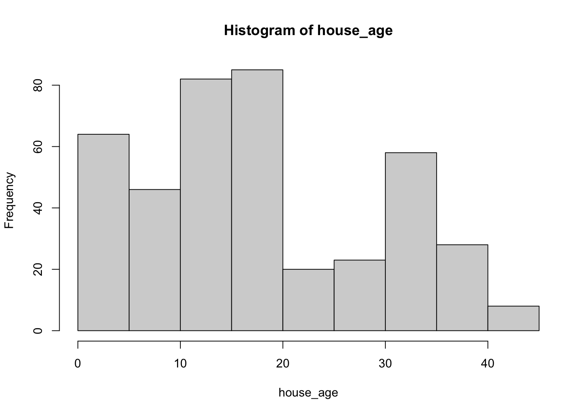

import { Code } from "../../../components/code";

# Simple Linear Regression

## Definition

The statistical model to analyze the correlation between a single independent variable (normally marked as $X$) and a single dependent variable (normally marked as $Y$).
Simple linear regression can be written as below.

<br />

<center>$\LARGE y = \beta_0 + \beta_1X + \epsilon$</center>

where

1. $\beta_0$ indicates **intercept**, the predicted value of $y$ when $x$ is 0.
2. $\beta_1$ indicates **regression coefficients**, the changing rate of $y$ according to $x$.
3. $\epsilon$ indicates **error of the estimate**, showing how much variation there is in our estimate of the regression coefficient.

<br />

<center>
  <figure>
    
    <figcaption>
      Source:
      [GeeksForGeeks](https://www.geeksforgeeks.org/ml-linear-regression/)
    </figcaption>
  </figure>
</center>

<br />

## Usage

Simple linear regression could be useful when we want to analyze the relationship between two quantitative variables where one variable ($X$) directly affects the other ($Y$).

## Conditions

1. _Linearity_: There should be a linear relationship between independent variable and dependent variable.
2. _Independence_: Errors (residuals) from each data should be independent, not affecting others.
   - For the simple linear regression, this condition is not effective as there is only one independent variable.
3. _Homoscedasticity_: The spread of data points around the regression line should be roughly the same throughout.
4. _Normality_: The distribution of the errors should be approximately normal (bell-curve shaped).
5. Both independent variable and dependent variable should be continuous variable.

## Hypotheses

<br/ >

<center>
$\LARGE H_0$: Independent variable does **NOT** affect dependent variable.

$\LARGE H_1$: Independent variable **DOES** affect dependent variable.

</center>

## Examples

We will be using [Real estate price prediction data](https://www.kaggle.com/datasets/quantbruce/real-estate-price-prediction) from Kaggle.

In dataset, I was wondering if the house age will affect house price or not because normally the older the house age, the lower the house price.

### Hypotheses

<br />

<center>
$\LARGE H_0$: House age will **NOT** affect house price.

$\LARGE H_1$: House age **WILL** affect house price.

</center>

<br />

### Code

#### Data pre-processing

I changed my current working directory to point the folder where my data file is lying.

<br />

```r statistics.R
getwd()
setwd("[Your data folder location]")

data <- read.csv("real_estate.csv")
head(data)
```

```txt
> head(data)
  No X1.transaction.date X2.house.age X3.distance.to.the.nearest.MRT.station X4.number.of.convenience.stores
1  1            2012.917         32.0                               84.87882                              10
2  2            2012.917         19.5                              306.59470                               9
3  3            2013.583         13.3                              561.98450                               5
4  4            2013.500         13.3                              561.98450                               5
5  5            2012.833          5.0                              390.56840                               5
6  6            2012.667          7.1                             2175.03000                               3
  X5.latitude X6.longitude Y.house.price.of.unit.area
1    24.98298     121.5402                       37.9
2    24.98034     121.5395                       42.2
3    24.98746     121.5439                       47.3
4    24.98746     121.5439                       54.8
5    24.97937     121.5425                       43.1
6    24.96305     121.5125                       32.1
```

<br />

Next, set the variables. For this, I set `house_price` as $Y$ dependant variable and `house_age` as $X$ independent variable.

<br />

```r statistics.R
house_price <- data$Y.house.price.of.unit.area
house_age <- data$X2.house.age
```

#### Data Visualization

##### Plot

```r statistics.R
plot(house_price ~ house_age, data=data)
```



It seems that there is no correlation between `house_price` and `house_age`.

##### Histogram (House age)



#### Simple Linear Regression

In order to get more specific result, let's actually perform simple linear regression.

<br />

```r statistics.R
result <- lm(house_price ~ house_age, data=data)
summary(result)
summary(result)$r.squared
```

### Result

<br />

```txt
> summary(result)

Call:
lm(formula = house_price ~ house_age, data = data)

Residuals:
    Min      1Q  Median      3Q     Max
-31.113 -10.738   1.626   8.199  77.781

Coefficients:
            Estimate Std. Error t value Pr(>|t|)
(Intercept) 42.43470    1.21098  35.042  < 2e-16 ***
house_age   -0.25149    0.05752  -4.372 1.56e-05 ***
---
Signif. codes:  0 ‘***’ 0.001 ‘**’ 0.01 ‘*’ 0.05 ‘.’ 0.1 ‘ ’ 1

Residual standard error: 13.32 on 412 degrees of freedom
Multiple R-squared:  0.04434,	Adjusted R-squared:  0.04202
F-statistic: 19.11 on 1 and 412 DF,  p-value: 1.56e-05

> summary(result)$r.squared
[1] 0.04433848
```

### Analysis

#### Overall

1. $R^2$ value is 0.04433848 (4.43%). This means 4.43% of variation in the $Y$ values is accounted for by the $X$ values.
2. p-value of this model is 0.000015605 (1.56e-05) which is lower than 0.05. This means that we can reject the null hypothesis ($H_0$).
   Therefore, we can say that <u>this statistical model is effective</u>.

#### Coefficients

1. Estimate of `house_age` has p-value of 0.000015605 which is lower than 0.05. This means that we can reject the null hypothesis ($H_0$).
   Therefore, we can say that <u>`house_age` _DOES_ affect `house_price`</u>.
2. Estimate of `house_age` is -0.25149. This means, `house_price` will _decrease_ 0.25149 per 1 increase in value of `house_age`.
   In other words, <u>the older the house, the lower the house price becomes by small percentage</u>.
