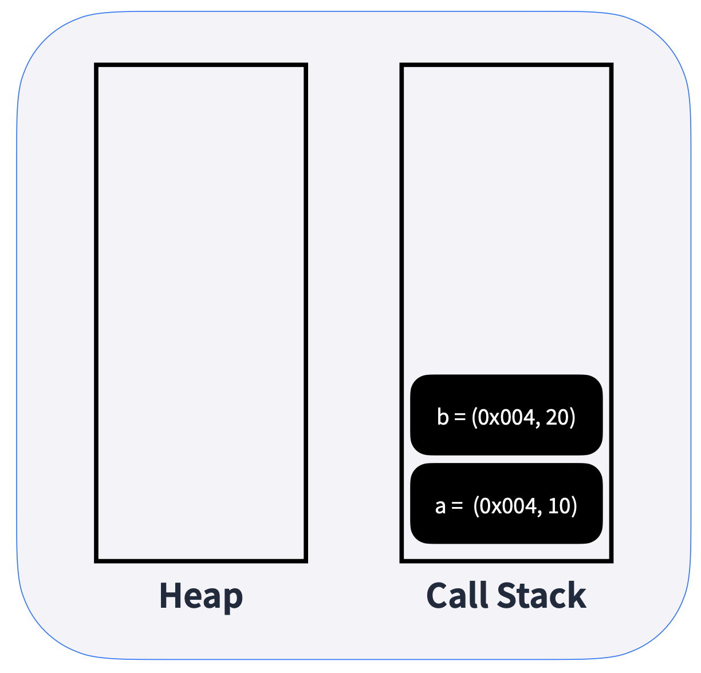
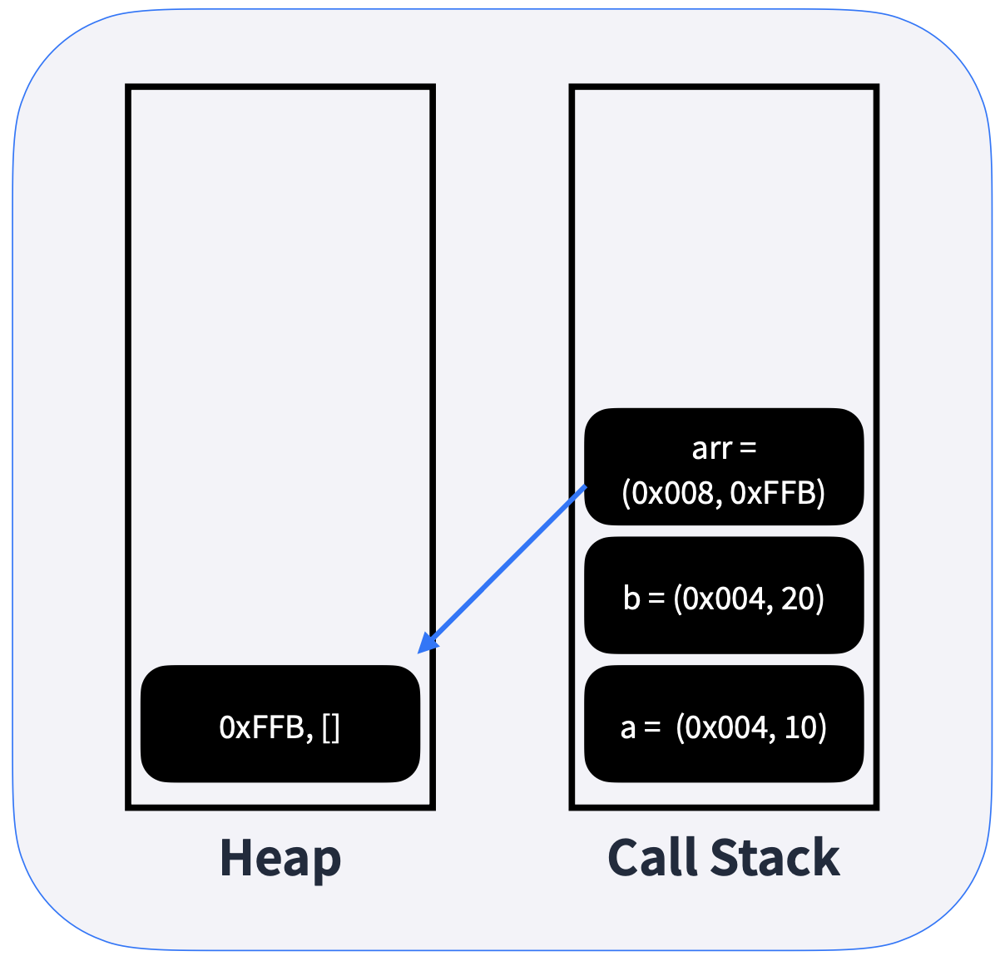

import Callout from 'nextra-theme-docs/callout'
import Bleed from 'nextra-theme-docs/bleed'
import { Mermaid } from 'mdx-mermaid/Mermaid'
import { SiJavascript, SiPython } from 'react-icons/si'

# 자바스크립트 기초 및 심화

자바스크립트의 기초 및 심화에 대한 지식을 나름 공부하여 정리한 글이다.

## 메모리

자바스크립트에서 어떤 변수에 값을 할당하게 되면

1. 변수에 고유 식별자를 생성하고
2. 메모리에 주소를 할당한다.
3. 할당한 주소에 값을 저장한다.

> 여기서 변수와 식별자의 차이점이라 하면
> 변수란 "변할 수 있는 데이터"를 의미하고, 식별자란 어떤 데이터를 식별하는 데 사용하는 이름, 즉 변수명을 지칭한다.

<br/>

<center>
    <figure>
        
        <figcaption>출처: Beta Labs</figcaption>
    </figure>
</center>

<br/>

### 다른 변수가 오게 될 경우

예를 들어 다음과 같이 변수를 하나 선언했다고 가정해보자.

```js
let variable = 1;
```

<br/>

만일 여기서 기존 변수에 새로운 변수를 대입을 하게 되면

```js
let variable2 = variable;
```

**새로운 변수는 기존 변수의 메모리를 참조하게 된다.**

<br/>

그렇다면 기존 변수를 조작하면 어떻게 될까?

```js
variable = variable + 1;
```

이 경우엔 두번째 변수의 값도 따라 변하는 것이 아니라 **새로운 메모리에 할당하여 값을 저장한다.** 그 이유는 <ins>자바스크립트에서 원시 타입은 불변하는 법칙을 가지고 있기 때문이다.</ins>

👉 원시 타입이 변경될 때에는 항상 새로운 메모리에 값이 할당되어 저장된다.

### 힙과 콜 스택

자바스크립트 엔진은 가상 머신으로 구성이 되어 있다. 이 가상 머신 내부에는 각각 힙과 콜 스택이라는 영역으로 구분되어 메모리 모델이 구현되어 있다.
힙은 참조 타입이, 콜 스택에는 원시 타입이 들어가게 된다.
그렇다면 변수나 배열이 선언이 될 때 자바스크립트의 가상 머신 내부에서 어떤 일이 일어나는지 알아보자.

<CH.Scrollycoding>

#### 변수 선언 시

<br/>
<center></center>

다음과 같이 `a`와 `b`의 변수가 선언이 될 경우 콜 스택에 스택처럼 하나씩 쌓이게 된다.

```js focus=1:2
let a = 10;
const b = 20;
const arr = [];
arr.push(5);
arr.push(3);
arr.push(1);
```

---

#### 배열 선언 시

<br/>

<center></center>

만일 배열이 선언이 될 경우 배열은 기본적으로 `object` 타입이기 때문에 참조 타입으로 분류가 된다.
배열을 선언하게 되면 힙에 배열 영역이 생성되고, 콜 스택에 생긴 배열 변수는 힙에서 생성된 배열의 메모리 주소를 참조하게 된다.

```js focus=3
let a = 10;
const b = 20;
const arr = [];
arr.push(5);
arr.push(3);
arr.push(1);
```

---

#### 배열의 크기

<br/>
<center></center>

힙 영역의 메모리는 동적으로 크기가 결정될 수 있다. 따라서 배열에 값을 추가하면 힙 메모리 영역에 그대로 할당이 된다.

```js focus=4:6
let a = 10;
const b = 20;
const arr = [];
arr.push(5);
arr.push(3);
arr.push(1);
```

</CH.Scrollycoding>

<br/>

### 메모리 정리

사용하지 않는 메모리를 옛날 자바스크립트의 경우 가비지 콜렉터를 통해 정리를 하곤 했었다.
현대에 들어서는 <a href="https://www.geeksforgeeks.org/mark-and-sweep-garbage-collection-algorithm/" target="_blank">Mark and Sweep 알고리즘</a>을 통해 이루어지고 있다.
이 알고리즘은 닿을 수 없는 주소를 더 이상 필요없는 주소로 정의하고 지우는 알고리즘이다.

<br/>

## 표현식과 연산자

### 표현식

표현식이란 어떠한 결과 값으로 평가되는 식을 지칭한다. 즉, **결과가 계산되는 식**을 의미한다.
숫자, 문자열, 논리값 같은 원시 값들을 포함하여 변수, 상수, 함수 호출 등 여러 가지 형태로 조합이 가능하다.

```js
// label 42
const a = 10 + 32;
// label 22
const b = a - 20;
// label "String3"
const c = "String" + 3;
// label 2
const d = true + false + true;
```

<br/>

### 연산자

#### 할당 연산자

할당 연산자란 오른쪽 표현식을 왼쪽 피연산자 값에 할당하는 연산자를 의미한다.
등호(`=`)를 사용하며, 다른 연산자와 같이 사용하여 복합 할당 연산자로 이용이 가능하다.

```js
let x;
// 할당 연산자
x = 10;

// 복합 할당 연산자
// label 15
x += 5; // 덧셈 할당 x = x + 5;
// label 10
x -= 5; // 뺄셈 할당 x = x - 5;
// label 100
x *= 10; // 곱셈 할당 x = x * 10;
// label 10
x /= 10; // 나눗셈 할당 x = x / 10;
// label 1
x %= 3; // 나머지 연산 할당 x = x % 3;
// label 16
x <<= 4; // 비트 왼쪽 이동 할당 x = x << 4;
// label 4
x >>= 2; // 비트 오른쪽 이동 할당 x = x >> 2;
```

<br/>

#### 비교 연산자

좌측 피연산자와 우측 피연산자를 비교하는 연산자이다. `true` 혹은 `false`를 반환한다.

```js
// 비교 연산자
const x = 10;
const y = 12;

// label false
x == y; // 동등
// label true
x != y; // 부등
// label false
x === y; // 일치
// label true
x !== y; // 불일치
// label false
x > y; // ~보다 큰
// label false
x >= y; // ~보다 크거나 같은
// label true
x < y; // ~보다 작은
// label true
x <= y; // ~보다 작거나 같은

// 타입 비교
// label true
"10" == 10; // 타입 비교는 무시한 채 값만 비교
// label false
"10" === 10; // 타입과 값 동시에 비교
```

<br/>

#### 산술 연산자

덧셈, 뺄셈, 곱셈, 나눗셈을 하는 연산자로써, `Number`를 반환한다

```js
// 산술 연산자
const x = 10;
const y = 12;

// label 22
x + y; // 덧셈
// label -2
x - y; // 뺄셈
// label 120
x * y; // 곱셈
// label 0.833...
x / y; // 나눗셈
```

<br/>

#### 논리 연산자

`Boolean`을 통해 참 혹은 거짓을 검증하는 연산자이다.

```js
// 논리 연산자
const x = true;
const y = false;

// label false
x && y; // AND
// label true
x || y; // OR
// label false
!x; // NOT
```

<br/>

#### 삼항 연산자

조건에 따라 값을 선택하는 연산자이다. `조건 ? 참 : 거짓` 꼴로 나타낸다.

```js
// 삼항 연산자
const x = 10;
const y = 12;

// label 200
x > y ? 100 : 200;
```

<br/>

#### 관계 연산자

객체에 속성이 있는지 확인하기 위한 연산자이다.

```js
// 관계 연산자
const x = {
    name: "bob",
    email: "bob@example.com"
};

// label true
"name" in x;
// label false
"gender" in x;
```

<br/>

#### `typeof`

피연산자의 타입을 반환하는 연산자이며, 문자열로 반환된다.

```js
// typeof
const x = 10;
const y = "String";
const z = false;

// label number
typeof x;
// label string
typeof y;
// label boolean
typeof z;
```

<br/>

## 흐름 제어

흐름 제어는 크게 Control Flow와 Data Flow 방식이 있다. 이 중 Control Flow는 조건이나 반복을 통해 상태를 제어하는 방식을 의미한다.

### 조건문

조건이 맞을 때에만 실행되는 문장(Statements) 문법이다.

```js
const a = 10;
const b = 20;

if (a < b) {
    // 참일 때 실행이 된다.
} else {
    // 무시된다.
}

if (a > b) {
    // 거짓이기 때문에 무시된다.
} else if (a === b) {
    // 거짓이기 때문에 무시된다.
} else {
    // 실행된다.
}
```

<br/>

허나, 다음 값들은 falsy한 값으로 모두 거짓으로 간주된다.
이는 반대로 생각하면 falsy한 값의 반대인 truthy는 모두 참으로 간주된다.

```js
if (false) { }
if (undefined) { }
if (null) { }
if (0) { }
if (NaN) { }
if ("") {}
```

#### `switch`문

괄호 안 값에 따라 분기되는 문법. `case`와 `default`라는 키워드가 함께 쓰인다.

```js
const grade = "B";

switch (grade) {
    case "A":
        console.log("A grade");
        break; // 쓰지 않을 경우 다음으로 넘어간다.
    case "B":
        console.log("B grade");
        break;
    case "C":
        console.log("C grade");
        break;
    case "D":
        console.log("D grade");
        break;
    case "F":
        console.log("F grade");
        break;
    default:
        console.log("Unknown");
}
```

<br/>

### 반복문

반복적인 작업을 지시하는 문법이다. 가장 기초적인 반복문으로써 초기문, 조건문, 증감문으로 이루어져 있다.
만일 조건문의 결과가 거짓이 되면 반복이 종료가 된다.

```js
for (let i = 0; i < 10; i++) {
    console.log(i);
}
```

<br/>

또다른 반복문으로 `while`이 있다. 괄호 안의 조건이 거짓이 될 때까지 반복된다.

```js
let x = 0;

while (x < 10) {
    x += 1;
    console.log(x);
}
```

`while`문과 다르게 `do`라는 키워드를 사용하게 되면 먼저 진입 후 로직을 실행한 다음 조건을 검사한다.

```js
let x = 0;

do {
    console.log("Fire");
} while (x > 10);
```

<br/>

## 스코프와 클로저

스코프란 유효 범위를 의미한다. 즉 <ins>**_변수가 어느 범위까지 참조되는지_**</ins>를 가리킨다.

```js
const a = 5; // 전역 변수

{
    const b = 3; // 지역 변수
    console.log(a, b);
}

// label Uncaught ReferenceError: b is not defined
console.log(a, b);
```

위 코드에서 상수 `a`는 최상단에 위치하였으며 전역 변수로써 작용하게 된다.
반면 상수 `b`의 경우 `{}` 안에 선언이 되었기 때문에 해당 스코프 내에서만 유효한 지역 변수로써 작용하게 된다.

<br/>

### 호이스팅

만일 키워드 `var`를 이용하여 변수를 선언하게 되면 변수 호이스팅으로 인해 개발의 오류를 야기할 수 있다.

```js
var a = 5;

{
    // 호이스팅으로 인해 변수 산언이 상단으로 올라가버린다.
    var a = 10;
    // label 10
    console.log(a);
}

// label 10
console.log(a);
```

<br/>

### 클로저

함수가 선언된 환경의 스코프를 기억하여 함수가 스코프 밖에서 실행될 때에도 기억한 스코프에 접근할 수 있게 만드는 문법이다.
다음 예시 코드를 통해 살펴보도록 하자.

<CH.Scrollycoding>

#### 지역 스코프는 사라진다

지역 스코프이기 때문에 함수가 종료되는대로 메모리에서 해당 변수는 사라지게 된다.

```js focus=2
function makeGreeting(name) {
    const greeting = "Hello, ";

    return function() {
        console.log(greeting + name);
    }
}

const world = makeGreeting('World!');
const bob = makeGreeting('Bob');

world();
bob();
```

---

#### 그런데 아직 살아있다?

하지만 `world()` 함수와 `bob()` 함수를 각각 호출해보면 여전히 결괏값이 잘 찍히는 것을 볼 수 있다.

이는 `makeGreeting()`에서 반환된 함수가 `greeting` 변수를 계속해서 참조하고 있기 때문에 메모리에서 사라지지 않고 있기 때문이다.

```js focus=12:13
function makeGreeting(name) {
    const greeting = "Hello, ";

    return function() {
        console.log(greeting + name);
    }
}

const world = makeGreeting('World!');
const bob = makeGreeting('Bob');

// label Hello, World!
world();
// label Hello, Bob!
bob();
```

</CH.Scrollycoding>

#### 은닉화

클로저를 유익하게 사용할 수 있는 방법 중 하나로 은닉화가 있다.
클로저를 활용하여 내부 변수와 함수를 숨길 수 있다.

```js
function Counter() {
    let privateCounter = 0;

    function changeBy(val) {
        privateCounter += val;
    }

    return {
        increment: function() {
            changeBy(1);
        },
        decrement: function() {
            changeBy(-1);
        },
        value: function() {
            return privateCounter;
        }
    }
}

const counter = Counter();

// label 0
console.log(counter.value());
counter.increment();
counter.increment();
// label 2
console.log(counter.value());
counter.decrement();
// label 1
console.log(counter.value());
```
