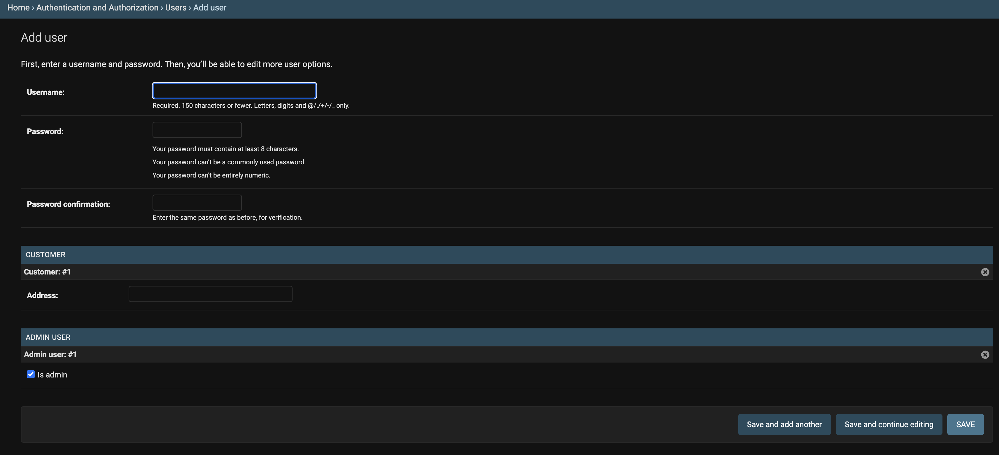

import Callout from 'nextra-theme-docs/callout'
import Bleed from 'nextra-theme-docs/bleed'

# Customizing User models in Django

## Introduction

We can simply make our User models <a href="https://docs.djangoproject.com/en/4.0/intro/tutorial02/#creating-models" target="_blank">in a basic way</a> that Django explains.
However, it would be much better if we could avoid making new fields manually and import all information fields that we can think of when it comes to "Users".
In this section, let's see how we can make our custom User models in sexier way.

Django is giving us two different ways as follows:[^1]

1. <a href="https://docs.djangoproject.com/en/4.0/topics/auth/customizing/#extending-user" target="_blank">Expanding</a> from the current User model
2. <a href="https://docs.djangoproject.com/en/4.0/topics/auth/customizing/#auth-custom-user" target="_blank">Replacing</a> the current User model

[^1]: Reference: <a href="https://docs.djangoproject.com/en/4.0/topics/auth/customizing/#customizing-authentication-in-django" target="_blank">Customizing authentication in Django</a>

<br/>

## Expanding

The basic methodology is that we are going to define secondary classes that we would like to add or change,
and then expand those classes from `User` class from `django.contrib.auth.models`.

<br/>

<CH.Scrollycoding>

### Inheriting `User` class

Let's import `User` class first.

If we dig into codes of `User` class, we can find out that it is inherited from `AbstractUser`, which we will see later.[^2]
[^2]: <a href="https://github.com/django/django/blob/6654289f5b350dfca3dc4f6abab777459b906756/django/contrib/auth/models.py#L405" target="_blank"><code>User</code> class code</a>

Therefore, it provides basic required fields such as `username` and `password` with some other optional fields.

```py users/models.py focus=2
from django.db import models
from django.contrib.auth.models import User


class Customer(models.Model):
    pass


class Admin(models.Model):
    pass
```

---

### Creating secondary classes

Now it's time to define secondary classes with which we want to connect `User` class.
For instance, when we are thinking about E-commerce platform, we can think of customers who visit platform and admin users who control platform.
Let's make this happen with our code.

```py users/models.py focus=5:6,9:10
from django.db import models
from django.contrib.auth.models import User


class Customer(models.Model):
    pass


class Admin(models.Model):
    pass
```

---

#### Creating `Customer` class

If we want to change information within `User` class,
We can use <a href="https://docs.djangoproject.com/en/4.0/ref/models/fields/#django.db.models.OneToOneField" target="_blank"><code>OneToOneField</code></a>
to connect `Customer` class with `User` class.

Then, we can define further extra fields to attach to `Customer` class.
In this case, I newly added `address` field.

```py users/models.py focus=5:7
from django.db import models
from django.contrib.auth.models import User


class Customer(models.Model):
    user = models.OneToOneField(User, on_delete=models.CASCADE)
    address = models.CharField(max_length=150)


class Admin(models.Model):
    pass
```

---

#### Creating `Admin` class

I created `Admin` class for admin users.
As we did in previous section, I made `admin_user` property and connected it with `User` using `OneToOneField` field.

To set this user as admin, I created <a href="https://docs.djangoproject.com/en/4.0/ref/models/fields/#booleanfield" target="_blank"><code>BooleanField</code></a> called `is_admin`.

```py users/models.py focus=10:12
from django.db import models
from django.contrib.auth.models import User


class Customer(models.Model):
    user = models.OneToOneField(User, on_delete=models.CASCADE)
    address = models.CharField(max_length=150)


class Admin(models.Model):
    admin_user = models.OneToOneField(User, on_delete=models.CASCADE)
    is_admin = models.BooleanField(default=True)
```

---

### Registering into `admin.py`

Let's register our models into `admin.py`.
We will be using <a href="https://docs.djangoproject.com/en/4.0/ref/contrib/admin/#django.contrib.admin.InlineModelAdmin" target="_blank"><code>InlineModelAdmin</code></a> method.

I imported <a href="https://github.com/django/django/blob/6654289f5b350dfca3dc4f6abab777459b906756/django/contrib/auth/admin.py#L44" target="_blank"><code>UserAdmin</code></a> within `User` class with giving alias as `BaseUserAdmin`
and connected to `UserAdmin` class after creating it.

```py users/admin.py focus=2:4,15:20
from django.contrib import admin
from django.contrib.auth.admin import UserAdmin as BaseUserAdmin
from django.contrib.auth.models import User
from .models import Customer, Admin


class CustomerInline(admin.StackedInline):
    pass


class AdminInline(admin.StackedInline):
    pass


class UserAdmin(BaseUserAdmin):
    inlines = []


admin.site.unregister(User)
admin.site.register(User, UserAdmin)

```

---

#### Creating `CustomerInline` Admin model

I created `CustomerInline` Admin model to connect with `Customer` model.

1. Connect `Customer` model with <a href="https://docs.djangoproject.com/en/4.0/ref/contrib/admin/#django.contrib.admin.InlineModelAdmin.model" target="_blank"><code>model</code></a> property.
2. I set <a href="https://docs.djangoproject.com/en/4.0/ref/contrib/admin/#django.contrib.admin.InlineModelAdmin.can_delete" target="_blank"><code>can_delete</code></a> as `False` so that users won't be deleted.
   > Setting value for `can_delete` may rely on your service policy. I just followed what it showed on the official documentation but if you need to let admin users delete users (whatsoever), then you may set it as `True`.
3. Set value of <a href="https://docs.djangoproject.com/en/4.0/ref/contrib/admin/#django.contrib.admin.InlineModelAdmin.verbose_name_plural" target="_blank"><code>verbose_name_plural</code></a> when we have multiple users.

```py users/admin.py focus=7:10
from django.contrib import admin
from django.contrib.auth.admin import UserAdmin as BaseUserAdmin
from django.contrib.auth.models import User
from .models import Customer, Admin


class CustomerInline(admin.StackedInline):
    model = Customer
    can_delete: bool = False
    verbose_name_plural: str = "Customers"


class AdminInline(admin.StackedInline):
    pass


class UserAdmin(BaseUserAdmin):
    inlines = []


admin.site.unregister(User)
admin.site.register(User, UserAdmin)
```

---

#### Creating `AdminInline` Admin model

It goes same with `Admin` model class as we exactly did previously.

```py users/admin.py focus=13:16
from django.contrib import admin
from django.contrib.auth.admin import UserAdmin as BaseUserAdmin
from django.contrib.auth.models import User
from .models import Customer, Admin


class CustomerInline(admin.StackedInline):
    model = Customer
    can_delete: bool = False
    verbose_name_plural: str = "Customers"


class AdminInline(admin.StackedInline):
    model = Admin
    can_delete: bool = False
    verbose_name_plural: str = "Admin Users"


class UserAdmin(BaseUserAdmin):
    inlines = []


admin.site.unregister(User)
admin.site.register(User, UserAdmin)
```

---

#### Connecting `UserAdmin` Admin model class

I inherited `BaseUserAdmin` to `UserAdmin` Admin class
and then connected `CustomerInline` and `AdminInline`.

```py users/admin.py focus=19:20
from django.contrib import admin
from django.contrib.auth.admin import UserAdmin as BaseUserAdmin
from django.contrib.auth.models import User
from .models import Customer, Admin


class CustomerInline(admin.StackedInline):
    model = Customer
    can_delete: bool = False
    verbose_name_plural: str = "Customers"


class AdminInline(admin.StackedInline):
    model = Admin
    can_delete: bool = False
    verbose_name_plural: str = "Admin Users"


class UserAdmin(BaseUserAdmin):
    inlines = (CustomerInline, AdminInline)


admin.site.unregister(User)
admin.site.register(User, UserAdmin)
```

</CH.Scrollycoding>

<br/>

### Result

You will be able to see as below once you started your server.
we can put `address` field information that is defined at `Customer` class
and `is_admin` field information that is defined at `Admin` class, respectively.

<br/>

<center></center>

<br/>

After we fill out all necessary information, you will be redirected to the page where we can put secondary information.

<br/>

<center></center>

<br/>

Finally, we can see the result page at Django admin page as below:

<br/>

<center></center>

<br/>

## 대체 (`AbstractBaseUser`)

이번에는 대체 방식으로 진행해보겠다.
이 포스트에선 <a href="https://docs.djangoproject.com/en/4.0/topics/auth/customizing/#django.contrib.auth.models.AbstractBaseUser" target="_blank"><code>AbstractBaseUser</code></a>의 방법을 사용해보겠다.

`AbstractBaseUser`에 대한 <a href="https://docs.djangoproject.com/en/4.0/topics/auth/customizing/#specifying-a-custom-user-model" target="_blank">공식 문서의 내용</a>에 따르면
의 경우 인증[^3]에 대한 기능만 있을 뿐 나머지 필요한 필드들은 본인이 전부 직접 구현을 해야하는 점에서 <a href="https://docs.djangoproject.com/en/4.1/topics/auth/customizing/#django.contrib.auth.models.AbstractUser" target="_blank"><code>AbstractUser</code></a>와 다르다
(`AbstractUser`의 경우 기본적으로 `username`, `email` 등 몇 가지 필드들은 이미 세팅이 되어 있다).

<br/>

### `BaseManager` 작성

<a href="https://docs.djangoproject.com/en/4.1/topics/db/managers/#managers" target="_blank">Manager</a>는 Django 모델에 DB 쿼리 작업을 제공해주는 인터페이스를 의미한다.
Django는 이 Manager를 통해서 데이터베이스와 통신을 하며, 모든 Django의 모델은 최소 하나의 Manager를 가지고 있다.

`AbstractUser`를 상속하게 될 경우 앞서 얘기했듯이 `username`, `email`, `last_login` 등 유저에 대한 기본 정보 필드들을 자동적으로 제공해준다.
하지만 필자는 원하는 필드들을 직접 추가해서 쓰는 방식인 `AbstractBaseUser`를 사용하기 때문에 <a href="https://docs.djangoproject.com/en/4.1/topics/auth/customizing/#writing-a-manager-for-a-custom-user-model" target="_blank"><code>BaseUserManager</code>를 상속하는 방식</a>으로 최대한 커스터마이징을 해볼 생각이다.

<br/>

<CH.Scrollycoding style={{ height: 700 }}>
#### `MyUserManager` 만들기

위에서 언급한 것처럼 <a href="https://docs.djangoproject.com/en/4.1/topics/auth/customizing/#django.contrib.auth.models.BaseUserManager" target="_blank"><code>BaseUserManager</code></a>를 상속시킨다.

`BaseUserManager`를 사용하게 되면 반드시 다음 두 개의 메소드를 추가적으로 정의해주어야 한다.

1. <a href="https://docs.djangoproject.com/en/4.1/topics/auth/customizing/#django.contrib.auth.models.CustomUserManager.create_user" target="_blank"><code>create_user()</code></a>: 일반 유저를 어떤 식으로 생성해줄지 결정짓는 메소드이다.
2. <a href="https://docs.djangoproject.com/en/4.1/topics/auth/customizing/#django.contrib.auth.models.CustomUserManager.create_superuser" target="_blank"><code>create_superuser()</code></a>: Django superuser를 어떻게 만들지 결정짓는 메소드이다.

```py users/models.py focus=2:6
class MyUserManager(BaseUserManager):
    def create_user(self):
        pass

    def create_superuser(self):
        pass
```

---

#### `create_user()` 유효성 검사

유저가 생성되기 위해선 필자는 `email`, 이름(`first_name`), 성(`last_name`), 닉네임(`nickname`) 그리고 비밀번호(`password`)를 넣게끔 설정해주었다.
따라서, 파라미터로 해당 필드들을 추가해주었다.

만일 파라미터로 전달해준 필드값이 없다면 특정 에러 메세지와 함께 <a href="https://docs.python.org/3/library/exceptions.html#ValueError" target="_blank"><code>ValueError</code></a>를 `raise`한다.

```py users/models.py focus=2:13
class MyUserManager(BaseUserManager):
    # mark[21:75]
    def create_user(self, email, first_name, last_name, nickname, password):
        if not email:
            raise ValueError(_("You must provide a valid email address."))
        if not password:
            raise ValueError(_("You must provide a valid password."))
        if not first_name:
            raise ValueError(_("You must provide your first name."))
        if not last_name:
            raise ValueError(_("You must provide your last name."))
        if not nickname:
            raise ValueError(_("You must provide your nickname for using service."))

    def create_superuser(self):
        pass
```

---

#### `user` 만들기

모든 유효성 검사가 통과가 되고 난 후에는 파라미터로 전달해준 값들로 `user` 객체를 생성한다.

여기서 `email`의 경우 <a href="https://docs.djangoproject.com/en/4.1/topics/auth/customizing/#django.contrib.auth.models.BaseUserManager.normalize_email" target="_blank"><code>normalize_email()</code></a> 메소드를 통해 도메인 주소 부분을 소문자화시킨 후 저장한다.

```py users/models.py focus=14:20
class MyUserManager(BaseUserManager):
    # mark[21:75]
    def create_user(self, email, first_name, last_name, nickname, password):
        if not email:
            raise ValueError(_("You must provide a valid email address."))
        if not password:
            raise ValueError(_("You must provide a valid password."))
        if not first_name:
            raise ValueError(_("You must provide your first name."))
        if not last_name:
            raise ValueError(_("You must provide your last name."))
        if not nickname:
            raise ValueError(_("You must provide your nickname for using service."))

        user = self.model(
            email=self.normalize_email(email),
            first_name=first_name,
            last_name=last_name,
            nickname=nickname,
        )

    def create_superuser(self):
        pass
```

---

#### `password` 생성 후 데이터베이스에 저장하기

<a href="https://docs.djangoproject.com/en/4.1/topics/auth/customizing/#django.contrib.auth.models.AbstractBaseUser.set_password" target="_blank"><code>set_password()</code></a> 메소드를 통해
파라미터로 전달받은 `password` 값을 비밀번호로써 저장한다.

이후 <a href="https://docs.djangoproject.com/en/4.1/ref/models/instances/#django.db.models.Model.save" target="_blank"><code>save()</code></a> 메소드를 통해 데이터베이스에 저장한 후
`user` 객체를 `return`한다.

```py users/models.py focus=20:23
class MyUserManager(BaseUserManager):
    # mark[21:75]
    def create_user(self, email, first_name, last_name, nickname, password):
        if not email:
            raise ValueError(_("You must provide a valid email address."))
        if not password:
            raise ValueError(_("You must provide a valid password."))
        if not first_name:
            raise ValueError(_("You must provide your first name."))
        if not last_name:
            raise ValueError(_("You must provide your last name."))
        if not nickname:
            raise ValueError(_("You must provide your nickname for using service."))

        user = self.model(
            email=self.normalize_email(email),
            first_name=first_name,
            last_name=last_name,
            nickname=nickname,
        )
        user.set_password(password)
        user.save(using=self._db)
        return user

    def create_superuser(self):
        pass
```

---

#### `create_superuser()` 메소드 정의

`create_superuser()`는 위에서 정의한 `create_user()` 메소드를 그대로 사용한다.
다만, 여기서 다른 점은 Django가 기본적으로 제공해주는 어드민에 접속할 수 있도록 `is_admin`을 `True`로 지정해주기만 하면 된다.

```py users/models.py focus=25:34
class MyUserManager(BaseUserManager):
    # mark[21:75]
    def create_user(self, email, first_name, last_name, nickname, password):
        if not email:
            raise ValueError(_("You must provide a valid email address."))
        if not password:
            raise ValueError(_("You must provide a valid password."))
        if not first_name:
            raise ValueError(_("You must provide your first name."))
        if not last_name:
            raise ValueError(_("You must provide your last name."))
        if not nickname:
            raise ValueError(_("You must provide your nickname for using service."))

        user = self.model(
            email=self.normalize_email(email),
            first_name=first_name,
            last_name=last_name,
            nickname=nickname,
        )
        user.set_password(password)
        user.save(using=self._db)
        return user

    def create_superuser(self):
        user = self.create_user(
            email,
            first_name=first_name,
            last_name=last_name,
            nickname=nickname,
            password=password,
        )
        user.is_admin = True
        user.save(using=self._db)
        return user
```

</CH.Scrollycoding>

<br/>

### `User` 모델 작성

이제 본격적으로 `User` 모델을 만들어보자.

<br/>

<CH.Scrollycoding style={{ height: 900 }}>

#### `AbstractBaseUser` 및 `TimeStampModel` 클래스 상속

`User`라는 모델 클래스를 생성해준 뒤, `AbstractBaseUser`와 저번 포스트에 만들었던
추상화 베이스 모델인 `TimeStampModel`을 상속시켜 준다.

`TimeStampModel`의 경우 데이터가 생성되거나 업데이트 된 시간을 다루는 모델이나 데이터베이스에는 직접적으로 저장이 되지는 않는 모델이다.

```py users/models.py
from django.db import models
from django.contrib.auth.models import (
    AbstractBaseUser,
    BaseUserManager,
    PermissionsMixin,
)
from django.core.exceptions import ValidationError
from django.utils.translation import gettext_lazy as _
from common.models import *


class User(AbstractBaseUser, TimeStampModel):

     """Custom User Definition Model"""

     pass
```

---

#### 모델 필드 설정하기

다음으로 각각의 필드들을 설정해주었다.

1. letsh는 이메일 주소가 곧 로그인 시 ID이므로 <a href="https://docs.djangoproject.com/en/4.1/ref/models/fields/#unique" target="_blank"><code>unique</code></a>를 `True`로 설정해주었다.
2. 아울러, `sex`, `language` 그리고 `currency` 필드는 <a href="https://docs.djangoproject.com/en/4.1/ref/models/fields/#choices" target="_blank"><code>choices</code></a>를 이용해 특정 값만 선택할 수 있게끔 하였다.

```py users/models.py focus=14:90
from django.db import models
from django.contrib.auth.models import (
    AbstractBaseUser,
    BaseUserManager,
    PermissionsMixin,
)
from django.core.exceptions import ValidationError
from django.utils.translation import gettext_lazy as _
from common.models import *


class User(AbstractBaseUser, TimeStampModel):

     """Custom User Definition Model"""

    class SexChioces(models.TextChoices):
        MALE = "male", _("Male")
        FEMALE = "female", _("Female")
        NOT_PREFER = "na", _("Prefer not to answer")

    class LanguageChoices(models.TextChoices):
        ENGLISH = "english", _("English")
        THAI = "thai", _("Thai")

    class CurrencyChoices(models.TextChoices):
        USD = "usd", _("US Dollar")
        THB = "thb", _("Thai Baht")

    email = models.EmailField(
        unique=True,
        max_length=100,
        help_text=_("Email address must be unique and valid."),
        error_messages={
            "null": _("You should provide an email address."),
            "blank": _("Email address cannot be empty."),
        },
    )
    first_name = models.CharField(
        max_length=100,
        verbose_name=_("First Name"),
        blank=True,
        error_messages={
            "null": _("You should provide your first name."),
        },
    )
    last_name = models.CharField(
        max_length=100,
        verbose_name=_("Last Name"),
        blank=True,
        error_messages={
            "null": _("You should provide your last name."),
        },
    )
    nickname = models.CharField(
        max_length=20,
        verbose_name=_("Nickname"),
        help_text=_(
            "Can only include lower/uppercases numbers, . and _. This nickname will be shown on the profile of the host. If not specified, first name field would appear."
        ),
    )
    phone_number = models.CharField(
        max_length=50,
        verbose_name=_("Phone Number"),
        null=True,
        blank=True,
    )
    profile_photo = models.ImageField(
        null=True, blank=True, verbose_name=_("Profile Photo")
    )
    sex = models.CharField(
        max_length=50,
        verbose_name=(_("Sex")),
        choices=SexChioces.choices,
        default=SexChioces.MALE,
    )
    language = models.CharField(
        max_length=10,
        verbose_name=(_("Language")),
        choices=LanguageChoices.choices,
        default=LanguageChoices.ENGLISH,
    )
    currency = models.CharField(
        max_length=10,
        verbose_name=(_("Currency")),
        choices=CurrencyChoices.choices,
        default=CurrencyChoices.USD,
    )
    is_host = models.BooleanField(default=False, verbose_name=_("Host"))
    is_active = models.BooleanField(default=True, verbose_name=_("Active User"))
    is_admin = models.BooleanField(default=False, verbose_name=_("Admin User"))
```

---

#### Manager 연결 및 추가 필드 설정

1. 위에서 만든 `MyUserManager`를 `User` 모델에 연결시킨다.
2. <a href="https://docs.djangoproject.com/en/4.1/topics/auth/customizing/#django.contrib.auth.models.CustomUser.USERNAME_FIELD" target="_blank"><code>USERNAME_FIELD</code></a>에 `email`을 넣어 이메일 주소를 로그인 ID로 사용되게끔 하였다.
3. <a href="https://docs.djangoproject.com/en/4.1/topics/auth/customizing/#django.contrib.auth.models.CustomUser.REQUIRED_FIELDS" target="_blank"><code>REQUIRED_FIELDS</code></a>에 앞서 `MyUserManager`에서 설정한 필수 필드들인 `first_name`, `last_name` 그리고 `nickname`을 넣었다.

```py users/models.py focus=92:95
from django.db import models
from django.contrib.auth.models import (
    AbstractBaseUser,
    BaseUserManager,
    PermissionsMixin,
)
from django.core.exceptions import ValidationError
from django.utils.translation import gettext_lazy as _
from common.models import *


class User(AbstractBaseUser, TimeStampModel):

     """Custom User Definition Model"""

    class SexChioces(models.TextChoices):
        MALE = "male", _("Male")
        FEMALE = "female", _("Female")
        NOT_PREFER = "na", _("Prefer not to answer")

    class LanguageChoices(models.TextChoices):
        ENGLISH = "english", _("English")
        THAI = "thai", _("Thai")

    class CurrencyChoices(models.TextChoices):
        USD = "usd", _("US Dollar")
        THB = "thb", _("Thai Baht")

    email = models.EmailField(
        unique=True,
        max_length=100,
        help_text=_("Email address must be unique and valid."),
        error_messages={
            "null": _("You should provide an email address."),
            "blank": _("Email address cannot be empty."),
        },
    )
    first_name = models.CharField(
        max_length=100,
        verbose_name=_("First Name"),
        blank=True,
        error_messages={
            "null": _("You should provide your first name."),
        },
    )
    last_name = models.CharField(
        max_length=100,
        verbose_name=_("Last Name"),
        blank=True,
        error_messages={
            "null": _("You should provide your last name."),
        },
    )
    nickname = models.CharField(
        max_length=20,
        verbose_name=_("Nickname"),
        help_text=_(
            "Can only include lower/uppercases numbers, . and _. This nickname will be shown on the profile of the host. If not specified, first name field would appear."
        ),
    )
    phone_number = models.CharField(
        max_length=50,
        verbose_name=_("Phone Number"),
        null=True,
        blank=True,
    )
    profile_photo = models.ImageField(
        null=True, blank=True, verbose_name=_("Profile Photo")
    )
    sex = models.CharField(
        max_length=50,
        verbose_name=(_("Sex")),
        choices=SexChioces.choices,
        default=SexChioces.MALE,
    )
    language = models.CharField(
        max_length=10,
        verbose_name=(_("Language")),
        choices=LanguageChoices.choices,
        default=LanguageChoices.ENGLISH,
    )
    currency = models.CharField(
        max_length=10,
        verbose_name=(_("Currency")),
        choices=CurrencyChoices.choices,
        default=CurrencyChoices.USD,
    )
    is_host = models.BooleanField(default=False, verbose_name=_("Host"))
    is_active = models.BooleanField(default=True, verbose_name=_("Active User"))
    is_admin = models.BooleanField(default=False, verbose_name=_("Admin User"))

    objects = MyUserManager()

    USERNAME_FIELD = "email"
    REQUIRED_FIELDS = ["first_name", "last_name", "nickname"]
```

---

#### 기타 메소드 정의

1. <a href="https://docs.djangoproject.com/en/4.1/ref/models/instances/#django.db.models.Model.__str__" target="_blank"><code>\_\_str\_\_</code></a>: 새롭게 만든 객체를 쉽게 알아볼 수 있도록 클래스 내부에 설정해준 필드값들을 이용하여 표시한다.
2. <a href="https://docs.djangoproject.com/en/4.1/topics/auth/customizing/#custom-users-and-django-contrib-admin" target="_blank"><code>has_perm()</code>과 <code>has_module_perms</code></a>: 해당 유저에게 permission이 따로 있는지 설정해주는 역할이다.
`has_module_perms()`의 경우 어드민 유저를 제외하곤 일반 유저에게는 접근을 할 수 없게끔 만들었다.

```py users/models.py focus=97:111
from django.db import models
from django.contrib.auth.models import (
    AbstractBaseUser,
    BaseUserManager,
    PermissionsMixin,
)
from django.core.exceptions import ValidationError
from django.utils.translation import gettext_lazy as _
from common.models import *


class User(AbstractBaseUser, TimeStampModel):

     """Custom User Definition Model"""

    class SexChioces(models.TextChoices):
        MALE = "male", _("Male")
        FEMALE = "female", _("Female")
        NOT_PREFER = "na", _("Prefer not to answer")

    class LanguageChoices(models.TextChoices):
        ENGLISH = "english", _("English")
        THAI = "thai", _("Thai")

    class CurrencyChoices(models.TextChoices):
        USD = "usd", _("US Dollar")
        THB = "thb", _("Thai Baht")

    email = models.EmailField(
        unique=True,
        max_length=100,
        help_text=_("Email address must be unique and valid."),
        error_messages={
            "null": _("You should provide an email address."),
            "blank": _("Email address cannot be empty."),
        },
    )
    first_name = models.CharField(
        max_length=100,
        verbose_name=_("First Name"),
        blank=True,
        error_messages={
            "null": _("You should provide your first name."),
        },
    )
    last_name = models.CharField(
        max_length=100,
        verbose_name=_("Last Name"),
        blank=True,
        error_messages={
            "null": _("You should provide your last name."),
        },
    )
    nickname = models.CharField(
        max_length=20,
        verbose_name=_("Nickname"),
        help_text=_(
            "Can only include lower/uppercases numbers, . and _. This nickname will be shown on the profile of the host. If not specified, first name field would appear."
        ),
    )
    phone_number = models.CharField(
        max_length=50,
        verbose_name=_("Phone Number"),
        null=True,
        blank=True,
    )
    profile_photo = models.ImageField(
        null=True, blank=True, verbose_name=_("Profile Photo")
    )
    sex = models.CharField(
        max_length=50,
        verbose_name=(_("Sex")),
        choices=SexChioces.choices,
        default=SexChioces.MALE,
    )
    language = models.CharField(
        max_length=10,
        verbose_name=(_("Language")),
        choices=LanguageChoices.choices,
        default=LanguageChoices.ENGLISH,
    )
    currency = models.CharField(
        max_length=10,
        verbose_name=(_("Currency")),
        choices=CurrencyChoices.choices,
        default=CurrencyChoices.USD,
    )
    is_host = models.BooleanField(default=False, verbose_name=_("Host"))
    is_active = models.BooleanField(default=True, verbose_name=_("Active User"))
    is_admin = models.BooleanField(default=False, verbose_name=_("Admin User"))

    objects = MyUserManager()

    USERNAME_FIELD = "email"
    REQUIRED_FIELDS = ["first_name", "last_name", "nickname"]

    def __str__(self):
        return f"{self.first_name} ({self.email})"

    def has_perm(self, perm, obj=None):
        return True

    def has_module_perms(self, app_label):
        if self.is_admin:
            return True
        else:
            return False

    @property
    def is_staff(self):
        return self.is_admin
```

---

#### `Meta` 클래스 정의

`User` 클래스에 몇 가지 메타 데이터를 마지막으로 설정해주었다.

```py users/models.py focus=113:116
from django.db import models
from django.contrib.auth.models import (
    AbstractBaseUser,
    BaseUserManager,
    PermissionsMixin,
)
from django.core.exceptions import ValidationError
from django.utils.translation import gettext_lazy as _
from common.models import *


class User(AbstractBaseUser, TimeStampModel):

     """Custom User Definition Model"""

    class SexChioces(models.TextChoices):
        MALE = "male", _("Male")
        FEMALE = "female", _("Female")
        NOT_PREFER = "na", _("Prefer not to answer")

    class LanguageChoices(models.TextChoices):
        ENGLISH = "english", _("English")
        THAI = "thai", _("Thai")

    class CurrencyChoices(models.TextChoices):
        USD = "usd", _("US Dollar")
        THB = "thb", _("Thai Baht")

    email = models.EmailField(
        unique=True,
        max_length=100,
        help_text=_("Email address must be unique and valid."),
        error_messages={
            "null": _("You should provide an email address."),
            "blank": _("Email address cannot be empty."),
        },
    )
    first_name = models.CharField(
        max_length=100,
        verbose_name=_("First Name"),
        blank=True,
        error_messages={
            "null": _("You should provide your first name."),
        },
    )
    last_name = models.CharField(
        max_length=100,
        verbose_name=_("Last Name"),
        blank=True,
        error_messages={
            "null": _("You should provide your last name."),
        },
    )
    nickname = models.CharField(
        max_length=20,
        verbose_name=_("Nickname"),
        help_text=_(
            "Can only include lower/uppercases numbers, . and _. This nickname will be shown on the profile of the host. If not specified, first name field would appear."
        ),
    )
    phone_number = models.CharField(
        max_length=50,
        verbose_name=_("Phone Number"),
        null=True,
        blank=True,
    )
    profile_photo = models.ImageField(
        null=True, blank=True, verbose_name=_("Profile Photo")
    )
    sex = models.CharField(
        max_length=50,
        verbose_name=(_("Sex")),
        choices=SexChioces.choices,
        default=SexChioces.MALE,
    )
    language = models.CharField(
        max_length=10,
        verbose_name=(_("Language")),
        choices=LanguageChoices.choices,
        default=LanguageChoices.ENGLISH,
    )
    currency = models.CharField(
        max_length=10,
        verbose_name=(_("Currency")),
        choices=CurrencyChoices.choices,
        default=CurrencyChoices.USD,
    )
    is_host = models.BooleanField(default=False, verbose_name=_("Host"))
    is_active = models.BooleanField(default=True, verbose_name=_("Active User"))
    is_admin = models.BooleanField(default=False, verbose_name=_("Admin User"))

    objects = MyUserManager()

    USERNAME_FIELD = "email"
    REQUIRED_FIELDS = ["first_name", "last_name", "nickname"]

    def __str__(self):
        return f"{self.first_name} ({self.email})"

    def has_perm(self, perm, obj=None):
        return True

    def has_module_perms(self, app_label):
        if self.is_admin:
            return True
        else:
            return False

    @property
    def is_staff(self):
        return self.is_admin

    class Meta:
        verbose_name = _("User")
        verbose_name_plural = _("Users")
        db_table = "users"
```

</CH.Scrollycoding>

### `AUTH_USER_MODEL` 설정

마지막으로, 우리가 만든 커스터마이징된 `User` 모델 클래스를 대체했다는 것을 Django에게 알리기 위해 <a href="https://docs.djangoproject.com/en/4.1/ref/settings/#std-setting-AUTH_USER_MODEL" target="_blank"><code>AUTH_USER_MODEL</code></a>를 `users.User`로 설정해주었다.

```py confing/settings.py
AUTH_USER_MODEL = "users.User"
```

<br/>

### 결과

이미 등록된 이메일로 회원가입을 하려 하면 다음과 같이 이미 존재하는 이메일 주소라는 에러가 발생하게 된다.

<br/>

<center></center>

<br/>

## 참고 자료

[^1]:
    <a href="https://docs.djangoproject.com/en/4.0/topics/auth/customizing/#customizing-authentication-in-django" target="_blank">Customizing authentication in Django</a>

[^2]:
    <a href="https://github.com/django/django/blob/6654289f5b350dfca3dc4f6abab777459b906756/django/contrib/auth/models.py#L405" target="_blank"><code>User</code> 클래스 코드</a>

[^3]:
    <a href="https://www.onelogin.com/learn/authentication-vs-authorization" target="_blank">인증과 인가의 차이점</a>
