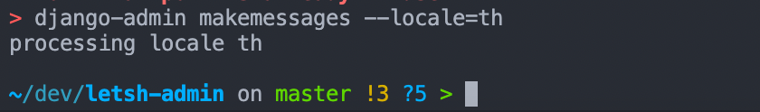
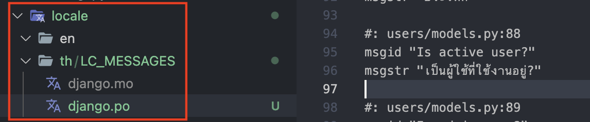

import Callout from 'nextra-theme-docs/callout'
import Bleed from 'nextra-theme-docs/bleed'

# 다국어 지원의 필요성

서비스를 개발하는 도중 영어 이외에도 로컬 언어도 지원을 할 수 있다면 더욱 좋을 것 같다는 생각을 하였다.
보통의 경우 프론트엔드에서 다국어 지원이 되도록 기능을 추가하는 편이지만 백엔드에서도 그 기능을 넣어 어드민 측에서 이용할 수 있다면 더욱 좋겠다는 생각을 하였다.
그리하여 이번에는 Django에서 다국어(i18n) 기능을 어떻게 지원할 수 있을지 알아보도록 하겠다.

<br/>

## Django 다국어 기능 설정

Django가 설정된 언어에 맞춰 자동적으로 번역을 해주는 것이 아니라 우리가 직접 일일히 번역을 완수해야 하기 때문에
다국어 지원 기능을 생각한다면 프로젝트 맨 처음부터 미리 준비해두는 것이 좋다.

### 사전 준비

`locale`이라는 폴더 안에 우리가 작업할 외국어 폴더를 집어넣는다. 즉, 3개국어를 지원한다면 `locale` 폴더 안에도 3개의 외국어 폴더가 들어가 있어야 한다는 점이다.

#### `locale` 폴더 생성

`locale`이란 폴더를 프로젝트 루트 경로에 생성해주도록 하자. .
이후, `locale` 폴더 안에 우리가 작업할 다국어 폴더를 넣도록 하자.
필자의 경우 영어(`en`)와 태국어(`th`)로 설정해주었다.

> <a href="https://docs.djangoproject.com/en/4.1/topics/i18n/#term-language-code" target="_blank">언어 코드</a>를 참고하여 폴더명을 정해주도록 하자.
언어 코드의 경우 <a href="http://www.i18nguy.com/unicode/language-identifiers.html" target="_blank">다음</a>에서 확인이 가능하다.

```bash
mkdir locale && mkdir locale/en && mkdir locale/th
```

<br/>

<CH.Scrollycoding>

#### 다국어 폴더 위치 설정

Django에게 우리가 작업할 다국어 폴더가 어디에 있는지 알려줘야 할 필요가 있다.
`settings.py` 파일에서 <a href="https://docs.djangoproject.com/en/4.1/ref/settings/#locale-paths" target="_blank"><code>LOCALE_PATH</code></a>의 값을 설정해주자.

```py settings.py
# Django 3.0 버전 이상
LOCAL_PATH = BASE_DIR / "locale"

# Django 3.0 버전 미만
import os
LOCAL_PATH = os.path.join(BASE_DIR, "locale")
```

---

#### `MIDDLEWARE` 설정

웹 사이트를 사용하는 사용자들이 각자 본인들이 원하는 언어로 서비스를 이용할 수 있게끔 하고 싶다면 `MIDDLEWARE` 설정 부분에 <a href="https://docs.djangoproject.com/en/4.1/ref/middleware/#module-django.middleware.locale" target="_blank"><code>LocaleMiddleware</code></a>를 추가해주도록 한다.

이 때, <a href="https://docs.djangoproject.com/en/4.1/topics/i18n/translation/#how-django-discovers-language-preference" target="_blank">공식 문서</a>에서 설명한 것처럼 <a href="https://docs.djangoproject.com/en/4.1/ref/middleware/#module-django.contrib.sessions.middleware" target="_blank"><code>SessionMiddleware</code></a>가 맨 위쪽에 위치할 수 있도록 한다.
이는 `LocaleMiddleware`가 세션 데이터를 사용하기 때문이다.

또한, `LocaleMiddleware`는 <a href="https://docs.djangoproject.com/en/4.1/ref/middleware/#module-django.middleware.common" target="_blank"><code>CommonMiddleware</code></a>의 앞에 위치해야 하는데 이는 `CommonMiddleware`가 특정 URL에 요청을 보냈을 시 `LocaleMiddleware` 측에서 현재 설정되어 있는 언어가 무엇인지 파악을 하기 위해서이다.

```py settings.py
MIDDLEWARE = [
   'django.contrib.sessions.middleware.SessionMiddleware',
   'django.middleware.locale.LocaleMiddleware',
   'django.middleware.common.CommonMiddleware',
]
```

---

#### 다국어 지원 활성화

이어서, `settings.py` 파일에 <a href="https://docs.djangoproject.com/en/4.1/ref/settings/#std-setting-USE_I18N" target="_blank"><code>USE_I18N</code></a>에 `True` 값으로 설정해주자.

```py settings.py
USE_I18N = True
```

</CH.Scrollycoding>

### 번역하기

이제 본격적으로 번역 작업을 시작해보도록 하자.

기본적으로 `settings.py` 파일 안의 <a href="https://docs.djangoproject.com/en/4.1/ref/settings/#language-code" target="_blank"><code>LANGUAGE_CODE</code></a>의 기본값은 `en-us`로 설정되어 있다.
여기서부터 기본적으로 설정되어 있는 영어에서 우리가 어떤 언어로 번역을 할 건지 정해줘야 하는 부분이 되겠다.

#### 번역할 부분 지정해주기

앞선 포스트에서 만들어봤던 `User` 모델 클래스의 내부 필드 및 프로퍼티들에 대하여 번역을 해보도록 하겠다.

이를 위해 <a href="https://docs.djangoproject.com/en/4.1/ref/utils/#django.utils.translation.gettext_lazy" target="_blank"><code>gettext\*lazy</code></a> 모듈을 `_` alias로 가져온 후 번역을 넣을 각각의 프로퍼티들에게 지정을 해준다. 필자의 경우 설명을 요하는 부분인`verbose_name`과 `help_text` 부분을 설정해주었다.

```py users/models.py focus=1,10,17:19,22,24 box=1[38:54],10[22:34],17[19:20],22[22:32],24[19:62]
from django.utils.translation import gettext_lazy as _

class User(AbstractBaseUser):

    # 중략

    username = models.CharField(
        max_length=20,
        unique=True,
        verbose_name=_("User ID"),
        validators=[
            RegexValidator(
                regex="^(?!.*\.\.)(?!.*\.$)[^\W][\w.]{0,20}$",
                message=_("Can only contain numbers, lowercases, ., _ and -"),
            )
        ],
        help_text=_(
            "Can only contain numbers, lowercases, ., _ and -. Should be unique less than 20 characters."
        ),
    )
    email = models.EmailField(
        verbose_name=_("Email"),
        unique=True,
        help_text=_("Email address should be always unique."),
    )

    # ... 중략 ...
```

#### 번역 파일 만들기

<a href="https://docs.djangoproject.com/en/4.1/ref/django-admin/#makemessages" target="_blank"><code>django-admin makemessages</code></a> 명령어를 이용하여 
우리가 번역하려는 언어 파일을 생성해주도록 하자. 이는 `--locale`이라는 추가 명령어를 이용하여 생성할 수 있다.
필자의 경우 태국어로 번역을 원하기 때문에 `--locale=th`를 지정해주었다.

```bash
django-admin makemessages --locale=th
```

명령어를 실행하게 되면 다음과 같이 `.po` 확장자의 파일이 생성된다. 이 파일은 번역가가 직접 번역해야 하는 메세지 파일이다.

<br/>
<center></center>

#### 번역하기

`.po` 확장자 파일을 연 후 `msgid` 안의 문자열을 번역하고자 하는 언어에 맞게 `msgstr`에 번역을 해주도록 하자.

#### 번역 파일 컴파일하기

번역을 완성한 이후 <a href="https://docs.djangoproject.com/en/4.1/ref/django-admin/#compilemessages" target="_blank">다음 명령어</a>를 통해 `.po` 번역 파일을 Django가 이해할 수 있는 컴파일된 번역 파일인 `.mo` 파일로 컴파일 해준다.

```bash
django-admin compilemessages
```

이후, 다음과 같이 `.mo` 파일이 생성이 되었음을 알 수 있다.

<br/>
<center></center>
