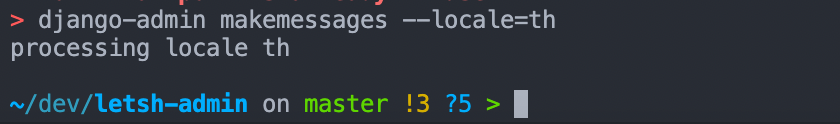
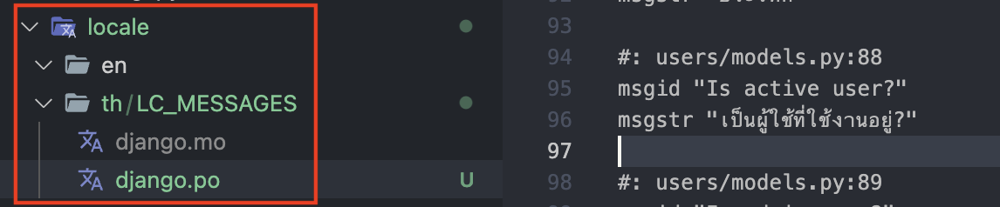

import Admonition from '@yozora/react-admonition'
import Bleed from 'nextra-theme-docs/bleed'

# Why i18n?

I thought that providing i18n would be able to provide much better user experience when it comes to making service.
Normally what I do is that I only configure i18n on frontend side, but this time it would be better to serve i18n on backend also.
In this post, we are going to go over how to apply i18n on Django.

<br/>

## Configuration of i18n in Django

Django does not automatically translate from one language into another.
Rather, we need to do it all by ourselves one by one.
Therefore, if you are thinking of providing i18n feature, **_you'd better start configuration from the beginning._**

### Prerequisites

We will be putting all language folders inside of `locale` folder.
The default value of <a href="https://docs.djangoproject.com/en/4.1/ref/settings/#language-code" target="_blank"><code>LANGUAGE_CODE</code></a> within `settings.py` file is set to be `en-US`.
Therefore, we can make language folders that we want to support other than the default language.

#### Creating `locale` folder

Create folder name called `locale` on the project root directory. For me, I created Thailand folder(`th`) inside of it.

> When you decide language folder name, you may refer to <a href="https://docs.djangoproject.com/en/4.1/topics/i18n/#term-language-code" target="_blank">language code</a>.
> For the abbreviated language code, you may refer in <a href="http://www.i18nguy.com/unicode/language-identifiers.html" target="_blank">here</a>.

```bash
mkdir locale && mkdir locale/th
```

<br/>

<CH.Scrollycoding>

#### Configuring language folder directories

We need to tell Django where our language folders are located.
In `settings.py` file, let's change <a href="https://docs.djangoproject.com/en/4.1/ref/settings/#locale-paths" target="_blank"><code>LOCALE_PATH</code></a> value.

```py settings.py
# Django version 3.0 or later
LOCAL_PATH = BASE_DIR / "locale"

# Django version 3.0 or earlier
import os
LOCAL_PATH = os.path.join(BASE_DIR, "locale")
```

---

#### Configuring `Middleware`

If you want to let users use your service with their preferred language, include <a href="https://docs.djangoproject.com/en/4.1/ref/middleware/#module-django.middleware.locale" target="_blank"><code>LocaleMiddleware</code></a> in `MIDDLEWARE` of `settings.py` file.

As addressed in <a href="https://docs.djangoproject.com/en/4.1/topics/i18n/translation/#how-django-discovers-language-preference" target="_blank">documentation</a>, <a href="https://docs.djangoproject.com/en/4.1/ref/middleware/#module-django.contrib.sessions.middleware" target="_blank"><code>SessionMiddleware</code></a> should be located at the top.
This is because `LocaleMiddleware` consumes session data.

Moreover, `LocaleMiddleware` should be located before <a href="https://docs.djangoproject.com/en/4.1/ref/middleware/#module-django.middleware.common" target="_blank"><code>CommonMiddleware</code></a> so that `CommonMiddleware` can recognize which language does `LocalMiddleware` is using when sending request to the specific URL.

```py settings.py
MIDDLEWARE = [
   'django.contrib.sessions.middleware.SessionMiddleware',
   'django.middleware.locale.LocaleMiddleware',
   'django.middleware.common.CommonMiddleware',
]
```

---

#### Enabling i18n

Lastly, set <a href="https://docs.djangoproject.com/en/4.1/ref/settings/#std-setting-USE_I18N" target="_blank"><code>USE_I18N</code></a> value of `True` in `settings.py` file.

```py settings.py
USE_I18N = True
```

</CH.Scrollycoding>

### Translation

Now it's time for translation. We are basically translating original English file into our desired languages.

#### Choosing which parts to translate

We will be translating fields and properties within `User` model class that we made at the previous post.

To begin with, we wil be importing <a href="https://docs.djangoproject.com/en/4.1/ref/utils/#django.utils.translation.gettext_lazy" target="_blank"><code>gettext lazy()</code></a> with aliasing `_` and put it all properties where we want to translate.
I chose `verbose_name` and `help_text` part.

> `lazy` suffix literally indicates that doing some task <ins>later</ins>.
> That is, it is operated not when the value is called, bur rather when value was accessed.[^1]

```py users/models.py focus=1,10,17:19,22,24 box=1[38:54],10[22:34],17[19:20],22[22:32],24[19:62]
from django.utils.translation import gettext_lazy as _

class User(AbstractBaseUser):

    # ... Omitted ...

    username = models.CharField(
        max_length=20,
        unique=True,
        verbose_name=_("User ID"),
        validators=[
            RegexValidator(
                regex="^(?!.*\.\.)(?!.*\.$)[^\W][\w.]{0,20}$",
                message=_("Can only contain numbers, lowercases, ., _ and -"),
            )
        ],
        help_text=_(
            "Can only contain numbers, lowercases, ., _ and -. Should be unique less than 20 characters."
        ),
    )
    email = models.EmailField(
        verbose_name=_("Email"),
        unique=True,
        help_text=_("Email address should be always unique."),
    )

    # ... Omitted ...
```

<Admonition 
    keyword="caution"
    style={{ color: '#dab600', fontSize: '16px' }}
    title={<span><strong>Why using `gettext_lazy()`?</strong></span>}
  >
    Fields defined in `models.py`, `forms.py` or `apps.py` are only called once by the time project initiated. 
    So using `gettext` module will lead to translation on the first language only and it won't be translated into another language although users change their language.
    For this reason, we are using `gettext_lazy` module.[^2]
</Admonition>

<br/>

#### Creating translation file

Usign <a href="https://docs.djangoproject.com/en/4.1/ref/django-admin/#makemessages" target="_blank"><code>django-admin makemessages</code></a> command,
let's create our translation file. We can use <a href="https://docs.djangoproject.com/en/4.1/ref/django-admin/#cmdoption-makemessages-locale" target="_blank"><code>--locale</code></a> suffix command for this.
In this case, I put `--locale=th` for translating into Thai language.

```bash
django-admin makemessages --locale=th
```

After running command we can get translation file with `.po` extension. This is the file which translators need to use for translation.

<br/>
<center></center>

<br/>

#### Translation

Open `.po` file and put our translated sentence in `msgstr` from strings in `msgid`.

<br/>

#### Compiling translation file

After completing translation, complie `.po` translation file into `.mo` file so that Django can recognize with using the <a href="https://docs.djangoproject.com/en/4.1/ref/django-admin/#compilemessages" target="_blank">following command</a>.

```bash
django-admin compilemessages
```

After that, we can see that `.mo` file has been created.

<br/>
<center></center>

## References

[^1]:
    <a href="https://nsikakimoh.com/blog/gettext-and-gettext_lazy-functions-in-django#what-is-the-difference-between-gettext-and-gettext_lazy" target="_blank">What is the Difference Between `gettext()` and `gettext_lazy()`</a>

[^2]:
    <a href="https://nsikakimoh.com/blog/gettext-and-gettext_lazy-functions-in-django#why-you-should-use-gettext_lazy-in-models-and-forms-instead-of-gettext" target="_blank">Why you should use `gettext_lazy()` in Models and Forms instead of `gettext()`</a>
