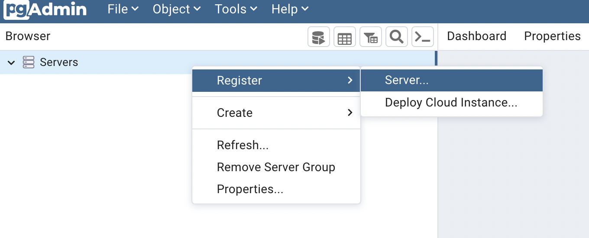
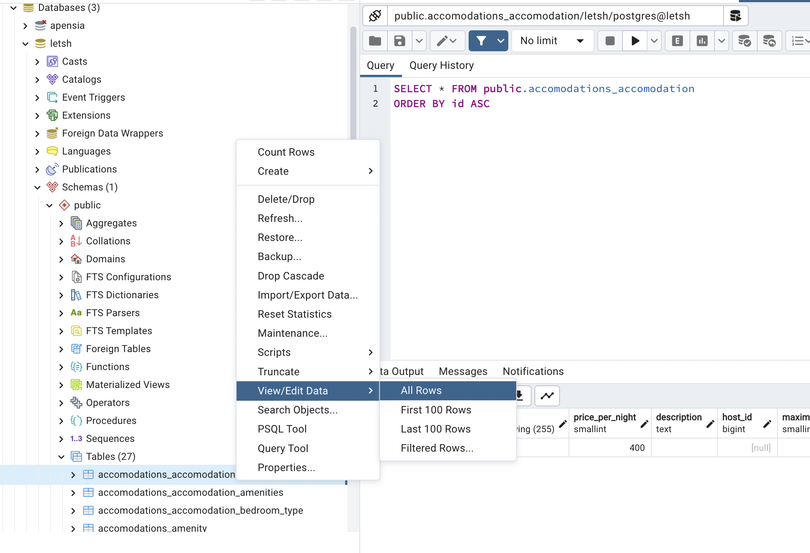

import Callout from 'nextra-theme-docs/callout'
import Bleed from 'nextra-theme-docs/bleed'

# Connecting PostgreSQL with Django

Whenever you start Django project, DB is basically set to Sqlite3.
According to the Django's documentation, however, they are <a href="https://docs.djangoproject.com/en/4.1/ref/contrib/postgres/#module-django.contrib.postgres" target="_blank">highly recommending PostgreSQL</a>.
This is because Django supports a number of data types that only workable with PostgreSQL[^1].
When you see <a href="https://github.com/django/django/tree/main/django/contrib/postgres" target="_blank"><code>django.contrib.postgres</code></a> module, it can be inferred that Django supports quite well with PostgreSQL.

[^1]:
    <a href="https://www.reddit.com/r/django/comments/v99iuh/comment/ibvdfyt/?utm_source=share&utm_medium=web2x&context=3" target="_blank">Django documentation recommends PostgreSQL</a>

## What is PostgreSQL?

<a href="https://www.postgresql.org/about/" target="_blank">PostgreSQL</a> is an <a href="https://en.wikipedia.org/wiki/Object%E2%80%93relational_database" target="_blank">Object Relational DataBase Management System (ORDBMS)</a>
which is an open-source system that expedites storing data safely and scaling up with using the SQL language.

> ### Difference between RDBMS and ORDBMS[^2]
>
> <a href="https://www.geeksforgeeks.org/rdbms-full-form/" target="_blank">Relational DataBase Management System</a> indicates system of allowing to create, delete and update relationship of data
which are stored in the manner of certain relationship of rows and columns of tables. 
Object Related DataBase Management System has more features that are commonly used in Object-Oriented Programming besides of RDBMS such as class, objects and inheritance.

[^2]:
    <a href="https://www.geeksforgeeks.org/difference-between-rdbms-and-ordbms/" target="_blank">Difference between RDBMS and ORDBMS</a>

<br/>

## PostgreSQL Configuration

Let us begin to connect PostgreSQL with our Django project.
_It is suggested to do DB setting by the time we initialize project._

### Installing PostgreSQL

#### MacOS

Let's install PostgreSQL with Homebrew. Version 15 is the latest as of November 13th, 2022.

```bash
brew install postgresql@15
```

You may install manually with install files available at <a href="https://www.enterprisedb.com/downloads/postgres-postgresql-downloads" target="_blank">here</a>.

#### Windows

You can install via <a href="https://community.chocolatey.org/packages/postgresql" target="_blank">Chocolatey</a>.

```powershell
choco install postgresql
```

You may install manually with install files available at <a href="https://www.enterprisedb.com/downloads/postgres-postgresql-downloads" target="_blank">here</a> and choose Windows x86-64 version.

<br/>

### Installing pgadmin4

After installed PostgresQL, let's move on to pgAdmin4 to manage PostgreSQL more intuitively and easily. Download installation files available at <a href="https://www.pgadmin.org/download/pgadmin-4-macos/" target="_blank">here</a>.

For the first time of installation, we need to set <a href="https://www.pgadmin.org/docs/pgadmin4/latest/master_password.html#master-password" target="_blank">master password</a>.
If we add pgAdmin4 master password as shown below picture, we can access to our DB.

<br/>

<center>
    <figure>
        
        <figcaption>Source: pgAdmin4</figcaption>
    </figure>
</center>

<br/>

### Creating server

Right click Servers on left panel and create new server.

<br/>

<center></center>

<br/>

Then, create name for the new server. I put service name for my server name.

<br/>

<center>
    <figure>
        
        <figcaption>Source: pgAdmin4</figcaption>
    </figure>
</center>

<br/>

Next thing to do is to configuring server connection. As I will be using as development server, I put `localhost`.
And put password for our newly created server.

<br/>

<center>
    <figure>
        
        <figcaption>Source: pgAdmin4</figcaption>
    </figure>
</center>

<br/>

## Connecting to Django

### Installing `psycopg2-binary` package

<a href="https://pypi.org/project/psycopg2-binary/" target="_blank"><code>psycopg2-binary</code></a> is a package that allows Django to use PostgreSQL.
Although we have normal version of `psycopg2`, we will be using `psycopg2-binary` package which is lighter enough for using during development stage.
Install the package when virtual environment is enabled.

```bash
# Using pip
pip install psycopg2-binary

# Using pipenv
pipenv install psycopg2-binary

# Using poetry
poetry add psycopg2-binary
```

<br/>

### Installing `django-dotenv` package

<a href="https://github.com/jpadilla/django-dotenv#installation" target="_blank"><code>django-dotenv</code></a> package allows to use variables from `.env` file that should not be revealed to the public.
Again, install the package with virtual environment enabled.

```bash
# Using pip
pip install django-dotenv

# Using pipenv
pipenv install django-dotenv

# Using poetry
poetry add django-dotenv
```

Then, let's modify our `settings.py` file in our Djagno root directory as follows.
I referred codes available at <a href="https://github.com/jpadilla/django-dotenv#usage" target="_blank">here</a>.

```py manage.py
#!/usr/bin/env python
"""Django's command-line utility for administrative tasks."""
import os
import sys
import dotenv


def main():
    """Run administrative tasks."""
    os.environ.setdefault("DJANGO_SETTINGS_MODULE", "config.settings")
    try:
        from django.core.management import execute_from_command_line
    except ImportError as exc:
        raise ImportError(
            "Couldn't import Django. Are you sure it's installed and "
            "available on your PYTHONPATH environment variable? Did you "
            "forget to activate a virtual environment?"
        ) from exc
    execute_from_command_line(sys.argv)


if __name__ == "__main__":
    dotenv.read_dotenv()
    main()
```

<br/>

### `.env` variables configuration

Now, let's create `.env` file in our project root directory and include variables regarding PostgreSQL server configuration.
Variables can be defined within `""`.

```txt .env
DB_NAME="DB Name"
DB_USER="Username for managing DB"
DB_PASSWORD="DB Password"
DB_HOST="DB Host"
DB_PORT="DB Port"
```

1. You can put your DB name for `DB_NAME`.
2. Put your username for `DB_USER`.
3. Put your password for `DB_PASSWORD`.
4. Put Host name/address that we put during configuration stage for `DB_HOST`. In our case, we can put `localhost`.
5. Put your port that we put during configuration stage.

Next, put our `.env` file in `.gitignore` so that it can be ignored from Git commit.

```txt .gitignore
.env
```

<br/>

### `settings.py` configuration

<CH.Scrollycoding>

#### Using `django-dotenv`

Import the following modules at the top of `settings.py`.

```py settings.py
import os
import dotenv
```

---

#### Basic configuration

By the time we started our first Django project, you will be able to see that <a href="https://docs.djangoproject.com/en/4.1/ref/settings/#databases" target="_blank"><code>DATABASE</code></a> is set to be `sqlite3` as default.
This is where the main game starts.

```py
DATABASES = {
    'default': {
        'ENGINE': 'django.db.backends.sqlite3',
        'NAME': 'mydatabase',
    }
}
```

---

#### Changing `DATABASE` configuration

We will be putting `django.db.backends.postgresql` for <a href="https://docs.djangoproject.com/en/4.1/ref/settings/#std-setting-DATABASE-ENGINE" target="_blank"><code>ENGINE</code></a>
as we will be using PostgreSQL.

After that, we replace value for <a href="https://docs.djangoproject.com/en/4.1/ref/settings/#std-setting-TEST_NAME" target="_blank"><code>NAME</code></a>, <a href="https://docs.djangoproject.com/en/4.1/ref/settings/#user" target="_blank"><code>USER</code></a>, <a href="https://docs.djangoproject.com/en/4.1/ref/settings/#password" target="_blank"><code>PASSWORD</code></a>, <a href="https://docs.djangoproject.com/en/4.1/ref/settings/#host" target="_blank"><code>HOST</code></a> and <a href="https://docs.djangoproject.com/en/4.1/ref/settings/#port" target="_blank"><code>PORT</code></a>
variables that we already defined in `.env` file with using `os.environ.get()`.

```py focus=3:8
DATABASES = {
    "default": {
        "ENGINE": "django.db.backends.postgresql",
        "NAME": os.environ.get("DB_NAME"),
        "USER": os.environ.get("DB_USER"),
        "PASSWORD": os.environ.get("DB_PASSWORD"),
        "HOST": os.environ.get("DB_HOST"),
        "PORT": os.environ.get("DB_PORT"),
    }
}
```

</CH.Scrollycoding>

<br/>

After migrate, we will also be creating superuser account with `python manage.py createsuperuser` command.

```bash
python manage.py migrate
python manage.py createsuperuser
```

<br/>

## Result

If we take a look in the order of Servers &rarr; Schemas &rarr; public &rarr; Tables at pgAdmin4,
we can see many tables applied in our database after migration.
If you would like to view data inside of tables, mouse right click on tables that you would like to view and click "View/Edit Data" and "All Rows".

<br/>

<center></center>
