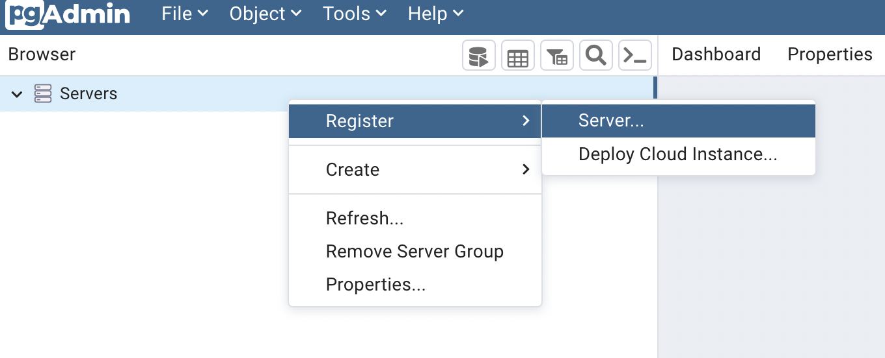
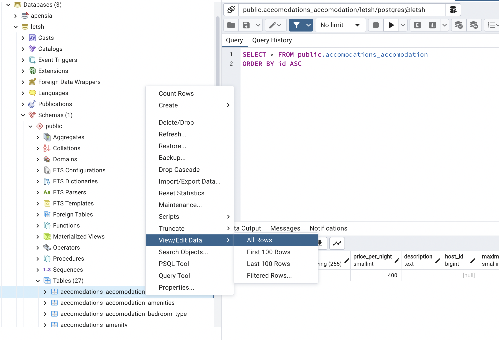

import Callout from 'nextra-theme-docs/callout'
import Bleed from 'nextra-theme-docs/bleed'

# Django와 PostgreSQL 연동하기

Django를 맨 처음 설치를 했을 때 기본 DB가 Sqlite3로 연결이 되어 있다.
하지만 Django의 공식 문서에 따르면 수많은 DB 중 <a href="https://docs.djangoproject.com/en/4.1/ref/contrib/postgres/#module-django.contrib.postgres" target="_blank">PostgreSQL를 강력히 추천하고 있다</a>.
이유는 Django가 오직 PostgreSQL와만 연동될 수 있는 다양한 데이터 타입들을 제공해주고 있기 때문이라 한다[^1]. 실제로 <a href="https://github.com/django/django/tree/main/django/contrib/postgres" target="_blank"><code>django.contrib.postgres</code></a>
모듈을 보면 Django가 PostgreSQL에 대한 지원을 전폭적으로 해주고 있는 모습을 보이고 있다.

[^1]:
    <a href="https://www.reddit.com/r/django/comments/v99iuh/comment/ibvdfyt/?utm_source=share&utm_medium=web2x&context=3" target="_blank">Django documentation recommends PostgreSQL</a>

## PostgreSQL이란?

<a href="https://www.postgresql.org/about/" target="_blank">PostgreSQL</a>는 SQL 언어를 사용하여 데이터를 안전하게 저장하고 스케일업하는데 최적화시킬 수 있는 다양한 기능들을 가지고 내장시킨
오픈 소스의 <a href="https://en.wikipedia.org/wiki/Object%E2%80%93relational_database" target="_blank">객체 관계 데이터베이스 (ORDBMS)</a>라고 소개하고 있다.

> ### RDBMS와 ORDBMS의 차이점[^2]
>
> <a href="https://www.geeksforgeeks.org/rdbms-full-form/" target="_blank">관계형 데이터베이스 시스템</a>란 모든 데이터는 테이블의 행과 열에 적절한 _관계_를 맺은 상태로 저장이 되는데 
이러한 데이터들의 관계를 생성, 삭제 그리고 업데이트 해줄 수 있는 시스템을 일컫는다. 
객체 관계 데이터베이스 시스템(ORDBMS)는 관계형 데이터베이스 시스템이 가지고 있는 기본적인 기능들에 더하여 클래스, 객체 그리고 상속과 같은 객체 지향 프로그래밍에서 통용되는 개념들이 내장되어 있다.

[^2]:
    <a href="https://www.geeksforgeeks.org/difference-between-rdbms-and-ordbms/" target="_blank">Difference between RDBMS and ORDBMS</a>

<br/>

## PostgreSQL 설정

그럼 본격적으로 PostgreSQL을 우리가 만든 Django 프로젝트와 연동해보도록 하겠다.
_DB 세팅은 가급적이면 맨 처음 프로젝트를 시작할 때에 세팅을 미리 해놓는 것이 바람직하다._

### PostgreSQL 설치하기

#### MacOS

Homebrew로 설치해보자. 2022년 11월 10일 기준으로 15 버전이 최신 버전이다.

```bash
brew install postgresql@15
```

수동으로 설치 파일을 다운로드 받아 설치하길 원한다면 <a href="https://www.enterprisedb.com/downloads/postgres-postgresql-downloads" target="_blank">여기</a>서 다운로드 할 수 있다.

#### Windows

<a href="https://community.chocolatey.org/packages/postgresql" target="_blank">Chocolatey</a>로 설치할 수 있다.

```powershell
choco install postgresql
```

수동으로 설치 파일을 다운로드 받아 설치하길 원한다면 <a href="https://www.enterprisedb.com/downloads/postgres-postgresql-downloads" target="_blank">여기</a>서 Windows x86-64 버전을 다운로드 받으면 된다.

<br/>

### pgAdmin4 설치하기

이후, PostgreSQL을 좀 더 직관적이고 쉽게 관리할 수 있는 툴인 pgAdmin4를 설치해보자. <a href="https://www.pgadmin.org/download/pgadmin-4-macos/" target="_blank">여기</a>서 제일 최신 버전을 선택하여 다운로드한다.

맨 처음 설치를 하게 되면 <a href="https://www.pgadmin.org/docs/pgadmin4/latest/master_password.html#master-password" target="_blank">마스터 비밀번호</a>를 설정하게끔 되어 있다.
아래 그림의 설명대로 pgAdmin4를 추후에 접속할 때마다 해당 비밀번호를 입력해야 엑세스가 가능하다.

<br/>

<center>
    <figure>
        
        <figcaption>출처: pgAdmin4</figcaption>
    </figure>
</center>

<br/>

### 서버 만들기

브라우저의 좌측 패널에 Servers를 마우스 우클릭 후 새로운 서버를 생성한다.

<br/>

<center></center>

<br/>

이후 생성하고자 하는 서버의 이름을 설정한다. 필자의 경우 만들고자 하는 서비스의 이름을 그대로 집어넣었다.

<br/>

<center>
    <figure>
        
        <figcaption>출처: pgAdmin4</figcaption>
    </figure>
</center>

<br/>

다음으로 생성된 서버의 연결 설정을 해주는 부분이다. 현재에는 개발용으로 사용할 것이기 때문에 `localhost`라는 이름을 적어둔다.
그리고 Password 부분에 우리가 만들어준 데이터베이스에 대한 비밀번호를 설정해준다.

<br/>

<center>
    <figure>
        
        <figcaption>출처: pgAdmin4</figcaption>
    </figure>
</center>

<br/>

## Django와 연결

### `psycopg2-binary` 패키지 설치

<a href="https://pypi.org/project/psycopg2-binary/" target="_blank"><code>psycopg2-binary</code></a>는 PostgreSQL이 Django 내에서 동작할 수 있도록 도와주는 패키지이다. 
`psycopg2` 일반 버전도 있으나 공식 문서에서 설명한대로 개발 단계에선 좀 더 가벼운 버전인 `psycopg2-binary` 패키지를 사용하겠다.
가상 환경이 활성화 된 상태에서 패키지를 설치한다.

```bash
# pip 사용 시
pip install psycopg2-binary

# pipenv 사용 시
pipenv install psycopg2-binary

# poetry 사용 시
poetry add psycopg2-binary
```

<br/>

### `django-dotenv` 패키지 설치

<a href="https://github.com/jpadilla/django-dotenv#installation" target="_blank"><code>django-dotenv</code></a> 패키지는 반드시 숨겨져야 하는 중요한 정보들이 저장된 `.env` 환경변수에서 해당 변수들을 가져올 수 있도록
도와주는 패키지이다. 이 또한 가상 환경이 활성화된 상태에서 패키지를 설치한다.

```bash
# pip 사용 시
pip install django-dotenv

# pipenv 사용 시
pipenv install django-dotenv

# poetry 사용 시
poetry add django-dotenv
```

이후 Django 프로젝트의 루트 경로에 있는 `manage.py` 파일을 다음과 같이 바꾼다. 코드는 <a href="https://github.com/jpadilla/django-dotenv#usage" target="_blank">여기</a>를 참조한다.

```py manage.py
#!/usr/bin/env python
"""Django's command-line utility for administrative tasks."""
import os
import sys
import dotenv


def main():
    """Run administrative tasks."""
    os.environ.setdefault("DJANGO_SETTINGS_MODULE", "config.settings")
    try:
        from django.core.management import execute_from_command_line
    except ImportError as exc:
        raise ImportError(
            "Couldn't import Django. Are you sure it's installed and "
            "available on your PYTHONPATH environment variable? Did you "
            "forget to activate a virtual environment?"
        ) from exc
    execute_from_command_line(sys.argv)


if __name__ == "__main__":
    dotenv.read_dotenv()
    main()
```

<br/>

### `.env` 변수 설정

프로젝트 루트 경로에 `.env` 파일을 만든 후 PostgreSQL 서버와 관련된 변수들을 추가해준다. 변수들은 `""` 안에 정의하도록 한다.

```txt .env
DB_NAME="DB 이름"
DB_USER="DB를 관리하는 유저"
DB_PASSWORD="DB 비밀번호"
DB_HOST="DB 호스트"
DB_PORT="DB 포트"
```

1. `DB_NAME`은 서버를 만들었을 때 생성했던 그 이름을 적으면 된다.
2. `DB_USER`는 어드민 권한을 가지고 있는 유저 이름을 넣는다.
3. `DB_PASSWORD`는 서버에 설정해둔 비밀번호를 넣는다.
4. `DB_HOST`는 연결 설정을 해줄 때 설정해주었던 Host name/address를 넣는다. 우리의 경우 `localhost`를 넣는다.
5. `DB_PORT`는 연결 설정을 해줄 때 적은 Port를 넣는다.

이후 `.gitignore` 파일에 `.env`를 추가시켜주어 깃 커밋에 올라가지 않도록 한다.

```txt .gitignore
.env
```

<br/>

### `settings.py` 설정

<CH.Scrollycoding>

#### `django-dotenv` 사용할 수 있도록 불러오기

`settings.py` 파일의 최상단에 다음 모듈을 불러온다.

```py settings.py
import os
import dotenv
```

---

#### 기본 세팅

맨 처음 프로젝트를 시작할 당시에는 <a href="https://docs.djangoproject.com/en/4.1/ref/settings/#databases" target="_blank"><code>DATABASE</code></a>가 `sqlite3`로 설정되어 있는 것을 볼 수 있다.
이 부분을 우리가 바꿔볼 것이다.

```py
DATABASES = {
    'default': {
        'ENGINE': 'django.db.backends.sqlite3',
        'NAME': 'mydatabase',
    }
}
```

---

#### `DATABASE` 설정 변경

<a href="https://docs.djangoproject.com/en/4.1/ref/settings/#std-setting-DATABASE-ENGINE" target="_blank"><code>ENGINE</code></a> 부분에 PostgreSQL을 사용하게 될 것이므로
`django.db.backends.postgresql`로 적어준다.

이후, <a href="https://docs.djangoproject.com/en/4.1/ref/settings/#std-setting-TEST_NAME" target="_blank"><code>NAME</code></a>, <a href="https://docs.djangoproject.com/en/4.1/ref/settings/#user" target="_blank"><code>USER</code></a>, <a href="https://docs.djangoproject.com/en/4.1/ref/settings/#password" target="_blank"><code>PASSWORD</code></a>, <a href="https://docs.djangoproject.com/en/4.1/ref/settings/#host" target="_blank"><code>HOST</code></a> 그리고 <a href="https://docs.djangoproject.com/en/4.1/ref/settings/#port" target="_blank"><code>PORT</code></a>에
앞서 우리가 `.env`에서 설정한 필드들을 `os.environ.get()`을 통해 연결시켜준다.

```py focus=3:8
DATABASES = {
    "default": {
        "ENGINE": "django.db.backends.postgresql",
        "NAME": os.environ.get("DB_NAME"),
        "USER": os.environ.get("DB_USER"),
        "PASSWORD": os.environ.get("DB_PASSWORD"),
        "HOST": os.environ.get("DB_HOST"),
        "PORT": os.environ.get("DB_PORT"),
    }
}
```

</CH.Scrollycoding>

<br/>

이후 마이그레이션을 진행해주고 `python manage.py createsuperuser` 명령어를 통해 `superuser` 계정도 생성해준다.

```bash
python manage.py migrate
python manage.py createsuperuser
```

<br/>

## 결과

pgAdmin4에서 우리가 생성한 서버 &rarr; Schemas &rarr; public &rarr; Tables을 펼쳐보면
마이그레이션 이후 설정된 여러 테이블들을 볼 수 있게 된다.
테이블 내부의 정보를 열람하고 싶을 경우 열람하고자 하는 테이블을 마우스 우클릭 후 View/Edit Data 및 All Rows를 선택하면 전체를 열람할 수 있다.

<br/>

<center></center>

<br/>

## 참고 자료

- <a href="https://stackpython.medium.com/how-to-start-django-project-with-a-database-postgresql-aaa1d74659d8" target="_blank">How to Start Django Project with a Database(PostgreSQL)</a>
