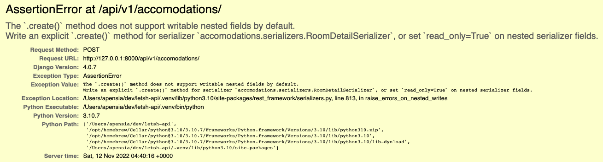
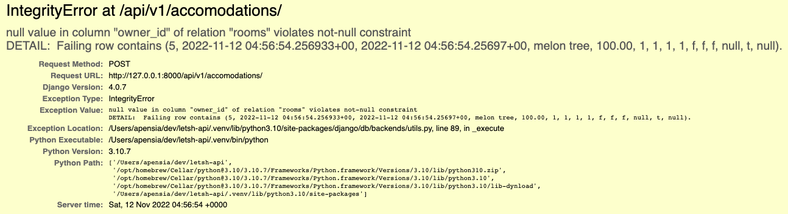

import Admonition from '@yozora/react-admonition'
import Bleed from 'nextra-theme-docs/bleed'

# 외부 관계형 데이터와 함께 새 데이터 만들기

letsh 플랫폼에서 유저는 본인이 스스로 호스트의 자격으로 숙소를 다른 유저들에게 제공할 수 있다.
한 유저는 여러 숙소들을 가질 수 있기 때문에 필자가 만든 유저 모델과 숙소 모델은 각각 일대다 관계(`1:N`)를 맺고 있는 상황이다.

## 개요

여러 관계형 모델들이 포함될 순 있지만 MVP 단계에서는 다음 두 개로 나뉘어서 작업한다.

1. `owner`: `ForeignKey`
2. `amenities`: `ManyToManyField`

### 숙소 모델

아래는 숙소 앱인 `accomodations` 내부에 필자가 설정한 모델 파일이다.

1. 유저
   - 모든 숙소는 항상 `owner`가 있어야 한다.
   - 해당 유저가 삭제되면 그 유저에 딸려 있던 모든 숙소들은 전부 삭제된다 &rarr; **<a href="https://docs.djangoproject.com/en/4.1/ref/models/fields/#django.db.models.ForeignKey.on_delete" target="_blank">`on_delete`</a> 속성을 <a href="https://docs.djangoproject.com/en/4.1/ref/models/fields/#django.db.models.CASCADE" target="_blank">`CASCADE`</a>로 지정해주었다.**
2. 카테고리
   - 모든 숙소는 항상 하나의 `category`가 있어야 한다.
   - 카테고리가 사라진다 하더라도 해당 숙소는 **변동이 없다**.
3. 편의 시설
   - 숙소는 편의 시설이 하나도 없을 수가 있다.
   - 숙소는 여러 개의 편의 시설을 보유할 수 있다.

```py accomodations/models.py
class Room(TimeStampModel):

    """Rooms Model Definition"""

    # 중략

    owner = models.ForeignKey(
        "users.User",
        on_delete=models.CASCADE,
        verbose_name=_("Owner"),
        related_name="rooms",
    )
    amenities = models.ManyToManyField("accomodations.Amenity", related_name="rooms")
    category = models.ForeignKey(
        "categories.Category",
        on_delete=models.DO_NOTHING,
    )
```

> #### Reverse Accessor
>
> 위 상황과 같이 숙소(`Room`) 모델이 유저(`User`) 모델을 `ForeignKey`로 가지고 있을 때 (즉, 한마디로 `Room` 모델은 `User` 모델을 `owner`라는 필드로 가리키고 있을 때) 해당 숙소에 대하여 주인이 누구인지는 쉽게 파악할 수 있다.
>
> ```
> >>> from accomodations.models import Room
> >>> room = Room.objects.get(pk=2)
> >>> room
> <Room: Apple Tree>
> >>> room.owner
> <User: Anna (anna@example.com)>
> ```
>
> 그렇다면 반대로 한 유저가 가지고 있는 방들에는 어떤 것들이 있는지 어떻게 알 수 있을까?
>
> <a href="https://docs.djangoproject.com/en/4.1/topics/db/queries/#following-relationships-backward" target="_blank">공식 문서</a>에 따르면 어떤 A라는 모델이 다른 B라는 모델을 `ForeignKey`로써 포함하게 될 경우, 
B 모델의 인스턴스들은 상위 A 모델의 모든 인스턴스를 반환하는 Manager에 접근할 수 있다. 이 때, A 모델의 Manager는 `{A 모델 소문자}_set` 형태로 접근할 수 있게 된다. 즉, 위의 예시에서 살펴보면
>
> ```
> >>> room.user_set.all()
> <User: Alex (admin@example.com)>
> ```
>
> 이때, `user_set`을 다른 이름으로 명명할 수가 있는데, 이는 <a href="https://docs.djangoproject.com/en/4.1/ref/models/fields/#django.db.models.ForeignKey.related_name" target="_blank">`related_name`</a>으로 설정할 수 있다.
>
> ```py accomodations/models.py
> class Room(TimeStampModel):
>
>
>    """Rooms Model Definition"""
>
>    # 중략
>
>    owner = models.ForeignKey(
>        "users.User",
>        on_delete=models.CASCADE,
>        verbose_name=_("Owner"),
>        # mark[8:19]
>        related_name="rooms",
>    )>
> ```
>
> 그럼 이제 다음과 같이도 접근이 가능하다.
>
> ```
> >>> from users.models import User
> >>> me = User.objects.get(pk=1)
> >>> me.rooms.all()
> <Room: Apple Tree>
> ```

<br/>

### 숙소 Serializer

아래는 숙소 생성에 필요한 serializer이다. 숙소 생성 시에는 모든 필드에 대한 정보를 제공해야 하기 때문에 모든 필드를 추가하기로 했다.

```py accomodations/serializers.py
from rest_framework.serializers import ModelSerializer

class RoomDetailSerializer(ModelSerializer):
    class Meta:
        model = Room
        fields = "__all__"
```

<br/>

### 유저 모델

다음은 필자가 설정한 `User` 모델이다.

```py
class User(AbstractBaseUser, TimeStampModel):

    """Custom User Definition Model"""

    # 중략

    nickname = models.CharField(
        max_length=20,
        verbose_name=_("Nickname"),
        help_text=_(
            "Can only include lower/uppercases numbers, . and _. This nickname will be shown on the profile of the host. If not specified, first name field would appear."
        ),
        error_messages={
            "null": _("You should provide your nickname."),
            "blank": _("Nickname cannot be empty."),
        },
    )
    profile_photo = models.ImageField(
        null=True, blank=True, verbose_name=_("Profile Photo")
    )

    # 중략
```

<br/>

### 편의 시설 모델

다음은 필자가 설정한 `Amenity` 모델이다. `name`은 편의 시설의 명칭이며 필수 조건이다. `description`은 편의 시설에 대한 설명이며 이는 어드민 유저들을 위해 만들었으며 필수 사항은 아니다.

```py
class Amenity(models.Model):

    """Amenity Model Definition"""

    name = models.CharField(max_length=200)
    description = models.TextField(null=True, blank=True)

    # 중략
```

<br/>

## 로직

1. 숙소의 디테일 페이지에 들어가게 되면 `Room` 모델에 정의한 필드를 전부 보여줄 것이다.
2. 따라서 유저가 숙소를 생성할 때에는 기본적으로 `Room` 모델 안에 들어가 있는 모든 필드에 대한 정보를 제공토록 할 것이다.
3. 유저가 숙소를 생성할 때에는 반드시 `owner`의 정보를 제공해야 한다. 즉, 숙소를 생성하는 사람은 본인의 정보를 제공해야 한다. 단, 이 때 모든 정보를 제공할 필요는 없고 단순히 `nickname`과 `profile_photo`만 제공한다.
4. `owner` 이외에도 `amenities`와 `category` 정보도 포함해야 한다.
5. **단, 숙소 정보를 제공할 시 유저 스스로가 본인의 정보를 제공케 해서는 안된다.**

5번의 이유는 유저가 이를 악용하여 함부로 숙소에 대한 정보를 변경시킬 수도 있기 때문이다.

<br/>

## `ForeignKey` (유저)

1. 숙소 생성 Serializer에는 숙소를 생성할 때 제공해야 하는 유저의 정보를 담은 Serializer를 포함시킨다.
2. 그렇게 새롭게 만든 Serializer를 가지고 `POST` View를 만든다.

<br/>

<CH.Scrollycoding style={{ height: 500 }}>
### 외부 모델 Serializer 변경

#### 유저 Serializer

`RoomDetailSerializer`에 `owner` 정보를 포함해야 하기 때문에 `users/` 앱 내부의 `serializers.py` 안에
숙소를 만들 때 필요한 유저의 정보를 담을 수 있는 Serializer를 만들어야 한다.
필자는 이 Serializer의 이름을 `SimpleUserForOneRoomSerializer`라 하였다.

```py users/serializers.py
from rest_framework.serializers import ModelSerializer
from .models import *


class SimpleUserForOneRoomSerializer(ModelSerializer):
    class Meta:
        model = User
        fields = ["nickname", "profile_photo"]
```

---

#### 편의 시설 Serializer

편의 시설에 대한 Serializer를 생성해준다.
편의 시설에 대한 설명을 담은 `description` 필드는 굳이 넣어줄 필요가 없을 것 같아 <a href="https://www.django-rest-framework.org/api-guide/serializers/#specifying-which-fields-to-include" target="_blank">`exclude` 키워드로 제외시켰다</a>.

```py accomodations/serializers.py
from rest_framework.serializers import ModelSerializer
from .models import *


class AmenitySerializer(ModelSerializer):
    class Meta:
        model = Amenity
        exclude = ["description"]
```

---

#### `RoomDetailSerializer`에 포함시키기

`ModelSerializer`는 <a href="https://www.django-rest-framework.org/api-guide/serializers/#specifying-fields-explicitly" target="_blank">다른 모델의 Serializer를 포함시킬 수 있다</a>.

이 때, 하나의 숙소는 여러 편의시설들을 포함시킬 수 있으므로 `many=True`를 집어넣어준다.

```py accomodations/serializers.py focus=3:4,13:15
from rest_framework.serializers import ModelSerializer
from .models import *
from users.serializers import *
from categories.serializers import *


class AmenitySerializer(ModelSerializer):
    class Meta:
        model = Amenity
        exclude = ["description"]

class RoomDetailSerializer(ModelSerializer):
    owner = SimpleUserForOneRoomSerializer()

    class Meta:
        model = Room
        fields = "__all__"
```

---

### `POST` View 작성

이후 `POST` View를 작성해준다.

```py accomodations/views.py
class RoomsView(APIView):

    # 중략

    def post(self, request):
        serializer = RoomDetailSerializer(data=request.data)

        if serializer.is_valid():
            room_to_create = serializer.save()
            serializer = RoomDetailSerializer(room_to_create)
            return Response(serializer.data)
        else:
            return Response(serializer.errors)
```

</CH.Scrollycoding>

<br/>

### 1차 결과

그럼 아래와 같은 화면 결과가 나온다.

<br/>

<center></center>

현재에는 `POST` View 내부에 정의한 `serializer`는 데이터의 유효성을 검사할 수 없다.
그도 그럴것이 앞서 `RoomDetailSerializer`에는 `category`와 `owner` 그리고 `amenities` 정보도 포함될 것이라고 했는데
View 단에서는 해당 정보를 보내주고 있지 않기 때문이다.

<br/>

### 디버깅: `AssertionError`

다음과 같이 관계형 데이터의 정보를 임의로 집어넣는 것은 DRF에선 허용하고 있지 않다.

<br/>

<Admonition 
    keyword="danger"
    style={{ color: 'red', fontSize: '16px' }}
    title={<span><strong>`AssertionError`: The `.create()` method does not support writable nested fields by default.</strong></span>}
  >
    ```json
    {
        "name": "melon tree",
        "price_per_night": 100,
        "amenities": [{
            "name": "lala"
        }],
        "category": {
            "name": "lalala",
            "kind": "room"
        }
    }
    ```
    <center></center>

</Admonition>

따라서, 각 Serializer에게 <a href="https://www.django-rest-framework.org/api-guide/fields/#read_only" target="_blank">`read_only=True`</a>를 포함시켜 API 단에서 불러올 때만 포함되지만 생성 혹은 업데이트 때에는 제외를 시킴으로써 문제를 해결할 수 있다.

```py accomodations/serializers.py
class RoomDetailSerializer(ModelSerializer):
    # mark[44:57]
    owner = SimpleUserForOneRoomSerializer(read_only=True)  # Serializer won't ask owner
    amenities = AmenitySerializer(many=True, read_only=True)
    category = CategorySerializer(read_only=True)

    class Meta:
        model = Room
        fields = "__all__"
```

<br/>

### 디버깅: `IntegrityError`

현재 `owner`는 반드시 포함되어야 하는 정보이나 이를 빼놓고 객체를 생성하게 되면 아래와 같은 에러가 발생하게 된다.

<br/>

<Admonition 
    keyword="danger"
    style={{ color: 'red', fontSize: '16px' }}
    title={<span><strong>`IntegrityError`: null value in column "FOO" of relation "BAR" violates not-null constraint.</strong></span>}
  >

    ```py accomodations/serializers.py
    class RoomDetailSerializer(ModelSerializer):
        # mark
        owner = SimpleUserForOneRoomSerializer(read_only=True)
        amenities = AmenitySerializer(many=True, read_only=True)
        category = CategorySerializer(read_only=True)

        class Meta:
            model = Room
            fields = "__all__"
    ```
    <center></center>

</Admonition>

#### `request` 객체

위 에러를 해결하기 위해선 좌우지간 `serializer`에게 `owner`에 대한 정보를 제공해야 한다.
여기에 `request` 객체에 대한 정보를 `print` 해보면

```py accomodations/views.py focus=6
class RoomsView(APIView):

    # 중략

    def post(self, request):
        print(dir(request))
        serializer = RoomDetailSerializer(data=request.data)

        if serializer.is_valid():
            room_to_create = serializer.save()
            serializer = RoomDetailSerializer(room_to_create)
            return Response(serializer.data)
        else:
            return Response(serializer.errors)
```

다음과 같은 결괏값을 얻을 수 있다. 자세히 보면 `request`라는 객체 내에 `user`라는 객체에 접근할 수 있음을 알 수 있다.
그렇다는 것은 Serializer가 `.save()` 메소드를 통해 정보를 저장할 때에 `request` 객체 내의 `user`라는 객체 정보를 전달하면 되지 않을까?

```bash
['DATA', 'FILES', 'POST', 'QUERY_PARAMS', '__class__', '__delattr__', '__dict__', '__dir__',
'__doc__', '__eq__', '__format__', '__ge__', '__getattr__', '__getattribute__', '__gt__',
'__hash__', '__init__', '__init_subclass__', '__le__', '__lt__', '__module__', '__ne__',
'__new__', '__reduce__', '__reduce_ex__', '__repr__', '__setattr__', '__sizeof__', '__str__',
'__subclasshook__', '__weakref__', '_auth', '_authenticate', '_authenticator', '_content_type',
'_data', '_default_negotiator', '_files', '_full_data', '_load_data_and_files', '_load_stream',
'_not_authenticated', '_parse', '_request', '_stream', '_supports_form_parsing', '_user',
'accepted_media_type', 'accepted_renderer', 'auth', 'authenticators', 'content_type',
'csrf_processing_done', 'data', 'force_plaintext_errors', 'negotiator', 'parser_context',
# mark[66:71]
'parsers', 'query_params', 'stream', 'successful_authenticator', 'user', 'version',
'versioning_scheme']
```

#### 추가적인 속성 전달하기

추가적인 속성을 Serializer에 전달하기 위해선 <a href="https://www.django-rest-framework.org/api-guide/serializers/#passing-additional-attributes-to-save" target="_blank">`.save()` 메소드에 전달하고자 하는 속성을 값을 담아 전달하면 된다</a>.

이 상황에선 우리는 `Room` 모델의 `ForeignKey` 필드인 `owner` 정보를 전달하고자 하는 것이므로, 다음과 같이 전달할 수 있다.

```py accomodations/views.py
    def post(self, request):
        serializer = RoomDetailSerializer(data=request.data)

        if serializer.is_valid():
            # mark[46:63]
            room_to_create = serializer.save(owner=request.user)
            serializer = RoomDetailSerializer(room_to_create)
            return Response(serializer.data)
        else:
            return Response(serializer.errors)
```

`.save()` 메소드에 추가적인 속성을 전달하는 순간, <a href="https://github.com/encode/django-rest-framework/blob/master/rest_framework/serializers.py#L178" target="_blank">`.create()`</a> 메소드의 파라미터로 전달되는 `**validated_data`에도 전달되게 된다.

## `ManyToManyField` (편의 시설)

<CH.Scrollycoding style={{ height: 500 }}>
### 외부 모델 Serializer 변경

#### 편의 시설 Serializer

편의 시설에 대한 Serializer를 생성해준다.
편의 시설에 대한 설명을 담은 `description` 필드는 굳이 넣어줄 필요가 없을 것 같아 <a href="https://www.django-rest-framework.org/api-guide/serializers/#specifying-which-fields-to-include" target="_blank">`exclude` 키워드로 제외시켰다</a>.

```py accomodations/serializers.py
from rest_framework.serializers import ModelSerializer
from .models import *


class AmenitySerializer(ModelSerializer):
    class Meta:
        model = Amenity
        exclude = ["description"]
```

---

#### `RoomDetailSerializer`에 포함시키기

이 때, 하나의 숙소는 여러 편의시설들을 포함시킬 수 있으므로 `many=True`를 집어넣어준다.

```py accomodations/serializers.py focus=13
from rest_framework.serializers import ModelSerializer
from .models import *
from users.serializers import *


class AmenitySerializer(ModelSerializer):
    class Meta:
        model = Amenity
        exclude = ["description"]

class RoomDetailSerializer(ModelSerializer):
    owner = SimpleUserForOneRoomSerializer()
    amenities = AmenitySerializer(many=True)

    class Meta:
        model = Room
        fields = "__all__"
```

</CH.Scrollycoding>
