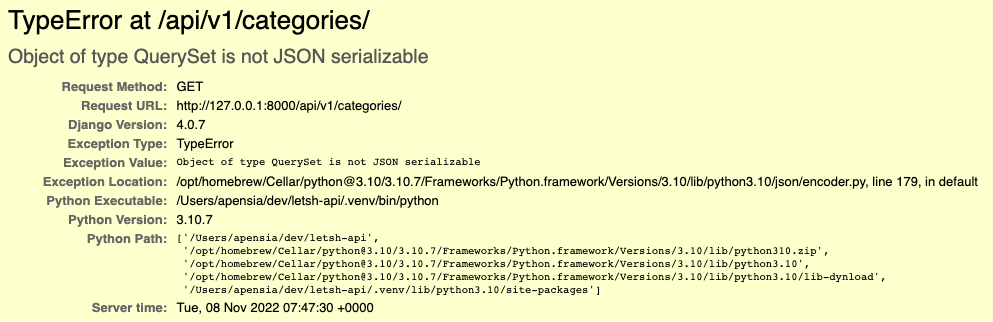

import Callout from 'nextra-theme-docs/callout'
import Bleed from 'nextra-theme-docs/bleed'

# Django Rest Framework (DRF)

## 순수 Django로 API 만들기

먼저 우리가 만든 가장 작은 단위의 모델인 `wishlists`부터 만져보도록 하자.

### URL 설정하기

아주 간단하게 URL과 View를 설정해보도록 하자.

먼저 프로젝트의 설정 폴더 내의 `urls.py` 파일에서 우리가 만든 앱 `wishlists` 앱을 연결시켜줄 수 있는 루트 URL을 설정해주자.

<a href="https://docs.djangoproject.com/en/4.1/ref/urls/#include" target="_blank"><code>include()</code></a> 메소드는 각 앱들에 대한 루트 URL을 설정해줄 수 있다. 
여기서 `wishlists` 앱은 `{메인 도메인 주소}/wishlists/`로 넘어가게끔 하고 싶기 때문에 <a href="https://docs.djangoproject.com/en/4.1/ref/urls/#path" target="_blank"><code>path()</code></a>의 첫번째 인자인 `route`에는 `wishlists/`를,
그 다음 인자인 `view`에는 그에 상응하는 루트 URL을 `include`로 연결해주었다.

```py config/settings.py m
"""
config URL Configuration

The `urlpatterns` list routes URLs to views. For more information please see:
    https://docs.djangoproject.com/en/4.0/topics/http/urls/
Examples:
Function views
    1. Add an import:  from my_app import views
    2. Add a URL to urlpatterns:  path('', views.home, name='home')
Class-based views
    1. Add an import:  from other_app.views import Home
    2. Add a URL to urlpatterns:  path('', Home.as_view(), name='home')
Including another URLconf
    1. Import the include() function: from django.urls import include, path
    2. Add a URL to urlpatterns:  path('blog/', include('blog.urls'))
"""
from django.contrib import admin
from django.urls import path, include

urlpatterns = [
    path("admin/", admin.site.urls),
    # mark[5:50]
    path("wishlists/", include("wishlists.urls")),
]
```

<br/>

이후 `wishlists` 앱 내부에 `urls.py`라는 새로운 파일을 만들고 세부 URL을 설정해준다.
아래 코드에서 `path()`의 첫번째 인자로 빈 문자열 `""`를 넣은 것은 유저가 `{도메인 주소}/wishlists/`로 갔을 때 맨 처음으로 보이는 View가 되게끔 하기 위해서이다.
두번째 인자로 들어가야 할 변수는 `view`인데 아직 `view`를 정의하지 못했으니 `view`를 정의해보도록 하자.

```py wishlists/urls.py
from django.urls import path
from .views import *

urlpatterns = [
    path("", wishlists)
]
```

<br/>

### View 설정하기

위의 URL에 걸맞는 View를 작성해보도록 하겠다. 일단 아주 간단하게 모든 찜하기 목록을 불러온 후 그 결괏값을 JSON 형태로 뿌려주는 역할을 해보도록 하겠다.
이를 위하여 <a href="https://docs.djangoproject.com/en/4.1/ref/request-response/#jsonresponse-objects" target="_blank"><code>JsonResponse</code></a>를 이용하여
통신이 원활하게 작동했을 때를 가리키는 `"ok"`와 찜하기 목록 데이터인 `"wishlists"`를 불러온다.

```py
from django.http import JsonResponse
from .models import *


def wishlists(request):
    all_wishlists = Wishlist.objects.all()
    return JsonResponse({"ok": True, "wishlists": all_wishlists})
```

<br/>

그런데 이 경우 다음과 같이 `TypeError: Object of type QuerySet is not JSON serializable` 에러가 발생하게 된다.

<br/>

<center></center>

이는 단순히 얘기해서 우리의 브라우저가 QuerySet을 읽어들이지 못하고 있으며, 그 이유는 QuerySet을 무슨 이유에선지 JSON 형태의 파일로 변환하지 못하고 있기 때문이다.
그렇기 때문에 QuerySet을 JSON 형태로 한 번 더 바꿔주는 작업을 해야 한다.

### Django 객체 직렬화하기

<a href="https://en.wikipedia.org/wiki/Serialization" target="_blank">직렬화</a>란 특정 데이터 구조 혹은 객체를 저장 가능하거나 전송되거나 재구성될 수 있도록 포맷을 바꿔주는 작업을 일컫는다.
Django는 모델을 <a href="https://docs.djangoproject.com/en/4.1/topics/serialization/#serialization-formats" target="_blank">다양한 형태</a>의 파일로 바꿔주는 <a href="https://docs.djangoproject.com/en/4.1/topics/serialization/" target="_blank">직렬화 프레임워크</a>를 지니고 있다.

<CH.Scrollycoding>

#### 모듈 불러오기

직렬화를 위하여 <a href="https://docs.djangoproject.com/en/4.1/topics/serialization/#serializing-data" target="_blank"><code>serializers</code></a> 모듈을 불러온다.

```py wishlists/views.py focus=2
from django.http import JsonResponse
from django.core import serializers
from .models import *


def wishlists(request):
    all_wishlists = Wishlist.objects.all()
    return JsonResponse({"ok": True, "wishlists": all_wishlists})
```

---

#### 직렬화하기

다음으로 `all_wishlists`를 직렬화시킨다.

```py wishlists/views.py focus=8:10
from django.http import JsonResponse
from django.core import serializers
from .models import *


def wishlists(request):
    all_wishlists = Wishlist.objects.all()
    return JsonResponse(
        {"ok": True, "wishlists": serializers.serialize("json", all_wishlists)}
    )
```

</CH.Scrollycoding>

그럼 아래와 같이 결괏값이 제대로 찍히는 것을 볼 수 있다.

<center></center>

다만, 이러한 방식의 문제점은 각 View 별로 매번 이런 작업들을 수동적으로 해줘야 한다는 뜻이고 가끔씩 우리가 숨기고 싶은 불필요한 정보들을 손쉽게 제어할 수 없다는 점이다.
따라서 Django에 내장되어 있는 직렬화 프레임워크는 아무래도 사용하는데에는 힘든 구석이 꽤 있다.

<br/>

## DRF 도입

<a href="https://www.django-rest-framework.org/" target="_blank">Django Rest Framework (이하 DRF)</a>는 이러한 문제점을 해결해줄 수 있는 유명한 프레임워크다.
단순히 직렬화 뿐만이 아니라 인증/인가 절차, 허용 범위 등 Rest API에 다양한 기능들을 추가해줄 수 있는 유용한 유틸리티들을 제공한다.

### 설치

먼저 <a href="https://www.django-rest-framework.org/#installation" target="_blank">DRF를 설치</a>하도록 하자.

```bash
# pip 사용 시
pip install djangorestframework

# pipenv 사용 시
pipenv install djangorestframework

# poetry 사용 시
poetry add djangorestframework
```

<br/>

이후 앞선 시간에 나눴던 `THIRDPARTY_APPS` 부분에 DRF를 추가시켜준다.

```py config/settings.py
THIRDPARTY_APPS = ["rest_framework"]
```

<CH.Scrollycoding>

#### `@api_view()`

필요한 모듈을 불러온다.

먼저 함수형 View에서 사용할 수 있는 <a href="https://www.django-rest-framework.org/api-guide/views/#api_view" target="_blank"><code>@api_view()</code></a> 데코레이터를 불러온다.
여기서 <a href="https://docs.python.org/3/glossary.html#term-decorator" target="_blank">데코레이터</a>란 이미 만들어져있는 기존의 코드를 수정하지 않고도 `wrapper` 함수를 이용하여
다양한 기능들을 추가할 수 있게 만들어주는 파이썬의 유용한 문법 중 하나이다.
`@api_view()` 데코레이터 내부의 파라미터로써 HTTP 메소드를 지정할 수 있다. 즉, `GET`, `POST`, `PUT`, `DELETE` 등 본인이 원하는 HTTP 메소드를 지정할 수 있다.

<a href="https://www.django-rest-framework.org/api-guide/responses/#response" target="_blank"><code>Response</code></a> 클래스는 클라이언트의 요청에 따라 다양한 형태의 데이터로 바꾸어
응답을 처리해주는 역할을 수행한다.

```py wishlists/views.py focus=1:2
from rest_framework.decorators import api_view
from rest_framework.response import Response
from .models import *


def wishlists(request):
    all_wishlists = Wishlist.objects.all()
    return JsonResponse(
        {"ok": True, "wishlists": serializers.serialize("json", all_wishlists)}
    )
```

---

#### View 수정

이후 View를 약간 수정해보자. 앞서 불러온 `@api_view()` 데코레이터를 `wishlists` View 상단에 불러온다.
또한, 아까 전에는 불러와지지 않았던 QuerySet을 불러와보자.

```py wishlists/views.py focus=6,8
from rest_framework.decorators import api_view
from rest_framework.response import Response
from .models import *


@api_view()
def wishlists(request):
    # mark[34:69]
    return Response({"ok": True, "wishlists": Wishlist.objects.all()})
```

</CH.Scrollycoding>

하지만 위 방법으로는 여전히 `TypeError: Object of type QuerySet is not JSON serializable` 에러가 발생하는 것을 알 수 있다.
즉, 여전히 브라우저는 우리가 제공하는 QuerySet을 읽어들이지 못하고 있는 것이다.

<br/>

## 직렬화

이 문제를 해결하기 위해 앞서 우리가 했었던 직렬화 작업을 한 번 더 해보도록 하자.
이번에는 Django가 아닌 DRF가 제공해주는 방법을 활용해 볼 것이다.

<CH.Scrollycoding>

### 직렬화 파일 생성

DRF의 직렬화를 사용하기 위해 `wishlists/` 폴더 내부에 `serializers.py` 파일을 생성한다.

```bash
touch wishlists/serializers.py
```

---

### 직렬화 클래스 생성

<a href="https://www.django-rest-framework.org/api-guide/serializers/#declaring-serializers" target="_blank">이 부분</a>을 참고하여 직렬화 클래스를 생성하였다.

`user`는 찜하기 목록의 주체인 유저를 의미한다. 기존의 모델에는 `accomodation`과 `transportation`도 있었지만
간결함을 위하여 현재는 제외시킨 상태이다.
`user`의 경우 단순하게 <a href="https://www.django-rest-framework.org/api-guide/fields/#charfield" target="_blank"><code>CharField</code></a>를 이용하였다.

```py wishlists/serializers.py
from rest_framework import serializers


class WishlistSerializer(serializers.Serializer):

    user = serializers.CharField(max_length=200)
```

---

### View에 직렬화 추가

앞서 만든 직렬화를 사용할 수 있도록 `import`를 해준다.

이후 `serializer`라는 변수를 `wishlists()` View 내부에 생성한 후 `WishlistSerializer` 내부 파라미터로 `wishlists` QuerySet을 넘겨준다.
마지막으로 직렬화된 QuerySet을 접근할 수 있도록 <a href="https://www.django-rest-framework.org/api-guide/serializers/#serializing-objects" target="_blank"><code>serializer.data</code></a>를 이용한다.

```py wishlists/views.py focus=4,9:11
from rest_framework.decorators import api_view
from rest_framework.response import Response
from .models import *
from .serializers import *


@api_view()
def wishlists(request):
    wishlists = Wishlist.objects.all()
    # mark[18:46]
    serializer = WishlistSerializer(wishlists)
    # mark[34:61]
    return Response({"ok": True, "wishlists": serializer.data})
```

</CH.Scrollycoding>

하지만 이번에는 다른 에러를 뱉는다.

<br/>

<center></center>

이 긴 내용의 에러의 한가지 핵심은 직렬기가 처리할 수 있는 데이터와 QuerySet 수의 차이이다.
`WishlistSerializer`는 `user`라는 필드가 있는 찜하기 QuerySet을 오직 하나를 바꾸기 위해 만들어졌다.
하지만 View에서의 직렬기에 전달한 데이터는 단순히 하나가 아닌 여러 개를 전달하였기 때문에 이런 에러가 발생하는 것이다.

따라서 하나의 직렬기를 통해 여러 객체들을 직렬화시키길 원한다면 직렬기에 <a href="https://www.django-rest-framework.org/api-guide/serializers/?q=many%3DTrue#dealing-with-multiple-objects" target="_blank"><code>many=True</code></a>
를 전달해야 한다.
이는 오직 하나의 QuerySet을 전달할 때에는 그렇게 할 필요가 없다는 뜻도 된다.

```py wishlists/views.py
from rest_framework.decorators import api_view
from rest_framework.response import Response
from .models import *
from .serializers import *


@api_view()
def wishlists(request):
    wishlists = Wishlist.objects.all()
    # mark[48:56]
    serializer = WishlistSerializer(wishlists, many=True)
    return Response({"ok": True, "wishlists": serializer.data})
```
