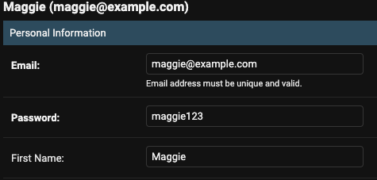
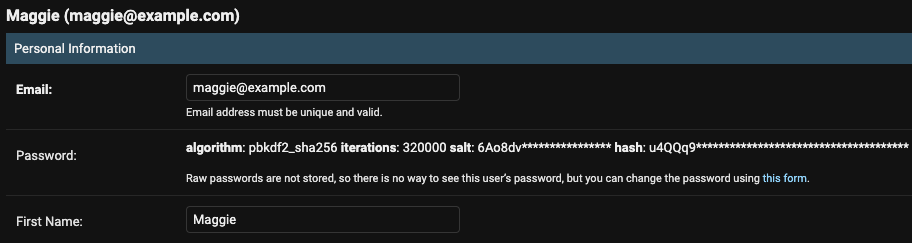

import Callout from 'nextra-theme-docs/callout'
import Bleed from 'nextra-theme-docs/bleed'
import { SiJavascript, SiPython } from 'react-icons/si'

# Django admin password hashing error

## What I tried

I was working on users admin page in for `User` model that inherited from `AbstractBaseUser`.

<br/>

## What happened

Although there was no errors in console, but admin was still saving raw password without hashing.

<br/>

## Solution

According to Stack Overflow's answer[^1], I needed to inherit <a class="https://github.com/django/django/blob/444b6da7cc229a58a2c476a52e45233001dc7073/django/contrib/auth/admin.py#L43" target="_blank"><code>UserAdmin</code></a> for admin of `User` model that is inherited from `AbstractBaseUser`.
Therefore, I simply replaced `admin.ModelAdmin` with `UserAdmin`.

<CH.Code>

```py users/admin.py(before) mark=3[17:32]
# Before
@admin.register(User)
class UserAdmin(admin.ModelAdmin):
```

---

```py users/admin.py(after) focus=2,5 mark=5[17:25]
# After
from django.contrib.auth.admin import UserAdmin as BaseUserAdmin

@admin.register(User)
class UserAdmin(UserAdmin):
```

</CH.Code>

<br/>

## Result

### Before

<center></center>

<br/>

### After

<center></center>

## Reference

[^1]:
      <a href="https://stackoverflow.com/a/32852793/13121145" target="_blank">Django Admin not hashing user's password</a>
