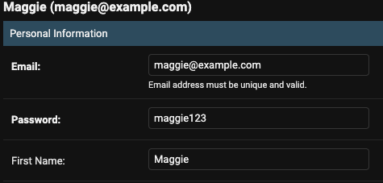
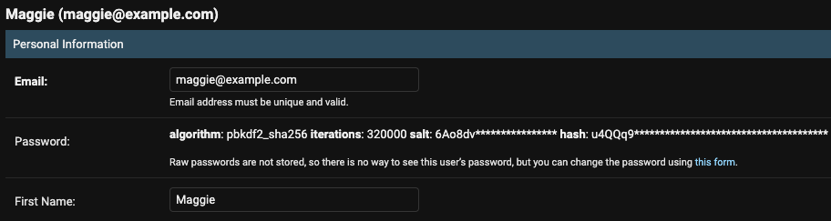

import Callout from 'nextra-theme-docs/callout'
import Bleed from 'nextra-theme-docs/bleed'
import { SiJavascript, SiPython } from 'react-icons/si'

# Django 어드민 비밀번호 해싱 에러

## 시도

`AbstractBaseUser`를 상속받아 만든 `User` 모델에 대한 어드민 페이지를 제작하고 있었다.

<br/>

## 문제 발생

콘솔에 대한 에러는 없었지만 어드민 페이지에서 비밀번호가 해싱이 되지 않은 채 저장이 되고 있었다.

<br/>

## 문제 해결

Stack Overflow의 한 답변[^1]에 따르면 `AbstractBaseUser`를 상속하여 만든 `User` 모델의 경우 <a class="https://github.com/django/django/blob/444b6da7cc229a58a2c476a52e45233001dc7073/django/contrib/auth/admin.py#L43" target="_blank"><code>UserAdmin</code></a>를 상속해야만 한다.
따라서, 단순히 `admin.ModelAdmin` 대신 `UserAdmin`을 상속시켜주었다.

<CH.Code>

```py users/admin.py(before) mark=3[17:32]
# 변경 전
@admin.register(User)
class UserAdmin(admin.ModelAdmin):
```

---

```py users/admin.py(after) focus=2,5 mark=5[17:25]
# 변경 후
from django.contrib.auth.admin import UserAdmin as BaseUserAdmin

@admin.register(User)
class UserAdmin(UserAdmin):
```

</CH.Code>

<br/>

## 결과

### 변경 전

<center></center>

<br/>

### 변경 후

<center></center>

## 참고 자료

[^1]:
      <a href="https://stackoverflow.com/a/32852793/13121145" target="_blank">Django Admin not hashing user's password</a>
