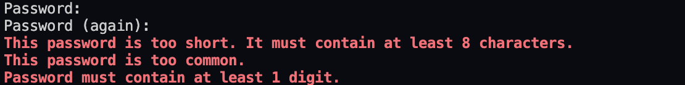

import Callout from 'nextra-theme-docs/callout'
import Bleed from 'nextra-theme-docs/bleed'

# Creating custom password validator in Django

Django provides the awesome built-in <a href="https://docs.djangoproject.com/en/4.0/topics/auth/passwords/#module-django.contrib.auth.password_validation" target="_blank">password validator</a>
that can be applied throughout the whole page by the time you initiate Django project.

Not too bad. However, I felt somehow some of them are "too much" or unnecessary. Therefore, I felt it would be much better if I can create my own custom password validator
that contains my whole password requirements that I want.

In this section, we are going to go over how can we create our own custom password validator.

<br/>

## Project initialization

### Creating virtual environment

In order to start project, we will create project folder called `password-validator`.

```bash
mkdir password-validator
cd password-validator
```

<br/>

Next, we wil set up the virutal environment with using <a href="https://pypi.org/project/pipenv/" target="_blank">pipenv</a> package.

```bash
pipenv --three
```

Finally, we will activate the virutal environment.

```bash
pipenv shell
```

<br/>

We will install Django with version of 4.0.0.

```bash
pipenv install django
```

> Make sure you always activate the virtual environment before installing Django!
> If you would like to deactivate the virtual environment, you can simply type `deactivate` on the command console.[^1]

If you successfully installed Django, Django will automatically create `Pipfile` file with contenst below for you.

```
[[source]]
url = "https://pypi.org/simple"
verify_ssl = true
name = "pypi"

[packages]
django = "*"

[dev-packages]

[requires]
python_version = "3.10"
```

<br/>

### Creating Django App

In the console, run the following command with virutal environment being up.

```bash
django-admin startproject config .
```

This command allows us to create Django project name `config` within `password-validator` folder.

<br/>

If you go to `settings.py` file, you will be able to see the Django's built-in password validators in `AUTH_PASSWORD_VALIDATORS`.[^2]

```python settings.py
AUTH_PASSWORD_VALIDATORS = [
    {
        'NAME': 'django.contrib.auth.password_validation.UserAttributeSimilarityValidator',
    },
    {
        'NAME': 'django.contrib.auth.password_validation.MinimumLengthValidator',
    },
    {
        'NAME': 'django.contrib.auth.password_validation.CommonPasswordValidator',
    },
    {
        'NAME': 'django.contrib.auth.password_validation.NumericPasswordValidator',
    },
]
```

<br/>

## Creating apps for `Users`

We are going to create django app called `users` that contain the user information. However, we are not going to build up any models, views or other annoying things here.
As we would just like to test out our password validator.

<br/>

To begin with, we will create the `users` app by hitting the console command.

```bash
django-admin startapp users
```

<br/>

Then, we are going to include the `users` into `INSTALLED_APPS`, so that Django can recognize our installed apps.

```python settings.py bg=8 box=8[5:11]
INSTALLED_APPS = [
    'django.contrib.admin',
    'django.contrib.auth',
    'django.contrib.contenttypes',
    'django.contrib.sessions',
    'django.contrib.messages',
    'django.contrib.staticfiles',
    'users'
]
```

<br/>

### Migration

Then, we are going to create DB table for `users`.

```bash
python manage.py migrate
```

So far, our folder structure will look as below:

<center></center>

<br/>

## Creating custom password validator

Inside the `uesrs/` folder, we are going to create new file called `validators.py`.[^3]

```
# For Mac/Linux users
touch validators.py

# For Windows users
echo.>validators.py
```

<br/>

<CH.Scrollycoding>

### Creating custom validator class

I created the custom password validator class called `CustomPasswordValidator`.

As mentioned in documentation, we are required to define the two methods.

1. `validate()`: This is where all our custom password validation logics will go.
2. `get_help_text()`: This is the help text that will be shown on the admin page.

```python users/validators.py focus=1,3:4,17
from django.core.exceptions import ValidationError

class CustomPasswordValidator():
    def validate(self, password, user=None):
        MIN_LENGTH = 1
        special_characters = "[~\!@#\$%\^&\*\(\)_\+{}\":;'\[\]]"

        if not any(c.isdigit() for c in password):
            raise ValidationError(f"Password must contain at least {MIN_LENGTH} digit.")
        if not any(c.isalpha() for c in password):
            raise ValidationError(f"Password must contain at least {MIN_LENGTH} character.")
        if not any(c.isupper() for c in password): # 3
            raise ValidationError(f"Password must contain at least {MIN_LENGTH} uppercase.")
        if not any(c in special_characters for c in password): # 4
            raise ValidationError(f"Password must contain at least {MIN_LENGTH} special characters.")

    def get_help_text():
        pass
```

---

### Inserting help text

I would like my custom passwords follow the below criteria:

- It must include at least one number.
- It must include at least one lowercase.
- It must include at least one uppercase.
- It must include at least one special character.

Therefore, inside the `get_help_text()` method, I included the text that explains how should my password validator look like.
This could be used as an error message if users attempted to create the password that does NOT match up with the criteria.

```python users/validators.py focus=18
from django.core.exceptions import ValidationError

class CustomPasswordValidator():
    def validate(self, password, user=None):
        MIN_LENGTH = 1
        special_characters = "[~\!@#\$%\^&\*\(\)_\+{}\":;'\[\]]"

        if not any(c.isdigit() for c in password):
            raise ValidationError(f"Password must contain at least {MIN_LENGTH} digit.")
        if not any(c.isalpha() for c in password):
            raise ValidationError(f"Password must contain at least {MIN_LENGTH} character.")
        if not any(c.isupper() for c in password): # 3
            raise ValidationError(f"Password must contain at least {MIN_LENGTH} uppercase.")
        if not any(c in special_characters for c in password): # 4
            raise ValidationError(f"Password must contain at least {MIN_LENGTH} special characters.")

    def get_help_text():
        return "Password should be no less than 8 characters with including at least 1 uppercase, lowercase, number and special character."
```

---

#### Declaring variables

Now, it's time to create our logic for `CustomPasswordValidator`. As I want to include at least one uppercase, lowercase, number and special character, I set variable `MIN_LENGTH` as `1` for this.

Also, I included the list of special characters as a string value that will be used as RegEx.

```python users/validators.py focus=5:6
from django.core.exceptions import ValidationError

class CustomPasswordValidator():
    def validate(self, password, user=None):
        MIN_LENGTH = 1
        special_characters = "[~\!@#\$%\^&\*\(\)_\+{}\":;'\[\]]"

        if not any(c.isdigit() for c in password):
            raise ValidationError(f"Password must contain at least {MIN_LENGTH} digit.")
        if not any(c.isalpha() for c in password):
            raise ValidationError(f"Password must contain at least {MIN_LENGTH} character.")
        if not any(c.isupper() for c in password): # 3
            raise ValidationError(f"Password must contain at least {MIN_LENGTH} uppercase.")
        if not any(c in special_characters for c in password): # 4
            raise ValidationError(f"Password must contain at least {MIN_LENGTH} special characters.")

    def get_help_text():
        return "Password should be no less than 8 characters with including at least 1 uppercase, lowercase, number and special character."
```

---

### Including at least one number

With using <a href="https://docs.python.org/3/library/stdtypes.html?highlight=isdigit#bytearray.isdigit"><code>isdigit()</code></a> method, we will check any characters that are numbers.
If all values in the sequence are numbers, then it will return `True`.

In this case, `c.isdigit() for c in password` will check that for every single one word in `password` that users provided, it will check whether they are all numbers.

Then, we will wrap the above interation with <a href="https://docs.python.org/3/library/functions.html#any" target="_blank"><code>any()</code></a> method, so that we can get `True` value
if there is **_at least one_** number in the password.

Finally, with using `not` keyword, the whole logic for the first `if` logic would be

> If there is NO number in the users' password at all ...

If this true, then we will raise the <a href="https://docs.djangoproject.com/en/4.0/ref/exceptions/#django.core.exceptions.ValidationError" target="_blank"><code>ValidationError</code></a> with the custom error message that we defined above.

```py users/validators.py focus=8:9
from django.core.exceptions import ValidationError

class CustomPasswordValidator():
    def validate(self, password, user=None):
        MIN_LENGTH = 1
        special_characters = "[~\!@#\$%\^&\*\(\)_\+{}\":;'\[\]]"

        if not any(c.isdigit() for c in password):
            raise ValidationError(f"Password must contain at least {MIN_LENGTH} digit.")
        if not any(c.isalpha() for c in password):
            raise ValidationError(f"Password must contain at least {MIN_LENGTH} character.")
        if not any(c.isupper() for c in password): # 3
            raise ValidationError(f"Password must contain at least {MIN_LENGTH} uppercase.")
        if not any(c in special_characters for c in password): # 4
            raise ValidationError(f"Password must contain at least {MIN_LENGTH} special characters.")

    def get_help_text():
        return "Password should be no less than 8 characters with including at least 1 uppercase, lowercase, number and special character."
```

---

### Including at least one alphabetic cases

Same logic is applied as we did on the previous section.
This time, we will be using <a href="https://docs.python.org/3/library/stdtypes.html?highlight=isalpha#bytearray.isalpha"><code>isalpha()</code></a> method, we will check all characters whether they are alphabets.
If it is, then it will return `True`.

Our final logic for this would be

> If there is NO alphabets in the users' password at all ...

If this true, then we will raise the <a href="https://docs.djangoproject.com/en/4.0/ref/exceptions/#django.core.exceptions.ValidationError" target="_blank"><code>ValidationError</code></a>.

```py users/validators.py focus=10:11
from django.core.exceptions import ValidationError

class CustomPasswordValidator():
    def validate(self, password, user=None):
        MIN_LENGTH = 1
        special_characters = "[~\!@#\$%\^&\*\(\)_\+{}\":;'\[\]]"

        if not any(c.isdigit() for c in password):
            raise ValidationError(f"Password must contain at least {MIN_LENGTH} digit.")
        if not any(c.isalpha() for c in password):
            raise ValidationError(f"Password must contain at least {MIN_LENGTH} character.")
        if not any(c.isupper() for c in password): # 3
            raise ValidationError(f"Password must contain at least {MIN_LENGTH} uppercase.")
        if not any(c in special_characters for c in password): # 4
            raise ValidationError(f"Password must contain at least {MIN_LENGTH} special characters.")

    def get_help_text():
        return "Password should be no less than 8 characters with including at least 1 uppercase, lowercase, number and special character."
```

---

### Including at least one uppercase

We will be using <a href="https://docs.python.org/3/library/stdtypes.html?highlight=isalpha#bytearray.isalpha"><code>isupper()</code></a> method, we will check all characters whether they are uppercases.
If it is, then it will return `True`.

Our final logic for this would be

> If there is NO uppercases in the users' password at all ...

If this true, then we will raise the <a href="https://docs.djangoproject.com/en/4.0/ref/exceptions/#django.core.exceptions.ValidationError" target="_blank"><code>ValidationError</code></a>.

```py users/validators.py focus=12:13
from django.core.exceptions import ValidationError

class CustomPasswordValidator():
    def validate(self, password, user=None):
        MIN_LENGTH = 1
        special_characters = "[~\!@#\$%\^&\*\(\)_\+{}\":;'\[\]]"

        if not any(c.isdigit() for c in password):
            raise ValidationError(f"Password must contain at least {MIN_LENGTH} digit.")
        if not any(c.isalpha() for c in password):
            raise ValidationError(f"Password must contain at least {MIN_LENGTH} character.")
        if not any(c.isupper() for c in password): # 3
            raise ValidationError(f"Password must contain at least {MIN_LENGTH} uppercase.")
        if not any(c in special_characters for c in password): # 4
            raise ValidationError(f"Password must contain at least {MIN_LENGTH} special characters.")

    def get_help_text():
        return "Password should be no less than 8 characters with including at least 1 uppercase, lowercase, number and special character."
```

---

### Including at least one special characters

Finally, we are going to check if user's password contains any special characters.

```py users/validators.py focus=14:15
from django.core.exceptions import ValidationError

class CustomPasswordValidator():
    def validate(self, password, user=None):
        MIN_LENGTH = 1
        special_characters = "[~\!@#\$%\^&\*\(\)_\+{}\":;'\[\]]"

        if not any(c.isdigit() for c in password):
            raise ValidationError(f"Password must contain at least {MIN_LENGTH} digit.")
        if not any(c.isalpha() for c in password):
            raise ValidationError(f"Password must contain at least {MIN_LENGTH} character.")
        if not any(c.isupper() for c in password): # 3
            raise ValidationError(f"Password must contain at least {MIN_LENGTH} uppercase.")
        if not any(c in special_characters for c in password): # 4
            raise ValidationError(f"Password must contain at least {MIN_LENGTH} special characters.")

    def get_help_text():
        return "Password should be no less than 8 characters with including at least 1 uppercase, lowercase, number and special character."
```

</CH.Scrollycoding>

<br/>

## Including our custom password validator

<CH.Scrollycoding>

Now that we created our own custom password validator, we are going to include it in <a href="https://docs.djangoproject.com/en/4.0/ref/settings/#std-setting-AUTH_PASSWORD_VALIDATORS" target="_blank"><code>AUTH_PASSWORD_VALIDATORS</code></a>.

```python settings.py
AUTH_PASSWORD_VALIDATORS = [
    {
        'NAME': 'django.contrib.auth.password_validation.UserAttributeSimilarityValidator',
    },
    {
        'NAME': 'django.contrib.auth.password_validation.MinimumLengthValidator',
    },
    {
        'NAME': 'django.contrib.auth.password_validation.CommonPasswordValidator',
    },
    {
        'NAME': 'django.contrib.auth.password_validation.NumericPasswordValidator',
    },
]
```

---

You are more than welcomed to delete the unnecessary password validator if you want.
In this case, I deleted <a href="https://docs.djangoproject.com/en/4.0/topics/auth/passwords/#django.contrib.auth.password_validation.UserAttributeSimilarityValidator" target="_blank"><code>UserAttributeSimilarityValidator</code></a>
as I think this validator is too strict for users.

```python settings.py
AUTH_PASSWORD_VALIDATORS = [
    {
        'NAME': 'django.contrib.auth.password_validation.MinimumLengthValidator',
    },
    {
        'NAME': 'django.contrib.auth.password_validation.CommonPasswordValidator',
    },
    {
        'NAME': 'django.contrib.auth.password_validation.NumericPasswordValidator',
    },
]
```

---

Instead, we are going to include our `CustomPasswordValidator` class that we made in our `validators.py` file.

```python settings.py focus=2:4
AUTH_PASSWORD_VALIDATORS = [
    {
        'NAME': 'users.validators.CustomPasswordValidator'
    }
    {
        'NAME': 'django.contrib.auth.password_validation.MinimumLengthValidator',
    },
    {
        'NAME': 'django.contrib.auth.password_validation.CommonPasswordValidator',
    },
    {
        'NAME': 'django.contrib.auth.password_validation.NumericPasswordValidator',
    },
]
```

</CH.Scrollycoding>

<br/>

## Result

If you are typing only numbers, you will get error as below:

<center></center>

And when you only type strings:

<center></center>

And when you only type lowercase and numbers:

<center></center>

And finally when you omitted the special characters:

<center></center>

[^1]:
    <a href="https://stackoverflow.com/a/49944909/13121145" target="_blank">Exiting virutal environment in pipenv</a>

[^2]:
    <a href="https://docs.djangoproject.com/en/4.0/topics/auth/passwords/#included-validators" taret="_blank">What are some basic built-in password validators?</a>

[^3]:
    <a href="https://docs.djangoproject.com/en/4.0/topics/auth/passwords/#writing-your-own-validator" target="_blank">Referred to this page</a>
