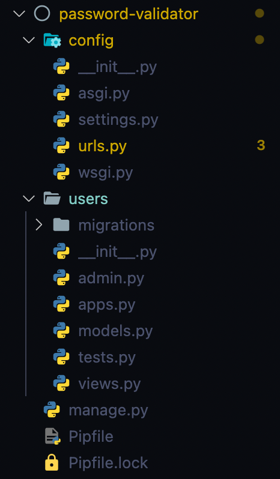

import Callout from 'nextra-theme-docs/callout'
import Bleed from 'nextra-theme-docs/bleed'

# Django 커스텀 비밀번호 유효성 검사기 만들기

Django에는 Django 프로젝트 시작할 때 모든 페이지에 적용 가능한
이미 멋진 <a href="https://docs.djangoproject.com/en/4.0/topics/auth/passwords/#module-django.contrib.auth.password_validation" target="_blank">비밀번호 유효성 검사기</a>가 내장되어 있다.

나쁘진 않지만 몇몇 검사기들은 "너무 과하거나" 불필요한 것들이 있었기에 나만의 기준이 들어 있는 커스터마이징된 비밀번호 유효성 검사기를 만들어보면 좋겠다는 생각을 해보았다.

따라서 이번 섹션에선 어떻게 커스터마이징된 비밀번호 유효성 검사기를 만들어볼 수 있을지 살펴보도록 하겠다.

<br/>

## 프로젝트 시작하기

### 가상 환경 설정

프로젝트를 꾸리기 위해 `password-validator`라는 프로젝트 폴더를 하나 만들어준다.

```bash
mkdir password-validator
cd password-validator
```

<br/>

다음, <a href="https://pypi.org/project/pipenv/" target="_blank">pipenv</a> 패키지를 통해 가상 환경을 설정한다.

```bash
pipenv --three
```

마지막으로, 가상 환경을 활성화한다.

```bash
pipenv shell
```

<br/>

Django 4.0.0 버전을 설치한다.

```bash
pipenv install django
```

> 꼭 가상 환경을 활성화시킨 상태에서 Django를 설치하도록 하자!
> 가상 환경을 비활성화하려면 커맨드 콘솔 창에 `deactivate`[^1]라고 치면 된다.

Django를 성공적으로 설치했다면 Django가 아래 내용들이 담긴 `Pipfile`를 생성해준다.

```
[[source]]
url = "https://pypi.org/simple"
verify_ssl = true
name = "pypi"

[packages]
django = "*"

[dev-packages]

[requires]
python_version = "3.10"
```

<br/>

### Django 앱 만들기

가상 환경이 활성화된 상태에서 콘솔 창에 다음 명령어를 실행한다.

```bash
django-admin startproject config .
```

이 명령어를 통해 `password-validator` 폴더 내부에 `config`라고 하는 Django 프로젝트를 생성할 수 있다.

<br/>

`settings.py`에 가면 `AUTH_PASSWORD_VALIDATORS`[^2]에 Django에 내장된 비밀번호 유효성 검사기들을 확인할 수 있다.

```python settings.py
AUTH_PASSWORD_VALIDATORS = [
    {
        'NAME': 'django.contrib.auth.password_validation.UserAttributeSimilarityValidator',
    },
    {
        'NAME': 'django.contrib.auth.password_validation.MinimumLengthValidator',
    },
    {
        'NAME': 'django.contrib.auth.password_validation.CommonPasswordValidator',
    },
    {
        'NAME': 'django.contrib.auth.password_validation.NumericPasswordValidator',
    },
]
```

<br/>

## `Users` 앱 만들기

유저의 정보를 담고 있는 `users`라는 Django 앱을 만들어 볼 것이다. 하지만 모델이나 뷰 설정 등 귀찮은 작업은 이번 섹션에선 다루지 않을 예정이다.
우리가 만드려는 비밀번호 유효성 검사기를 테스트하기 위한 것 뿐이기 때문이다.

<br/>

먼저, 다음 명령어를 통해 `users`라는 앱을 만든다.

```bash
django-admin startapp users
```

<br/>

이후, Django가 우리가 설치해준 `users` 앱을 인식할 수 있도록 `INSTALLED_APPS`에 포함시켜 준다.

```python settings.py bg=8 box=8[5:11]
INSTALLED_APPS = [
    'django.contrib.admin',
    'django.contrib.auth',
    'django.contrib.contenttypes',
    'django.contrib.sessions',
    'django.contrib.messages',
    'django.contrib.staticfiles',
    'users'
]
```

<br/>

### Migration

`users`를 위한 DB 테이블을 만들어주자.

```bash
python manage.py migrate
```

여기까지의 폴더 구조를 살피면 다음과 같다.

<center></center>

<br/>

## 커스터마이징된 비밀번호 유효성 검사기 만들기

`users/` 폴더 안에 `validators.py`라는 파일을 새로 생성해주자.[^3]

```
# 맥/리눅스 유저 경우
touch validators.py

# 윈도우 유저의 경우
echo.>validators.py
```

<br/>

<CH.Scrollycoding>

### 커스텀 유효성 검사기 클래스 생성

`CustomPasswordValidator`라는 이름의 커스텀 비밀번호 유효성 검사기 클래스를 만들었다.

공식 문서에서도 확인할 수 있듯이, 다음 두 메소드를 반드시 설정해줘야 한다.

1. `validate()`: 여기에 나만의 커스터마이징 비밀번호 유효성 검사기의 로직이 들어가게 된다.
2. `get_help_text()`: 에러가 날 경우 나타나게 될 도움말이다.

```python users/validators.py focus=1,3:4,17
from django.core.exceptions import ValidationError

class CustomPasswordValidator():
    def validate(self, password, user=None):
        MIN_LENGTH = 1
        special_characters = "[~\!@#\$%\^&\*\(\)_\+{}\":;'\[\]]"

        if not any(c.isdigit() for c in password):
            raise ValidationError(f"비밀번호는 최소 {MIN_LENGTH}개의 숫자를 포함해야 합니다.")
        if not any(c.isalpha() for c in password):
            raise ValidationError(f"비밀번호는 최소 {MIN_LENGTH}개의 영소문자를 포함해야 합니다.")
        if not any(c.isupper() for c in password): # 3
            raise ValidationError(f"비밀번호는 최소 {MIN_LENGTH}개의 영대문자를 포함해야 합니다.")
        if not any(c in special_characters for c in password): # 4
            raise ValidationError(f"비밀번호는 최소 {MIN_LENGTH}개의 특수문자를 포함해야 합니다.")

    def get_help_text():
        pass
```

---

### 도움말 설정하기

내가 만들고자 하는 비밀번호의 조건들은 다음과 같다.

- 최소한 1개의 숫자를 반드시 포함할 것.
- 최소한 1개의 알파벳 소문자를 반드시 포함할 것.
- 최소한 1개의 알파벳 대문자를 반드시 포함할 것.
- 최소한 1개의 특수문자를 반드시 포함할 것.

따라서, `get_help_text()` 메소드 내부에 비밀번호 유효성 검사기에 대한 도움말을 설정해주었다.
이는 유저가 조건에 맞지 않는 비밀번호를 기입하였을 때 나타낼 수 있는 에러 메세지로도 사용할 수 있다.

```python users/validators.py focus=18
from django.core.exceptions import ValidationError

class CustomPasswordValidator():
    def validate(self, password, user=None):
        MIN_LENGTH = 1
        special_characters = "[~\!@#\$%\^&\*\(\)_\+{}\":;'\[\]]"

        if not any(c.isdigit() for c in password):
            raise ValidationError(f"비밀번호는 최소 {MIN_LENGTH}개의 숫자를 포함해야 합니다.")
        if not any(c.isalpha() for c in password):
            raise ValidationError(f"비밀번호는 최소 {MIN_LENGTH}개의 영소문자를 포함해야 합니다.")
        if not any(c.isupper() for c in password): # 3
            raise ValidationError(f"비밀번호는 최소 {MIN_LENGTH}개의 영대문자를 포함해야 합니다.")
        if not any(c in special_characters for c in password): # 4
            raise ValidationError(f"비밀번호는 최소 {MIN_LENGTH}개의 특수문자를 포함해야 합니다.")

    def get_help_text():
        return "비밀번호는 영어 대소문자, 숫자 그리고 특수문자를 최소 1개씩 포함하여야 합니다."
```

---

#### 변수 선언하기

이제 본격적으로 `CustomPasswordValidator`에 대한 로직을 짜보도록 하자. 알파멧 대소문자와 숫자 그리고 특수문자를 1개씩은 최소한 넣었으면 하기 때문에 `MIN_LENGTH`를 `1`로 지정해주었다.

또한, 유저가 사용할 수 있는 모든 특수문자를 `special_characters`라는 하나의 문자열 값을 지정해주었다.

```python users/validators.py focus=5:6
from django.core.exceptions import ValidationError

class CustomPasswordValidator():
    def validate(self, password, user=None):
        MIN_LENGTH = 1
        special_characters = "[~\!@#\$%\^&\*\(\)_\+{}\":;'\[\]]"

        if not any(c.isdigit() for c in password):
            raise ValidationError(f"비밀번호는 최소 {MIN_LENGTH}개의 숫자를 포함해야 합니다.")
        if not any(c.isalpha() for c in password):
            raise ValidationError(f"비밀번호는 최소 {MIN_LENGTH}개의 영소문자를 포함해야 합니다.")
        if not any(c.isupper() for c in password): # 3
            raise ValidationError(f"비밀번호는 최소 {MIN_LENGTH}개의 영대문자를 포함해야 합니다.")
        if not any(c in special_characters for c in password): # 4
            raise ValidationError(f"비밀번호는 최소 {MIN_LENGTH}개의 특수문자를 포함해야 합니다.")

    def get_help_text():
        return "비밀번호는 영어 대소문자, 숫자 그리고 특수문자를 최소 1개씩 포함하여야 합니다."
```

---

### 최소 1개의 숫자를 포함하기

<a href="https://docs.python.org/3/library/stdtypes.html?highlight=isdigit#bytearray.isdigit"><code>isdigit()</code></a> 메소드를 통해, 모든 글자가 숫자인지 판별할 수 있다.
만일 모든 값이 숫자일 경우, `True`를 반환하게 된다.

`c.isdigit() for c in password`를 통해 유저가 제공한 `password`의 모든 글자가 숫자로 이루어져 있는지 하나하나 체크하게 된다.

그런 다음, <a href="https://docs.python.org/3/library/functions.html#any" target="_blank"><code>any()</code></a> 메소드로 감싸서 비밀번호가 **최소 한 개의** 숫자를 포함하고 있다면
`True`값을 반환해주는 것으로 바꾼다.

마지막으로, `not`이라는 키워드를 통해 `if`문의 로직은 다음과 같이 풀이될 수 있다.

> 만일 유저의 비밀번호에 숫자가 하나도 존재하지 않는다면 ...

만일 위의 명제가 참일 경우, <a href="https://docs.djangoproject.com/en/4.0/ref/exceptions/#django.core.exceptions.ValidationError" target="_blank"><code>ValidationError</code></a>를 통해 위에서 설정해준 커스텀 에러 메세지를 뱉게 한다.

```py users/validators.py focus=8:9
from django.core.exceptions import ValidationError

class CustomPasswordValidator():
    def validate(self, password, user=None):
        MIN_LENGTH = 1
        special_characters = "[~\!@#\$%\^&\*\(\)_\+{}\":;'\[\]]"

        if not any(c.isdigit() for c in password):
            raise ValidationError(f"비밀번호는 최소 {MIN_LENGTH}개의 숫자를 포함해야 합니다.")
        if not any(c.isalpha() for c in password):
            raise ValidationError(f"비밀번호는 최소 {MIN_LENGTH}개의 영소문자를 포함해야 합니다.")
        if not any(c.isupper() for c in password): # 3
            raise ValidationError(f"비밀번호는 최소 {MIN_LENGTH}개의 영대문자를 포함해야 합니다.")
        if not any(c in special_characters for c in password): # 4
            raise ValidationError(f"비밀번호는 최소 {MIN_LENGTH}개의 특수문자를 포함해야 합니다.")

    def get_help_text():
        return "비밀번호는 영어 대소문자, 숫자 그리고 특수문자를 최소 1개씩 포함하여야 합니다."
```

---

### 최소 1개의 영소문자를 포함하기

위의 로직과 동일하다.
이번에는 <a href="https://docs.python.org/3/library/stdtypes.html?highlight=isalpha#bytearray.isalpha"><code>isalpha()</code></a> 메소드를 이용하여 모든 글자가 영소문자로 이루어져 있는지 체크한다.
만일 그렇다면 `True`값을 반환한다.

이는 다음과 같이 풀이될 수 있다.

> 만일 유저의 비밀번호에 영소문자가 하나도 존재하지 않는다면 ...

만일 위의 명제가 참이라면 <a href="https://docs.djangoproject.com/en/4.0/ref/exceptions/#django.core.exceptions.ValidationError" target="_blank"><code>ValidationError</code></a>를 제기한다.

```py users/validators.py focus=10:11
from django.core.exceptions import ValidationError

class CustomPasswordValidator():
    def validate(self, password, user=None):
        MIN_LENGTH = 1
        special_characters = "[~\!@#\$%\^&\*\(\)_\+{}\":;'\[\]]"

        if not any(c.isdigit() for c in password):
            raise ValidationError(f"비밀번호는 최소 {MIN_LENGTH}개의 숫자를 포함해야 합니다.")
        if not any(c.isalpha() for c in password):
            raise ValidationError(f"비밀번호는 최소 {MIN_LENGTH}개의 영소문자를 포함해야 합니다.")
        if not any(c.isupper() for c in password): # 3
            raise ValidationError(f"비밀번호는 최소 {MIN_LENGTH}개의 영대문자를 포함해야 합니다.")
        if not any(c in special_characters for c in password): # 4
            raise ValidationError(f"비밀번호는 최소 {MIN_LENGTH}개의 특수문자를 포함해야 합니다.")

    def get_help_text():
        return "비밀번호는 영어 대소문자, 숫자 그리고 특수문자를 최소 1개씩 포함하여야 합니다."
```

---

### 최소 1개의 영대문자를 포함하기

<a href="https://docs.python.org/3/library/stdtypes.html?highlight=isalpha#bytearray.isalpha"><code>isupper()</code></a> 메소드를 통해 모든 글자가 영대문자인지 확인한다. 
만일 그렇다면 `True`값을 반환한다.

로직은 다음과 같다.

> 만일 유저의 비밀번호에 영대문자가 하나도 존재하지 않는다면 ...

위의 명제가 참일 경우, <a href="https://docs.djangoproject.com/en/4.0/ref/exceptions/#django.core.exceptions.ValidationError" target="_blank"><code>ValidationError</code></a>를 제기한다.

```py users/validators.py focus=12:13
from django.core.exceptions import ValidationError

class CustomPasswordValidator():
    def validate(self, password, user=None):
        MIN_LENGTH = 1
        special_characters = "[~\!@#\$%\^&\*\(\)_\+{}\":;'\[\]]"

        if not any(c.isdigit() for c in password):
            raise ValidationError(f"비밀번호는 최소 {MIN_LENGTH}개의 숫자를 포함해야 합니다.")
        if not any(c.isalpha() for c in password):
            raise ValidationError(f"비밀번호는 최소 {MIN_LENGTH}개의 영소문자를 포함해야 합니다.")
        if not any(c.isupper() for c in password): # 3
            raise ValidationError(f"비밀번호는 최소 {MIN_LENGTH}개의 영대문자를 포함해야 합니다.")
        if not any(c in special_characters for c in password): # 4
            raise ValidationError(f"비밀번호는 최소 {MIN_LENGTH}개의 특수문자를 포함해야 합니다.")

    def get_help_text():
        return "비밀번호는 영어 대소문자, 숫자 그리고 특수문자를 최소 1개씩 포함하여야 합니다."
```

---

### 최소 1개의 특수문자를 포함하기

마지막으로 유저의 비밀번호에 특수문자가 포함되어 있는지 체크한다.

```py users/validators.py focus=14:15
from django.core.exceptions import ValidationError

class CustomPasswordValidator():
    def validate(self, password, user=None):
        MIN_LENGTH = 1
        special_characters = "[~\!@#\$%\^&\*\(\)_\+{}\":;'\[\]]"

        if not any(c.isdigit() for c in password):
            raise ValidationError(f"비밀번호는 최소 {MIN_LENGTH}개의 숫자를 포함해야 합니다.")
        if not any(c.isalpha() for c in password):
            raise ValidationError(f"비밀번호는 최소 {MIN_LENGTH}개의 영소문자를 포함해야 합니다.")
        if not any(c.isupper() for c in password): # 3
            raise ValidationError(f"비밀번호는 최소 {MIN_LENGTH}개의 영대문자를 포함해야 합니다.")
        if not any(c in special_characters for c in password): # 4
            raise ValidationError(f"비밀번호는 최소 {MIN_LENGTH}개의 특수문자를 포함해야 합니다.")

    def get_help_text():
        return "비밀번호는 영어 대소문자, 숫자 그리고 특수문자를 최소 1개씩 포함하여야 합니다."
```

</CH.Scrollycoding>

<br/>

## 커스터마이징된 유효성 검사기 추가하기

<CH.Scrollycoding>

커스터마이징 유효성 검사기를 만들었으니 <a href="https://docs.djangoproject.com/en/4.0/ref/settings/#std-setting-AUTH_PASSWORD_VALIDATORS" target="_blank"><code>AUTH_PASSWORD_VALIDATORS</code></a>에 추가해주도록 하자.

```python settings.py
AUTH_PASSWORD_VALIDATORS = [
    {
        'NAME': 'django.contrib.auth.password_validation.UserAttributeSimilarityValidator',
    },
    {
        'NAME': 'django.contrib.auth.password_validation.MinimumLengthValidator',
    },
    {
        'NAME': 'django.contrib.auth.password_validation.CommonPasswordValidator',
    },
    {
        'NAME': 'django.contrib.auth.password_validation.NumericPasswordValidator',
    },
]
```

---

물론 불필요한 검사기는 얼마든지 제거해도 된다.
필자의 경우 <a href="https://docs.djangoproject.com/en/4.0/topics/auth/passwords/#django.contrib.auth.password_validation.UserAttributeSimilarityValidator" target="_blank"><code>UserAttributeSimilarityValidator</code></a>가
너무 엄격한 기준인 것 같아 제거해버렸다.

```python settings.py
AUTH_PASSWORD_VALIDATORS = [
    {
        'NAME': 'django.contrib.auth.password_validation.MinimumLengthValidator',
    },
    {
        'NAME': 'django.contrib.auth.password_validation.CommonPasswordValidator',
    },
    {
        'NAME': 'django.contrib.auth.password_validation.NumericPasswordValidator',
    },
]
```

---

그 대신, `validators.py` 파일에 있는 `CustomPasswordValidator` 클래스를 추가해주었다.

```python settings.py focus=2:4
AUTH_PASSWORD_VALIDATORS = [
    {
        'NAME': 'users.validators.CustomPasswordValidator'
    }
    {
        'NAME': 'django.contrib.auth.password_validation.MinimumLengthValidator',
    },
    {
        'NAME': 'django.contrib.auth.password_validation.CommonPasswordValidator',
    },
    {
        'NAME': 'django.contrib.auth.password_validation.NumericPasswordValidator',
    },
]
```

</CH.Scrollycoding>

<br/>

## 결과

만일 숫자만 치게 될 경우, 다음과 같은 에러가 발생된다.

<center></center>

숫자가 안 들어간 오로지 글자만 쳤을 경우,

<center></center>

영소문자와 숫자만 쳤을 경우,

<center></center>

그리고 마지막으로 특수문자를 생략했을 경우,

<center></center>

[^1]:
    <a href="https://stackoverflow.com/a/49944909/13121145" target="_blank">pipenv 가상 환경 비활성화하려면</a>

[^2]:
    <a href="https://docs.djangoproject.com/en/4.0/topics/auth/passwords/#included-validators" taret="_blank">내장된 비밀번호 유효성 검사기엔 어떤 것이 있을까?</a>

[^3]:
    <a href="https://docs.djangoproject.com/en/4.0/topics/auth/passwords/#writing-your-own-validator" target="_blank">해당 섹션 참조</a>
