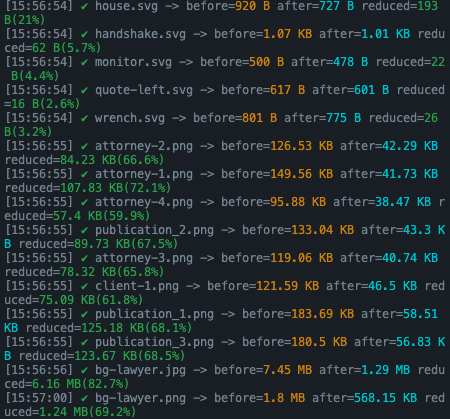

import Callout from 'nextra-theme-docs/callout'
import Bleed from 'nextra-theme-docs/bleed'

# Playing with Gulp

## What is Gulp?

<a href="https://gulpjs.com/" target="_blank">Gulp</a> is an automated task runner based on NodeJS and NPM.
In this context, what do we mean by "tasks" indicate a series of JavaScript functions that are executed by the time they are called such as compiling SASS/SCSS into CSS, compiling TypeScript into JavaScript and so on.

### Difference between Webpack and Gulp

This will lead us to the question: Then what is the difference between Webpack and Gulp?

I created the table that shows the difference between Webpack and Gulp.[^1]

|                          |                                 Webpack                                 |                                        Gulp                                         |
| :----------------------: | :---------------------------------------------------------------------: | :---------------------------------------------------------------------------------: |
|        Definition        | Module Bundler that combines different files into one consolidated file | Automated task runner that carries out the different types of tasks simultaneously. |
| Configuration Difficulty |                                  Hard                                   |                                        Easy                                         |
|      Code required       |                                  More                                   |                                        Less                                         |
|     Appropriate for      |               Application with multiple complex processes               |               Simple application that does not take too much memories               |

[^1]: Source: <a href="https://www.educba.com/gulp-vs-webpack/" target="_blank">Difference between Webpack and Gulp</a>

<hr/>

## Setup for Gulp

Let's go over each section one by one.

### Installing Gulp

We will installing the <a href="https://gulpjs.com/docs/en/getting-started/quick-start#install-the-gulp-command-line-utility" target="_blank">gulp-cli</a> first.

```bash
npm i -g gulp-cli
```

<br/>

Next, inside the project folder, we will create `package.json` file with the following command:

```bash
npm init -y
```

This command will allow you to create `package.json` file automatically <a href="https://docs.npmjs.com/cli/v8/commands/npm-init#yes" target="_blank">with answering all questions "yes"</a>.

<br/>

Then, we will <a href="https://gulpjs.com/docs/en/getting-started/quick-start#install-the-gulp-package-in-your-devdependencies" target="_blank">install Gulp</a>.

```bash
# Using NPM
npm i -D gulp

# Using yarn
yarn add -D gulp
```

<br/>

### Creating `gulpfile.js`

<a href="https://gulpjs.com/docs/en/getting-started/javascript-and-gulpfiles#gulpfile-explained" target="_blank"><code>gulpfile.js</code></a> is a Gulp's configuration file where we can define all tasks that we desire.

```bash
# For MAC/Linux users
touch gulpfile.js

# For Windows command prompt users
echo.> gulpfile.js

# For Windows powershell users
ni gulpfile.js
```

#### Using with Babel (Optional)

In order to use `gulpfile.js` with JavaScript ES6 version, we would need to use <a href="https://babeljs.io/" target="_blank">Babel</a>, which converts modern version JavaScript into an older version so that old browser could also understand the code.

To do so, we will firstly rename `gulpfile.js` into `gulpfile.babel.js`.

Next, we will install additional packages.

```bash
# Using npm
npm i -D @babel/core @babel/preset-env

# Using yarn
yarn add -D @babel/core @babel/preset-env
```

Then, we will create `babel.config.json` in the project root and include the following code.
By doing this, we can set up the `@babel/preset-env` and use it for our project.

```json babel.config.json
{
    "presets": ["@babel/preset-env"]
}
```

So far, our folder structure will look as below:

<br/>

<center></center>

<br/>

Inside of `package.json` file, let's add `dev` command at "`scripts`".
This command will only be used during development stage.

```json package.json
"scripts": {
    "dev": "gulp dev",
}
```

<br/>

We will put all files that are to be compiled within `src/` folder.

```bash
mkdir src/
```

<hr/>

## Converting Pug into HTML

<a href="https://pugjs.org/api/getting-started.html" target="_blank">Pug</a> is a template engine for NodeJS. We will be converting Pug into HTML files.

```bash
# npm
npm i -D gulp-pug gulp-htmlmin

# yarn
yarn add -D gulp-pug gulp-htmlmin
```

1. <a href="https://github.com/gulp-community/gulp-pug#readme" target="_blank">gulp-pug</a>: Gulp plugin for converting Pug into HTML files.
2. <a href="https://github.com/jonschlinkert/gulp-htmlmin" target="_blank">gulp-htmlmin</a>: Minify the HTML for improving performance.

<br/>

<CH.Scrollycoding>

### Importing

Let's import necessary packages.
If you are using Babel, you can use `import` keyword.

```js gulpfile.js focus=1:6
const { src, dest } = require('gulp');
const pug = require('gulp-pug');
const htmlmin = require("gulp-htmlmin");
// If you are using Babel with Gulp
// import { src, dest } from 'gulp';
// import pug from 'gulp-pug';

const routes = {
    pug: {
        src: "src/**/*.pug",
        build: "build"
    }
}

function PugIntoHTML() {
    return;
}

export const dev = series([PugIntoHTML]);
```

---

### Routes

I created `routes` object to manage the files that are to be compiled and compiled files altogether.

```js gulpfile.js focus=8:13
const { src, dest } = require('gulp');
const pug = require('gulp-pug');
const htmlmin = require("gulp-htmlmin");
// If you are using Babel with Gulp
// import { src, dest } from 'gulp';
// import pug from 'gulp-pug';

const routes = {
    pug: {
        src: "src/**/*.pug",
        build: "build"
    }
}

function PugIntoHTML() {
    return;
}

export const dev = series([PugIntoHTML]);
```

---

### Configuring tasks

Now it'ts time to make task for converting Pug file into HTML files.
I named it as `PugIntoHTML()`

> As suggested in Gulp's documentation, it is highly recommended to make tasks with functions instead of using `gulp.tasks`.

1. First, I used <a href="https://gulpjs.com/docs/en/api/src" target="_blank"><code>src()</code></a> method to let `PugIntoHTML()` task know the location of `src/` folder where all files to be converted are located.
2. Then let `pug()` method from `gulp-pug` happens next with connecting `pipe()`.
3. With using `gulp-htmlmin` package, we will minify compiled files for improving performance.
4. Finally with using <a href="https://gulpjs.com/docs/en/api/dest" target="_blank"><code>dest()</code></a> method, I connected routes that converted files will be located with the task.

```js gulpfile.js focus=15:20
const { src, dest } = require('gulp');
const pug = require('gulp-pug');
const htmlmin = require("gulp-htmlmin");
// If you are using Babel with Gulp
// import { src, dest } from 'gulp';
// import pug from 'gulp-pug';

const routes = {
    pug: {
        src: "src/**/*.pug",
        build: "build"
    }
}

function PugIntoHTML() {
    return src(routes.pug.src)
        .pipe(pug())
        .pipe(htmlmin({ collapseWhitespace: true }))
        .pipe(dest(routes.pug.build));
}

export const dev = series([PugIntoHTML]);
```

---

#### Registering task

Let's connect the task with `"scripts"`'s `dev` command with using <a href="https://gulpjs.com/docs/en/api/series" target="_blank"><code>series()</code></a> method.

```js gulpfile.js focus=1,21
const { src, dest, series } = require('gulp');
const pug = require('gulp-pug');
const htmlmin = require("gulp-htmlmin");
// If you are using Babel with Gulp
// import { src, dest } from 'gulp';
// import pug from 'gulp-pug';

const routes = {
    pug: {
        src: "src/**/*.pug",
        build: "build"
    }
}

function PugIntoHTML() {
    return src(routes.pug.src)
        .pipe(pug())
        .pipe(htmlmin({ collapseWhitespace: true }))
        .pipe(dest(routes.pug.build));
}

export const dev = series([PugIntoHTML]);
```

</CH.Scrollycoding>

### Result

Let's create `index.pug` file within `src/` folder and hit `npm run dev` or `yarn dev` in command console.

```pug src/index.pug
doctype html
html(lang="en")
    head
        meta(charset="UTF-8")
        meta(http-equiv="X-UA-Compatible", content="IE=edge")
        meta(name="viewport", content="width=device-width, initial-scale=1.0")
        title Document
    body
```

Then `index.pug` file will be converted into `index.html` in minified version shown as below.

<center></center>

<br/>

## Converting SCSS into CSS

Let's install following packages.

```bash
# npm
npm i -D gulp-sass sass gulp-autoprefixer gulp-uglifycss

# yarn
yarn add -D gulp-sass sass gulp-autoprefixer gulp-uglifycss
```

1. <a href="https://github.com/dlmanning/gulp-sass#readme" target="_blank">gulp-sass</a>: Gulp's SASS plugin. Gulp will convert SCSS/SASS files into CSS files with Dart package versioned <a href="https://github.com/sass/dart-sass" target="_blank">sass</a> tool.
2. <a href="https://github.com/sindresorhus/gulp-autoprefixer#readme" target="_blank">gulp-autoprefixer</a>: Make converted CSS codes compatible with older version of browsers.
3. <a href="https://github.com/ubirak/gulp-uglifycss" target="_blank">gulp-uglifycss</a>: Minify compiled CSS for improving performance.

<br/>
<br/>

<CH.Scrollycoding>

### Routes

I put SCSS files in `routes` object.

```js gulpfile.js focus=4:6,13:16
const { src, dest, series } = require('gulp');
const pug = require('gulp-pug');
const htmlmin = require("gulp-htmlmin");
const sass = require('gulp-sass')(requrie('sass'));
const autoPrefixer = require("gulp-autoprefixer");
const uglify = require("gulp-uglify");

const routes = {
    pug: {
        src: "src/**/*.pug",
        build: "build"
    },
    sass: {
        src: "src/scss/style.scss",
        build: "build/css/style.css"
    }
}

function PugIntoHTML() {
    return src(routes.pug.src)
        .pipe(pug())
        .pipe(htmlmin({ collapseWhitespace: true }))
        .pipe(dest(routes.pug.build));
}

function SCSStoCSS() {
    return;
}

export const dev = series([PugIntoHTML, SCSStoCSS]);
```

---

### Configuring task

I created task named `SCSStoCSS()`.

```js gulpfile.js focus=26:28
const { src, dest, series } = require('gulp');
const pug = require('gulp-pug');
const htmlmin = require("gulp-htmlmin");
const sass = require('gulp-sass')(requrie('sass'));
const autoPrefixer = require("gulp-autoprefixer");
const uglify = require("gulp-uglify");

const routes = {
    pug: {
        src: "src/**/*.pug",
        build: "build"
    },
    sass: {
        src: "src/scss/style.scss",
        build: "build/css/style.css"
    }
}

function PugIntoHTML() {
    return src(routes.pug.src)
        .pipe(pug())
        .pipe(htmlmin({ collapseWhitespace: true }))
        .pipe(dest(routes.pug.build));
}

function SCSStoCSS() {
    return;
}

export const dev = series([PugIntoHTML, SCSStoCSS]);
```

---

#### Converting SCSS into CSS

We will convert SCSS files within `src/` folder.
I exactly followed guideline available in <a href="https://github.com/dlmanning/gulp-sass#render-your-css" target="_blank">documentation</a>.

```js gulpfile.js focus=27:28,36
const { src, dest, series } = require('gulp');
const pug = require('gulp-pug');
const htmlmin = require("gulp-htmlmin");
const sass = require('gulp-sass')(requrie('sass'));
const autoPrefixer = require("gulp-autoprefixer");
const uglify = require("gulp-uglify");

const routes = {
    pug: {
        src: "src/**/*.pug",
        build: "build"
    },
    sass: {
        src: "src/scss/style.scss",
        build: "build/css/style.css"
    }
}

function PugIntoHTML() {
    return src(routes.pug.src)
        .pipe(pug())
        .pipe(htmlmin({ collapseWhitespace: true }))
        .pipe(dest(routes.pug.build));
}

function SCSStoCSS() {
    return src(routes.scss.src)
        .pipe(sass().on("error", sass.logError))
        .pipe(autoPrefixer())
        .pipe(
            uglifycss({
                maxLineLen: 80,
                uglyComments: true,
            })
        )
        .pipe(dest(routes.scss.build));
}

export const dev = series([PugIntoHTML, SCSStoCSS]);
```

---

#### Connecting with Autoprefixer

Next, I connected <a href="https://github.com/sindresorhus/gulp-autoprefixer#readme" target="_blank">gulp-autoprefixer</a> with following guideline available at <a href="https://github.com/sindresorhus/gulp-autoprefixer#usage" target="_blank">documentation</a>.
You can include further options available at <a href="https://github.com/postcss/autoprefixer#options" target="_blank">here</a> at any time.

```js gulpfile.js focus=29
const { src, dest, series } = require('gulp');
const pug = require('gulp-pug');
const htmlmin = require("gulp-htmlmin");
const sass = require('gulp-sass')(requrie('sass'));
const autoPrefixer = require("gulp-autoprefixer");
const uglify = require("gulp-uglify");

const routes = {
    pug: {
        src: "src/**/*.pug",
        build: "build"
    },
    sass: {
        src: "src/scss/style.scss",
        build: "build/css/style.css"
    }
}

function PugIntoHTML() {
    return src(routes.pug.src)
        .pipe(pug())
        .pipe(htmlmin({ collapseWhitespace: true }))
        .pipe(dest(routes.pug.build));
}

function SCSStoCSS() {
    return src(routes.scss.src)
        .pipe(sass().on("error", sass.logError))
        .pipe(autoPrefixer())
        .pipe(
            uglifycss({
                maxLineLen: 80,
                uglyComments: true,
            })
        )
        .pipe(dest(routes.scss.build));
}

export const dev = series([PugIntoHTML, SCSStoCSS]);
```

---

#### Uglifying CSS

Lastly, I uglified CSS files based on <a href="https://github.com/ubirak/gulp-uglifycss#usage" target="_blank">documentation</a>.

```js gulpfile.js focus=30:35
const { src, dest, series } = require('gulp');
const pug = require('gulp-pug');
const htmlmin = require("gulp-htmlmin");
const sass = require('gulp-sass')(requrie('sass'));
const autoPrefixer = require("gulp-autoprefixer");
const uglify = require("gulp-uglify");

const routes = {
    pug: {
        src: "src/**/*.pug",
        build: "build"
    },
    sass: {
        src: "src/scss/style.scss",
        build: "build/css/style.css"
    }
}

function PugIntoHTML() {
    return src(routes.pug.src)
        .pipe(pug())
        .pipe(htmlmin({ collapseWhitespace: true }))
        .pipe(dest(routes.pug.build));
}

function SCSStoCSS() {
    return src(routes.scss.src)
        .pipe(sass().on("error", sass.logError))
        .pipe(autoPrefixer())
        .pipe(
            uglifycss({
                maxLineLen: 80,
                uglyComments: true,
            })
        )
        .pipe(dest(routes.scss.build));
}

export const dev = series([PugIntoHTML, SCSStoCSS]);
```

---

#### Registering tasks

Connected task with `dev` script command.

```js gulpfile.js focus=38
const { src, dest, series } = require('gulp');
const pug = require('gulp-pug');
const htmlmin = require("gulp-htmlmin");
const sass = require('gulp-sass')(requrie('sass'));
const autoPrefixer = require("gulp-autoprefixer");
const uglify = require("gulp-uglify");

const routes = {
    pug: {
        src: "src/**/*.pug",
        build: "build"
    },
    sass: {
        src: "src/scss/style.scss",
        build: "build/css/style.css"
    }
}

function PugIntoHTML() {
    return src(routes.pug.src)
        .pipe(pug())
        .pipe(htmlmin({ collapseWhitespace: true }))
        .pipe(dest(routes.pug.build));
}

function SCSStoCSS() {
    return src(routes.scss.src)
        .pipe(sass().on("error", sass.logError))
        .pipe(autoPrefixer())
        .pipe(
            uglifycss({
                maxLineLen: 80,
                uglyComments: true,
            })
        )
        .pipe(dest(routes.scss.build));
}

export const dev = series([PugIntoHTML, SCSStoCSS]);
```

</CH.Scrollycoding>

### Result

Create SCSS file in the following routes, and we can see it is well converted.

```scss src/scss/style.scss
body {
    margin: 0;
    padding: 0;
    box-sizing: border-box;
}
```

<center></center>

<br/>

## Converting TypeScript into JavaScript

Let's install below packages[^2]. There are a number of packages to install this time.

[^2]: Reference: <a href="https://www.typescriptlang.org/docs/handbook/gulp.html" target="_blank">TypeScript: Gulp</a>

```bash
# NPM
npm i -D typescript gulp-typescript browserify tsify vinyl-source-stream gulp-sourcemaps vinly-buffer

# yarn
yarn add -D typescript gulp-typescript browserify tsify vinyl-source-stream gulp-sourcemaps vinly-buffer
```

1. <a href="https://github.com/ivogabe/gulp-typescript" target="_blank">gulp-typescript</a>: Gulp package to convert TypeScript into JavaScript.
2. Browserify용
   - <a href="https://github.com/browserify/browserify#readme" target="_blank">browserify</a>: Allows to use NodeJS module inside the browser.
   - <a href="https://github.com/TypeStrong/tsify" target="_blank">tsify</a>: Allows Browserify to access to TypeScript compiler.
   - <a href="https://github.com/hughsk/vinyl-source-stream" target="_blank">vinyl-source-stream</a>: Adapt Browserified results into <a href="https://github.com/gulpjs/vinyl#what-is-vinyl" target="_blank">vinyl</a> format.
3. Terser용
   - <a href="https://github.com/duan602728596/gulp-terser#readme" target="_blank">gulp-terser</a>: Gulp plugin to compress into ES6 codes.
   - <a href="https://github.com/hughsk/vinyl-buffer" target="_blank">vinyl-buffer</a>: Convert into streaming vinly files to use buffer.
   - <a href="https://github.com/gulp-sourcemaps/gulp-sourcemaps" target="_blank">gulp-sourcemaps</a>: Make sourcemap files inserted within source file.

<br/>

<CH.Scrollycoding>

### Routes

I imported all necessary packages to compile TypeScript into JavaScript.
Then, I configured `routes` object where compiled JavaScript files will be located.

```js gulpfile.js focus=6:13,24:27
const { src, dest, series } = require('gulp');
const pug = require('gulp-pug');
const htmlmin = require("gulp-htmlmin");
const sass = require('gulp-sass')(requrie('sass'));
const autoPrefixer = require("gulp-autoprefixer");
const uglify = require("gulp-uglify");
const browserify = require("browserify");
const tsify = require("tsify");
const buffer = require("vinyl-buffer");
const source = require("vinyl-source-stream");
const sourcemaps = require("gulp-sourcemaps");
const ts = require("gulp-typescript");
const tsProject = ts.createProject("tsconfig.json");

const routes = {
    pug: {
        src: "src/**/*.pug",
        build: "build"
    },
    sass: {
        src: "src/scss/style.scss",
        build: "build/css/style.css"
    },
    ts: {
        src: "src/ts/**/*.ts",
        build: "build/js/",
    },
}

function PugIntoHTML() {
    return src(routes.pug.src)
        .pipe(pug())
        .pipe(htmlmin({ collapseWhitespace: true }))
        .pipe(dest(routes.pug.build));
}

function SCSStoCSS() {
    return src(routes.scss.src)
        .pipe(sass().on("error", sass.logError))
        .pipe(autoPrefixer())
        .pipe(
            uglifycss({
                maxLineLen: 80,
                uglyComments: true,
            })
        )
        .pipe(dest(routes.scss.build));
}

function TStoJS() {
    return;
}

export const dev = series([PugIntoHTML, SCSStoCSS, TStoJS]);
```

---

### Configuring task

I created task name callled `TStoJS()`.

```js gulpfile.js focus=50:52
const { src, dest, series } = require('gulp');
const pug = require('gulp-pug');
const htmlmin = require("gulp-htmlmin");
const sass = require('gulp-sass')(requrie('sass'));
const autoPrefixer = require("gulp-autoprefixer");
const uglify = require("gulp-uglify");
const browserify = require("browserify");
const tsify = require("tsify");
const buffer = require("vinyl-buffer");
const source = require("vinyl-source-stream");
const sourcemaps = require("gulp-sourcemaps");
const ts = require("gulp-typescript");
const tsProject = ts.createProject("tsconfig.json");

const routes = {
    pug: {
        src: "src/**/*.pug",
        build: "build"
    },
    sass: {
        src: "src/scss/style.scss",
        build: "build/css/style.css"
    },
    ts: {
        src: "src/ts/**/*.ts",
        build: "build/js/",
    },
}

function PugIntoHTML() {
    return src(routes.pug.src)
        .pipe(pug())
        .pipe(htmlmin({ collapseWhitespace: true }))
        .pipe(dest(routes.pug.build));
}

function SCSStoCSS() {
    return src(routes.scss.src)
        .pipe(sass().on("error", sass.logError))
        .pipe(autoPrefixer())
        .pipe(
            uglifycss({
                maxLineLen: 80,
                uglyComments: true,
            })
        )
        .pipe(dest(routes.scss.build));
}

function TStoJS() {
    return;
}

export const dev = series([PugIntoHTML, SCSStoCSS, TStoJS]);
```

---

#### Browserifying task

1. As I will be using one TypeScript file in this project, I set entry point with single route.
2. I followed tsify configuration with <a href="https://github.com/TypeStrong/tsify#browserify-api" target="_blank">this</a> part.

```js focus=51:60
const { src, dest, series } = require('gulp');
const pug = require('gulp-pug');
const htmlmin = require("gulp-htmlmin");
const sass = require('gulp-sass')(requrie('sass'));
const autoPrefixer = require("gulp-autoprefixer");
const uglify = require("gulp-uglify");
const browserify = require("browserify");
const tsify = require("tsify");
const buffer = require("vinyl-buffer");
const source = require("vinyl-source-stream");
const sourcemaps = require("gulp-sourcemaps");
const ts = require("gulp-typescript");
const tsProject = ts.createProject("tsconfig.json");

const routes = {
    pug: {
        src: "src/**/*.pug",
        build: "build"
    },
    sass: {
        src: "src/scss/style.scss",
        build: "build/css/style.css"
    },
    ts: {
        src: "src/ts/**/*.ts",
        build: "build/js/",
    },
}

function PugIntoHTML() {
    return src(routes.pug.src)
        .pipe(pug())
        .pipe(htmlmin({ collapseWhitespace: true }))
        .pipe(dest(routes.pug.build));
}

function SCSStoCSS() {
    return src(routes.scss.src)
        .pipe(sass().on("error", sass.logError))
        .pipe(autoPrefixer())
        .pipe(
            uglifycss({
                maxLineLen: 80,
                uglyComments: true,
            })
        )
        .pipe(dest(routes.scss.build));
}

function TStoJS() {
  return browserify({
    basedir: ".",
    debug: true,
    entries: ["src/ts/main.ts"],
    cache: {},
    packageCache: {},
  })
    .plugin(tsify)
    .bundle()
    .pipe(source("js/bundle.js"))
    .pipe(buffer())
    .pipe(sourcemaps.init({ loadMaps: true }))
    .pipe(uglify())
    .pipe(sourcemaps.write("./"))
    .pipe(gulp.dest("build"))
}

export const dev = series([PugIntoHTML, SCSStoCSS, TStoJS]);
```

---

#### Configuring Terser

I followed Terser configuration <a href="https://www.typescriptlang.org/docs/handbook/gulp.html#terser" target="_blank">in this part</a>.

```js focus=61:65
const { src, dest, series } = require('gulp');
const pug = require('gulp-pug');
const htmlmin = require("gulp-htmlmin");
const sass = require('gulp-sass')(requrie('sass'));
const autoPrefixer = require("gulp-autoprefixer");
const uglify = require("gulp-uglify");
const browserify = require("browserify");
const tsify = require("tsify");
const buffer = require("vinyl-buffer");
const source = require("vinyl-source-stream");
const sourcemaps = require("gulp-sourcemaps");
const ts = require("gulp-typescript");
const tsProject = ts.createProject("tsconfig.json");

const routes = {
    pug: {
        src: "src/**/*.pug",
        build: "build"
    },
    sass: {
        src: "src/scss/style.scss",
        build: "build/css/style.css"
    },
    ts: {
        src: "src/ts/**/*.ts",
        build: "build/js/",
    },
}

function PugIntoHTML() {
    return src(routes.pug.src)
        .pipe(pug())
        .pipe(htmlmin({ collapseWhitespace: true }))
        .pipe(dest(routes.pug.build));
}

function SCSStoCSS() {
    return src(routes.scss.src)
        .pipe(sass().on("error", sass.logError))
        .pipe(autoPrefixer())
        .pipe(
            uglifycss({
                maxLineLen: 80,
                uglyComments: true,
            })
        )
        .pipe(dest(routes.scss.build));
}

function TStoJS() {
  return browserify({
    basedir: ".",
    debug: true,
    entries: ["src/ts/main.ts"],
    cache: {},
    packageCache: {},
  })
    .plugin(tsify)
    .bundle()
    .pipe(source("js/bundle.js"))
    .pipe(buffer())
    .pipe(sourcemaps.init({ loadMaps: true }))
    .pipe(uglify())
    .pipe(sourcemaps.write("./"))
    .pipe(gulp.dest("build"))
}

export const dev = series([PugIntoHTML, SCSStoCSS, TStoJS]);
```

---

#### Registering task

Let's add our task into `dev` script command.

```js focus=68
const { src, dest, series } = require('gulp');
const pug = require('gulp-pug');
const htmlmin = require("gulp-htmlmin");
const sass = require('gulp-sass')(requrie('sass'));
const autoPrefixer = require("gulp-autoprefixer");
const uglify = require("gulp-uglify");
const browserify = require("browserify");
const tsify = require("tsify");
const buffer = require("vinyl-buffer");
const source = require("vinyl-source-stream");
const sourcemaps = require("gulp-sourcemaps");
const ts = require("gulp-typescript");
const tsProject = ts.createProject("tsconfig.json");

const routes = {
    pug: {
        src: "src/**/*.pug",
        build: "build"
    },
    sass: {
        src: "src/scss/style.scss",
        build: "build/css/style.css"
    },
    ts: {
        src: "src/ts/**/*.ts",
        build: "build/js/",
    },
}

function PugIntoHTML() {
    return src(routes.pug.src)
        .pipe(pug())
        .pipe(htmlmin({ collapseWhitespace: true }))
        .pipe(dest(routes.pug.build));
}

function SCSStoCSS() {
    return src(routes.scss.src)
        .pipe(sass().on("error", sass.logError))
        .pipe(autoPrefixer())
        .pipe(
            uglifycss({
                maxLineLen: 80,
                uglyComments: true,
            })
        )
        .pipe(dest(routes.scss.build));
}

function TStoJS() {
  return browserify({
    basedir: ".",
    debug: true,
    entries: ["src/ts/main.ts"],
    cache: {},
    packageCache: {},
  })
    .plugin(tsify)
    .bundle()
    .pipe(source("js/bundle.js"))
    .pipe(buffer())
    .pipe(sourcemaps.init({ loadMaps: true }))
    .pipe(uglify())
    .pipe(sourcemaps.write("./"))
    .pipe(gulp.dest("build"))
}

export const dev = series([PugIntoHTML, SCSStoCSS, TStoJS]);
```

</CH.Scrollycoding>

### Result

If we hit `npm run dev` or `yarn dev` command, we can see `main.ts` file has been converted into minified version of JavaScript codde.

<center></center>

<br/>
<br/>

<center></center>

<br/>

## Image Optimization

Lastly, we will do image optimization. Let's install below packages.

```bash
# NPM
npm i -D gulp-image

# yarn
yarn add -D gulp-image
```

1. <a href="https://github.com/1000ch/gulp-image#readme" target="_blank">gulp-image</a>: Gulp's plugin for optimizing images.

<CH.Scrollycoding>

### Routes

I included all image files to optimize in `src/image/` folder.
Opimized image files will be sent to `build/image/` folder.

```js gulpfile.js focus=14,29:32
const { src, dest, series } = require('gulp');
const pug = require('gulp-pug');
const htmlmin = require("gulp-htmlmin");
const sass = require('gulp-sass')(requrie('sass'));
const autoPrefixer = require("gulp-autoprefixer");
const uglify = require("gulp-uglify");
const browserify = require("browserify");
const tsify = require("tsify");
const buffer = require("vinyl-buffer");
const source = require("vinyl-source-stream");
const sourcemaps = require("gulp-sourcemaps");
const ts = require("gulp-typescript");
const tsProject = ts.createProject("tsconfig.json");
const image = require("gulp-image");

const routes = {
    pug: {
        src: "src/**/*.pug",
        build: "build"
    },
    sass: {
        src: "src/scss/style.scss",
        build: "build/css/style.css"
    },
    ts: {
        src: "src/ts/**/*.ts",
        build: "build/js/",
    },
    image: {
        src: "src/image/*",
        build: "build/image",
    },
}

function PugIntoHTML() {
    return src(routes.pug.src)
        .pipe(pug())
        .pipe(htmlmin({ collapseWhitespace: true }))
        .pipe(dest(routes.pug.build));
}

function SCSStoCSS() {
    return src(routes.scss.src)
        .pipe(sass().on("error", sass.logError))
        .pipe(autoPrefixer())
        .pipe(
            uglifycss({
                maxLineLen: 80,
                uglyComments: true,
            })
        )
        .pipe(dest(routes.scss.build));
}

function TStoJS() {
  return browserify({
    basedir: ".",
    debug: true,
    entries: ["src/ts/main.ts"],
    cache: {},
    packageCache: {},
  })
    .plugin(tsify)
    .bundle()
    .pipe(source("js/bundle.js"))
    .pipe(buffer())
    .pipe(sourcemaps.init({ loadMaps: true }))
    .pipe(uglify())
    .pipe(sourcemaps.write("./"))
    .pipe(gulp.dest("build"))
}

function Image() {
    return;
}

export const dev = series([PugIntoHTML, SCSStoCSS, TStoJS, Image]);
```

---

### Configuring task

I created task with name of `Image()`.

```js gulpfile.js focus=73:75
const { src, dest, series } = require('gulp');
const pug = require('gulp-pug');
const htmlmin = require("gulp-htmlmin");
const sass = require('gulp-sass')(requrie('sass'));
const autoPrefixer = require("gulp-autoprefixer");
const uglify = require("gulp-uglify");
const browserify = require("browserify");
const tsify = require("tsify");
const buffer = require("vinyl-buffer");
const source = require("vinyl-source-stream");
const sourcemaps = require("gulp-sourcemaps");
const ts = require("gulp-typescript");
const tsProject = ts.createProject("tsconfig.json");
const image = require("gulp-image");

const routes = {
    pug: {
        src: "src/**/*.pug",
        build: "build"
    },
    sass: {
        src: "src/scss/style.scss",
        build: "build/css/style.css"
    },
    ts: {
        src: "src/ts/**/*.ts",
        build: "build/js/",
    },
    image: {
        src: "src/image/*",
        build: "build/image",
    },
}

function PugIntoHTML() {
    return src(routes.pug.src)
        .pipe(pug())
        .pipe(htmlmin({ collapseWhitespace: true }))
        .pipe(dest(routes.pug.build));
}

function SCSStoCSS() {
    return src(routes.scss.src)
        .pipe(sass().on("error", sass.logError))
        .pipe(autoPrefixer())
        .pipe(
            uglifycss({
                maxLineLen: 80,
                uglyComments: true,
            })
        )
        .pipe(dest(routes.scss.build));
}

function TStoJS() {
  return browserify({
    basedir: ".",
    debug: true,
    entries: ["src/ts/main.ts"],
    cache: {},
    packageCache: {},
  })
    .plugin(tsify)
    .bundle()
    .pipe(source("js/bundle.js"))
    .pipe(buffer())
    .pipe(sourcemaps.init({ loadMaps: true }))
    .pipe(uglify())
    .pipe(sourcemaps.write("./"))
    .pipe(gulp.dest("build"))
}

function Image() {
    return;
}

export const dev = series([PugIntoHTML, SCSStoCSS, TStoJS, Image]);
```

---

#### Optimizing images

Include the following code for optimizing images.[^3]

[^3]: Reference: <a href="https://github.com/1000ch/gulp-image#usage" target="_blank">gulp-image package options</a>

```js focus=74:77
const { src, dest, series } = require('gulp');
const pug = require('gulp-pug');
const htmlmin = require("gulp-htmlmin");
const sass = require('gulp-sass')(requrie('sass'));
const autoPrefixer = require("gulp-autoprefixer");
const uglify = require("gulp-uglify");
const browserify = require("browserify");
const tsify = require("tsify");
const buffer = require("vinyl-buffer");
const source = require("vinyl-source-stream");
const sourcemaps = require("gulp-sourcemaps");
const ts = require("gulp-typescript");
const tsProject = ts.createProject("tsconfig.json");
const image = require("gulp-image");

const routes = {
    pug: {
        src: "src/**/*.pug",
        build: "build"
    },
    sass: {
        src: "src/scss/style.scss",
        build: "build/css/style.css"
    },
    ts: {
        src: "src/ts/**/*.ts",
        build: "build/js/",
    },
    image: {
        src: "src/image/*",
        build: "build/image",
    },
}

function PugIntoHTML() {
    return src(routes.pug.src)
        .pipe(pug())
        .pipe(htmlmin({ collapseWhitespace: true }))
        .pipe(dest(routes.pug.build));
}

function SCSStoCSS() {
    return src(routes.scss.src)
        .pipe(sass().on("error", sass.logError))
        .pipe(autoPrefixer())
        .pipe(
            uglifycss({
                maxLineLen: 80,
                uglyComments: true,
            })
        )
        .pipe(dest(routes.scss.build));
}

function TStoJS() {
  return browserify({
    basedir: ".",
    debug: true,
    entries: ["src/ts/main.ts"],
    cache: {},
    packageCache: {},
  })
    .plugin(tsify)
    .bundle()
    .pipe(source("js/bundle.js"))
    .pipe(buffer())
    .pipe(sourcemaps.init({ loadMaps: true }))
    .pipe(uglify())
    .pipe(sourcemaps.write("./"))
    .pipe(gulp.dest("build"))
}

function Image() {
  return src(routes.image.src)
    .pipe(image())
    .pipe(gulp.dest(routes.image.build));
}

export const dev = series([PugIntoHTML, SCSStoCSS, TStoJS, Image]);
```

---

#### Including task

Let's connect our taks with `dev` script command.

```js focus=79
const { src, dest, series } = require('gulp');
const pug = require('gulp-pug');
const htmlmin = require("gulp-htmlmin");
const sass = require('gulp-sass')(requrie('sass'));
const autoPrefixer = require("gulp-autoprefixer");
const uglify = require("gulp-uglify");
const browserify = require("browserify");
const tsify = require("tsify");
const buffer = require("vinyl-buffer");
const source = require("vinyl-source-stream");
const sourcemaps = require("gulp-sourcemaps");
const ts = require("gulp-typescript");
const tsProject = ts.createProject("tsconfig.json");
const image = require("gulp-image");

const routes = {
    pug: {
        src: "src/**/*.pug",
        build: "build"
    },
    sass: {
        src: "src/scss/style.scss",
        build: "build/css/style.css"
    },
    ts: {
        src: "src/ts/**/*.ts",
        build: "build/js/",
    },
    image: {
        src: "src/image/*",
        build: "build/image",
    },
}

function PugIntoHTML() {
    return src(routes.pug.src)
        .pipe(pug())
        .pipe(htmlmin({ collapseWhitespace: true }))
        .pipe(dest(routes.pug.build));
}

function SCSStoCSS() {
    return src(routes.scss.src)
        .pipe(sass().on("error", sass.logError))
        .pipe(autoPrefixer())
        .pipe(
            uglifycss({
                maxLineLen: 80,
                uglyComments: true,
            })
        )
        .pipe(dest(routes.scss.build));
}

function TStoJS() {
  return browserify({
    basedir: ".",
    debug: true,
    entries: ["src/ts/main.ts"],
    cache: {},
    packageCache: {},
  })
    .plugin(tsify)
    .bundle()
    .pipe(source("js/bundle.js"))
    .pipe(buffer())
    .pipe(sourcemaps.init({ loadMaps: true }))
    .pipe(uglify())
    .pipe(sourcemaps.write("./"))
    .pipe(gulp.dest("build"))
}

function Image() {
  return src(routes.image.src)
    .pipe(image())
    .pipe(gulp.dest(routes.image.build));
}

export const dev = series([PugIntoHTML, SCSStoCSS, TStoJS, Image]);
```

</CH.Scrollycoding>

### Result

If we run `dev` script, Gulp will proceed image optimization automatically as shown in the image below.

<center></center>

<br/>
<br/>

On our next section, we will go over deeply how to properly manage Gulp tasks.
