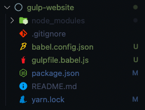
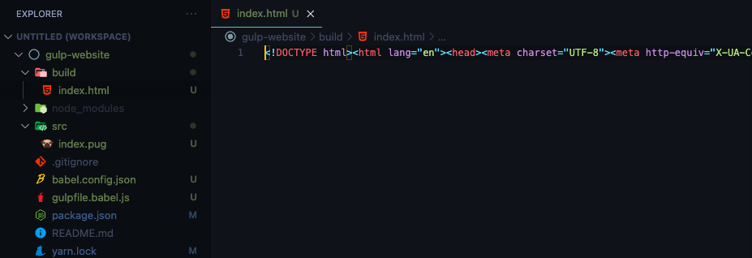
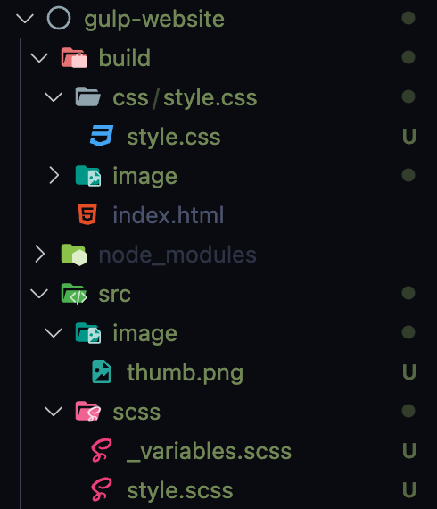
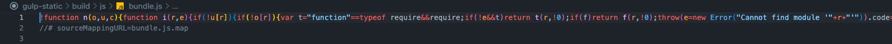

import Callout from 'nextra-theme-docs/callout'
import Bleed from 'nextra-theme-docs/bleed'

# Gulp와 친해지기

## Gulp란?

<a href="https://gulpjs.com/" target="_blank">Gulp</a>는 NodeJS와 NPM 기반의 자동화 태스트 러너이다.
여기서 말하는 "태스크"란 타입스크립트에서 자바스크립트로 컴파일링, SCSS/SASS에서 CSS로 컴파일링 등 함수 기반으로 작성된 이러한 일련의 작업들을 의미한다.

### Webpack과 Gulp의 차이점

그렇다면 과연 Webpack과 Gulp의 차이점은 무엇일까?

이 둘의 차이점을 비교하기 위한 표를 다음과 같이 정리해보았다.[^1]

|             |                         Webpack                          |                               Gulp                               |
| :---------: | :------------------------------------------------------: | :--------------------------------------------------------------: |
|    정의     |  다른 모든 파일들을 하나의 파일로 합쳐주는 모듈 번들러   | 동시다발적으로 일어나는 태스크를 실행시켜주는 자동화 태스크 러너 |
| 설정 난이도 |                           높음                           |                               낮음                               |
|   코드량    |                           많음                           |                               적음                               |
|  사용 용도  | 여러 복잡한 프로세스들을 가지고 있는 어플리케이션에 유리 |       메모리를 너무 많이 잡아먹지 않는 단순한 어플리케이션       |

[^1]: 출처: <a href="https://www.educba.com/gulp-vs-webpack/" target="_blank">Difference between Webpack and Gulp</a>

<hr/>

## 설정

각 세션 별로 하나씩 파헤쳐보자.

### Gulp 설치하기

먼저 <a href="https://gulpjs.com/docs/en/getting-started/quick-start#install-the-gulp-command-line-utility" target="_blank">gulp-cli</a>를 설치해보자.

```bash
npm i -g gulp-cli
```

<br/>

다음으로, 프로젝트 폴더 내에 다음 명령어를 통해 `package.json` 파일을 생성한다.

```bash
npm init -y
```

이렇게 함으로서 <a href="https://docs.npmjs.com/cli/v8/commands/npm-init#yes" target="_blank">모든 질문에 대하여 "예"와 함께</a> `package.json`을 자동으로 생성해준다.

<br/>

그리고 <a href="https://gulpjs.com/docs/en/getting-started/quick-start#install-the-gulp-package-in-your-devdependencies" target="_blank">Gulp를 설치한다</a>.

```bash
# Using NPM
npm i -D gulp

# Using yarn
yarn add -D gulp
```

<br/>

### `gulpfile.js` 파일 만들기

<a href="https://gulpjs.com/docs/en/getting-started/javascript-and-gulpfiles#gulpfile-explained" target="_blank"><code>gulpfile.js</code></a>는 Gulp의 설정 파일로써 여기에 모든 태스크들을 넣을 수 있다.

```bash
# 맥/리눅스일 경우
touch gulpfile.js

# 윈도우 명령 프롬프트를 사용할 경우
echo.> gulpfile.js

# 윈도우 powershell을 사용할 경우
ni gulpfile.js
```

#### Babel 사용하기 (선택 사항)

`gulpfile.js` 파일을 자바스크립트 ES6 버전으로 사용하기 위해선, 오래된 브라우저도 인식 가능한 코드로 변환시켜주는 <a href="https://babeljs.io/" target="_blank">Babel</a>을 사용해야만 한다.

이를 위해, `gulpfile.js`의 이름을 `gulpfile.babel.js`로 명명한다.

그리고 다음 패키지들을 추가로 설치해준다.

```bash
# npm
npm i -D @babel/core @babel/preset-env

# yarn
yarn add -D @babel/core @babel/preset-env
```

이후 `babel.config.json` 파일을 프로젝트 루트 경로에 생성한 후 다음 코드를 삽입한다.
이렇게 함으로서 `@babel/preset-env`를 우리 프로젝트에 반영할 수 있다.

```json babel.config.json
{
    "presets": ["@babel/preset-env"]
}
```

지금까지의 폴더 구조를 살펴보면 다음과 같다:

<br/>

<center></center>

<br/>

`package.json` 파일 내부의 "`scripts`" 부분에 `dev`라는 명령어를 추가한다.
이 명령어는 앞으로 개발 단계에서만 사용될 것ㅣㅏ.

```json package.json
"scripts": {
    "dev": "gulp dev",
}
```

<br/>

컴파일 시킬 모든 파일들을 `src/` 폴더에 두고 관리하자.

```bash
mkdir src/
```

<hr/>

## Pug를 HTML로 바꾸기

<a href="https://pugjs.org/api/getting-started.html" target="_blank">Pug</a>는 NodeJS의 템플릿 엔진이다. 이 Pug를 HTML 파일로 변환시켜보자.

Pug 파일을 HTML 파일로 변환하기 위해서 <a href="https://github.com/gulp-community/gulp-pug#readme" target="_blank">gulp-pug</a> 패키지를 사용할 것이다.

```bash
# npm
npm i -D gulp-pug gulp-htmlmin

# yarn
yarn add -D gulp-pug gulp-htmlmin
```

<br/>

<CH.Scrollycoding>

### Importing

이제 필요한 몇 가지 패키지들을 import 해보도록 하자.
Babel을 사용한다면, `import` 키워드를 사용할 수 있다.

```js gulpfile.js focus=1:6
const { src, dest } = require('gulp');
const pug = require('gulp-pug');
const htmlmin = require("gulp-htmlmin");
// If you are using Babel with Gulp
// import { src, dest } from 'gulp';
// import pug from 'gulp-pug';

const routes = {
    pug: {
        src: "src/**/*.pug",
        build: "build"
    }
}

function PugIntoHTML() {
    return;
}

export const dev = series([PugIntoHTML]);
```

---

### 경로

`routes`라는 객체를 만들어 컴파일될 파일과 컴파일된 파일을 위치할 각각의 경로를 설정해주었다.

```js gulpfile.js focus=8:13
const { src, dest } = require('gulp');
const pug = require('gulp-pug');
const htmlmin = require("gulp-htmlmin");
// If you are using Babel with Gulp
// import { src, dest } from 'gulp';
// import pug from 'gulp-pug';

const routes = {
    pug: {
        src: "src/**/*.pug",
        build: "build"
    }
}

function PugIntoHTML() {
    return;
}

export const dev = series([PugIntoHTML]);
```

---

### 태스크 설정

Pug 파일을 HTML 파일로 변환시키기 위한 태스크를 만들어보자.
필자는 `PugIntoHTML()`로 이름을 지어보았다.

> 공식 문서에서도 알 수 있듯이 태스크를 생성할 때 `gulp.task` 대신 함수형으로 작성하는 것을 추천하고 있다.

1. 먼저, `PugIntoHTML()` 태스크가 변환시킬 파일들이 담겨 있는 `src/` 폴더를 바라볼 수 있게끔 <a href="https://gulpjs.com/docs/en/api/src" target="_blank"><code>src()</code></a> 메소드를 이용하여 지정해준다.
2. 이후 `pipe()`를 통해 `gulp-pug` 패키지의 `pug()` 메소드 동작이 일어나게끔 연결시켜 준다.
3. 퍼포먼스 최적화를 위해 gulp-htmlmin 패키지를 사용하여 minify 해준다.
4. 마지막으로 <a href="https://gulpjs.com/docs/en/api/dest" target="_blank"><code>dest()</code></a> 메소드를 통해 빌드된 파일을 담을 경로와 연결해주었다.

```js gulpfile.js focus=15:20
const { src, dest } = require('gulp');
const pug = require('gulp-pug');
const htmlmin = require("gulp-htmlmin");
// If you are using Babel with Gulp
// import { src, dest } from 'gulp';
// import pug from 'gulp-pug';

const routes = {
    pug: {
        src: "src/**/*.pug",
        build: "build"
    }
}

function PugIntoHTML() {
    return src(routes.pug.src)
        .pipe(pug())
        .pipe(htmlmin({ collapseWhitespace: true }))
        .pipe(dest(routes.pug.build));
}

export const dev = series([PugIntoHTML]);
```

---

#### 태스크 등록하기

<a href="https://gulpjs.com/docs/en/api/series" target="_blank"><code>series()</code></a> 메소드를 이용하여 아까 만들었던 `"scripts"`의 `dev` 명령어와 연결시켜주자.

```js gulpfile.js focus=1,21
const { src, dest, series } = require('gulp');
const pug = require('gulp-pug');
const htmlmin = require("gulp-htmlmin");
// If you are using Babel with Gulp
// import { src, dest } from 'gulp';
// import pug from 'gulp-pug';

const routes = {
    pug: {
        src: "src/**/*.pug",
        build: "build"
    }
}

function PugIntoHTML() {
    return src(routes.pug.src)
        .pipe(pug())
        .pipe(htmlmin({ collapseWhitespace: true }))
        .pipe(dest(routes.pug.build));
}

export const dev = series([PugIntoHTML]);
```

</CH.Scrollycoding>

### 결과

태스크 설정이 완료되었으니 `index.pug` 파일을 `src/` 폴더 내부에 만들고 `npm run dev` 혹은 `yarn dev` 명령어를 실행시켜보자.

```pug src/index.pug
doctype html
html(lang="en")
    head
        meta(charset="UTF-8")
        meta(http-equiv="X-UA-Compatible", content="IE=edge")
        meta(name="viewport", content="width=device-width, initial-scale=1.0")
        title Document
    body
```

그러면 `index.pug` 파일이 아래와 같이 최적화된 코드로 이루어진 `index.html` 파일을 생성해내는 걸 볼 수 있다.

<center></center>

<br/>

## SCSS를 CSS로 바꾸기

다음 패키지들을 설치해보자.

```bash
# npm
npm i -D gulp-sass sass gulp-autoprefixer gulp-uglifycss

# yarn
yarn add -D gulp-sass sass gulp-autoprefixer gulp-uglifycss
```

1. <a href="https://github.com/dlmanning/gulp-sass#readme" target="_blank">gulp-sass</a>: Gulp의 SASS 플러그인이다. Gulp는 이 플러그인으로 Dart 패키지 버전의 <a href="https://github.com/sass/dart-sass" target="_blank">sass</a>로 SCSS/SASS 파일을 CSS로 바꿔준다.
2. <a href="https://github.com/sindresorhus/gulp-autoprefixer#readme" target="_blank">gulp-autoprefixer</a>: 오래된 브라우저도 호환되는 CSS 코드로 바꿔준다.
3. <a href="https://github.com/ubirak/gulp-uglifycss" target="_blank">gulp-uglifycss</a>: 성능 최적화를 위해 컴파일된 CSS를 압축시켜준다

<br/>
<br/>

<CH.Scrollycoding>

### 경로

SCSS 파일들이 위치할 장소를 `routes` 객체 내부에 추가해주었다.

```js gulpfile.js focus=4:6,13:16
const { src, dest, series } = require('gulp');
const pug = require('gulp-pug');
const htmlmin = require("gulp-htmlmin");
const sass = require('gulp-sass')(requrie('sass'));
const autoPrefixer = require("gulp-autoprefixer");
const uglify = require("gulp-uglify");

const routes = {
    pug: {
        src: "src/**/*.pug",
        build: "build"
    },
    sass: {
        src: "src/scss/style.scss",
        build: "build/css/style.css"
    }
}

function PugIntoHTML() {
    return src(routes.pug.src)
        .pipe(pug())
        .pipe(htmlmin({ collapseWhitespace: true }))
        .pipe(dest(routes.pug.build));
}

function SCSStoCSS() {
    return;
}

export const dev = series([PugIntoHTML, SCSStoCSS]);
```

---

### 태스크 설정

`SCSStoCSS()`라는 이름의 태스크를 만들었다.

```js gulpfile.js focus=26:28
const { src, dest, series } = require('gulp');
const pug = require('gulp-pug');
const htmlmin = require("gulp-htmlmin");
const sass = require('gulp-sass')(requrie('sass'));
const autoPrefixer = require("gulp-autoprefixer");
const uglify = require("gulp-uglify");

const routes = {
    pug: {
        src: "src/**/*.pug",
        build: "build"
    },
    sass: {
        src: "src/scss/style.scss",
        build: "build/css/style.css"
    }
}

function PugIntoHTML() {
    return src(routes.pug.src)
        .pipe(pug())
        .pipe(htmlmin({ collapseWhitespace: true }))
        .pipe(dest(routes.pug.build));
}

function SCSStoCSS() {
    return;
}

export const dev = series([PugIntoHTML, SCSStoCSS]);
```

---

#### SCSS를 CSS로 변환하기

`src/` 폴더 안에 있는 SCSS 파일들을 변환시켜 볼 것이다.
필자는 <a href="https://github.com/dlmanning/gulp-sass#render-your-css" target="_blank">공식 문서</a> 상의 내용을 그대로 따라해보았다.

```js gulpfile.js focus=27:28,36
const { src, dest, series } = require('gulp');
const pug = require('gulp-pug');
const htmlmin = require("gulp-htmlmin");
const sass = require('gulp-sass')(requrie('sass'));
const autoPrefixer = require("gulp-autoprefixer");
const uglify = require("gulp-uglify");

const routes = {
    pug: {
        src: "src/**/*.pug",
        build: "build"
    },
    sass: {
        src: "src/scss/style.scss",
        build: "build/css/style.css"
    }
}

function PugIntoHTML() {
    return src(routes.pug.src)
        .pipe(pug())
        .pipe(htmlmin({ collapseWhitespace: true }))
        .pipe(dest(routes.pug.build));
}

function SCSStoCSS() {
    return src(routes.scss.src)
        .pipe(sass().on("error", sass.logError))
        .pipe(autoPrefixer())
        .pipe(
            uglifycss({
                maxLineLen: 80,
                uglyComments: true,
            })
        )
        .pipe(dest(routes.scss.build));
}

export const dev = series([PugIntoHTML, SCSStoCSS]);
```

---

#### Autoprefixer와 연동하기

다음으로, <a href="https://github.com/sindresorhus/gulp-autoprefixer#readme" target="_blank">gulp-autoprefixer</a>를 <a href="https://github.com/sindresorhus/gulp-autoprefixer#usage" target="_blank">공식 문서</a> 상의 내용대로 연결시켜 주었다.
원한다면 얼마든지 <a href="https://github.com/postcss/autoprefixer#options" target="_blank">여기</a>에서 확인할 수 있는 추가 옵션들을 넣어볼 수 있다.

```js gulpfile.js focus=29
const { src, dest, series } = require('gulp');
const pug = require('gulp-pug');
const htmlmin = require("gulp-htmlmin");
const sass = require('gulp-sass')(requrie('sass'));
const autoPrefixer = require("gulp-autoprefixer");
const uglify = require("gulp-uglify");

const routes = {
    pug: {
        src: "src/**/*.pug",
        build: "build"
    },
    sass: {
        src: "src/scss/style.scss",
        build: "build/css/style.css"
    }
}

function PugIntoHTML() {
    return src(routes.pug.src)
        .pipe(pug())
        .pipe(htmlmin({ collapseWhitespace: true }))
        .pipe(dest(routes.pug.build));
}

function SCSStoCSS() {
    return src(routes.scss.src)
        .pipe(sass().on("error", sass.logError))
        .pipe(autoPrefixer())
        .pipe(
            uglifycss({
                maxLineLen: 80,
                uglyComments: true,
            })
        )
        .pipe(dest(routes.scss.build));
}

export const dev = series([PugIntoHTML, SCSStoCSS]);
```

---

#### CSS 파일 Uglify하기

마지막으로, <a href="https://github.com/ubirak/gulp-uglifycss#usage" target="_blank">공식 문서</a> 상의 내용을 토대로 CSS를 uglify해보았다.

```js gulpfile.js focus=30:35
const { src, dest, series } = require('gulp');
const pug = require('gulp-pug');
const htmlmin = require("gulp-htmlmin");
const sass = require('gulp-sass')(requrie('sass'));
const autoPrefixer = require("gulp-autoprefixer");
const uglify = require("gulp-uglify");

const routes = {
    pug: {
        src: "src/**/*.pug",
        build: "build"
    },
    sass: {
        src: "src/scss/style.scss",
        build: "build/css/style.css"
    }
}

function PugIntoHTML() {
    return src(routes.pug.src)
        .pipe(pug())
        .pipe(htmlmin({ collapseWhitespace: true }))
        .pipe(dest(routes.pug.build));
}

function SCSStoCSS() {
    return src(routes.scss.src)
        .pipe(sass().on("error", sass.logError))
        .pipe(autoPrefixer())
        .pipe(
            uglifycss({
                maxLineLen: 80,
                uglyComments: true,
            })
        )
        .pipe(dest(routes.scss.build));
}

export const dev = series([PugIntoHTML, SCSStoCSS]);
```

---

#### 태스크 등록하기

만든 태스크를 `dev` 스크립트 명령어에 연결시켜 주었다.

```js gulpfile.js focus=38
const { src, dest, series } = require('gulp');
const pug = require('gulp-pug');
const htmlmin = require("gulp-htmlmin");
const sass = require('gulp-sass')(requrie('sass'));
const autoPrefixer = require("gulp-autoprefixer");
const uglify = require("gulp-uglify");

const routes = {
    pug: {
        src: "src/**/*.pug",
        build: "build"
    },
    sass: {
        src: "src/scss/style.scss",
        build: "build/css/style.css"
    }
}

function PugIntoHTML() {
    return src(routes.pug.src)
        .pipe(pug())
        .pipe(htmlmin({ collapseWhitespace: true }))
        .pipe(dest(routes.pug.build));
}

function SCSStoCSS() {
    return src(routes.scss.src)
        .pipe(sass().on("error", sass.logError))
        .pipe(autoPrefixer())
        .pipe(
            uglifycss({
                maxLineLen: 80,
                uglyComments: true,
            })
        )
        .pipe(dest(routes.scss.build));
}

export const dev = series([PugIntoHTML, SCSStoCSS]);
```

</CH.Scrollycoding>

### 결과

아래와 같이 폴더를 생성한 후 SCSS 파일을 생성하여 명령어를 실행시키면 잘 변환되는 것을 볼 수 있다.

```scss src/scss/style.scss
body {
    margin: 0;
    padding: 0;
    box-sizing: border-box;
}
```

<center></center>

<br/>

## 타입스크립트를 자바스크립트로 바꾸기

다음 패키지들을 설치해보자[^2]. 설치해야 할 패키지들이 이번에는 꽤나 많이 있다.

[^2]: 참조: <a href="https://www.typescriptlang.org/docs/handbook/gulp.html" target="_blank">TypeScript: Gulp</a>

```bash
# NPM
npm i -D typescript gulp-typescript browserify tsify vinyl-source-stream gulp-sourcemaps vinly-buffer

# yarn
yarn add -D typescript gulp-typescript browserify tsify vinyl-source-stream gulp-sourcemaps vinly-buffer
```

1. <a href="https://github.com/ivogabe/gulp-typescript" target="_blank">gulp-typescript</a>: 타입스크립트에서 자바스크립트로 변환시켜주는 Gulp의 패키지이다.
2. Browserify용
   - <a href="https://github.com/browserify/browserify#readme" target="_blank">browserify</a>: NodeJS 모듈을 브라우저에서 직접 사용할 수 있게 해준다.
   - <a href="https://github.com/TypeStrong/tsify" target="_blank">tsify</a>: Browserify가 타입스크립트 컴파일러에 접근할 수 있도록 해준다.
   - <a href="https://github.com/hughsk/vinyl-source-stream" target="_blank">vinyl-source-stream</a>: Browserify의 파일 결과물을 <a href="https://github.com/gulpjs/vinyl#what-is-vinyl" target="_blank">vinyl</a> 형태로 다시 조정해준다.
3. Terser용
   - <a href="https://github.com/duan602728596/gulp-terser#readme" target="_blank">gulp-terser</a>: ES6 코드로 압축시켜 주는 Gulp 플러그인이다.
   - <a href="https://github.com/hughsk/vinyl-buffer" target="_blank">vinyl-buffer</a>: buffer를 사용하기 위해 스트리밍 vinyl 파일로 변환시켜 준다.
   - <a href="https://github.com/gulp-sourcemaps/gulp-sourcemaps" target="_blank">gulp-sourcemaps</a>: 소스 파일에 삽입되는 소스맵 파일을 생성해준다.

<br/>

<CH.Scrollycoding>

### 경로

타입스크립트에서 자바스크립트로 컴파일하기 위해 필요한 모든 패키지들을 import하였다.
그리고, 변환시킬 타입스크립트와 변환된 자바스크립트가 놓여질 장소를 `routes` 객체 내에 지정해주었다.

```js gulpfile.js focus=6:13,24:27
const { src, dest, series } = require('gulp');
const pug = require('gulp-pug');
const htmlmin = require("gulp-htmlmin");
const sass = require('gulp-sass')(requrie('sass'));
const autoPrefixer = require("gulp-autoprefixer");
const uglify = require("gulp-uglify");
const browserify = require("browserify");
const tsify = require("tsify");
const buffer = require("vinyl-buffer");
const source = require("vinyl-source-stream");
const sourcemaps = require("gulp-sourcemaps");
const ts = require("gulp-typescript");
const tsProject = ts.createProject("tsconfig.json");

const routes = {
    pug: {
        src: "src/**/*.pug",
        build: "build"
    },
    sass: {
        src: "src/scss/style.scss",
        build: "build/css/style.css"
    },
    ts: {
        src: "src/ts/**/*.ts",
        build: "build/js/",
    },
}

function PugIntoHTML() {
    return src(routes.pug.src)
        .pipe(pug())
        .pipe(htmlmin({ collapseWhitespace: true }))
        .pipe(dest(routes.pug.build));
}

function SCSStoCSS() {
    return src(routes.scss.src)
        .pipe(sass().on("error", sass.logError))
        .pipe(autoPrefixer())
        .pipe(
            uglifycss({
                maxLineLen: 80,
                uglyComments: true,
            })
        )
        .pipe(dest(routes.scss.build));
}

function TStoJS() {
    return;
}

export const dev = series([PugIntoHTML, SCSStoCSS, TStoJS]);
```

---

### 태스크 설정

`TStoJS()` 이름의 태스크를 만들어 보았다.

```js gulpfile.js focus=50:52
const { src, dest, series } = require('gulp');
const pug = require('gulp-pug');
const htmlmin = require("gulp-htmlmin");
const sass = require('gulp-sass')(requrie('sass'));
const autoPrefixer = require("gulp-autoprefixer");
const uglify = require("gulp-uglify");
const browserify = require("browserify");
const tsify = require("tsify");
const buffer = require("vinyl-buffer");
const source = require("vinyl-source-stream");
const sourcemaps = require("gulp-sourcemaps");
const ts = require("gulp-typescript");
const tsProject = ts.createProject("tsconfig.json");

const routes = {
    pug: {
        src: "src/**/*.pug",
        build: "build"
    },
    sass: {
        src: "src/scss/style.scss",
        build: "build/css/style.css"
    },
    ts: {
        src: "src/ts/**/*.ts",
        build: "build/js/",
    },
}

function PugIntoHTML() {
    return src(routes.pug.src)
        .pipe(pug())
        .pipe(htmlmin({ collapseWhitespace: true }))
        .pipe(dest(routes.pug.build));
}

function SCSStoCSS() {
    return src(routes.scss.src)
        .pipe(sass().on("error", sass.logError))
        .pipe(autoPrefixer())
        .pipe(
            uglifycss({
                maxLineLen: 80,
                uglyComments: true,
            })
        )
        .pipe(dest(routes.scss.build));
}

function TStoJS() {
    return;
}

export const dev = series([PugIntoHTML, SCSStoCSS, TStoJS]);
```

---

#### 태스크 Browserify하기

1. 이 프로젝트에선 하나의 타입스크립트 파일만을 다룰 것이기에 하나의 경로를 entry point로 설정해주었다.
2. tsify의 설정은 <a href="https://github.com/TypeStrong/tsify#browserify-api" target="_blank">이 부분</a>을 참조하였다.

```js focus=51:60
const { src, dest, series } = require('gulp');
const pug = require('gulp-pug');
const htmlmin = require("gulp-htmlmin");
const sass = require('gulp-sass')(requrie('sass'));
const autoPrefixer = require("gulp-autoprefixer");
const uglify = require("gulp-uglify");
const browserify = require("browserify");
const tsify = require("tsify");
const buffer = require("vinyl-buffer");
const source = require("vinyl-source-stream");
const sourcemaps = require("gulp-sourcemaps");
const ts = require("gulp-typescript");
const tsProject = ts.createProject("tsconfig.json");

const routes = {
    pug: {
        src: "src/**/*.pug",
        build: "build"
    },
    sass: {
        src: "src/scss/style.scss",
        build: "build/css/style.css"
    },
    ts: {
        src: "src/ts/**/*.ts",
        build: "build/js/",
    },
}

function PugIntoHTML() {
    return src(routes.pug.src)
        .pipe(pug())
        .pipe(htmlmin({ collapseWhitespace: true }))
        .pipe(dest(routes.pug.build));
}

function SCSStoCSS() {
    return src(routes.scss.src)
        .pipe(sass().on("error", sass.logError))
        .pipe(autoPrefixer())
        .pipe(
            uglifycss({
                maxLineLen: 80,
                uglyComments: true,
            })
        )
        .pipe(dest(routes.scss.build));
}

function TStoJS() {
  return browserify({
    basedir: ".",
    debug: true,
    entries: ["src/ts/main.ts"],
    cache: {},
    packageCache: {},
  })
    .plugin(tsify)
    .bundle()
    .pipe(source("js/bundle.js"))
    .pipe(buffer())
    .pipe(sourcemaps.init({ loadMaps: true }))
    .pipe(uglify())
    .pipe(sourcemaps.write("./"))
    .pipe(gulp.dest("build"))
}

export const dev = series([PugIntoHTML, SCSStoCSS, TStoJS]);
```

---

#### Terser 설정

Terser 설정은 <a href="https://www.typescriptlang.org/docs/handbook/gulp.html#terser" target="_blank">이 부분을 참조하였다</a>.

```js focus=61:65
const { src, dest, series } = require('gulp');
const pug = require('gulp-pug');
const htmlmin = require("gulp-htmlmin");
const sass = require('gulp-sass')(requrie('sass'));
const autoPrefixer = require("gulp-autoprefixer");
const uglify = require("gulp-uglify");
const browserify = require("browserify");
const tsify = require("tsify");
const buffer = require("vinyl-buffer");
const source = require("vinyl-source-stream");
const sourcemaps = require("gulp-sourcemaps");
const ts = require("gulp-typescript");
const tsProject = ts.createProject("tsconfig.json");

const routes = {
    pug: {
        src: "src/**/*.pug",
        build: "build"
    },
    sass: {
        src: "src/scss/style.scss",
        build: "build/css/style.css"
    },
    ts: {
        src: "src/ts/**/*.ts",
        build: "build/js/",
    },
}

function PugIntoHTML() {
    return src(routes.pug.src)
        .pipe(pug())
        .pipe(htmlmin({ collapseWhitespace: true }))
        .pipe(dest(routes.pug.build));
}

function SCSStoCSS() {
    return src(routes.scss.src)
        .pipe(sass().on("error", sass.logError))
        .pipe(autoPrefixer())
        .pipe(
            uglifycss({
                maxLineLen: 80,
                uglyComments: true,
            })
        )
        .pipe(dest(routes.scss.build));
}

function TStoJS() {
  return browserify({
    basedir: ".",
    debug: true,
    entries: ["src/ts/main.ts"],
    cache: {},
    packageCache: {},
  })
    .plugin(tsify)
    .bundle()
    .pipe(source("js/bundle.js"))
    .pipe(buffer())
    .pipe(sourcemaps.init({ loadMaps: true }))
    .pipe(uglify())
    .pipe(sourcemaps.write("./"))
    .pipe(gulp.dest("build"))
}

export const dev = series([PugIntoHTML, SCSStoCSS, TStoJS]);
```

---

#### 태스크 등록하기

`dev` 스크립트 명령어에 우리가 만든 태스크를 추가해주자.

```js focus=68
const { src, dest, series } = require('gulp');
const pug = require('gulp-pug');
const htmlmin = require("gulp-htmlmin");
const sass = require('gulp-sass')(requrie('sass'));
const autoPrefixer = require("gulp-autoprefixer");
const uglify = require("gulp-uglify");
const browserify = require("browserify");
const tsify = require("tsify");
const buffer = require("vinyl-buffer");
const source = require("vinyl-source-stream");
const sourcemaps = require("gulp-sourcemaps");
const ts = require("gulp-typescript");
const tsProject = ts.createProject("tsconfig.json");

const routes = {
    pug: {
        src: "src/**/*.pug",
        build: "build"
    },
    sass: {
        src: "src/scss/style.scss",
        build: "build/css/style.css"
    },
    ts: {
        src: "src/ts/**/*.ts",
        build: "build/js/",
    },
}

function PugIntoHTML() {
    return src(routes.pug.src)
        .pipe(pug())
        .pipe(htmlmin({ collapseWhitespace: true }))
        .pipe(dest(routes.pug.build));
}

function SCSStoCSS() {
    return src(routes.scss.src)
        .pipe(sass().on("error", sass.logError))
        .pipe(autoPrefixer())
        .pipe(
            uglifycss({
                maxLineLen: 80,
                uglyComments: true,
            })
        )
        .pipe(dest(routes.scss.build));
}

function TStoJS() {
  return browserify({
    basedir: ".",
    debug: true,
    entries: ["src/ts/main.ts"],
    cache: {},
    packageCache: {},
  })
    .plugin(tsify)
    .bundle()
    .pipe(source("js/bundle.js"))
    .pipe(buffer())
    .pipe(sourcemaps.init({ loadMaps: true }))
    .pipe(uglify())
    .pipe(sourcemaps.write("./"))
    .pipe(gulp.dest("build"))
}

export const dev = series([PugIntoHTML, SCSStoCSS, TStoJS]);
```

</CH.Scrollycoding>

### 결과

`npm run build` 혹은 `yarn build` 명령어를 실행하면 `main.ts` 파일이 압축된 자바스크립트 코드로 변환된 것을 확인할 수 있다.

<center></center>

<br/>
<br/>

<center></center>

<br/>
<br/>

다음 섹션에서 Gulp 태스크를 좀 더 수월하게 관리하는 방법에 대해서 알아보도록 하겠다.
