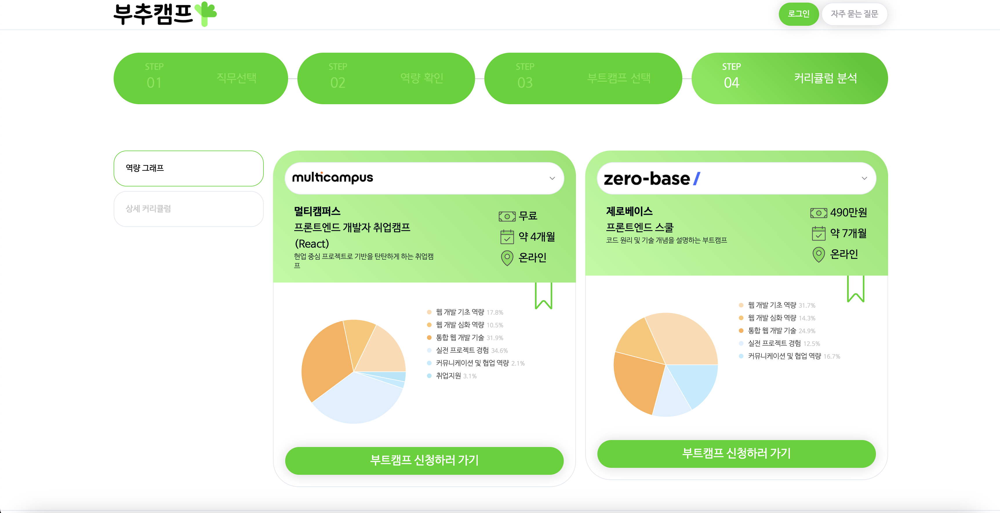

# Introduction

## What is Boochoo-camp?

[Boochoo-camp](https://www.boochoo-camp.com/bootcamp/2?career=clsvjyl830004wd3ydu1jw39c) is web service that provides visualized analysis of bootcamp curriculums based on users' required skills for position.

## What's in service? (feat. Analysis of competitor)

There is another similar service called [Boottent](https://boottent.sayun.studio/) that shows list of a variety of bootcamps, created by Youtuber [Sayun](https://www.youtube.com/@sayunstudio) who is also admin as well.

I analyzed what makes Boochoo-camp tells from Boottent.

### 1. Showing which skills are needed per position

While Boottent just shows a full bunch of list of the available bootcamps, Boochoo-camp teaches users who are not majored in the area they are applying or changing their job completely required skills for successful career.

 

  

 

### 2. Comparison of bootcamps based on skill sets

As mentioned above, Boottent is showing available bootcamps that users can choose.
On the other hand, Boochoo-camp helps users with providing visualized graph that describes which strengths that each bootcamp has.

 

  

 

## Built with...

I was responsible for front-end of Boochoo-camp, and used the following tools.

- Next.js
- SASS (Later switched to TailwindCSS)
