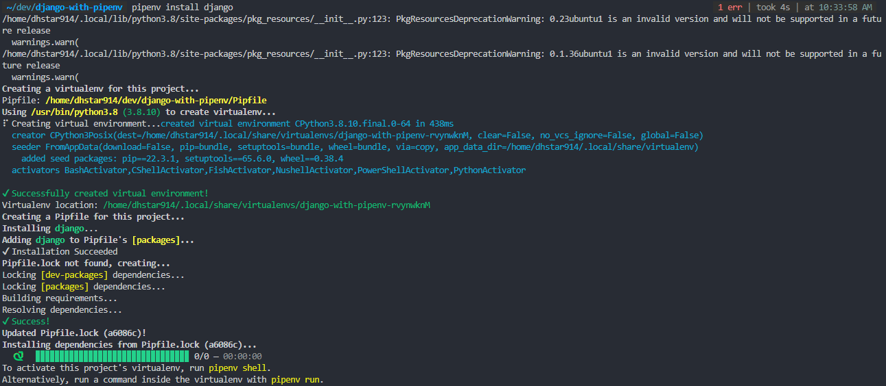
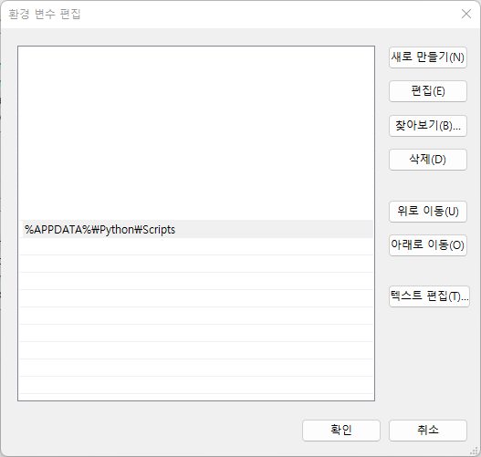
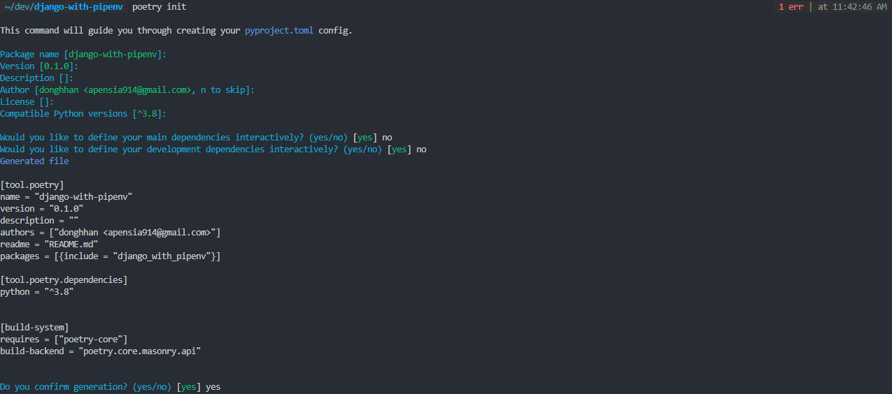
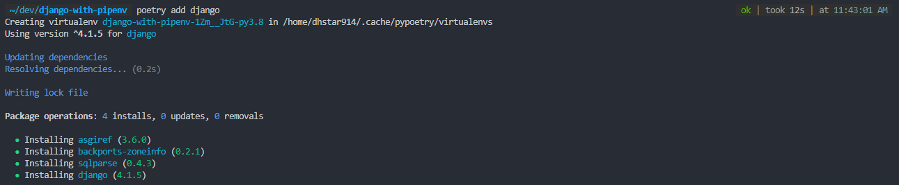

import { Tab, Tabs } from "nextra-theme-docs";

# 설치

## 가상 환경

파이썬으로 프로젝트를 시작할 때 가장 먼저 해야할 것이 가상 환경 설정이다.
여기서 **가상 환경**이란 <ins>_현재 설치된 파이썬 환경과 다른 독립된 환경_</ins>을 의미한다.
다시 말해서 각 프로젝트마다 독립적인 파이썬 개발환경을 설정해주는 것이다.

왜 가상 환경을 설정해야 할까? 프로젝트를 진행하다보면 다양한 패키지에 의존하게 되는데 이 패키지 간에 의존성(Dependencies)가 있을 경우
패키지 버전이 다르게 되면 에러가 발생하게 된다. 그리고 패키지를 업그레이드 및 설치를 할 경우 패키지 버전이 맞지 않을 때 에러가 발생할 수도 있다.
이러한 불편함을 효율적으로 통제하기 위해서 파이썬으로 웹 개발을 할 경우에는 가상 환경을 설정해주는 것이 바람직하다.

## 가상 환경을 통해 설치하기

### Pipenv

Pipenv는 파이썬 패키지 관리 툴인 pip와 가상 환경 생성을 도와주는 virtualenv 패키지의 합성어이다.

Pipenv 설치를 먼저 해주자.

```bash
pip install pipenv
```

이후 `pipenv` 키워드를 이용해 필요한 패키지들을 설치해준다. 설치 전 반드시 본인이 원하는 프로젝트의 루트 경로 내에서 설치해주도록 한다.

```bash
mkdir django-project
cd django-project
pipenv install django
```



### Poetry

[Poetry](https://python-poetry.org/docs/)는 또다른 파이썬 패키지 관리 툴이다.

<Tabs items={["MacOS", "Windows", "Linux"]}>
  <Tab>
    MacOS의 경우 curl을 통해 설치해준다. 
    ```bash
    curl -sSL https://install.python-poetry.org | POETRY_HOME=/etc/poetry python3 -
    ```

  </Tab>
  <Tab>
    윈도우 Powershell을 사용할 경우
    ```bash
    (Invoke-WebRequest -Uri https://install.python-poetry.org -UseBasicParsing).Content | py -
    ```

    이후, 시스템 환경 변수 편집 메뉴에서 환경 변수를 추가해준다.
    <br/>
    <center></center>

  </Tab>
  <Tab>
    Linux의 경우 curl을 통해 설치해준다. 
    ```bash
    curl -sSL https://install.python-poetry.org | POETRY_HOME=/etc/poetry python3 -
    ```
  </Tab>
</Tabs>

이후 프로젝트 루트 폴더로 들어와 다음 명령어를 통해 `.lock` 파일을 생성해준다.

```bash
mkdir django-project
cd django-project
poetry init
```



만들게 되면 Django를 설치해준다.

```bash
poetry add django
```


