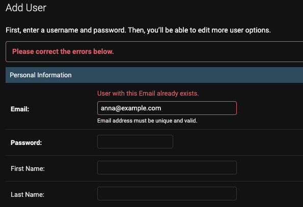

# Customizing User models in Django

## Introduction

We can simply make our User models <a href="https://docs.djangoproject.com/en/4.0/intro/tutorial02/#creating-models" target="_blank">in a basic way</a> that Django explains.
However, it would be much better if we could avoid making new fields manually and import all information fields that we can think of when it comes to "Users".
In this section, let's see how we can make our custom User models in sexier way.

Django is giving us [two different ways](https://docs.djangoproject.com/en/4.0/topics/auth/customizing/#customizing-authentication-in-django) as follows:

1. [Expanding](https://docs.djangoproject.com/en/4.0/topics/auth/customizing/#extending-user) from from the current User model
2. [Replacing](https://docs.djangoproject.com/en/4.0/topics/auth/customizing/#auth-custom-user) the current User model

<br />

## Expanding

The basic methodology is that we are going to define secondary classes that we would like to add or change,
and then expand those classes from `User` class from `django.contrib.auth.models`.

<br />

<CH.Scrollycoding>

### Inheriting `User` class

Let's import `User` class first.

If we dig into codes of `User` class, we can find out that it is inherited from `AbstractUser`, which we will see later.

Therefore, it provides basic required fields such as `username` and `password` with some other optional fields.

```py users/models.py focus=2
from django.db import models
from django.contrib.auth.models import User


class Customer(models.Model):
    pass


class Admin(models.Model):
    pass
```

---

### Creating secondary classes

Now it's time to define secondary classes with which we want to connect `User` class.
For instance, when we are thinking about E-commerce platform, we can think of customers who visit platform and admin users who control platform.
Let's make this happen with our code.

```py users/models.py focus=5:6,9:10
from django.db import models
from django.contrib.auth.models import User


class Customer(models.Model):
    pass


class Admin(models.Model):
    pass
```

---

#### Creating `Customer` class

If we want to change information within `User` class,
We can use [`OneToOneField`](https://docs.djangoproject.com/en/4.0/ref/models/fields/#django.db.models.OneToOneField) to connect `Customer` class with `User` class.

Then, we can define further extra fields to attach to `Customer` class.
In this case, I newly added `address` field.

```py users/models.py focus=5:7
from django.db import models
from django.contrib.auth.models import User


class Customer(models.Model):
    user = models.OneToOneField(User, on_delete=models.CASCADE)
    address = models.CharField(max_length=150)


class Admin(models.Model):
    pass
```

---

#### Creating `Admin` class

I created `Admin` class for admin users.
As we did in previous section, I made `admin_user` property and connected it with `User` using `OneToOneField` field.

To set this user as admin, I created [`BooleanField`](https://docs.djangoproject.com/en/4.0/ref/models/fields/#booleanfield) called `is_admin`.

```py users/models.py focus=10:12
from django.db import models
from django.contrib.auth.models import User


class Customer(models.Model):
    user = models.OneToOneField(User, on_delete=models.CASCADE)
    address = models.CharField(max_length=150)


class Admin(models.Model):
    admin_user = models.OneToOneField(User, on_delete=models.CASCADE)
    is_admin = models.BooleanField(default=True)
```

</CH.Scrollycoding>

### Registering into `admin.py`

Let's register our models into `admin.py`.

<CH.Scrollycoding>

We will be using [`InlineModelAdmin`](https://docs.djangoproject.com/en/4.0/ref/contrib/admin/#django.contrib.admin.InlineModelAdmin) method.

I imported [`UserAdmin`](https://github.com/django/django/blob/6654289f5b350dfca3dc4f6abab777459b906756/django/contrib/auth/admin.py#L44) within `User` class with giving alias as `BaseUserAdmin`
and connected to `UserAdmin` class after creating it.

```py users/admin.py focus=2:4,15:20
from django.contrib import admin
from django.contrib.auth.admin import UserAdmin as BaseUserAdmin
from django.contrib.auth.models import User
from .models import Customer, Admin


class CustomerInline(admin.StackedInline):
    pass


class AdminInline(admin.StackedInline):
    pass


class UserAdmin(BaseUserAdmin):
    inlines = []


admin.site.unregister(User)
admin.site.register(User, UserAdmin)

```

---

#### Creating `CustomerInline` Admin model

I created `CustomerInline` Admin model to connect with `Customer` model.

1. Connect `Customer` model with [`model`](https://docs.djangoproject.com/en/4.0/ref/contrib/admin/#django.contrib.admin.InlineModelAdmin.model) property.
2. I set [`can_delete`](https://docs.djangoproject.com/en/4.0/ref/contrib/admin/#django.contrib.admin.InlineModelAdmin.can_delete) as `False` so that users won't be deleted.
   > Setting value for `can_delete` may rely on your service policy. I just followed what it showed on the official documentation but if you need to let admin users delete users (whatsoever), then you may set it as `True`.
3. Set value of [`verbose_name_plural`](https://docs.djangoproject.com/en/4.0/ref/contrib/admin/#django.contrib.admin.InlineModelAdmin.verbose_name_plural) when we have multiple users.

```py users/admin.py focus=7:10
from django.contrib import admin
from django.contrib.auth.admin import UserAdmin as BaseUserAdmin
from django.contrib.auth.models import User
from .models import Customer, Admin


class CustomerInline(admin.StackedInline):
    model = Customer
    can_delete: bool = False
    verbose_name_plural: str = "Customers"


class AdminInline(admin.StackedInline):
    pass


class UserAdmin(BaseUserAdmin):
    inlines = []


admin.site.unregister(User)
admin.site.register(User, UserAdmin)
```

---

#### Creating `AdminInline` Admin model

It goes same with `Admin` model class as we exactly did previously.

```py users/admin.py focus=13:16
from django.contrib import admin
from django.contrib.auth.admin import UserAdmin as BaseUserAdmin
from django.contrib.auth.models import User
from .models import Customer, Admin


class CustomerInline(admin.StackedInline):
    model = Customer
    can_delete: bool = False
    verbose_name_plural: str = "Customers"


class AdminInline(admin.StackedInline):
    model = Admin
    can_delete: bool = False
    verbose_name_plural: str = "Admin Users"


class UserAdmin(BaseUserAdmin):
    inlines = []


admin.site.unregister(User)
admin.site.register(User, UserAdmin)
```

---

#### Connecting `UserAdmin` Admin model class

I inherited `BaseUserAdmin` to `UserAdmin` Admin class
and then connected `CustomerInline` and `AdminInline`.

```py users/admin.py focus=19:20
from django.contrib import admin
from django.contrib.auth.admin import UserAdmin as BaseUserAdmin
from django.contrib.auth.models import User
from .models import Customer, Admin


class CustomerInline(admin.StackedInline):
    model = Customer
    can_delete: bool = False
    verbose_name_plural: str = "Customers"


class AdminInline(admin.StackedInline):
    model = Admin
    can_delete: bool = False
    verbose_name_plural: str = "Admin Users"


class UserAdmin(BaseUserAdmin):
    inlines = (CustomerInline, AdminInline)


admin.site.unregister(User)
admin.site.register(User, UserAdmin)
```

</CH.Scrollycoding>

<br />

### Result

You will be able to see as below once you started your server.
we can put `address` field information that is defined at `Customer` class
and `is_admin` field information that is defined at `Admin` class, respectively.

<br />

<center>
  
</center>

<br />

After we fill out all necessary information, you will be redirected to the page where we can put secondary information.

<br />

<center>
  
</center>

<br />

Finally, we can see the result page at Django admin page as below:

<br />

<center>
  
</center>

<br />

## Replacing

Let's try with replacing method.
In this post, we will be using [`AbstractBaseUser`](https://docs.djangoproject.com/en/4.0/topics/auth/customizing/#django.contrib.auth.models.AbstractBaseUser) method.

According to [documentation](https://docs.djangoproject.com/en/4.0/topics/auth/customizing/#specifying-a-custom-user-model),
there are only basic authentication features for `AbstractBaseUser`, which is different from [`AbstractUser`](https://docs.djangoproject.com/en/4.1/topics/auth/customizing/#django.contrib.auth.models.AbstractUser)
(that `AbstractUser` has other basic fields for user such as `username`, `email` and etc).

<br />

### Writing `BaseManager`

[Manager](https://docs.djangoproject.com/en/4.1/topics/db/managers/#managers) is an interface that provides DB query operation for Django model.
Django talks database with this Manager and all Django models have at least one Manager.

Inheriting `AbstractUser` will automatically give us the basic information fields such as `username`, `email`, `last_login`.
However, as I decided to use `AbstractBaseUser` where I need to specify all necessary information fields, I will be using [method of `BaseUserManager` inheritance](https://docs.djangoproject.com/en/4.1/topics/auth/customizing/#writing-a-manager-for-a-custom-user-model)
and will be customizing fields as much as possible.

<br />

<CH.Scrollycoding>

#### Making `MyUserManager`

Let's inherit [`BaseUserManager`](https://docs.djangoproject.com/en/4.1/topics/auth/customizing/#django.contrib.auth.models.BaseUserManager).

We need to specify two methods when inheriting `BaseUserManager`.

1. [`create_user()`](https://docs.djangoproject.com/en/4.1/topics/auth/customizing/#django.contrib.auth.models.CustomUserManager.create_user): This is a method for deciding how are we creating normal users.
2. [`create_superuser()`](https://docs.djangoproject.com/en/4.1/topics/auth/customizing/#django.contrib.auth.models.CustomUserManager.create_superuser): A method deciding how are we creating Django superuser.

```py users/models.py focus=2:6
class MyUserManager(BaseUserManager):
    def create_user(self):
        pass

    def create_superuser(self):
        pass
```

---

#### `create_user()` Validation Check

I made users to provide `email`, `first_name`, `last_name`, `nickname` and `password` for creating their account.
Therefore, I added those fields as parameters.

It will raise [`ValueError`](https://docs.python.org/3/library/exceptions.html#ValueError) if any of those values were not given.

```py users/models.py focus=2:13
class MyUserManager(BaseUserManager):
    # mark[21:75]
    def create_user(self, email, first_name, last_name, nickname, password):
        if not email:
            raise ValueError(_("You must provide a valid email address."))
        if not password:
            raise ValueError(_("You must provide a valid password."))
        if not first_name:
            raise ValueError(_("You must provide your first name."))
        if not last_name:
            raise ValueError(_("You must provide your last name."))
        if not nickname:
            raise ValueError(_("You must provide your nickname for using service."))

    def create_superuser(self):
        pass
```

---

#### Creating `user`

After all validation checks are done, Django will create `user` object with those parameters.

I used [`normalize_email()`](https://docs.djangoproject.com/en/4.1/topics/auth/customizing/#django.contrib.auth.models.BaseUserManager.normalize_email) method for normalize email domain address and save it in DB.

```py users/models.py focus=14:20
class MyUserManager(BaseUserManager):
    # mark[21:75]
    def create_user(self, email, first_name, last_name, nickname, password):
        if not email:
            raise ValueError(_("You must provide a valid email address."))
        if not password:
            raise ValueError(_("You must provide a valid password."))
        if not first_name:
            raise ValueError(_("You must provide your first name."))
        if not last_name:
            raise ValueError(_("You must provide your last name."))
        if not nickname:
            raise ValueError(_("You must provide your nickname for using service."))

        user = self.model(
            email=self.normalize_email(email),
            first_name=first_name,
            last_name=last_name,
            nickname=nickname,
        )

    def create_superuser(self):
        pass
```

---

#### Saving in DB after creating `password`

We can save `password` that has been passed as parameter with using [`set_password()`](https://docs.djangoproject.com/en/4.1/topics/auth/customizing/#django.contrib.auth.models.AbstractBaseUser.set_password) method.

After that, we save `user` object in DB with using [`save()`](https://docs.djangoproject.com/en/4.1/ref/models/instances/#django.db.models.Model.save) method and `return` `user` object.

```py users/models.py focus=20:23
class MyUserManager(BaseUserManager):
    # mark[21:75]
    def create_user(self, email, first_name, last_name, nickname, password):
        if not email:
            raise ValueError(_("You must provide a valid email address."))
        if not password:
            raise ValueError(_("You must provide a valid password."))
        if not first_name:
            raise ValueError(_("You must provide your first name."))
        if not last_name:
            raise ValueError(_("You must provide your last name."))
        if not nickname:
            raise ValueError(_("You must provide your nickname for using service."))

        user = self.model(
            email=self.normalize_email(email),
            first_name=first_name,
            last_name=last_name,
            nickname=nickname,
        )
        user.set_password(password)
        user.save(using=self._db)
        return user

    def create_superuser(self):
        pass
```

---

#### `create_superuser()`

I used exact as same logic as I did for `create_user()` method.
The only different point is that I set `is_admin` to `True` so that I can allow superuser can access to Django admin which is provided for free by default.

```py users/models.py focus=25:34
class MyUserManager(BaseUserManager):
    # mark[21:75]
    def create_user(self, email, first_name, last_name, nickname, password):
        if not email:
            raise ValueError(_("You must provide a valid email address."))
        if not password:
            raise ValueError(_("You must provide a valid password."))
        if not first_name:
            raise ValueError(_("You must provide your first name."))
        if not last_name:
            raise ValueError(_("You must provide your last name."))
        if not nickname:
            raise ValueError(_("You must provide your nickname for using service."))

        user = self.model(
            email=self.normalize_email(email),
            first_name=first_name,
            last_name=last_name,
            nickname=nickname,
        )
        user.set_password(password)
        user.save(using=self._db)
        return user

    def create_superuser(self):
        user = self.create_user(
            email,
            first_name=first_name,
            last_name=last_name,
            nickname=nickname,
            password=password,
        )
        user.is_admin = True
        user.save(using=self._db)
        return user
```

</CH.Scrollycoding>

<br />

### Creating `User` model

Let's create `User` model.

<CH.Scrollycoding>

#### Defining model fields

I configured each of fields for `User` model.

1. As email address will be used as login ID for Let'sh, I set attribute of [`unique`](https://docs.djangoproject.com/en/4.1/ref/models/fields/#unique) as `True`.
2. For `sex`, `language` and `currency` fields, I made users only be able to select certain values with using [`choices`](https://docs.djangoproject.com/en/4.1/ref/models/fields/#choices).

```py users/models.py focus=14:90
from django.db import models
from django.contrib.auth.models import (
    AbstractBaseUser,
    BaseUserManager,
    PermissionsMixin,
)
from django.core.exceptions import ValidationError
from django.utils.translation import gettext_lazy as _
from common.models import *


class User(AbstractBaseUser, TimeStampModel):

     """Custom User Definition Model"""

    class SexChioces(models.TextChoices):
        MALE = "male", _("Male")
        FEMALE = "female", _("Female")
        NOT_PREFER = "na", _("Prefer not to answer")

    class LanguageChoices(models.TextChoices):
        ENGLISH = "english", _("English")
        THAI = "thai", _("Thai")

    class CurrencyChoices(models.TextChoices):
        USD = "usd", _("US Dollar")
        THB = "thb", _("Thai Baht")

    email = models.EmailField(
        unique=True,
        max_length=100,
        help_text=_("Email address must be unique and valid."),
        error_messages={
            "null": _("You should provide an email address."),
            "blank": _("Email address cannot be empty."),
        },
    )
    first_name = models.CharField(
        max_length=100,
        verbose_name=_("First Name"),
        blank=True,
        error_messages={
            "null": _("You should provide your first name."),
        },
    )
    last_name = models.CharField(
        max_length=100,
        verbose_name=_("Last Name"),
        blank=True,
        error_messages={
            "null": _("You should provide your last name."),
        },
    )
    nickname = models.CharField(
        max_length=20,
        verbose_name=_("Nickname"),
        help_text=_(
            "Can only include lower/uppercases numbers, . and _. This nickname will be shown on the profile of the host. If not specified, first name field would appear."
        ),
    )
    phone_number = models.CharField(
        max_length=50,
        verbose_name=_("Phone Number"),
        null=True,
        blank=True,
    )
    profile_photo = models.ImageField(
        null=True, blank=True, verbose_name=_("Profile Photo")
    )
    sex = models.CharField(
        max_length=50,
        verbose_name=(_("Sex")),
        choices=SexChioces.choices,
        default=SexChioces.MALE,
    )
    language = models.CharField(
        max_length=10,
        verbose_name=(_("Language")),
        choices=LanguageChoices.choices,
        default=LanguageChoices.ENGLISH,
    )
    currency = models.CharField(
        max_length=10,
        verbose_name=(_("Currency")),
        choices=CurrencyChoices.choices,
        default=CurrencyChoices.USD,
    )
    is_host = models.BooleanField(default=False, verbose_name=_("Host"))
    is_active = models.BooleanField(default=True, verbose_name=_("Active User"))
    is_admin = models.BooleanField(default=False, verbose_name=_("Admin User"))
```

---

#### Connecting Manager and Configuring Additional Fields

1. Connect `MyUserManager` with `User` model.
2. I put `email` in [`USERNAME_FIELD`](https://docs.djangoproject.com/en/4.1/topics/auth/customizing/#django.contrib.auth.models.CustomUser.USERNAME_FIELD)
   so that users can login with their email address.
3. I put `first_name`, `last_name` and `nickname` in [`REQUIRED_FIELDS`](https://docs.djangoproject.com/en/4.1/topics/auth/customizing/#django.contrib.auth.models.CustomUser.REQUIRED_FIELDS)
   which were set in `MyUserManager`.

```py users/models.py focus=92:95
from django.db import models
from django.contrib.auth.models import (
    AbstractBaseUser,
    BaseUserManager,
    PermissionsMixin,
)
from django.core.exceptions import ValidationError
from django.utils.translation import gettext_lazy as _
from common.models import *


class User(AbstractBaseUser, TimeStampModel):

     """Custom User Definition Model"""

    class SexChioces(models.TextChoices):
        MALE = "male", _("Male")
        FEMALE = "female", _("Female")
        NOT_PREFER = "na", _("Prefer not to answer")

    class LanguageChoices(models.TextChoices):
        ENGLISH = "english", _("English")
        THAI = "thai", _("Thai")

    class CurrencyChoices(models.TextChoices):
        USD = "usd", _("US Dollar")
        THB = "thb", _("Thai Baht")

    email = models.EmailField(
        unique=True,
        max_length=100,
        help_text=_("Email address must be unique and valid."),
        error_messages={
            "null": _("You should provide an email address."),
            "blank": _("Email address cannot be empty."),
        },
    )
    first_name = models.CharField(
        max_length=100,
        verbose_name=_("First Name"),
        blank=True,
        error_messages={
            "null": _("You should provide your first name."),
        },
    )
    last_name = models.CharField(
        max_length=100,
        verbose_name=_("Last Name"),
        blank=True,
        error_messages={
            "null": _("You should provide your last name."),
        },
    )
    nickname = models.CharField(
        max_length=20,
        verbose_name=_("Nickname"),
        help_text=_(
            "Can only include lower/uppercases numbers, . and _. This nickname will be shown on the profile of the host. If not specified, first name field would appear."
        ),
    )
    phone_number = models.CharField(
        max_length=50,
        verbose_name=_("Phone Number"),
        null=True,
        blank=True,
    )
    profile_photo = models.ImageField(
        null=True, blank=True, verbose_name=_("Profile Photo")
    )
    sex = models.CharField(
        max_length=50,
        verbose_name=(_("Sex")),
        choices=SexChioces.choices,
        default=SexChioces.MALE,
    )
    language = models.CharField(
        max_length=10,
        verbose_name=(_("Language")),
        choices=LanguageChoices.choices,
        default=LanguageChoices.ENGLISH,
    )
    currency = models.CharField(
        max_length=10,
        verbose_name=(_("Currency")),
        choices=CurrencyChoices.choices,
        default=CurrencyChoices.USD,
    )
    is_host = models.BooleanField(default=False, verbose_name=_("Host"))
    is_active = models.BooleanField(default=True, verbose_name=_("Active User"))
    is_admin = models.BooleanField(default=False, verbose_name=_("Admin User"))

    objects = MyUserManager()

    USERNAME_FIELD = "email"
    REQUIRED_FIELDS = ["first_name", "last_name", "nickname"]
```

---

#### Defining Other Methods

1. [`__str__`](https://docs.djangoproject.com/en/4.1/ref/models/instances/#django.db.models.Model.__str__): Display objects with human-readable fields so that they can be recognized well.
2. [`has_perm()`과 `has_module_perms()`](https://docs.djangoproject.com/en/4.1/topics/auth/customizing/#custom-users-and-django-contrib-admin): Determine whether the user has specific permission
   for certain app label. For `has_module_perms()`, I prevented normal users from entering admin page except admin users.

```py users/models.py focus=97:111
from django.db import models
from django.contrib.auth.models import (
    AbstractBaseUser,
    BaseUserManager,
    PermissionsMixin,
)
from django.core.exceptions import ValidationError
from django.utils.translation import gettext_lazy as _
from common.models import *


class User(AbstractBaseUser, TimeStampModel):

     """Custom User Definition Model"""

    class SexChioces(models.TextChoices):
        MALE = "male", _("Male")
        FEMALE = "female", _("Female")
        NOT_PREFER = "na", _("Prefer not to answer")

    class LanguageChoices(models.TextChoices):
        ENGLISH = "english", _("English")
        THAI = "thai", _("Thai")

    class CurrencyChoices(models.TextChoices):
        USD = "usd", _("US Dollar")
        THB = "thb", _("Thai Baht")

    email = models.EmailField(
        unique=True,
        max_length=100,
        help_text=_("Email address must be unique and valid."),
        error_messages={
            "null": _("You should provide an email address."),
            "blank": _("Email address cannot be empty."),
        },
    )
    first_name = models.CharField(
        max_length=100,
        verbose_name=_("First Name"),
        blank=True,
        error_messages={
            "null": _("You should provide your first name."),
        },
    )
    last_name = models.CharField(
        max_length=100,
        verbose_name=_("Last Name"),
        blank=True,
        error_messages={
            "null": _("You should provide your last name."),
        },
    )
    nickname = models.CharField(
        max_length=20,
        verbose_name=_("Nickname"),
        help_text=_(
            "Can only include lower/uppercases numbers, . and _. This nickname will be shown on the profile of the host. If not specified, first name field would appear."
        ),
    )
    phone_number = models.CharField(
        max_length=50,
        verbose_name=_("Phone Number"),
        null=True,
        blank=True,
    )
    profile_photo = models.ImageField(
        null=True, blank=True, verbose_name=_("Profile Photo")
    )
    sex = models.CharField(
        max_length=50,
        verbose_name=(_("Sex")),
        choices=SexChioces.choices,
        default=SexChioces.MALE,
    )
    language = models.CharField(
        max_length=10,
        verbose_name=(_("Language")),
        choices=LanguageChoices.choices,
        default=LanguageChoices.ENGLISH,
    )
    currency = models.CharField(
        max_length=10,
        verbose_name=(_("Currency")),
        choices=CurrencyChoices.choices,
        default=CurrencyChoices.USD,
    )
    is_host = models.BooleanField(default=False, verbose_name=_("Host"))
    is_active = models.BooleanField(default=True, verbose_name=_("Active User"))
    is_admin = models.BooleanField(default=False, verbose_name=_("Admin User"))

    objects = MyUserManager()

    USERNAME_FIELD = "email"
    REQUIRED_FIELDS = ["first_name", "last_name", "nickname"]

    def __str__(self):
        return f"{self.first_name} ({self.email})"

    def has_perm(self, perm, obj=None):
        return True

    def has_module_perms(self, app_label):
        if self.is_admin:
            return True
        else:
            return False

    @property
    def is_staff(self):
        return self.is_admin
```

---

#### `Meta` Class

Lastly, I defined some meta data in `Meta` class.

```py users/models.py focus=113:116
from django.db import models
from django.contrib.auth.models import (
    AbstractBaseUser,
    BaseUserManager,
    PermissionsMixin,
)
from django.core.exceptions import ValidationError
from django.utils.translation import gettext_lazy as _
from common.models import *


class User(AbstractBaseUser, TimeStampModel):

     """Custom User Definition Model"""

    class SexChioces(models.TextChoices):
        MALE = "male", _("Male")
        FEMALE = "female", _("Female")
        NOT_PREFER = "na", _("Prefer not to answer")

    class LanguageChoices(models.TextChoices):
        ENGLISH = "english", _("English")
        THAI = "thai", _("Thai")

    class CurrencyChoices(models.TextChoices):
        USD = "usd", _("US Dollar")
        THB = "thb", _("Thai Baht")

    email = models.EmailField(
        unique=True,
        max_length=100,
        help_text=_("Email address must be unique and valid."),
        error_messages={
            "null": _("You should provide an email address."),
            "blank": _("Email address cannot be empty."),
        },
    )
    first_name = models.CharField(
        max_length=100,
        verbose_name=_("First Name"),
        blank=True,
        error_messages={
            "null": _("You should provide your first name."),
        },
    )
    last_name = models.CharField(
        max_length=100,
        verbose_name=_("Last Name"),
        blank=True,
        error_messages={
            "null": _("You should provide your last name."),
        },
    )
    nickname = models.CharField(
        max_length=20,
        verbose_name=_("Nickname"),
        help_text=_(
            "Can only include lower/uppercases numbers, . and _. This nickname will be shown on the profile of the host. If not specified, first name field would appear."
        ),
    )
    phone_number = models.CharField(
        max_length=50,
        verbose_name=_("Phone Number"),
        null=True,
        blank=True,
    )
    profile_photo = models.ImageField(
        null=True, blank=True, verbose_name=_("Profile Photo")
    )
    sex = models.CharField(
        max_length=50,
        verbose_name=(_("Sex")),
        choices=SexChioces.choices,
        default=SexChioces.MALE,
    )
    language = models.CharField(
        max_length=10,
        verbose_name=(_("Language")),
        choices=LanguageChoices.choices,
        default=LanguageChoices.ENGLISH,
    )
    currency = models.CharField(
        max_length=10,
        verbose_name=(_("Currency")),
        choices=CurrencyChoices.choices,
        default=CurrencyChoices.USD,
    )
    is_host = models.BooleanField(default=False, verbose_name=_("Host"))
    is_active = models.BooleanField(default=True, verbose_name=_("Active User"))
    is_admin = models.BooleanField(default=False, verbose_name=_("Admin User"))

    objects = MyUserManager()

    USERNAME_FIELD = "email"
    REQUIRED_FIELDS = ["first_name", "last_name", "nickname"]

    def __str__(self):
        return f"{self.first_name} ({self.email})"

    def has_perm(self, perm, obj=None):
        return True

    def has_module_perms(self, app_label):
        if self.is_admin:
            return True
        else:
            return False

    @property
    def is_staff(self):
        return self.is_admin

    class Meta:
        verbose_name = _("User")
        verbose_name_plural = _("Users")
        db_table = "users"
```

</CH.Scrollycoding>

#### `AUTH_USER_MODEL`

Finally, I put `users.User` in [`AUTH_USER_MODEL`](https://docs.djangoproject.com/en/4.1/ref/settings/#std-setting-AUTH_USER_MODEL)
so that we can tell Django that we actually replaced with the customized `User` model.

```py confing/settings.py
AUTH_USER_MODEL = "users.User"
```

<br />

### Results

We can see that Django raises error when we are trying to signup with the registered email address.

<br />

<center>
  
</center>

<br />
