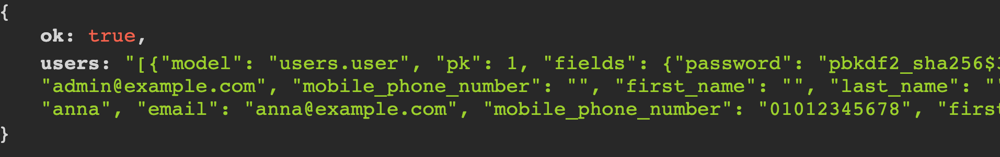
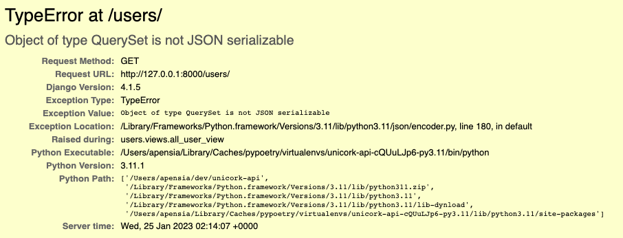

import { Callout } from "nextra-theme-docs";

# Serializers

## Introduction

Serializer is kind of translator that converts QuerySet into JSON format so that our browsers can understand what it means.
There are basically two ways of creating Serializer.

1. Using Django's built-in features
2. DRF's Serializer

## Django's Built-in

We can make Serializer with using Django's [`JsonResponse`](https://docs.djangoproject.com/en/4.1/ref/request-response/#jsonresponse-objects).

### Code

<CH.Scrollycoding>

#### Configuration of Django app's `urls.py`

To begin with, create `urls.py` file inside of app folder.
Next, configure sub URL to connect views that we will be creating later with using [`path()`](https://docs.djangoproject.com/en/4.1/ref/urls/#path) inside of `urlpatterns` array.

```py users/urls.py
from django.urls import path

urlpatterns = [
    path("")
]
```

---

#### Configuration of master `urls.py`

Configure master `urls.py` in project root folder.
We can configure _master URL_ with using [`include()`](https://docs.djangoproject.com/en/4.1/ref/urls/#include) method for each created Django app.

```py project/urls.py focus=2,6
from django.contrib import admin
from django.urls import path, include

urlpatterns = [
    path("admin/", admin.site.urls),
    path("users/", include("users.urls")),
]
```

</CH.Scrollycoding>

Next, let's create views.

<CH.Scrollycoding>

#### Creating `views.py`

We will be creating function-based view that shows the all users.
To start with, let's get QuerySet to get all users with name of `all_users`.

```py users/views.py
from .models import User


def all_user_view(request):
    all_users = User.objects.all()
```

---

#### serialization and returning `JsonResponse`

Then, let's serialize `all_users` QuerySet that has been created above.
we can use Django's built-in [`serializers`](https://docs.djangoproject.com/en/4.1/topics/serialization/#serializing-data) to convert QuerySet into [JSON format](https://docs.djangoproject.com/en/4.1/topics/serialization/#serialization-formats).

Next, we `return` that serialized `all_users` QuerySet within [`JsonResponse`](https://docs.djangoproject.com/en/4.1/ref/request-response/#jsonresponse-objects).

```py users/views.py focus=1:2,7:12
from django.http import JsonResponse
from django.core import serializers
from .models import User


def all_user_view(request):
    all_users = User.objects.all()
    return JsonResponse(
        {
            "ok": True,
            "users": serializers.serialize("json", all_users),
        }
    )
```

---

#### Connecting View

Connet the `all_user_view()` with `urls.py`.

```py users/urls.py
from django.urls import path
from .views import all_user_view

urlpatterns = [path("", all_user_view)]
```

</CH.Scrollycoding>

### Result

We can see that our `all_users` QuerySet is converted into JSON file that browser can recognizable.



<Callout type="warning" emoji="⚠️">
  If you just pass pure QuerySet into `JsonResponse` and return it without
  serialization, browser won't still be able to recognize what it means. Thus,
  it will throw `TypeError: Object of type QuerySet is not JSON serializable` as
  below. 
</Callout>

For the Atmohpserher For the
At ths most time fo the theories that ar not the only way arond.
The reason why they are doing For the

### Drawbacks

Method that we have discussed above cannot allow us to customize
다만 위와 같이 불필요한 필드들(예: `password` 등)을 숨긴다든지 하는 커스터마이징은 쉽게 할 수 없으며
매번 위와 같이 다른 QuerySet을 생성할 때마다 다른 `JsonResponse`를 `return`해야 하는 불편함이 생기게 된다.

## DRF

DRF 라이브러리를 사용하게 되면 보다 손쉽게 Serializer를 만들 수 있다.

### 구현

#### `serializers.py` 파일 생성
