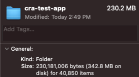

import Bleed from 'nextra-theme-docs/bleed'

# Webpack과 TypeScript로 나만의 React 보일러플레이트 만들기

## 개요

React로 어플리케이션을 만들 때 줄곧 <a href="https://create-react-app.dev/" target="_blank">Create React App (혹은 CRA)</a> 프레임워크를 활용하여 많이 만들곤 한다.
단 한 줄의 콘솔 창에서의 명령어를 통해 테스트 툴까지 포함된 근사한 React 보일러플레이트를 만들어준다. letsh의 프론트엔드 단을 구성하고자 했을 때 귀찮으니 단순하게 CRA 프레임워크를 사용해볼까를 생각했지만
Webpack과 TypeScript도 익숙해질겸 하여 직접 만들어보기로 하였다.

### CRA의 문제점

#### 쓸데없이 무겁다

CRA의 `create-react-app` 명령어를 통해 보일러플레이트를 생성하게 되면 수많은 의존성이 설치됨과 동시에 앱의 무게가 굉장히 증가하는 걸 볼 수 있다[^1].

<br/>

<center></center>

#### 설정이 까다롭다

CRA로 보일러플레이트를 만들 시 실제로 내부에는 수많은 의존성 패키지들이 내장된 채 만들어진다. 따라서 불필요한 패키지들을 손쉽게 제어하기 힘들다.
이를 위하여 Eject[^2]라는 방법을 통해 숨겨진 모든 패키지들을 한번에 노출시키는 명령어를 통해 커스터마이징 할 순 있지만 자칫 잘못 건드렸다간 프로젝트가 꼬이기 십상이다.

<br/>

## 패키지 설치

필요한 패키지들을 설치한다 (필자는 참고로 yarn을 이용하였다).

```bash
# package.json 파일 생성
yarn init -y

# 필요 패키지 설치
yarn add react react-dom
```

## 참고 자료

[^1]:
    <a href="https://stackoverflow.com/questions/63595886/what-are-the-drawbacks-of-create-react-app" target="_blank">What are drawbacks of create-react-app?</a>

[^2]:
    <a href="https://stackoverflow.com/questions/54902190/are-there-any-drawbacks-of-using-npm-run-eject-in-create-react-app-setup#comment96571714_54902190" target="_blank">Are there any drawbacks of using "npm run eject" in "create-react-app" setup?</a>
