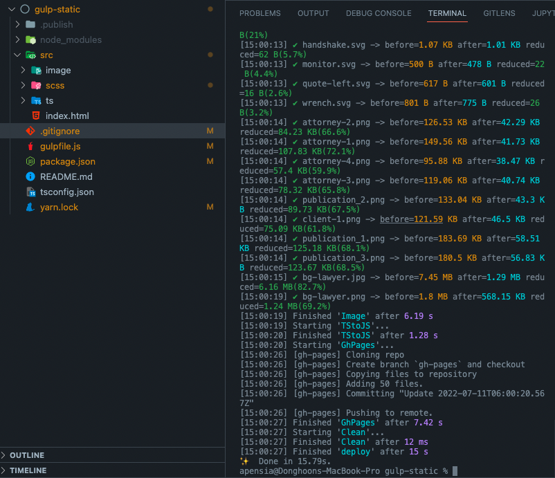
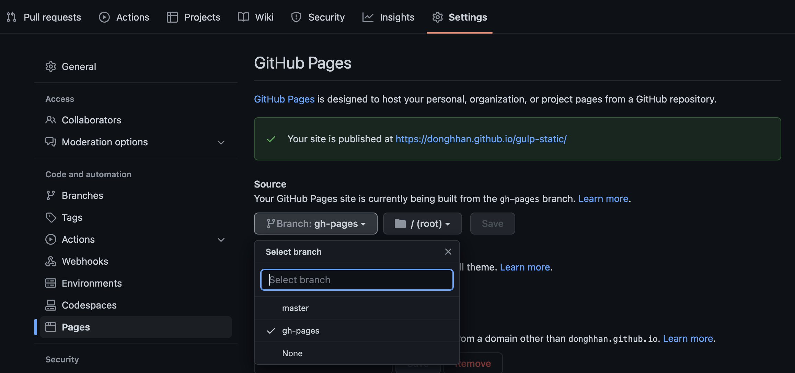

import Callout from 'nextra-theme-docs/callout'
import Bleed from 'nextra-theme-docs/bleed'

# Using Gulp more sexier

## Auto refresh

It would be quite annoying if we always need to hit refresh button whenever we make changes.
Therefore, we will use <a href="https://browsersync.io" target="_blank">browser-sync</a> package for adding auto-refreshing feature in our project.

```bash
# npm
npm i -D browser-sync

# yarn
yarn add -D browser-sync
```

<a href="https://browsersync.io" target="_blank">browser-sync</a>: Comfy plugin that enables auto refreshing

<Callout>
  There is another package called <a href="https://github.com/schickling/gulp-webserver" target="_blank">gulp-webserver</a> but I ended up not using it because it's too slow. 
</Callout>

<br/>
<br/>

<CH.Scrollycoding>

### Importing

Let's import necessary packages.

```js focus=14
const { src, dest, series } = require('gulp');
const pug = require('gulp-pug');
const htmlmin = require("gulp-htmlmin");
const sass = require('gulp-sass')(requrie('sass'));
const autoPrefixer = require("gulp-autoprefixer");
const uglify = require("gulp-uglify");
const browserify = require("browserify");
const tsify = require("tsify");
const buffer = require("vinyl-buffer");
const source = require("vinyl-source-stream");
const sourcemaps = require("gulp-sourcemaps");
const ts = require("gulp-typescript");
const tsProject = ts.createProject("tsconfig.json");
const browserSync = require("browser-sync").create();

const routes = {
    pug: {
        src: "src/**/*.pug",
        build: "build"
    },
    sass: {
        src: "src/scss/style.scss",
        build: "build/css/style.css"
    },
    ts: {
        src: "src/ts/**/*.ts",
        build: "build/js/",
    },
}

function PugIntoHTML() {
  return gulp
    .src(routes.html.src)
    .pipe(htmlmin({ collapseWhitespace: true }))
    .pipe(gulp.dest(routes.html.docs))
    .pipe(browserSync.stream());
}

function SCSStoCSS() {
    return src(routes.scss.src)
        .pipe(sass().on("error", sass.logError))
        .pipe(autoPrefixer())
        .pipe(
            uglifycss({
                maxLineLen: 80,
                uglyComments: true,
            })
        )
        .pipe(dest(routes.scss.build));
}

function TStoJS() {
  return browserify({
    basedir: ".",
    debug: true,
    entries: ["src/ts/main.ts"],
    cache: {},
    packageCache: {},
  })
    .plugin(tsify)
    .bundle()
    .pipe(source("js/bundle.js"))
    .pipe(buffer())
    .pipe(sourcemaps.init({ loadMaps: true }))
    .pipe(uglify())
    .pipe(sourcemaps.write("./"))
    .pipe(gulp.dest("build"))
}

function Image() {
  return src(routes.image.src)
    .pipe(image())
    .pipe(gulp.dest(routes.image.build));
}

function Watch() {
  return;
}

export const dev = series([PugIntoHTML, SCSStoCSS, TStoJS, Image, Watch]);
```

---

### Configuring task

I created function called `Watch()`.
This function literally is a task that makes Gulp watch all the changes happening in designated files.

```js focus=76:78
const { src, dest, series } = require('gulp');
const pug = require('gulp-pug');
const htmlmin = require("gulp-htmlmin");
const sass = require('gulp-sass')(requrie('sass'));
const autoPrefixer = require("gulp-autoprefixer");
const uglify = require("gulp-uglify");
const browserify = require("browserify");
const tsify = require("tsify");
const buffer = require("vinyl-buffer");
const source = require("vinyl-source-stream");
const sourcemaps = require("gulp-sourcemaps");
const ts = require("gulp-typescript");
const tsProject = ts.createProject("tsconfig.json");
const browserSync = require("browser-sync").create();

const routes = {
    pug: {
        src: "src/**/*.pug",
        build: "build"
    },
    sass: {
        src: "src/scss/style.scss",
        build: "build/css/style.css"
    },
    ts: {
        src: "src/ts/**/*.ts",
        build: "build/js/",
    },
}

function PugIntoHTML() {
  return gulp
    .src(routes.html.src)
    .pipe(htmlmin({ collapseWhitespace: true }))
    .pipe(gulp.dest(routes.html.docs))
    .pipe(browserSync.stream());
}

function SCSStoCSS() {
    return src(routes.scss.src)
        .pipe(sass().on("error", sass.logError))
        .pipe(autoPrefixer())
        .pipe(
            uglifycss({
                maxLineLen: 80,
                uglyComments: true,
            })
        )
        .pipe(dest(routes.scss.build));
}

function TStoJS() {
  return browserify({
    basedir: ".",
    debug: true,
    entries: ["src/ts/main.ts"],
    cache: {},
    packageCache: {},
  })
    .plugin(tsify)
    .bundle()
    .pipe(source("js/bundle.js"))
    .pipe(buffer())
    .pipe(sourcemaps.init({ loadMaps: true }))
    .pipe(uglify())
    .pipe(sourcemaps.write("./"))
    .pipe(gulp.dest("build"))
}

function Image() {
  return src(routes.image.src)
    .pipe(image())
    .pipe(gulp.dest(routes.image.build));
}

function Watch() {
  return;
}

export const dev = series([PugIntoHTML, SCSStoCSS, TStoJS, Image, Watch]);
```

---

#### Connecting browser-sync

As shown in the official documentation[^1], I initialized browser-sync with `init()`, and designated current route as our init point(`baseDir`) of our `server`.

[^1]:
    <a href="https://browsersync.io/docs/gulp#gulp-install" target="_blank">Browsersync + Gulp.js</a>

```js focus=76:81
const { src, dest, series } = require('gulp');
const pug = require('gulp-pug');
const htmlmin = require("gulp-htmlmin");
const sass = require('gulp-sass')(requrie('sass'));
const autoPrefixer = require("gulp-autoprefixer");
const uglify = require("gulp-uglify");
const browserify = require("browserify");
const tsify = require("tsify");
const buffer = require("vinyl-buffer");
const source = require("vinyl-source-stream");
const sourcemaps = require("gulp-sourcemaps");
const ts = require("gulp-typescript");
const tsProject = ts.createProject("tsconfig.json");
const browserSync = require("browser-sync").create();

const routes = {
    pug: {
        src: "src/**/*.pug",
        build: "build"
    },
    sass: {
        src: "src/scss/style.scss",
        build: "build/css/style.css"
    },
    ts: {
        src: "src/ts/**/*.ts",
        build: "build/js/",
    },
}

function PugIntoHTML() {
  return gulp
    .src(routes.html.src)
    .pipe(htmlmin({ collapseWhitespace: true }))
    .pipe(gulp.dest(routes.html.docs))
    .pipe(browserSync.stream());
}

function SCSStoCSS() {
    return src(routes.scss.src)
        .pipe(sass().on("error", sass.logError))
        .pipe(autoPrefixer())
        .pipe(
            uglifycss({
                maxLineLen: 80,
                uglyComments: true,
            })
        )
        .pipe(dest(routes.scss.build));
}

function TStoJS() {
  return browserify({
    basedir: ".",
    debug: true,
    entries: ["src/ts/main.ts"],
    cache: {},
    packageCache: {},
  })
    .plugin(tsify)
    .bundle()
    .pipe(source("js/bundle.js"))
    .pipe(buffer())
    .pipe(sourcemaps.init({ loadMaps: true }))
    .pipe(uglify())
    .pipe(sourcemaps.write("./"))
    .pipe(gulp.dest("build"))
}

function Image() {
  return src(routes.image.src)
    .pipe(image())
    .pipe(gulp.dest(routes.image.build));
}

function Watch() {
  browserSync.init({
    server: {
      baseDir: "./build",
    },
  });
  gulp.watch(routes.scss.src, SCSStoCSS);
  gulp.watch(routes.html.src, MinifyHTML);
  gulp.watch(routes.ts.src, TStoJS);
}

export const dev = series([PugIntoHTML, SCSStoCSS, TStoJS, Image, Watch]);
```

---

#### `watch()` method

We can make Gulp watch changes with using <a href="https://gulpjs.com/docs/en/api/watch" target="_blank"><code>watch()</code></a> method.

The first <a href="https://gulpjs.com/docs/en/api/watch#parameters" target="_blank">parameter</a> that is required is <a href="https://gulpjs.com/docs/en/api/concepts#globs" target="_blank">globs</a>, which are files can be changed.
As we already created `routes` object where we have `src/` route containing files to be changed, we will tell route to Gulp with Pug, SCSS and TypeScript files in it.

Next, we can pass task to implement for the next parameter. In this case, we will put `PugIntoHTML()`, `SCSStoCSS()` and `TStoJS()` tasks.

```js focus=82:84
const { src, dest, series } = require('gulp');
const pug = require('gulp-pug');
const htmlmin = require("gulp-htmlmin");
const sass = require('gulp-sass')(requrie('sass'));
const autoPrefixer = require("gulp-autoprefixer");
const uglify = require("gulp-uglify");
const browserify = require("browserify");
const tsify = require("tsify");
const buffer = require("vinyl-buffer");
const source = require("vinyl-source-stream");
const sourcemaps = require("gulp-sourcemaps");
const ts = require("gulp-typescript");
const tsProject = ts.createProject("tsconfig.json");
const browserSync = require("browser-sync").create();

const routes = {
    pug: {
        src: "src/**/*.pug",
        build: "build"
    },
    sass: {
        src: "src/scss/style.scss",
        build: "build/css/style.css"
    },
    ts: {
        src: "src/ts/**/*.ts",
        build: "build/js/",
    },
}

function PugIntoHTML() {
  return gulp
    .src(routes.html.src)
    .pipe(htmlmin({ collapseWhitespace: true }))
    .pipe(gulp.dest(routes.html.docs))
    .pipe(browserSync.stream());
}

function SCSStoCSS() {
    return src(routes.scss.src)
        .pipe(sass().on("error", sass.logError))
        .pipe(autoPrefixer())
        .pipe(
            uglifycss({
                maxLineLen: 80,
                uglyComments: true,
            })
        )
        .pipe(dest(routes.scss.build));
}

function TStoJS() {
  return browserify({
    basedir: ".",
    debug: true,
    entries: ["src/ts/main.ts"],
    cache: {},
    packageCache: {},
  })
    .plugin(tsify)
    .bundle()
    .pipe(source("js/bundle.js"))
    .pipe(buffer())
    .pipe(sourcemaps.init({ loadMaps: true }))
    .pipe(uglify())
    .pipe(sourcemaps.write("./"))
    .pipe(gulp.dest("build"))
}

function Image() {
  return src(routes.image.src)
    .pipe(image())
    .pipe(gulp.dest(routes.image.build));
}

function Watch() {
  browserSync.init({
    server: {
      baseDir: "./build",
    },
  });
  gulp.watch(routes.scss.src, SCSStoCSS);
  gulp.watch(routes.html.src, MinifyHTML);
  gulp.watch(routes.ts.src, TStoJS);
}

export const dev = series([PugIntoHTML, SCSStoCSS, TStoJS, Image, Watch]);
```

---

#### Registering task

Connect created task into `dev` script command.

```js focus=87
const { src, dest, series } = require('gulp');
const pug = require('gulp-pug');
const htmlmin = require("gulp-htmlmin");
const sass = require('gulp-sass')(requrie('sass'));
const autoPrefixer = require("gulp-autoprefixer");
const uglify = require("gulp-uglify");
const browserify = require("browserify");
const tsify = require("tsify");
const buffer = require("vinyl-buffer");
const source = require("vinyl-source-stream");
const sourcemaps = require("gulp-sourcemaps");
const ts = require("gulp-typescript");
const tsProject = ts.createProject("tsconfig.json");
const browserSync = require("browser-sync").create();

const routes = {
    pug: {
        src: "src/**/*.pug",
        build: "build"
    },
    sass: {
        src: "src/scss/style.scss",
        build: "build/css/style.css"
    },
    ts: {
        src: "src/ts/**/*.ts",
        build: "build/js/",
    },
}

function PugIntoHTML() {
  return gulp
    .src(routes.html.src)
    .pipe(htmlmin({ collapseWhitespace: true }))
    .pipe(gulp.dest(routes.html.docs))
    .pipe(browserSync.stream());
}

function SCSStoCSS() {
    return src(routes.scss.src)
        .pipe(sass().on("error", sass.logError))
        .pipe(autoPrefixer())
        .pipe(
            uglifycss({
                maxLineLen: 80,
                uglyComments: true,
            })
        )
        .pipe(dest(routes.scss.build));
}

function TStoJS() {
  return browserify({
    basedir: ".",
    debug: true,
    entries: ["src/ts/main.ts"],
    cache: {},
    packageCache: {},
  })
    .plugin(tsify)
    .bundle()
    .pipe(source("js/bundle.js"))
    .pipe(buffer())
    .pipe(sourcemaps.init({ loadMaps: true }))
    .pipe(uglify())
    .pipe(sourcemaps.write("./"))
    .pipe(gulp.dest("build"))
}

function Image() {
  return src(routes.image.src)
    .pipe(image())
    .pipe(gulp.dest(routes.image.build));
}

function Watch() {
  browserSync.init({
    server: {
      baseDir: "./build",
    },
  });
  gulp.watch(routes.scss.src, SCSStoCSS);
  gulp.watch(routes.html.src, MinifyHTML);
  gulp.watch(routes.ts.src, TStoJS);
}

export const dev = series([PugIntoHTML, SCSStoCSS, TStoJS, Image, Watch]);
```

</CH.Scrollycoding>

### Result

We can see auto-refreshing is happening after running `dev` script command.

<br/>

<center></center>

<br/>

## Deleting old files

We may need to delete the old files after saving the newly changed files.
For this, we will be using <a href="https://github.com/sindresorhus/del#readme" target="_blank">del</a> package.

```bash
# npm
npm i -D del

# yarn
yarn add -D del
```

<a href="https://github.com/sindresorhus/del#readme" target="_blank">del</a>: Plugin that deletes files in the specific routes.

<br/>

<CH.Scrollycoding>

### Importing

Let's import necessary packages.

```js focus=15
const { src, dest, series } = require('gulp');
const pug = require('gulp-pug');
const htmlmin = require("gulp-htmlmin");
const sass = require('gulp-sass')(requrie('sass'));
const autoPrefixer = require("gulp-autoprefixer");
const uglify = require("gulp-uglify");
const browserify = require("browserify");
const tsify = require("tsify");
const buffer = require("vinyl-buffer");
const source = require("vinyl-source-stream");
const sourcemaps = require("gulp-sourcemaps");
const ts = require("gulp-typescript");
const tsProject = ts.createProject("tsconfig.json");
const browserSync = require("browser-sync").create();
const del = require("del");

const routes = {
    pug: {
        src: "src/**/*.pug",
        build: "build"
    },
    sass: {
        src: "src/scss/style.scss",
        build: "build/css/style.css"
    },
    ts: {
        src: "src/ts/**/*.ts",
        build: "build/js/",
    },
}

function PugIntoHTML() {
  return gulp
    .src(routes.html.src)
    .pipe(htmlmin({ collapseWhitespace: true }))
    .pipe(gulp.dest(routes.html.docs))
    .pipe(browserSync.stream());
}

function SCSStoCSS() {
    return src(routes.scss.src)
        .pipe(sass().on("error", sass.logError))
        .pipe(autoPrefixer())
        .pipe(
            uglifycss({
                maxLineLen: 80,
                uglyComments: true,
            })
        )
        .pipe(dest(routes.scss.build));
}

function TStoJS() {
  return browserify({
    basedir: ".",
    debug: true,
    entries: ["src/ts/main.ts"],
    cache: {},
    packageCache: {},
  })
    .plugin(tsify)
    .bundle()
    .pipe(source("js/bundle.js"))
    .pipe(buffer())
    .pipe(sourcemaps.init({ loadMaps: true }))
    .pipe(uglify())
    .pipe(sourcemaps.write("./"))
    .pipe(gulp.dest("build"))
}

function Image() {
  return src(routes.image.src)
    .pipe(image())
    .pipe(gulp.dest(routes.image.build));
}

function Watch() {
  browserSync.init({
    server: {
      baseDir: "./build",
    },
  });
  gulp.watch(routes.scss.src, SCSStoCSS);
  gulp.watch(routes.html.src, MinifyHTML);
  gulp.watch(routes.ts.src, TStoJS);
}

export const dev = series([PugIntoHTML, SCSStoCSS, TStoJS, Image, Watch]);
```

---

### Configuring task

I created task name called `Clean()`.
I will make this task happen prior to all other tasks so that previous files can be successfully deleted.

```js focus=88:90
const { src, dest, series } = require('gulp');
const pug = require('gulp-pug');
const htmlmin = require("gulp-htmlmin");
const sass = require('gulp-sass')(requrie('sass'));
const autoPrefixer = require("gulp-autoprefixer");
const uglify = require("gulp-uglify");
const browserify = require("browserify");
const tsify = require("tsify");
const buffer = require("vinyl-buffer");
const source = require("vinyl-source-stream");
const sourcemaps = require("gulp-sourcemaps");
const ts = require("gulp-typescript");
const tsProject = ts.createProject("tsconfig.json");
const browserSync = require("browser-sync").create();
const del = require("del");

const routes = {
    pug: {
        src: "src/**/*.pug",
        build: "build"
    },
    sass: {
        src: "src/scss/style.scss",
        build: "build/css/style.css"
    },
    ts: {
        src: "src/ts/**/*.ts",
        build: "build/js/",
    },
}

function PugIntoHTML() {
  return gulp
    .src(routes.html.src)
    .pipe(htmlmin({ collapseWhitespace: true }))
    .pipe(gulp.dest(routes.html.docs))
    .pipe(browserSync.stream());
}

function SCSStoCSS() {
    return src(routes.scss.src)
        .pipe(sass().on("error", sass.logError))
        .pipe(autoPrefixer())
        .pipe(
            uglifycss({
                maxLineLen: 80,
                uglyComments: true,
            })
        )
        .pipe(dest(routes.scss.build));
}

function TStoJS() {
  return browserify({
    basedir: ".",
    debug: true,
    entries: ["src/ts/main.ts"],
    cache: {},
    packageCache: {},
  })
    .plugin(tsify)
    .bundle()
    .pipe(source("js/bundle.js"))
    .pipe(buffer())
    .pipe(sourcemaps.init({ loadMaps: true }))
    .pipe(uglify())
    .pipe(sourcemaps.write("./"))
    .pipe(gulp.dest("build"))
}

function Image() {
  return src(routes.image.src)
    .pipe(image())
    .pipe(gulp.dest(routes.image.build));
}

function Watch() {
  browserSync.init({
    server: {
      baseDir: "./build",
    },
  });
  gulp.watch(routes.scss.src, SCSStoCSS);
  gulp.watch(routes.html.src, MinifyHTML);
  gulp.watch(routes.ts.src, TStoJS);
}

function Clean() {
  return;
}

export const dev = series([PugIntoHTML, SCSStoCSS, TStoJS, Image, Watch]);
```

---

#### Connecting `del`

Files that we are supposed to delete is files within `build/` folder, NOT in `src/` folder.
Therefore, we will be deleteing files within `build/` folder.[^2]

[^2]: Reference: <a href="https://github.com/sindresorhus/del#usage" target="_blank">Del Usage</a>

```js focus=88:90
const { src, dest, series } = require('gulp');
const pug = require('gulp-pug');
const htmlmin = require("gulp-htmlmin");
const sass = require('gulp-sass')(requrie('sass'));
const autoPrefixer = require("gulp-autoprefixer");
const uglify = require("gulp-uglify");
const browserify = require("browserify");
const tsify = require("tsify");
const buffer = require("vinyl-buffer");
const source = require("vinyl-source-stream");
const sourcemaps = require("gulp-sourcemaps");
const ts = require("gulp-typescript");
const tsProject = ts.createProject("tsconfig.json");
const browserSync = require("browser-sync").create();
const del = require("del");

const routes = {
    pug: {
        src: "src/**/*.pug",
        build: "build"
    },
    sass: {
        src: "src/scss/style.scss",
        build: "build/css/style.css"
    },
    ts: {
        src: "src/ts/**/*.ts",
        build: "build/js/",
    },
}

function PugIntoHTML() {
  return gulp
    .src(routes.html.src)
    .pipe(htmlmin({ collapseWhitespace: true }))
    .pipe(gulp.dest(routes.html.docs))
    .pipe(browserSync.stream());
}

function SCSStoCSS() {
    return src(routes.scss.src)
        .pipe(sass().on("error", sass.logError))
        .pipe(autoPrefixer())
        .pipe(
            uglifycss({
                maxLineLen: 80,
                uglyComments: true,
            })
        )
        .pipe(dest(routes.scss.build));
}

function TStoJS() {
  return browserify({
    basedir: ".",
    debug: true,
    entries: ["src/ts/main.ts"],
    cache: {},
    packageCache: {},
  })
    .plugin(tsify)
    .bundle()
    .pipe(source("js/bundle.js"))
    .pipe(buffer())
    .pipe(sourcemaps.init({ loadMaps: true }))
    .pipe(uglify())
    .pipe(sourcemaps.write("./"))
    .pipe(gulp.dest("build"))
}

function Image() {
  return src(routes.image.src)
    .pipe(image())
    .pipe(gulp.dest(routes.image.build));
}

function Watch() {
  browserSync.init({
    server: {
      baseDir: "./build",
    },
  });
  gulp.watch(routes.scss.src, SCSStoCSS);
  gulp.watch(routes.html.src, MinifyHTML);
  gulp.watch(routes.ts.src, TStoJS);
}

function Clean() {
  return del(["build/"]);
}

export const dev = series([PugIntoHTML, SCSStoCSS, TStoJS, Image, Watch]);
```

---

### Registering task

After that, let's register the task into `dev` script command.
Put task in front so that it can be implemented every time it is refreshed.

```js focus=92
const { src, dest, series } = require('gulp');
const pug = require('gulp-pug');
const htmlmin = require("gulp-htmlmin");
const sass = require('gulp-sass')(requrie('sass'));
const autoPrefixer = require("gulp-autoprefixer");
const uglify = require("gulp-uglify");
const browserify = require("browserify");
const tsify = require("tsify");
const buffer = require("vinyl-buffer");
const source = require("vinyl-source-stream");
const sourcemaps = require("gulp-sourcemaps");
const ts = require("gulp-typescript");
const tsProject = ts.createProject("tsconfig.json");
const browserSync = require("browser-sync").create();
const del = require("del");

const routes = {
    pug: {
        src: "src/**/*.pug",
        build: "build"
    },
    sass: {
        src: "src/scss/style.scss",
        build: "build/css/style.css"
    },
    ts: {
        src: "src/ts/**/*.ts",
        build: "build/js/",
    },
}

function PugIntoHTML() {
  return gulp
    .src(routes.html.src)
    .pipe(htmlmin({ collapseWhitespace: true }))
    .pipe(gulp.dest(routes.html.docs))
    .pipe(browserSync.stream());
}

function SCSStoCSS() {
    return src(routes.scss.src)
        .pipe(sass().on("error", sass.logError))
        .pipe(autoPrefixer())
        .pipe(
            uglifycss({
                maxLineLen: 80,
                uglyComments: true,
            })
        )
        .pipe(dest(routes.scss.build));
}

function TStoJS() {
  return browserify({
    basedir: ".",
    debug: true,
    entries: ["src/ts/main.ts"],
    cache: {},
    packageCache: {},
  })
    .plugin(tsify)
    .bundle()
    .pipe(source("js/bundle.js"))
    .pipe(buffer())
    .pipe(sourcemaps.init({ loadMaps: true }))
    .pipe(uglify())
    .pipe(sourcemaps.write("./"))
    .pipe(gulp.dest("build"))
}

function Image() {
  return src(routes.image.src)
    .pipe(image())
    .pipe(gulp.dest(routes.image.build));
}

function Watch() {
  browserSync.init({
    server: {
      baseDir: "./build",
    },
  });
  gulp.watch(routes.scss.src, SCSStoCSS);
  gulp.watch(routes.html.src, MinifyHTML);
  gulp.watch(routes.ts.src, TStoJS);
}

function Clean() {
  return del(["build/"]);
}

export const dev = series([Clean, PugIntoHTML, SCSStoCSS, TStoJS, Image, Watch]);
```

</CH.Scrollycoding>

<br/>

## Dividing tasks

Let's divide our tasks to manage more intuitively.

<br/>

<CH.Scrollycoding>

### Main

Core tasks would be:

1. `PugIntoHTML()`
2. `SCSStoCSS()`
3. `TStoJS()`

I grouped them up into one progress called `progress`.

```js focus=92
const { src, dest, series } = require('gulp');
const pug = require('gulp-pug');
const htmlmin = require("gulp-htmlmin");
const sass = require('gulp-sass')(requrie('sass'));
const autoPrefixer = require("gulp-autoprefixer");
const uglify = require("gulp-uglify");
const browserify = require("browserify");
const tsify = require("tsify");
const buffer = require("vinyl-buffer");
const source = require("vinyl-source-stream");
const sourcemaps = require("gulp-sourcemaps");
const ts = require("gulp-typescript");
const tsProject = ts.createProject("tsconfig.json");
const browserSync = require("browser-sync").create();
const del = require("del");

const routes = {
    pug: {
        src: "src/**/*.pug",
        build: "build"
    },
    sass: {
        src: "src/scss/style.scss",
        build: "build/css/style.css"
    },
    ts: {
        src: "src/ts/**/*.ts",
        build: "build/js/",
    },
}

function PugIntoHTML() {
  return gulp
    .src(routes.html.src)
    .pipe(htmlmin({ collapseWhitespace: true }))
    .pipe(gulp.dest(routes.html.docs))
    .pipe(browserSync.stream());
}

function SCSStoCSS() {
    return src(routes.scss.src)
        .pipe(sass().on("error", sass.logError))
        .pipe(autoPrefixer())
        .pipe(
            uglifycss({
                maxLineLen: 80,
                uglyComments: true,
            })
        )
        .pipe(dest(routes.scss.build));
}

function TStoJS() {
  return browserify({
    basedir: ".",
    debug: true,
    entries: ["src/ts/main.ts"],
    cache: {},
    packageCache: {},
  })
    .plugin(tsify)
    .bundle()
    .pipe(source("js/bundle.js"))
    .pipe(buffer())
    .pipe(sourcemaps.init({ loadMaps: true }))
    .pipe(uglify())
    .pipe(sourcemaps.write("./"))
    .pipe(gulp.dest("build"))
}

function Image() {
  return src(routes.image.src)
    .pipe(image())
    .pipe(gulp.dest(routes.image.build));
}

function Watch() {
  browserSync.init({
    server: {
      baseDir: "./build",
    },
  });
  gulp.watch(routes.scss.src, SCSStoCSS);
  gulp.watch(routes.html.src, MinifyHTML);
  gulp.watch(routes.ts.src, TStoJS);
}

function Clean() {
  return del(["build/"]);
}

const progress = gulp.series([PugIntoHTML, SCSStoCSS, TStoJS]);
```

---

### Others

We only need `Watch()` task during development stage, so we can omit it for build stage.
`Clean()` task, however, is necessary for both development and build stage.

Therefore, I splited `dev` and `build` script command as follows:

```js focus=94:96
const { src, dest, series } = require('gulp');
const pug = require('gulp-pug');
const htmlmin = require("gulp-htmlmin");
const sass = require('gulp-sass')(requrie('sass'));
const autoPrefixer = require("gulp-autoprefixer");
const uglify = require("gulp-uglify");
const browserify = require("browserify");
const tsify = require("tsify");
const buffer = require("vinyl-buffer");
const source = require("vinyl-source-stream");
const sourcemaps = require("gulp-sourcemaps");
const ts = require("gulp-typescript");
const tsProject = ts.createProject("tsconfig.json");
const browserSync = require("browser-sync").create();
const del = require("del");

const routes = {
    pug: {
        src: "src/**/*.pug",
        build: "build"
    },
    sass: {
        src: "src/scss/style.scss",
        build: "build/css/style.css"
    },
    ts: {
        src: "src/ts/**/*.ts",
        build: "build/js/",
    },
}

function PugIntoHTML() {
  return gulp
    .src(routes.html.src)
    .pipe(htmlmin({ collapseWhitespace: true }))
    .pipe(gulp.dest(routes.html.docs))
    .pipe(browserSync.stream());
}

function SCSStoCSS() {
    return src(routes.scss.src)
        .pipe(sass().on("error", sass.logError))
        .pipe(autoPrefixer())
        .pipe(
            uglifycss({
                maxLineLen: 80,
                uglyComments: true,
            })
        )
        .pipe(dest(routes.scss.build));
}

function TStoJS() {
  return browserify({
    basedir: ".",
    debug: true,
    entries: ["src/ts/main.ts"],
    cache: {},
    packageCache: {},
  })
    .plugin(tsify)
    .bundle()
    .pipe(source("js/bundle.js"))
    .pipe(buffer())
    .pipe(sourcemaps.init({ loadMaps: true }))
    .pipe(uglify())
    .pipe(sourcemaps.write("./"))
    .pipe(gulp.dest("build"))
}

function Image() {
  return src(routes.image.src)
    .pipe(image())
    .pipe(gulp.dest(routes.image.build));
}

function Watch() {
  browserSync.init({
    server: {
      baseDir: "./build",
    },
  });
  gulp.watch(routes.scss.src, SCSStoCSS);
  gulp.watch(routes.html.src, MinifyHTML);
  gulp.watch(routes.ts.src, TStoJS);
}

function Clean() {
  return del(["build/"]);
}

const progress = gulp.series([PugIntoHTML, SCSStoCSS, TStoJS]);

exports.dev = gulp.series([Clean, progress, Watch]);
exports.build = gulp.series([Clean, progress]);
```

---

#### Editing script command

And finally let's update script commands of `dev` and `build` in `package.json` file.

```json package.json
{
  "scripts": {
    "dev": gulp dev,
    "build": gulp build
  }
}
```

</CH.Scrollycoding>

<br/>

## Deploying into Github Page

We will be creating task for auto deploying our webpage with Github Pages powered by Github.

```bash
# npm
npm i -D gulp-gh-pages

# yarn
yarn add -D gulp-gh-pages
```

<a href="https://github.com/shinnn/gulp-gh-pages#readme" target="_blank">gulp-gh-pages</a>: Gulp plugin that allows to deploy into Github page in easier way.

<CH.Scrollycoding>

### Importing

Let's import necessary packages.

```js focus=16
const { src, dest, series } = require('gulp');
const pug = require('gulp-pug');
const htmlmin = require("gulp-htmlmin");
const sass = require('gulp-sass')(requrie('sass'));
const autoPrefixer = require("gulp-autoprefixer");
const uglify = require("gulp-uglify");
const browserify = require("browserify");
const tsify = require("tsify");
const buffer = require("vinyl-buffer");
const source = require("vinyl-source-stream");
const sourcemaps = require("gulp-sourcemaps");
const ts = require("gulp-typescript");
const tsProject = ts.createProject("tsconfig.json");
const browserSync = require("browser-sync").create();
const del = require("del");
const ghPages = require("gulp-gh-pages");

const routes = {
    pug: {
        src: "src/**/*.pug",
        build: "build"
    },
    sass: {
        src: "src/scss/style.scss",
        build: "build/css/style.css"
    },
    ts: {
        src: "src/ts/**/*.ts",
        build: "build/js/",
    },
}

function PugIntoHTML() {
  return gulp
    .src(routes.html.src)
    .pipe(htmlmin({ collapseWhitespace: true }))
    .pipe(gulp.dest(routes.html.docs))
    .pipe(browserSync.stream());
}

function SCSStoCSS() {
    return src(routes.scss.src)
        .pipe(sass().on("error", sass.logError))
        .pipe(autoPrefixer())
        .pipe(
            uglifycss({
                maxLineLen: 80,
                uglyComments: true,
            })
        )
        .pipe(dest(routes.scss.build));
}

function TStoJS() {
  return browserify({
    basedir: ".",
    debug: true,
    entries: ["src/ts/main.ts"],
    cache: {},
    packageCache: {},
  })
    .plugin(tsify)
    .bundle()
    .pipe(source("js/bundle.js"))
    .pipe(buffer())
    .pipe(sourcemaps.init({ loadMaps: true }))
    .pipe(uglify())
    .pipe(sourcemaps.write("./"))
    .pipe(gulp.dest("build"))
}

function Image() {
  return src(routes.image.src)
    .pipe(image())
    .pipe(gulp.dest(routes.image.build));
}

function Watch() {
  browserSync.init({
    server: {
      baseDir: "./build",
    },
  });
  gulp.watch(routes.scss.src, SCSStoCSS);
  gulp.watch(routes.html.src, MinifyHTML);
  gulp.watch(routes.ts.src, TStoJS);
}

function Clean() {
  return del(["build/"]);
}

const progress = gulp.series([PugIntoHTML, SCSStoCSS, TStoJS]);

exports.dev = gulp.series([Clean, progress, Watch]);
exports.build = gulp.series([Clean, progress]);
```

---

### Configuring task

I created task name called `GhPages()`.

```js focus=93:95
const { src, dest, series } = require('gulp');
const pug = require('gulp-pug');
const htmlmin = require("gulp-htmlmin");
const sass = require('gulp-sass')(requrie('sass'));
const autoPrefixer = require("gulp-autoprefixer");
const uglify = require("gulp-uglify");
const browserify = require("browserify");
const tsify = require("tsify");
const buffer = require("vinyl-buffer");
const source = require("vinyl-source-stream");
const sourcemaps = require("gulp-sourcemaps");
const ts = require("gulp-typescript");
const tsProject = ts.createProject("tsconfig.json");
const browserSync = require("browser-sync").create();
const del = require("del");
const ghPages = require("gulp-gh-pages");

const routes = {
    pug: {
        src: "src/**/*.pug",
        build: "build"
    },
    sass: {
        src: "src/scss/style.scss",
        build: "build/css/style.css"
    },
    ts: {
        src: "src/ts/**/*.ts",
        build: "build/js/",
    },
}

function PugIntoHTML() {
  return gulp
    .src(routes.html.src)
    .pipe(htmlmin({ collapseWhitespace: true }))
    .pipe(gulp.dest(routes.html.docs))
    .pipe(browserSync.stream());
}

function SCSStoCSS() {
    return src(routes.scss.src)
        .pipe(sass().on("error", sass.logError))
        .pipe(autoPrefixer())
        .pipe(
            uglifycss({
                maxLineLen: 80,
                uglyComments: true,
            })
        )
        .pipe(dest(routes.scss.build));
}

function TStoJS() {
  return browserify({
    basedir: ".",
    debug: true,
    entries: ["src/ts/main.ts"],
    cache: {},
    packageCache: {},
  })
    .plugin(tsify)
    .bundle()
    .pipe(source("js/bundle.js"))
    .pipe(buffer())
    .pipe(sourcemaps.init({ loadMaps: true }))
    .pipe(uglify())
    .pipe(sourcemaps.write("./"))
    .pipe(gulp.dest("build"))
}

function Image() {
  return src(routes.image.src)
    .pipe(image())
    .pipe(gulp.dest(routes.image.build));
}

function Watch() {
  browserSync.init({
    server: {
      baseDir: "./build",
    },
  });
  gulp.watch(routes.scss.src, SCSStoCSS);
  gulp.watch(routes.html.src, MinifyHTML);
  gulp.watch(routes.ts.src, TStoJS);
}

function Clean() {
  return del(["build/"]);
}

function GhPages() {
  return;
}

const progress = gulp.series([PugIntoHTML, SCSStoCSS, TStoJS]);

exports.dev = gulp.series([Clean, progress, Watch]);
exports.build = gulp.series([Clean, progress]);
```

---

#### Registering `ghPages()`

I connected task with using `.pipe()`.

Meanwhile, as we will be uploading the files on build stage, let Gulp watch on `build/` folder with `.dest()`.[^3]

[^3]: Reference: <a href="https://github.com/shinnn/gulp-gh-pages#usage" target="_blank">gulp-gh-pages Usage</a>

```js focus=93:95
const { src, dest, series } = require('gulp');
const pug = require('gulp-pug');
const htmlmin = require("gulp-htmlmin");
const sass = require('gulp-sass')(requrie('sass'));
const autoPrefixer = require("gulp-autoprefixer");
const uglify = require("gulp-uglify");
const browserify = require("browserify");
const tsify = require("tsify");
const buffer = require("vinyl-buffer");
const source = require("vinyl-source-stream");
const sourcemaps = require("gulp-sourcemaps");
const ts = require("gulp-typescript");
const tsProject = ts.createProject("tsconfig.json");
const browserSync = require("browser-sync").create();
const del = require("del");
const ghPages = require("gulp-gh-pages");

const routes = {
    pug: {
        src: "src/**/*.pug",
        build: "build"
    },
    sass: {
        src: "src/scss/style.scss",
        build: "build/css/style.css"
    },
    ts: {
        src: "src/ts/**/*.ts",
        build: "build/js/",
    },
}

function PugIntoHTML() {
  return gulp
    .src(routes.html.src)
    .pipe(htmlmin({ collapseWhitespace: true }))
    .pipe(gulp.dest(routes.html.docs))
    .pipe(browserSync.stream());
}

function SCSStoCSS() {
    return src(routes.scss.src)
        .pipe(sass().on("error", sass.logError))
        .pipe(autoPrefixer())
        .pipe(
            uglifycss({
                maxLineLen: 80,
                uglyComments: true,
            })
        )
        .pipe(dest(routes.scss.build));
}

function TStoJS() {
  return browserify({
    basedir: ".",
    debug: true,
    entries: ["src/ts/main.ts"],
    cache: {},
    packageCache: {},
  })
    .plugin(tsify)
    .bundle()
    .pipe(source("js/bundle.js"))
    .pipe(buffer())
    .pipe(sourcemaps.init({ loadMaps: true }))
    .pipe(uglify())
    .pipe(sourcemaps.write("./"))
    .pipe(gulp.dest("build"))
}

function Image() {
  return src(routes.image.src)
    .pipe(image())
    .pipe(gulp.dest(routes.image.build));
}

function Watch() {
  browserSync.init({
    server: {
      baseDir: "./build",
    },
  });
  gulp.watch(routes.scss.src, SCSStoCSS);
  gulp.watch(routes.html.src, MinifyHTML);
  gulp.watch(routes.ts.src, TStoJS);
}

function Clean() {
  return del(["build/"]);
}

function GhPages() {
  return gulp.src("build/**/*").pipe(ghPages());
}

const progress = gulp.series([PugIntoHTML, SCSStoCSS, TStoJS]);

exports.dev = gulp.series([Clean, progress, Watch]);
exports.build = gulp.series([Clean, progress]);
```

---

### Registering task

I newly created script command called `deploy()`.
This command will firstly implement `progress` command that we previously created, then carry out `GhPages()` task for deploying our website at Github Pages.

The reason why I also included `Clean()` task is to eliminate unnecessary dummy files while `GhPages()` is deploying at Github Pages.

```js focus=101
const { src, dest, series } = require('gulp');
const pug = require('gulp-pug');
const htmlmin = require("gulp-htmlmin");
const sass = require('gulp-sass')(requrie('sass'));
const autoPrefixer = require("gulp-autoprefixer");
const uglify = require("gulp-uglify");
const browserify = require("browserify");
const tsify = require("tsify");
const buffer = require("vinyl-buffer");
const source = require("vinyl-source-stream");
const sourcemaps = require("gulp-sourcemaps");
const ts = require("gulp-typescript");
const tsProject = ts.createProject("tsconfig.json");
const browserSync = require("browser-sync").create();
const del = require("del");
const ghPages = require("gulp-gh-pages");

const routes = {
    pug: {
        src: "src/**/*.pug",
        build: "build"
    },
    sass: {
        src: "src/scss/style.scss",
        build: "build/css/style.css"
    },
    ts: {
        src: "src/ts/**/*.ts",
        build: "build/js/",
    },
}

function PugIntoHTML() {
  return gulp
    .src(routes.html.src)
    .pipe(htmlmin({ collapseWhitespace: true }))
    .pipe(gulp.dest(routes.html.docs))
    .pipe(browserSync.stream());
}

function SCSStoCSS() {
    return src(routes.scss.src)
        .pipe(sass().on("error", sass.logError))
        .pipe(autoPrefixer())
        .pipe(
            uglifycss({
                maxLineLen: 80,
                uglyComments: true,
            })
        )
        .pipe(dest(routes.scss.build));
}

function TStoJS() {
  return browserify({
    basedir: ".",
    debug: true,
    entries: ["src/ts/main.ts"],
    cache: {},
    packageCache: {},
  })
    .plugin(tsify)
    .bundle()
    .pipe(source("js/bundle.js"))
    .pipe(buffer())
    .pipe(sourcemaps.init({ loadMaps: true }))
    .pipe(uglify())
    .pipe(sourcemaps.write("./"))
    .pipe(gulp.dest("build"))
}

function Image() {
  return src(routes.image.src)
    .pipe(image())
    .pipe(gulp.dest(routes.image.build));
}

function Watch() {
  browserSync.init({
    server: {
      baseDir: "./build",
    },
  });
  gulp.watch(routes.scss.src, SCSStoCSS);
  gulp.watch(routes.html.src, MinifyHTML);
  gulp.watch(routes.ts.src, TStoJS);
}

function Clean() {
  return del(["build/"]);
}

function GhPages() {
  return gulp.src("build/**/*").pipe(ghPages());
}

const progress = gulp.series([PugIntoHTML, SCSStoCSS, TStoJS]);

exports.dev = gulp.series([Clean, progress, Watch]);
exports.build = gulp.series([Clean, progress]);
exports.deploy = gulp.series([progress, GhPages, Clean]);
```

---

#### Editing script command.

At last, let's update `deploy` script into `package.json` file.

```json package.json
{
  "scripts": {
    "dev": gulp dev,
    "build": gulp build,
    "deploy": gulp deploy
  }
}
```

</CH.Scrollycoding>

### Connecting Github pages

If we hit `npm run deploy` or `yarn deploy` script, Gulp will automatically create branch called `gh-pages`.
This is the branch that is automatically created by the time deploy at Github pages starts. We need to let Github Page look at this branch.

<center></center>

<br/>

Go to Settings tab in repository and click Pages tab on the left menu of Code and automation.
Then, choose gh-pages for Source Branch, select /(root) and click Save.

<center></center>

<br/>

### Result

After waiting approximately 5 minutes, we can see the deployed website.
