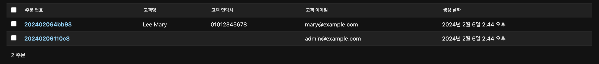

# 주문과 연결된 고객 정보 보이기

## 개요

어드민 유저들이 고객의 주문을 보다 수월하게 하기 위하여 어드민 패널에 주문 내역 말고도 주문을 생성한 고객의 몇 가지 정보를 보여주기로 하였다.

## 분석

Django에서는 모델의 필드들을 [`list_display`](https://docs.djangoproject.com/en/dev/ref/contrib/admin/#django.contrib.admin.ModelAdmin.list_display) 속성을 통해서 보여줄 수 있다.
그러나 관계형 필드인 [`ForeignKey`](https://docs.djangoproject.com/en/dev/ref/models/fields/#django.db.models.ForeignKey)나 [`ManyToManyField`](https://docs.djangoproject.com/en/dev/ref/models/fields/#django.db.models.ManyToManyField)의 경우 얘기는 달라진다.

1. `ForeignKey`의 경우 `list_display`에 있는 그대로를 집어넣게 되면 `__str__()` 메소드가 반환하는 값을 보여준다.
2. `ManyToManyField`는 들어갈 수 없는데 그 이유는 테이블의 각 행에 대하여 서로 다른 SQL 쿼리문이 실행되기 때문에 비효율적이기 때문이다.

> 2024년 2월 6일 기준으로 개발용 버전에서는 `__`를 이용한 lookup을 사용할 수 있으나 최신 버전인 5.0에서는 아직 사용이 불가능해보인다.

이는 [`display` 데코레이터](https://docs.djangoproject.com/en/dev/ref/contrib/admin/#the-display-decorator)를 이용하여 추가적인 메소드를 만들어서 진행하였다.

## 설계

<CH.Scrollycoding>

### `OrderAdmin` 클래스 생성

[`register` 데코레이터](https://docs.djangoproject.com/en/dev/ref/contrib/admin/#the-register-decorator)를 이용하여 먼저 `Order` 모델을 `OrderAdmin` 클래스와 연결시켜준다.

```py admin.py
from django.contrib import admin
from .models import *

@admin.register(Order)
class OrderAdmin(admin.ModelAdmin):
    list_display = []
```

---

### 고객명 메소드 만들기

`display` 데코레이터를 통하여 고객의 풀네임을 반환하는 `get_customer_full_name()` 메소드를 생성했다.
두번째 파라미터인 `obj`는 현재 `OrderAdmin` 클래스와 연결되어 있는 `Order` queryset을 의미하며, `Order` 모델과 `ForeignKey`로 연결되어 있는 `user`의 `first_name`과 `last_name`을 `return` 하였다.

이후 생성된 메소드를 `list_display` 배열 안에 넣어주었다.

```py admin.py focus=5,9:11
@admin.register(Order)
class OrderAdmin(admin.ModelAdmin):
    list_display = [
        "order_number",
        "get_customer_full_name",
        "created_at",
    ]

    @admin.display(description="고객명")
    def get_customer_full_name(self, obj):
        return f"{obj.user.last_name} {obj.user.first_name}"
```

---

### 고객 연락망 메소드 만들기

위와 같은 방식으로 고객의 이메일과 휴대전화 번호 정보도 `list_display`에 추가해주었다.

```py admin.py focus=15:21
@admin.register(Order)
class OrderAdmin(admin.ModelAdmin):
    list_display = [
        "order_number",
        "get_customer_full_name",
        "get_customer_mobile_number",
        "get_customer_email",
        "created_at",
    ]

    @admin.display(description="고객명")
    def get_customer_full_name(self, obj):
        return f"{obj.user.last_name} {obj.user.first_name}"

    @admin.display(description="고객 연락처")
    def get_customer_mobile_number(self, obj):
        return obj.user.mobile_number

    @admin.display(description="고객 이메일")
    def get_customer_email(self, obj):
        return obj.user.email
```

</CH.Scrollycoding>

## 결과

다음과 같이 필자가 선택한대로 고객명과 연락처 및 이메일 주소가 잘 나오는 것을 볼 수 있다.

<center>
  
</center>
