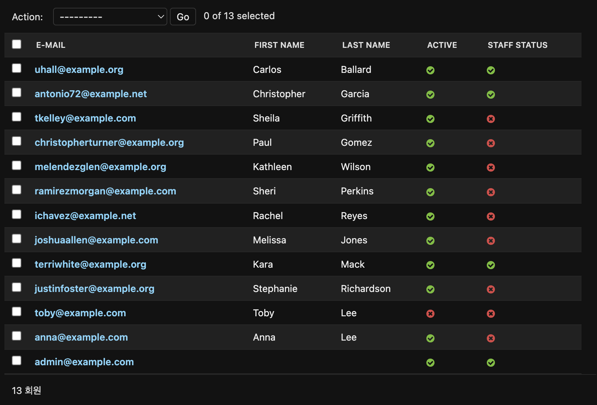

import { Callout, Tabs, Tab, Steps, FileTree } from "nextra/components";

# 더미 데이터 만들기

## 개요

개발 도중 테스트 용도로 사용하기 위한 많은 더미 데이터가 필요했었는데 이를 일일히 만드는 것보다 자동적으로 한꺼번에 만들어주는 방법이 없을까하고 방법을 강구하였다.

## 솔루션

[django-seed](https://github.com/Brobin/django-seed) 패키지는 필자가 원하는 종류의 더미 데이터 및 개수를 자유롭게 만들 수 있게 도와주는 패키지였다.
해당 패키지와 Django에서 제공해주는 [`django-admin` 커스텀 명령어](https://docs.djangoproject.com/en/dev/howto/custom-management-commands/#module-django.core.management) 작성법을 참고하여
진행하였다.

## 과정

<Steps>

### 패키지 설치

django-seed 패키지를 설치해준다.

```bash
pip install django-seed
```

### `INSTALLED_APPS` 등록

이후 `settings.py`의 `INSTALLED_APPS`에 [등록](https://github.com/Brobin/django-seed?tab=readme-ov-file#configuration)해준다.

```py
# settings.py
INSTALLED_APPS = [
    # ...
    "django_seed",
    # ...
]
```

### 파일 생성

유저 더미 데이터를 만들기 위한 명령어 파일을 만들어준다. 명령어 파일은 [Django 공식문서](https://docs.djangoproject.com/en/dev/howto/custom-management-commands/#module-django.core.management)의 것을 그대로 따랐다.

<FileTree>
    <FileTree.Folder name="users" defaultOpen>
        <FileTree.Folder name="management" defaultOpen>
            <FileTree.File name="__init__.py"/ >
            <FileTree.Folder name="commands" defaultOpen>
                <FileTree.File name="__init__.py"/ >
                <FileTree.File name="fake_users.py"/ >
            </FileTree.Folder>
        </FileTree.Folder>
    </FileTree.Folder>

</FileTree>

<CH.Scrollycoding>

### 명령어 클래스 만들기

[`BaseCommand`](https://docs.djangoproject.com/en/dev/howto/custom-management-commands/#django.core.management.BaseCommand)를 상속받는 `Command` 클래스를 만들어준다.

```py fake_users.py
from django.core.management.base import BaseCommand

class Command(BaseCommand):
    pass
```

---

### `django_seed` 초기화

본격적으로 django-seed 패키지를 사용하기 위해 `seeder` Provider를 초기화해준다.

```py fake_users.py focus=2,4
from django.core.management.base import BaseCommand
from django_seed import Seed

seeder = Seed.seeder()

class Command(BaseCommand):
    pass
```

---

### 도움말

해당 명령어가 어떤 명령어인지 알려주기 위해 [`help`](https://docs.djangoproject.com/en/dev/howto/custom-management-commands/#django.core.management.BaseCommand.help) 속성으로 정해주었다.

```py fake_users.py focus=7
from django.core.management.base import BaseCommand
from django_seed import Seed

seeder = Seed.seeder()

class Command(BaseCommand):
    help = "Creating fake user data"
```

---

### 명령어 인자 정하기

우리가 만들고자 하는 명령어에 전달할 인자를 설정해주는 작업을 [`add_arguments()`](https://docs.djangoproject.com/en/dev/howto/custom-management-commands/#django.core.management.BaseCommand.add_arguments) 메소드를 통해 해준다.
필자는 `--number`라는 인자를 전달할 수 있게 해주었고 기본값으로 `1`을 설정해주었다.

```py fake_users.py focus=9:12
from django.core.management.base import BaseCommand
from django_seed import Seed

seeder = Seed.seeder()

class Command(BaseCommand):
    help = "Creating fake user data"

    def add_arguments(self, parser):
        parser.add_argument(
            "--number", default=1, help="How many users do you want to create"
        )
```

---

### 명령어 로직 설계

본격적으로 명령어를 통해 수행할 작업을 [`handle()`](https://docs.djangoproject.com/en/dev/howto/custom-management-commands/#django.core.management.BaseCommand.handle) 메소드를 통해 설정해준다.
먼저, 명령어로 전달된 `--number` 인자를 가져와서

```py fake_users.py focus=14:15
from django.core.management.base import BaseCommand
from django_seed import Seed

seeder = Seed.seeder()

class Command(BaseCommand):
    help = "Creating fake user data"

    def add_arguments(self, parser):
        parser.add_argument(
            "--number", default=1, help="How many users do you want to create"
        )

    def handle(self, *args, **kwargs):
        number = kwargs.get("number")
```

---

### seeder 설정

`models.py`에서 정의한 `User` 모델을 불러온 후 각각의 필드에 어떤 값을 넣을건지 설정한 후 더미 데이터를 생성하였다[^1].

```py fake_users.py focus=17:27
from django.core.management.base import BaseCommand
from django_seed import Seed
from users.models import User

seeder = Seed.seeder()

class Command(BaseCommand):
    help = "Creating fake user data"

    def add_arguments(self, parser):
        parser.add_argument(
            "--number", default=1, help="How many users do you want to create"
        )

    def handle(self, *args, **kwargs):
        number = kwargs.get("number")
        seeder.add_entity(
            User,
            number,
            {
                "email": lambda x: seeder.faker.email(),
                "phone_number": lambda x: seeder.faker.phone_number(),
                "is_staff": False,
                "is_active": True,
            },
        )
        seeder.execute()
```

---

### 성공 시 메세지 스타일 수정

마지막으로 [`style`](https://docs.djangoproject.com/en/dev/howto/custom-management-commands/#django.core.management.BaseCommand.style)을 통해서
더미 데이터 생성에 성공시 보여지는 성공 메세지의 스타일을 꾸며주었다.
이 때, 앞서 만든 `number` 인자값을 가져와 f스트링 값으로 전달해주었다.

```py fake_users.py focus=29
from django.core.management.base import BaseCommand
from django_seed import Seed
from users.models import User

seeder = Seed.seeder()

class Command(BaseCommand):
    help = "Creating fake user data"

    def add_arguments(self, parser):
        parser.add_argument(
            "--number", default=1, help="How many users do you want to create"
        )

    def handle(self, *args, **kwargs):
        number = kwargs.get("number")
        seeder.add_entity(
            User,
            number,
            {
                "email": lambda x: seeder.faker.email(),
                "phone_number": lambda x: seeder.faker.phone_number(),
                "is_staff": False,
                "is_active": True,
            },
        )
        seeder.execute()

        self.stdout.write(self.style.SUCCES(f"{number} fake users created!"))
```

[^1]: [Using with code](https://github.com/Brobin/django-seed?tab=readme-ov-file#using-with-code)

</CH.Scrollycoding>

</Steps>

## 결과

아래 이미지와 같이 필자가 원하는대로 더미 데이터가 개수에 맞춰 생성됨을 볼 수 있다.

<center></center>

## 디버깅

### TypeError: make_aware() got an unexpected keyword argument 'is_dst'

#### 문제 발생

django-seed 패키지를 이용하여 더미 데이터를 만들기 위해 터미널 창에 다음 명령어를 기입했다.

```bash
python manage.py seed users --number=10
```

그러나 다음과 같은 에러가 발생하였다.

```bash
Traceback (most recent call last):
  File "/Users/apensia/dev/knower-admin/manage.py", line 32, in <module>
    main()
  File "/Users/apensia/dev/knower-admin/manage.py", line 28, in main
    execute_from_command_line(sys.argv)
  File "/Users/apensia/dev/knower-admin/venv/lib/python3.11/site-packages/django/core/management/__init__.py", line 442, in execute_from_command_line
    utility.execute()
  File "/Users/apensia/dev/knower-admin/venv/lib/python3.11/site-packages/django/core/management/__init__.py", line 436, in execute
    self.fetch_command(subcommand).run_from_argv(self.argv)
  File "/Users/apensia/dev/knower-admin/venv/lib/python3.11/site-packages/django/core/management/base.py", line 413, in run_from_argv
    self.execute(*args, **cmd_options)
  File "/Users/apensia/dev/knower-admin/venv/lib/python3.11/site-packages/django/core/management/base.py", line 459, in execute
    output = self.handle(*args, **options)
             ^^^^^^^^^^^^^^^^^^^^^^^^^^^^^
  File "/Users/apensia/dev/knower-admin/venv/lib/python3.11/site-packages/django/core/management/base.py", line 646, in handle
    app_output = self.handle_app_config(app_config, **options)
                 ^^^^^^^^^^^^^^^^^^^^^^^^^^^^^^^^^^^^^^^^^^^^^
  File "/Users/apensia/dev/knower-admin/venv/lib/python3.11/site-packages/django_seed/management/commands/seed.py", line 63, in handle_app_config
    generated = seeder.execute()
                ^^^^^^^^^^^^^^^^
  File "/Users/apensia/dev/knower-admin/venv/lib/python3.11/site-packages/django_seed/seeder.py", line 250, in execute
    executed_entity = entity.execute(using, inserted_entities)
                      ^^^^^^^^^^^^^^^^^^^^^^^^^^^^^^^^^^^^^^^^
  File "/Users/apensia/dev/knower-admin/venv/lib/python3.11/site-packages/django_seed/seeder.py", line 157, in execute
    faker_data = {
                 ^
  File "/Users/apensia/dev/knower-admin/venv/lib/python3.11/site-packages/django_seed/seeder.py", line 158, in <dictcomp>
    field: format_field(field_format, inserted_entities)
           ^^^^^^^^^^^^^^^^^^^^^^^^^^^^^^^^^^^^^^^^^^^^^
  File "/Users/apensia/dev/knower-admin/venv/lib/python3.11/site-packages/django_seed/seeder.py", line 144, in format_field
    return format(inserted_entities)
           ^^^^^^^^^^^^^^^^^^^^^^^^^
  File "/Users/apensia/dev/knower-admin/venv/lib/python3.11/site-packages/django_seed/guessers.py", line 120, in <lambda>
    return lambda x: _timezone_format(faker.date_time())
                     ^^^^^^^^^^^^^^^^^^^^^^^^^^^^^^^^^^^
  File "/Users/apensia/dev/knower-admin/venv/lib/python3.11/site-packages/django_seed/guessers.py", line 21, in _timezone_format
    return timezone.make_aware(value, timezone.get_current_timezone(), is_dst=False)
           ^^^^^^^^^^^^^^^^^^^^^^^^^^^^^^^^^^^^^^^^^^^^^^^^^^^^^^^^^^^^^^^^^^^^^^^^^
TypeError: make_aware() got an unexpected keyword argument 'is_dst'
```

#### 분석

django-seed Github repo에 제기된 이슈를 살펴보던 도중 Django 버전 5 이상에서 날짜 데이터를 기입할 때 해당 에러가 발생하는 것을 알 수 있었다.
버전 5로 업그레이드되면서 `is_dst` 인자를 더 이상 받지 않기 때문.

#### 해결

[salimbyte의 조언](https://github.com/Brobin/django-seed/issues/119#issuecomment-2141574298)에 따라 [`USE_TZ`](https://docs.djangoproject.com/en/dev/ref/settings/#std-setting-USE_TZ)의 값을
`False`로 설정하여 해결하였다.

```py
# settings.py

USE_TZ = False
```
