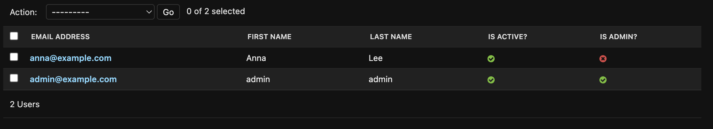
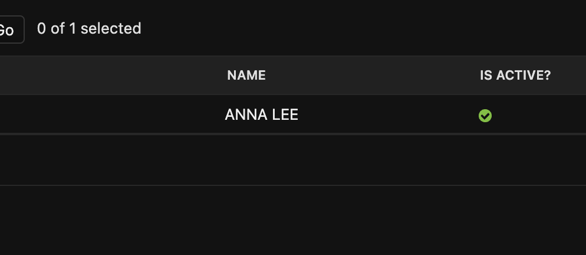
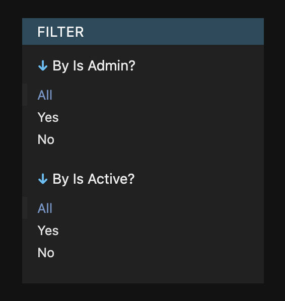
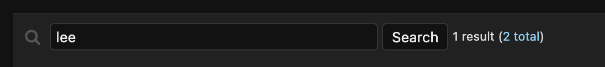

# `ModelAdmin` Options

`ModelAdmin` [allows us to create admin interface quickly and much flexibility](https://docs.djangoproject.com/en/4.2/ref/contrib/admin/#modeladmin-options).

<br />

## `list_display`

[`list_display`](https://docs.djangoproject.com/en/4.2/ref/contrib/admin/#django.contrib.admin.ModelAdmin.list_display) determines which fields of models to show on the admin
panel.

Let's say we have `User` model defined as below:

<CH.Code>

```py users/models.py
class User(models.Model):
    email = models.EmailField()
    first_name = models.CharField(max_length=255)
    last_name = models.CharField(max_length=255)
    is_active = models.BooleanField(default=True)
    is_admin = models.BooleanField(default=False)
```

---

```py users/admin.py
@admin.register(User)
class UserAdmin(admin.ModelAdmin):
    list_display = ['email', 'first_name', 'last_name', 'is_active', 'is_admin']
```

</CH.Code>

Then it will display as below.



Or you can also include customized fields by using custom methods based on the fields information.
Below example shows how to print the full name of user combining with his/her `first_name` and `last_name` and make them all uppercase.

```py users/admin.py focus=5:6
@admin.register(User)
class UserAdmin(admin.ModelAdmin):
    # ...

    def upper_case_name(self, obj):
        return f"{obj.first_name} {obj.last_name}".upper()
```



<br />

## `list_filter`

[`list_filter`](https://docs.djangoproject.com/en/4.2/ref/contrib/admin/#django.contrib.admin.ModelAdmin.list_filter) reorgnizes the information displayed on `list_display`
by certain condition that admin user chose.

For instance, we can rearrange the user data table based on `is_active` and `is_admin` as below.

```py users/admin.py
@admin.register(User)
class UserAdmin(admin.ModelAdmin):
    list_filter = ["is_active", "is_admin"]
```

<center>
  
</center>

## `search_fields`

[`search_fields`](https://docs.djangoproject.com/en/4.2/ref/contrib/admin/#django.contrib.admin.ModelAdmin.search_fields) allows us to search fields on `list_display` with certain keywords.

```py users/admin.py
@admin.register(User)
class UserAdmin(admin.ModelAdmin):
    search_fields = ["email"]
```

Above example shows that admin user can search users by their `email` field. Of course, we can include multiple fields if we want to.



By default, `search_fields` provides [`icontains`](https://docs.djangoproject.com/en/4.2/ref/models/querysets/#std-fieldlookup-icontains) feature that searches all results _containing_ certain keywords. However, we can also use [`startswith`](https://docs.djangoproject.com/en/4.2/ref/models/querysets/#std-fieldlookup-startswith) feature by using `^` for searching words that _starts only_ with that keyword.

For fields that are connected by `ForeignKey` or `ManyToManyField`, we can search results as below:

```py
search_fields = ["foreign_key__related_fieldname"]
```
