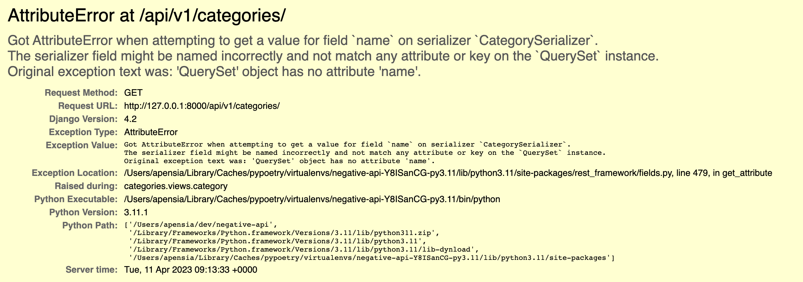
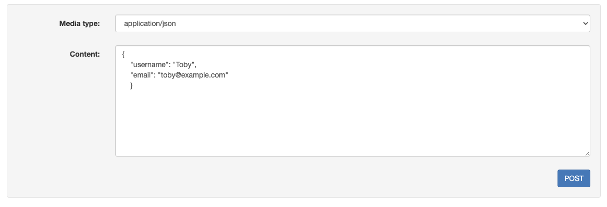
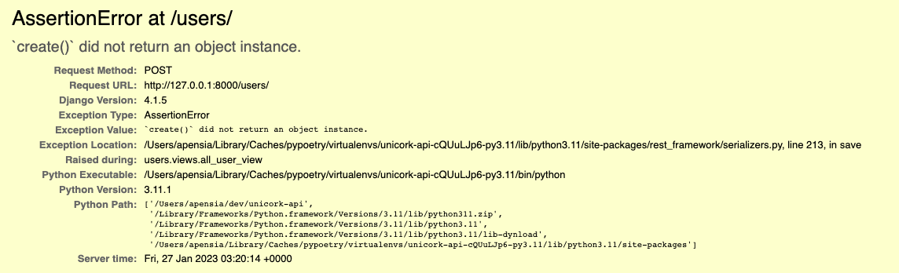

import { Callout } from "nextra-theme-docs";

# 메소드

## `.is_valid()`

Serializer가 view단에서 수행하는 작업에는 크게 두 가지가 있다.

1. 하나는 우리가 정의한 모델에 대한 정보들(QuerySet)을 JSON 형태로 번역하여 브라우저를 통해 유저들에게 전달하거나
2. 다른 하나는 반대로 유저에게서 받은 데이터를 바탕으로 모델에 대한 인스턴스를 생성할 수 있다.

특히 유저에게서 받은 데이터를 토대로 모델 인스턴스를 만들 경우에는 항상 그 데이터가 우리가 <ins>**정의한 Serializer의 제약 조건에 부합하는지**</ins>를 따져야한다.
왜냐하면 우리는 유저가 어떤 데이터를 받아낼지 알 수 없기 때문이다.
DRF에서는 이 경우, [유효한 데이터에 접근하기 전에 항상 `is_valid()` 메소드를 호출하는 것을 권장하고 있다](https://www.django-rest-framework.org/api-guide/serializers/#validation).

예를 들어, 다음의 코드를 살펴보도록 하자.

<CH.Section>

```py users/views.py
from rest_framework.decorators import api_view
from rest_framework.response import Response
from .models import User
from .serializers import UserSerializer

@api_view(["GET", "POST"])
    def all_user_view(request):
        if request.method == "GET":
            all_users = User.objects.all()
            serializer = UserSerializer(all_users, many=True)
            return Response(serializer.data)
        elif request.method == "POST":
            serializer = UserSerializer(data=request.data)
            return Response({"created": True})

```

`all_user_view()`는 모든 유저들을 보여주는 view이며 HTTP 메소드가 각각 `GET` 방식과 `POST` 방식일 때 어떻게 보일지 분기처리하여 보여주고 있다.
특히 `POST` view에서는 유저들이 전달해준 `data`를 바탕으로 [데이터를 직렬화해주고 있다](https://www.django-rest-framework.org/api-guide/serializers/#serializing-objects).
즉, 유저가 제공한 [`data=request.data`](focus://13[41:57])를 `UserSerializer`를 통해 직렬화하고 있다.

<br />

<Callout type="warning" emoji="⚠️">
  위에서 [`many=True`](focus://10[52:60])를 설정해주지 않을 경우 `Got
  AttributeError when attempting to get a value for field on serializer. The
  serializer field might be named incorrectly and not match any attribute or key
  on the QuerySet instance.` 에러를 발생하게 된다.



이는 우리가 만든 Serializer 클래스는 하나의 QuerySet만 담당을 하지만 뷰로 넘겨줄 땐 다수의 QuerySet을 넘겨줬기 때문이다.

</Callout>

</CH.Section>

<br />

그렇다면 이제 데이터가 유효한지 알아보도록 하자. 다음과 같이 `request.is_valid()`와 `request.errors`를 각각 `print` 해보도록 하자.

```py users/views.py focus=14,15
from rest_framework.decorators import api_view
from rest_framework.response import Response
from .models import User
from .serializers import UserSerializer

@api_view(["GET", "POST"])
    def all_user_view(request):
        if request.method == "GET":
            all_users = User.objects.all()
            serializer = UserSerializer(all_users, many=True)
            return Response(serializer.data)
        elif request.method == "POST":
            serializer = UserSerializer(data=request.data)
            print(request.is_valid())
            print(request.errors)
            return Response({"created": True})

```

이제 직접 JSON 데이터를 작성하여 POST 요청을 해보자. 일부러 필수 항목들을 몇 개 빼놓은 상태에서 POST 요청을 하게 되면



다음과 같이 콘솔에 `request.is_valid()`의 값이 `False`로 뜨는 것을 알 수 있으며, 아래에 유효하지 않는 이유들이 나온다.


<br />

## `.save()`

이제 유저가 제공해준 데이터가 모두 유효하여 데이터베이스에 저장하고자 한다면 어떻게 해야 할까?
DRF에서는 [`.save()`라는 메소드를 통해 저장하게끔 하고 있다](https://www.django-rest-framework.org/api-guide/serializers/#saving-instances).

`.save()` 메소드가 호출되게 되면 DRF는 자동적으로 `.create()` 메소드를 찾게 된다.

<CH.Code>

```py users/views.py focus=10
@api_view(["GET", "POST"])
    def all_user_view(request):
        if request.method == "GET":
            all_users = User.objects.all()
            serializer = UserSerializer(all_users, many=True)
            return Response(serializer.data)
        elif request.method == "POST":
            serializer = UserSerializer(data=request.data)
                if serializer.is_valid():
                    serializer.save()
                    return Response({"created": True})
                else:
                    return Response(serializer.errors)

```

---

```py users/serializers.py
def create(self, validated_data):
    print(validated_data)
    return User.objects.create(**validated_data)
```

</CH.Code>

위의 예시에서 `.create()` 메소드는 Serializer 클래스 내부에 위치해있기 때문에 `self`를 첫번째 인자로 받으며, 유저가 제공한 유효한 데이터는 `validated_data`에 담긴다.
하지만 유저가 제공한 데이터를 어떻게 저장할지에 대한 로직은 **_순전히 개발자의 몫에 달려있다_**.

<Callout type="warning" emoji="⚠️">
  만일 `.create()` 메소드에 어떤 것도 `return` 하지 않을 경우 `AssertionError:
  .create() did not return an object instance.` 에러를 발생시킨다.
  
</Callout>

<br />

## `.update()`

`.update()` 메소드는 글자 그대로 어떤 정보를 수정할 때 사용된다.

<CH.Scrollycoding>

### QuerySet 생성

먼저 `try - except` 문을 통해 `pk`에 해당하는 하나의 `user`를 가져온다.
만일 주어진 `pk`에 해당하는 유저가 없을 경우 `NotFound` 예외를 발생시킨다.

```py users/views.py focus=6:10
from rest_framework.exceptions import NotFound
from rest_framework.response import Response

@api_view(["GET", "POST"])
    def single_user(request, pk):
        try:
            user = User.objects.get(pk=pk)
        except User.DoesNotExist:
            raise NotFound

        if request.method == "PUT":
            serializer = UserSerializer(user, data=request.data, partial=True)

        if serializer.is_valid():
            updated_user = serializer.save()
            return Response(UserSerializer(updated_user).data)
        else:
            return Response(serializer.errors)
```

---

### `serializer` 연동

`request.method`가 `PUT`일 경우 (즉, 무언가를 업데이트 해야 할 경우) 사용자가 준 `data`를 가지고 직렬화한다.

이 때, 업데이트되는 내용은<ins>**반드시 모든 내용이 업데이트 되어야 하는 건 아니므로**</ins> [부분 업데이트](https://www.django-rest-framework.org/api-guide/serializers/#partial-updates)를 위해 `partial = True`를 넣어준다.

```py users/views.py focus=11:12
from rest_framework.exceptions import NotFound
from rest_framework.response import Response

@api_view(["GET", "POST"])
    def single_user(request, pk):
        try:
            user = User.objects.get(pk=pk)
        except User.DoesNotExist:
            raise NotFound

        if request.method == "PUT":
            serializer = UserSerializer(user, data=request.data, partial=True)

        if serializer.is_valid():
            updated_user = serializer.save()
            return Response(UserSerializer(updated_user).data)
        else:
            return Response(serializer.errors)
```

---

### 유효성 검사

사용자가 건네준 `data`가 유효한지 검사한 후, 만일 유효하다면 직렬화를 시켜주고 이 정보를 `Response`에 담아 `return` 해준다.

유효하지 않다면 `errors`를 뱉게끔 한다.

```py users/views.py focus=14:18
from rest_framework.exceptions import NotFound
from rest_framework.response import Response

@api_view(["GET", "POST"])
    def single_user(request, pk):
        try:
            user = User.objects.get(pk=pk)
        except User.DoesNotExist:
            raise NotFound

        if request.method == "PUT":
            serializer = UserSerializer(user, data=request.data, partial=True)

        if serializer.is_valid():
            updated_user = serializer.save()
            return Response(UserSerializer(updated_user).data)
        else:
            return Response(serializer.errors)
```

</CH.Scrollycoding>

### `.update()` 메소드 로직 수정

우리가 만들어준 `UserSerializer` 클래스로 넘어와서 [`.update()` 메소드의 로직](https://www.django-rest-framework.org/community/3.0-announcement/#the-create-and-update-methods)을 직접 변경해준다.

```py users/serializers.py
from rest_Framework import serializers

class UserSerializer(serializers.Serializer):

    # ...

    def update(self, instance, validated_data):
        instance.username = validated_data.get('username', instance.username)
        instance.email = validated_data.get('email', instance.email)
        instance.save()
        return instance
```

## `ModelSerializer` 사용 시

[공식 문서](https://www.django-rest-framework.org/api-guide/serializers/#modelserializer)에서도 볼 수 있듯이
`ModelSerializer` 안에는 기본적으로 `.create()`와 `.update()`의 메소드가 내장되어 있기 때문에 굳이 따로 우리가 만들어준 Serializer에 구현할 필요는 없다.
