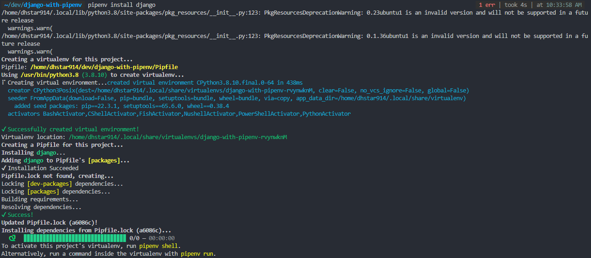
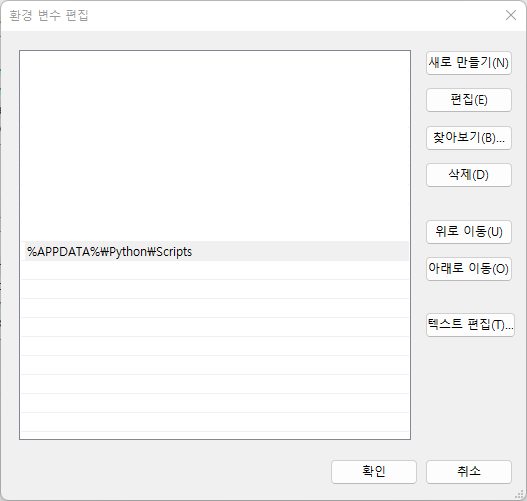
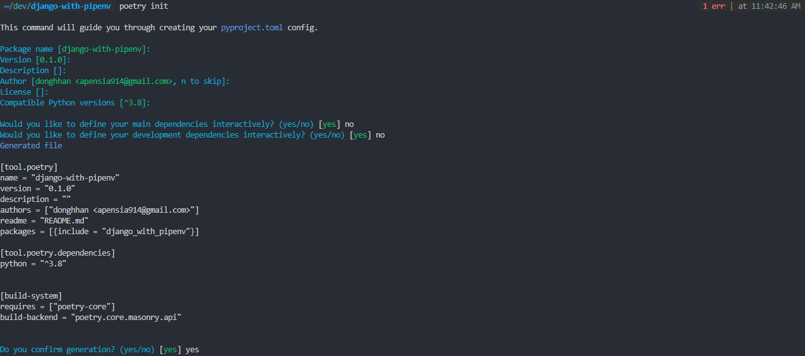
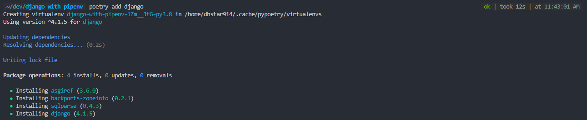

import { Callout, Tabs, Tab, Steps } from "nextra/components";

# Virtual Environment

The first thing we need to do before initializing project with python is to set up virutal environment.
**Virtual Environment** indicates <ins>_the independent environment that is isolated from currently installed Python environment_</ins>.
In other words, we are basically setting individual Python development environment per each projects independently.

Why would we need to do this? We need to install many packages while doing projects and if those packages have their own dependencies,
an error would occur if package versions are different.
Moreover, error can also occur when package versions collide with each other after upgrading or installing packages.
In order to effectively control over these cumbersome things, it is recommended to set up virtual environment.

## Pipenv

Pipenv is a combination of word of pip which is Python package managing tool and virtualenv which helps to create virtual environment.

<Steps>

### Installation

Let's install Pipenv first.

```bash
pip install pipenv
```

### Creating Virtual Environment

Next, choose which version of Python you would like to use. All commands of Pipenv are at [here](https://github.com/pypa/pipenv#usage-examples).
For me, I used the most recent version of `3.11` as of July 2023.

```bash
pipenv --python 3.11
```

### Installing Necessary Packages

Next, [install necessary packages](https://github.com/pypa/pipenv#install-packages) with using `pipenv` keyword. Before install packages, make sure you install packages under the project root folder.

```bash
mkdir letsh
cd letsh
pipenv install django
```



</Steps>

## Poetry

[Poetry](https://python-poetry.org/docs/) is another Python package manage tool.

<Callout type="error" emoji="🚨">
  I found out that Poetry takes too much slow speed when downloading certain packages[^1]. 
  Therefore, I ended up choosing to use Pipenv for this project.

[^1]: [Poetry is extremely slow when resolving the dependencies](https://github.com/python-poetry/poetry/issues/2094#issuecomment-596224736)

</Callout>

<Steps>

### Installtion

<Tabs items={["MacOS / Linux", "Windows"]}>
  <Tab>
    Install Poetry with curl.
    ```bash
    curl -sSL https://install.python-poetry.org | POETRY_HOME=/etc/poetry python3 -
    ```

  </Tab>
  <Tab>
    If you are using Powershell, 
    ```bash
    (Invoke-WebRequest -Uri https://install.python-poetry.org -UseBasicParsing).Content | py -
    ```

    Then, add environment variable in Advanced System Settings in Windows.
    <br/>
    <center></center>

  </Tab>
</Tabs>

### Creating `.lock` File

Next, navigate to project root folder and create `.lock` file with the following command.

```bash
mkdir letsh
cd letsh
poetry init
```



### Installing Necessary Packages

And we can install Django now.

```bash
poetry add django
```



</Steps>

<br />

## Frontend (React + TS)

I decided to use React with TypeScript, and used [Vite](https://vitejs.dev/guide/#overview) for making boilerplate.

[Create React App](https://create-react-app.dev/docs/getting-started), which I used to use quite often, installed too many unnecessary packages
that makes my project heavier and it didn't allow me to customize the packages that I want.

### Creating Project

We can create project by using the [following command](https://vitejs.dev/guide/#scaffolding-your-first-vite-project).
As I will be using React with TypeScript, I included `react-ts` command keyword.

```bash
pnpm create vite letsh --template react-ts
```

> What is PNPM?[^2]
> PNPM은 NPM

[^2]: [Let's settle things out [2]: NPM Vs. YARN VS. PNPM](https://dev.to/ayoub3bidi/lets-settle-things-out-2-npm-vs-yarn-vs-pnpm-5e04)
