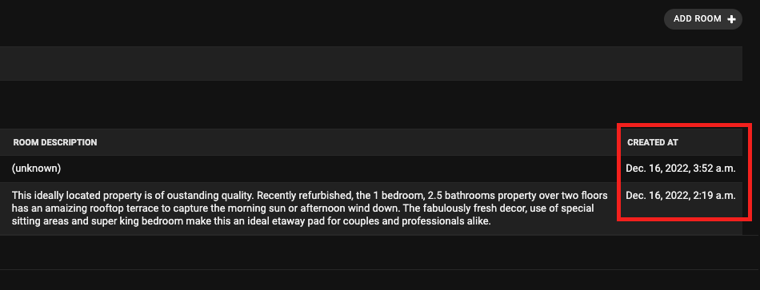
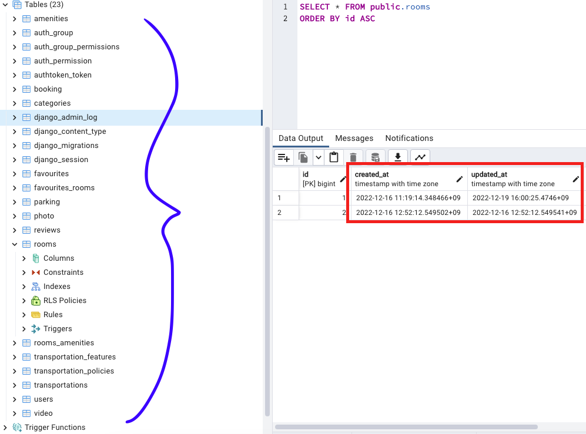

# Abstract Model

## Introduction

While I was creating letsh application, I thought that there must be some data that could be <ins>shared</ins> throughout data no matter what they are.
The best example for this could be time that data was newly created or updated.
If I include these data, then admin users later will be able to easily control over those data based on those time data.

However, including all these common data into all other apps' models is just repeating codes ourselves and it could waste our DB.
So it would be very effective to make these types of models that <ins>**_do not wasting too much DB space and can be used in other models_**</ins>.

> Django is also suggesting [DRY(Do NOT Repeat Yourself)](https://docs.djangoproject.com/en/4.1/misc/design-philosophies/#don-t-repeat-yourself-dry), so let's keep our code more sexier!

This is where [abstract model](https://docs.djangoproject.com/en/4.2/topics/db/models/#abstract-base-classes) is used.
After I defined the common data fields, with [class inheritance](https://docs.python.org/3/tutorial/classes.html#inheritance)
other apps' models can also use Common model's data fields.

<br />

## Initialization

To get start with creating an abstract model, I created `common/` app in my project root route.

```
django-admin startapp common
```

Then included my app in [`INSTALLED_APPS`](https://docs.djangoproject.com/en/4.2/ref/settings/#installed-apps) 내부에 설치해준다.

```python config/settings.py
INSTALLED_APPS = [
  # ...
  "common.apps.CommonConfig",
]
```

<br />

### `CommonDateModel`

`CommonDateModel` is an abstract model for representing date.
This model will be occasionally used where date data is needed.

1. Date that user left comment
2. Date that user created its own wishlist
3. Date that user created reservation (check-in & check-out)

<CH.Scrollycoding>

#### Creating Model Class

I created `CommonDateModel` model class.

```python focus=3:7
from django.db import models

class CommonDateModel(models.Model):

    """Common Date Model Definition"""

    pass
```

---

#### `Meta` Class Configuration

[`Meta` class](https://docs.djangoproject.com/en/4.1/topics/db/models/#meta-options) allows us to do extra configuration on the model.
As models in `common/` app are abstract models, I set `abstract = True` as shown in [documentaiton](https://docs.djangoproject.com/en/4.1/topics/db/models/#abstract-base-classes).

By doing this, it won't create tables in DB separately but still be able to use those abstract model fields in other models as well.

```python focus=9:10
from django.db import models

class CommonDateModel(models.Model):

    """Common Date Model Definition"""

    pass

    class Meta:
        abstract = True
```

---

#### `DateField`

Lastly I set fields.

[`DateField`](https://docs.djangoproject.com/en/4.2/ref/models/fields/#datefield) is a field that literally controls with date.
I set date created as `created_date`, and date updated as `updated_date`, respectively.

Here, [`auto_now_add`](https://docs.djangoproject.com/en/4.2/ref/models/fields/#django.db.models.DateField.auto_now_add) attribute is used when an object is automatically <ins>created</ins> as current date.

On the other hand, [`auto_now`](https://docs.djangoproject.com/en/4.2/ref/models/fields/#django.db.models.DateField.auto_now) attribute is used
when object is <ins>updated</ins> and set update date as current date automatically.

```python focus=7:8
from django.db import models

class CommonDateModel(models.Model):

    """Common Date Model Definition"""

    created_date = models.DateField(auto_now_add=True, verbose_name=_("Created Date"))
    updated_date = models.DateField(auto_now=True, verbose_name=_("Updated Date"))

    class Meta:
        abstract = True
```

---

</CH.Scrollycoding>

<br />

### `CommonDateTimeModel`

I followed exact same logic as I did above for `CommonDateModel`.
The only difference is that since this model will control over both date and time, I used [`DateTimeField`](https://docs.djangoproject.com/en/4.2/ref/models/fields/#datetimefield).
This abstract model will be used in which models that require more precise date and time.

1. Date and time when user created reservation
2. Date and time when user created payment
3. Date and time when user created abuse report

```py common/models.py
class CommonDateTimeModel(models.Model):

    """Common Date Time Model Definition"""

    created_at = models.DateTimeField(
        auto_now_add=True, verbose_name=_("Created Date & Time")
    )
    updated_at = models.DateTimeField(
        auto_now=True, verbose_name=_("Updated Date & Time")
    )

    class Meta:
        abstract = True
```

## Result

If we add field defined in abstract base model in other apps' `admin.py`,
we can see it is nicely put into admin panel as below.

<br />

<center></center>

<br />

But then if we take a look at `common/` app's database, we can find out that there has been no migration happened for `TimeStampModel` (See blue bracket).
By doing this, we can effectively manage database.

<br />

<center></center>
