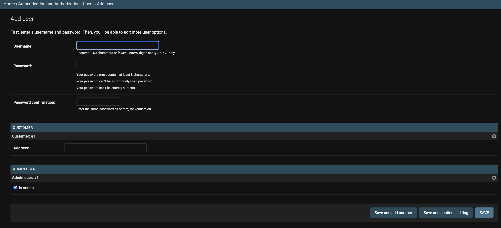
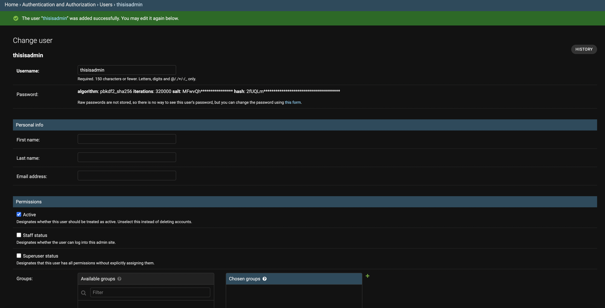
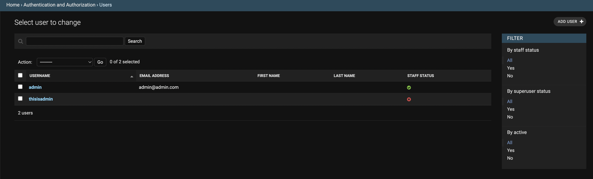

# `AbstractBaseUser` 커스텀 유저 모델

Django에서 설명하고 있는 [기본 방법](https://docs.djangoproject.com/en/4.0/intro/tutorial02/#creating-models)으로도 유저 모델을 충분히 구현해낼 수 있지만
매번 새로운 필드를 만드는 귀찮은 작업을 피하고, 유저라고 하면 통상적으로 있어야 할 법한 정보들을 한꺼번에 불러와서 손쉽게 사용할 수 있으면 더욱 좋겠다.
그런 의미에서 Django에서 제공하는 좀 더 섹시한 방법으로 커스텀 User 모델을 만들어보자.

Django에서는 크게 2가지 방법으로 제시를 하고 있는데 이는 다음과 같다.[^1]

1. 기존 유저 모델에서 [확장](https://docs.djangoproject.com/en/4.0/topics/auth/customizing/#extending-user)을 하는 방법
2. 기존 유저 모델을 [대체](https://docs.djangoproject.com/en/4.0/topics/auth/customizing/#auth-custom-user)하는 방법

<br />

## 확장

`django.contrib.auth.models`의 `User`라는 기본적으로 제공되는 클래스에서
본인이 추가하거나 변경하고 싶은 세부 클래스들을 정의한 후, `User` 클래스를 세부 클래스들로 확장을 시키는 방법이다.

<br />

<CH.Scrollycoding style={{ height: 600 }}>

### `User` 클래스 상속하기

먼저 `User` 클래스를 import 해주자.

`User` 클래스의 코드를 기본적으로 살펴보면 (추후에 살펴볼) `AbstractUser`를 상속받고 있는 것을 알 수 있다.[^2]

따라서, 기본적으로 `username`과 `password`와 같이 필수 필드들과 나머지 부가적인 필드들을 제공한다.

```py users/models.py focus=2
from django.db import models
from django.contrib.auth.models import User


class Customer(models.Model):
    pass


class Admin(models.Model):
    pass
```

---

### 세부 클래스 생성하기

`User`라는 기본 클래스에 본인이 덧붙이고 싶은 세부 클래스들을 정의해보자.
예컨대, 이커머스 플랫폼의 경우 플랫폼을 사용하는 소비자와 플랫폼을 관리하는 어드민 유저가 있으니
이번 예제에선 그것들을 한 번 구현해보도록 하자.

```py users/models.py focus=5:6,9:10
from django.db import models
from django.contrib.auth.models import User


class Customer(models.Model):
    pass


class Admin(models.Model):
    pass
```

---

#### `Customer` 클래스 생성

`User`라는 클래스 내부의 정보까지 변경을 원한다면 [`OneToOneField`](https://docs.djangoproject.com/en/4.0/ref/models/fields/#django.db.models.OneToOneField)로 연결지어서
`User` 클래스와 `Customer` 클래스를 연결시켜준다.

그리고 그 밖에 `Customer` 클래스에 붙일 또다른 필드를 정의해주면 된다.
필자의 경우 `address`라는 필드를 새로 생성해주었다.

```py users/models.py focus=5:7
from django.db import models
from django.contrib.auth.models import User


class Customer(models.Model):
    user = models.OneToOneField(User, on_delete=models.CASCADE)
    address = models.CharField(max_length=150)


class Admin(models.Model):
    pass
```

---

#### `Admin` 클래스 생성

어드민 유저를 위한 `Admin` 클래스를 생성해주었다.
이번에도 마찬가지로 `User` 클래스를 `admin_user`라는 프로퍼티와 함께 `OneToOneField`로 묶어주었다.

그리고 어드민 유저임을 표시하기 위해 `is_admin`이라는 [`BooleanField`](https://docs.djangoproject.com/en/4.0/ref/models/fields/#booleanfield)를 생성해주었다.

```py users/models.py focus=10:12
from django.db import models
from django.contrib.auth.models import User


class Customer(models.Model):
    user = models.OneToOneField(User, on_delete=models.CASCADE)
    address = models.CharField(max_length=150)


class Admin(models.Model):
    admin_user = models.OneToOneField(User, on_delete=models.CASCADE)
    is_admin = models.BooleanField(default=True)
```

---

### `admin.py`에 등록하기

이제 우리가 만든 모델들을 `admin.py`에 연결시켜주자.
이를 위해 [`InlineModelAdmin`](https://docs.djangoproject.com/en/4.0/ref/contrib/admin/#django.contrib.admin.InlineModelAdmin) 방식을 사용해보도록 하겠다.

`User` 클래스에 내장되어 있는 [`UserAdmin`](https://github.com/django/django/blob/6654289f5b350dfca3dc4f6abab777459b906756/django/contrib/auth/admin.py#L44)를
`BaseUserAdmin`으로 alias를 줘서 import를 한 후, `UserAdmin` 클래스를 생성하고 연결시켜준다.

```py users/admin.py focus=2:4,15:20
from django.contrib import admin
from django.contrib.auth.admin import UserAdmin as BaseUserAdmin
from django.contrib.auth.models import User
from .models import Customer, Admin


class CustomerInline(admin.StackedInline):
    pass


class AdminInline(admin.StackedInline):
    pass


class UserAdmin(BaseUserAdmin):
    inlines = []


admin.site.unregister(User)
admin.site.register(User, UserAdmin)

```

---

#### `CustomerInline` Admin 모델 만들기

앞서 만든 `Customer` 모델과 연결시키기 위한 `CustomerInline` Admin 모델을 생성해준다.

1.  [`model` 프로퍼티에 앞서 만든 `Customer` 모델 클래스를 연결해준다.](https://docs.djangoproject.com/en/4.0/ref/contrib/admin/#django.contrib.admin.InlineModelAdmin.model)
2.  [`can_delete`](https://docs.djangoproject.com/en/4.0/ref/contrib/admin/#django.contrib.admin.InlineModelAdmin.can_delete)
    에 `False` 값을 줌으로서 생성된 유저는 삭제될 수 없도록 만들었다. > `can_delete`
    프로퍼티는 만들고자 하는 서비스의 정책에 따라 `True` 혹은 `False`가 될 수 있을
    것이다. 필자의 경우 공식 문서에 나온 내용 토대로 했지만 어드민이 (어떤 이유에서든)
    유저를 삭제해야 할 필요가 있다면 기본값인 `True`로 놔둬도 괜찮을 것 같다.
3.  [`verbose_name_plural`](https://docs.djangoproject.com/en/4.0/ref/contrib/admin/#django.contrib.admin.InlineModelAdmin.verbose_name_plural)
    를 설정해줌으로서 `Customer`들이 여러 개가 있을 때 Django admin 페이지에서 어떻게
    보일지 설정해준다.

```py users/admin.py focus=7:10
from django.contrib import admin
from django.contrib.auth.admin import UserAdmin as BaseUserAdmin
from django.contrib.auth.models import User
from .models import Customer, Admin


class CustomerInline(admin.StackedInline):
    model = Customer
    can_delete: bool = False
    verbose_name_plural: str = "Customers"


class AdminInline(admin.StackedInline):
    pass


class UserAdmin(BaseUserAdmin):
    inlines = []


admin.site.unregister(User)
admin.site.register(User, UserAdmin)
```

---

#### `AdminInline` Admin 모델 만들기

`Admin` 모델 클래스에 대한 Admin 모델도 위에서 살펴본 바와 같이 만들어준다.

```py users/admin.py focus=13:16
from django.contrib import admin
from django.contrib.auth.admin import UserAdmin as BaseUserAdmin
from django.contrib.auth.models import User
from .models import Customer, Admin


class CustomerInline(admin.StackedInline):
    model = Customer
    can_delete: bool = False
    verbose_name_plural: str = "Customers"


class AdminInline(admin.StackedInline):
    model = Admin
    can_delete: bool = False
    verbose_name_plural: str = "Admin Users"


class UserAdmin(BaseUserAdmin):
    inlines = []


admin.site.unregister(User)
admin.site.register(User, UserAdmin)
```

---

#### `UserAdmin` Admin 모델 클래스와 붙여주기

앞서 불러온 `BaseUserAdmin`을 `UserAdmin`이라는 Admin 클래스에 상속으르 시킨 후,
위에서 만든 `CustomerInline`과 `AdminInline`을 연결시켜준다.

```py users/admin.py focus=19:20
from django.contrib import admin
from django.contrib.auth.admin import UserAdmin as BaseUserAdmin
from django.contrib.auth.models import User
from .models import Customer, Admin


class CustomerInline(admin.StackedInline):
    model = Customer
    can_delete: bool = False
    verbose_name_plural: str = "Customers"


class AdminInline(admin.StackedInline):
    model = Admin
    can_delete: bool = False
    verbose_name_plural: str = "Admin Users"


class UserAdmin(BaseUserAdmin):
    inlines = (CustomerInline, AdminInline)


admin.site.unregister(User)
admin.site.register(User, UserAdmin)
```

</CH.Scrollycoding>

<br />

### 결과

서버를 실행시키면 다음과 같은 화면을 볼 수 있다.
즉, 앞서 우리가 만든 `Customer`라는 세부 클래스에 정의된 `address` 필드 정보를 집어넣을 수 있고,
`Admin`이라는 세부 클래스에 정의된 `is_admin` 필드 정보를 집어넣을 수 있다.

<br />

<center>
  
</center>

<br />

이후, 기본 정보들을 넣으면 추가로 부가적인 정보들을 넣을 수 있는 페이지로 넘어간다.

<br />

<center>
  
</center>

<br />

Django admin 페이지에서 최종적으로 다음과 같이 보이게 된다.

<br />

<center>
  
</center>

<br />

## 대체 (`AbstractBaseUser`)

이번에는 대체 방식으로 진행해보겠다.
이 포스트에선 [`AbstractBaseUser`](https://docs.djangoproject.com/en/4.0/topics/auth/customizing/#django.contrib.auth.models.AbstractBaseUser)의 방법을 사용해보겠다.

`AbstractBaseUser`에 대한 [공식 문서의 내용](https://docs.djangoproject.com/en/4.0/topics/auth/customizing/#specifying-a-custom-user-model)에 따르면
의 경우 인증[^3]에 대한 기능만 있을 뿐 나머지 필요한 필드들은 본인이 전부 직접 구현을 해야하는 점에서 [`AbstractUser`](https://docs.djangoproject.com/en/4.1/topics/auth/customizing/#django.contrib.auth.models.AbstractUser)와 다르다
(`AbstractUser`의 경우 기본적으로 `username`, `email` 등 몇 가지 필드들은 이미 세팅이 되어 있다).

<br />

### `BaseManager` 작성

[Manager](https://docs.djangoproject.com/en/4.1/topics/db/managers/#managers)는 Django 모델에 DB 쿼리 작업을 제공해주는 인터페이스를 의미한다. Django는 이 Manager를
통해서 데이터베이스와 통신을 하며, 모든 Django의 모델은 최소 하나의 Manager를 가지고 있다.

`AbstractUser`를 상속하게 될 경우 앞서 얘기했듯이 `username`, `email`, `last_login` 등 유저에 대한 기본 정보 필드들을 자동적으로 제공해준다.
하지만 필자는 원하는 필드들을 직접 추가해서 쓰는 방식인 `AbstractBaseUser`를 사용하기 때문에 [`BaseUserManager`를 상속하는 방식](https://docs.djangoproject.com/en/4.1/topics/auth/customizing/#writing-a-manager-for-a-custom-user-model)으로 최대한 커스터마이징을 해볼 생각이다.

<br />

<CH.Scrollycoding style={{ height: 500 }}>

#### `MyUserManager` 만들기

위에서 언급한 것처럼 [`BaseUserManager`](https://docs.djangoproject.com/en/4.1/topics/auth/customizing/#django.contrib.auth.models.BaseUserManager)를 상속시킨다.

`BaseUserManager`를 사용하게 되면 반드시 다음 두 개의 메소드를 추가적으로 정의해주어야 한다.

1. [`create_user()`](https://docs.djangoproject.com/en/4.1/topics/auth/customizing/#django.contrib.auth.models.CustomUserManager.create_user): 일반 유저를 어떤 식으로 생성해줄지 결정짓는 메소드이다.
2. [`create_superuser()`](https://docs.djangoproject.com/en/4.1/topics/auth/customizing/#django.contrib.auth.models.CustomUserManager.create_superuser): Django superuser를 어떻게 만들지 결정짓는 메소드이다.

```py users/models.py focus=2:6
class MyUserManager(BaseUserManager):
    def create_user(self):
        pass

    def create_superuser(self):
        pass
```

---

#### `create_user()` 유효성 검사

유저가 생성되기 위해선 필자는 `email`, 이름(`first_name`), 성(`last_name`), 닉네임(`nickname`) 그리고 비밀번호(`password`)를 넣게끔 설정해주었다.
따라서, 파라미터로 해당 필드들을 추가해주었다.

만일 파라미터로 전달해준 필드값이 없다면 특정 에러 메세지와 함께 [`ValueError`](https://docs.python.org/3/library/exceptions.html#ValueError)를 `raise`한다.

```py users/models.py focus=2:13
class MyUserManager(BaseUserManager):
    # mark[21:75]
    def create_user(self, email, first_name, last_name, nickname, password):
        if not email:
            raise ValueError(_("You must provide a valid email address."))
        if not password:
            raise ValueError(_("You must provide a valid password."))
        if not first_name:
            raise ValueError(_("You must provide your first name."))
        if not last_name:
            raise ValueError(_("You must provide your last name."))
        if not nickname:
            raise ValueError(_("You must provide your nickname for using service."))

    def create_superuser(self):
        pass
```

---

#### `user` 만들기

모든 유효성 검사가 통과가 되고 난 후에는 파라미터로 전달해준 값들로 `user` 객체를 생성한다.

여기서 `email`의 경우 [`normalize_email()`](https://docs.djangoproject.com/en/4.1/topics/auth/customizing/#django.contrib.auth.models.BaseUserManager.normalize_email) 메소드를 통해 도메인 주소 부분을 소문자화시킨 후 저장한다.

```py users/models.py focus=14:20
class MyUserManager(BaseUserManager):
    # mark[21:75]
    def create_user(self, email, first_name, last_name, nickname, password):
        if not email:
            raise ValueError(_("You must provide a valid email address."))
        if not password:
            raise ValueError(_("You must provide a valid password."))
        if not first_name:
            raise ValueError(_("You must provide your first name."))
        if not last_name:
            raise ValueError(_("You must provide your last name."))
        if not nickname:
            raise ValueError(_("You must provide your nickname for using service."))

        user = self.model(
            email=self.normalize_email(email),
            first_name=first_name,
            last_name=last_name,
            nickname=nickname,
        )

    def create_superuser(self):
        pass
```

---

#### `password` 생성 후 데이터베이스에 저장하기

[`set_password()`](https://docs.djangoproject.com/en/4.1/topics/auth/customizing/#django.contrib.auth.models.AbstractBaseUser.set_password) 메소드를 통해 파라미터로 전달받은 `password` 값을 비밀번호로써 저장한다.

이후 [`save()`](https://docs.djangoproject.com/en/4.1/ref/models/instances/#django.db.models.Model.save) 메소드를 통해 데이터베이스에 저장한 후
`user` 객체를 `return`한다.

```py users/models.py focus=20:23
class MyUserManager(BaseUserManager):
    # mark[21:75]
    def create_user(self, email, first_name, last_name, nickname, password):
        if not email:
            raise ValueError(_("You must provide a valid email address."))
        if not password:
            raise ValueError(_("You must provide a valid password."))
        if not first_name:
            raise ValueError(_("You must provide your first name."))
        if not last_name:
            raise ValueError(_("You must provide your last name."))
        if not nickname:
            raise ValueError(_("You must provide your nickname for using service."))

        user = self.model(
            email=self.normalize_email(email),
            first_name=first_name,
            last_name=last_name,
            nickname=nickname,
        )
        user.set_password(password)
        user.save(using=self._db)
        return user

    def create_superuser(self):
        pass
```

---

#### `create_superuser()` 메소드 정의

`create_superuser()`는 위에서 정의한 `create_user()` 메소드를 그대로 사용한다.
다만, 여기서 다른 점은 Django가 기본적으로 제공해주는 어드민에 접속할 수 있도록 `is_admin`을 `True`로 지정해주기만 하면 된다.

```py users/models.py focus=25:34
class MyUserManager(BaseUserManager):
    # mark[21:75]
    def create_user(self, email, first_name, last_name, nickname, password):
        if not email:
            raise ValueError(_("You must provide a valid email address."))
        if not password:
            raise ValueError(_("You must provide a valid password."))
        if not first_name:
            raise ValueError(_("You must provide your first name."))
        if not last_name:
            raise ValueError(_("You must provide your last name."))
        if not nickname:
            raise ValueError(_("You must provide your nickname for using service."))

        user = self.model(
            email=self.normalize_email(email),
            first_name=first_name,
            last_name=last_name,
            nickname=nickname,
        )
        user.set_password(password)
        user.save(using=self._db)
        return user

    def create_superuser(self):
        user = self.create_user(
            email,
            first_name=first_name,
            last_name=last_name,
            nickname=nickname,
            password=password,
        )
        user.is_admin = True
        user.save(using=self._db)
        return user
```

</CH.Scrollycoding>

<br />

### `User` 모델 작성

이제 본격적으로 `User` 모델을 만들어보자.

<CH.Scrollycoding style={{ height: 900 }}>

#### `AbstractBaseUser` 및 `TimeStampModel` 클래스 상속

`User`라는 모델 클래스를 생성해준 뒤, `AbstractBaseUser`와 저번 포스트에 만들었던
추상화 베이스 모델인 `TimeStampModel`을 상속시켜 준다.

`TimeStampModel`의 경우 데이터가 생성되거나 업데이트 된 시간을 다루는 모델이나 데이터베이스에는 직접적으로 저장이 되지는 않는 모델이다.

```py users/models.py
from django.db import models
from django.contrib.auth.models import (
    AbstractBaseUser,
    BaseUserManager,
    PermissionsMixin,
)
from django.core.exceptions import ValidationError
from django.utils.translation import gettext_lazy as _
from common.models import *


class User(AbstractBaseUser, TimeStampModel):

     """Custom User Definition Model"""

     pass
```

---

#### 모델 필드 설정하기

다음으로 각각의 필드들을 설정해주었다.

1. letsh는 이메일 주소가 곧 로그인 시 ID이므로 [`unique`](https://docs.djangoproject.com/en/4.1/ref/models/fields/#unique)를 `True`로 설정해주었다.
2. 아울러, `sex`, `language` 그리고 `currency` 필드는 [`choices`](https://docs.djangoproject.com/en/4.1/ref/models/fields/#choices)를 이용해 특정 값만 선택할 수 있게끔 하였다.

```py users/models.py focus=14:90
from django.db import models
from django.contrib.auth.models import (
    AbstractBaseUser,
    BaseUserManager,
    PermissionsMixin,
)
from django.core.exceptions import ValidationError
from django.utils.translation import gettext_lazy as _
from common.models import *


class User(AbstractBaseUser, TimeStampModel):

     """Custom User Definition Model"""

    class SexChioces(models.TextChoices):
        MALE = "male", _("Male")
        FEMALE = "female", _("Female")
        NOT_PREFER = "na", _("Prefer not to answer")

    class LanguageChoices(models.TextChoices):
        ENGLISH = "english", _("English")
        THAI = "thai", _("Thai")

    class CurrencyChoices(models.TextChoices):
        USD = "usd", _("US Dollar")
        THB = "thb", _("Thai Baht")

    email = models.EmailField(
        unique=True,
        max_length=100,
        help_text=_("Email address must be unique and valid."),
        error_messages={
            "null": _("You should provide an email address."),
            "blank": _("Email address cannot be empty."),
        },
    )
    first_name = models.CharField(
        max_length=100,
        verbose_name=_("First Name"),
        blank=True,
        error_messages={
            "null": _("You should provide your first name."),
        },
    )
    last_name = models.CharField(
        max_length=100,
        verbose_name=_("Last Name"),
        blank=True,
        error_messages={
            "null": _("You should provide your last name."),
        },
    )
    nickname = models.CharField(
        max_length=20,
        verbose_name=_("Nickname"),
        help_text=_(
            "Can only include lower/uppercases numbers, . and _. This nickname will be shown on the profile of the host. If not specified, first name field would appear."
        ),
    )
    phone_number = models.CharField(
        max_length=50,
        verbose_name=_("Phone Number"),
        null=True,
        blank=True,
    )
    profile_photo = models.ImageField(
        null=True, blank=True, verbose_name=_("Profile Photo")
    )
    sex = models.CharField(
        max_length=50,
        verbose_name=(_("Sex")),
        choices=SexChioces.choices,
        default=SexChioces.MALE,
    )
    language = models.CharField(
        max_length=10,
        verbose_name=(_("Language")),
        choices=LanguageChoices.choices,
        default=LanguageChoices.ENGLISH,
    )
    currency = models.CharField(
        max_length=10,
        verbose_name=(_("Currency")),
        choices=CurrencyChoices.choices,
        default=CurrencyChoices.USD,
    )
    is_host = models.BooleanField(default=False, verbose_name=_("Host"))
    is_active = models.BooleanField(default=True, verbose_name=_("Active User"))
    is_admin = models.BooleanField(default=False, verbose_name=_("Admin User"))
```

---

#### Manager 연결 및 추가 필드 설정

1. 위에서 만든 `MyUserManager`를 `User` 모델에 연결시킨다.
2. [`USERNAME_FIELD`](https://docs.djangoproject.com/en/4.1/topics/auth/customizing/#django.contrib.auth.models.CustomUser.USERNAME_FIELD)
   에 `email`을 넣어 이메일 주소를 로그인 ID로 사용되게끔 하였다.
3. [`REQUIRED_FIELDS`](https://docs.djangoproject.com/en/4.1/topics/auth/customizing/#django.contrib.auth.models.CustomUser.REQUIRED_FIELDS)
   에 앞서 `MyUserManager`에서 설정한 필수 필드들인 `first_name`, `last_name` 그리고
   `nickname`을 넣었다.

```py users/models.py focus=92:95
from django.db import models
from django.contrib.auth.models import (
    AbstractBaseUser,
    BaseUserManager,
    PermissionsMixin,
)
from django.core.exceptions import ValidationError
from django.utils.translation import gettext_lazy as _
from common.models import *


class User(AbstractBaseUser, TimeStampModel):

     """Custom User Definition Model"""

    class SexChioces(models.TextChoices):
        MALE = "male", _("Male")
        FEMALE = "female", _("Female")
        NOT_PREFER = "na", _("Prefer not to answer")

    class LanguageChoices(models.TextChoices):
        ENGLISH = "english", _("English")
        THAI = "thai", _("Thai")

    class CurrencyChoices(models.TextChoices):
        USD = "usd", _("US Dollar")
        THB = "thb", _("Thai Baht")

    email = models.EmailField(
        unique=True,
        max_length=100,
        help_text=_("Email address must be unique and valid."),
        error_messages={
            "null": _("You should provide an email address."),
            "blank": _("Email address cannot be empty."),
        },
    )
    first_name = models.CharField(
        max_length=100,
        verbose_name=_("First Name"),
        blank=True,
        error_messages={
            "null": _("You should provide your first name."),
        },
    )
    last_name = models.CharField(
        max_length=100,
        verbose_name=_("Last Name"),
        blank=True,
        error_messages={
            "null": _("You should provide your last name."),
        },
    )
    nickname = models.CharField(
        max_length=20,
        verbose_name=_("Nickname"),
        help_text=_(
            "Can only include lower/uppercases numbers, . and _. This nickname will be shown on the profile of the host. If not specified, first name field would appear."
        ),
    )
    phone_number = models.CharField(
        max_length=50,
        verbose_name=_("Phone Number"),
        null=True,
        blank=True,
    )
    profile_photo = models.ImageField(
        null=True, blank=True, verbose_name=_("Profile Photo")
    )
    sex = models.CharField(
        max_length=50,
        verbose_name=(_("Sex")),
        choices=SexChioces.choices,
        default=SexChioces.MALE,
    )
    language = models.CharField(
        max_length=10,
        verbose_name=(_("Language")),
        choices=LanguageChoices.choices,
        default=LanguageChoices.ENGLISH,
    )
    currency = models.CharField(
        max_length=10,
        verbose_name=(_("Currency")),
        choices=CurrencyChoices.choices,
        default=CurrencyChoices.USD,
    )
    is_host = models.BooleanField(default=False, verbose_name=_("Host"))
    is_active = models.BooleanField(default=True, verbose_name=_("Active User"))
    is_admin = models.BooleanField(default=False, verbose_name=_("Admin User"))

    objects = MyUserManager()

    USERNAME_FIELD = "email"
    REQUIRED_FIELDS = ["first_name", "last_name", "nickname"]
```

---

#### 기타 메소드 정의

1. [`__str__`](https://docs.djangoproject.com/en/4.1/ref/models/instances/#django.db.models.Model.__str__): 새롭게 만든 객체를 쉽게 알아볼 수 있도록 클래스 내부에 설정해준 필드값들을 이용하여 표시한다.
2. [`has_perm()`과 `has_module_perms()`](https://docs.djangoproject.com/en/4.1/topics/auth/customizing/#custom-users-and-django-contrib-admin): 해당 유저에게 permission이 따로 있는지 설정해주는 역할이다. `has_module_perms()`의 경우 어드민 유저를 제외하곤 일반 유저에게는 접근을 할 수 없게끔 만들었다.

```py users/models.py focus=97:111
from django.db import models
from django.contrib.auth.models import (
    AbstractBaseUser,
    BaseUserManager,
    PermissionsMixin,
)
from django.core.exceptions import ValidationError
from django.utils.translation import gettext_lazy as _
from common.models import *


class User(AbstractBaseUser, TimeStampModel):

     """Custom User Definition Model"""

    class SexChioces(models.TextChoices):
        MALE = "male", _("Male")
        FEMALE = "female", _("Female")
        NOT_PREFER = "na", _("Prefer not to answer")

    class LanguageChoices(models.TextChoices):
        ENGLISH = "english", _("English")
        THAI = "thai", _("Thai")

    class CurrencyChoices(models.TextChoices):
        USD = "usd", _("US Dollar")
        THB = "thb", _("Thai Baht")

    email = models.EmailField(
        unique=True,
        max_length=100,
        help_text=_("Email address must be unique and valid."),
        error_messages={
            "null": _("You should provide an email address."),
            "blank": _("Email address cannot be empty."),
        },
    )
    first_name = models.CharField(
        max_length=100,
        verbose_name=_("First Name"),
        blank=True,
        error_messages={
            "null": _("You should provide your first name."),
        },
    )
    last_name = models.CharField(
        max_length=100,
        verbose_name=_("Last Name"),
        blank=True,
        error_messages={
            "null": _("You should provide your last name."),
        },
    )
    nickname = models.CharField(
        max_length=20,
        verbose_name=_("Nickname"),
        help_text=_(
            "Can only include lower/uppercases numbers, . and _. This nickname will be shown on the profile of the host. If not specified, first name field would appear."
        ),
    )
    phone_number = models.CharField(
        max_length=50,
        verbose_name=_("Phone Number"),
        null=True,
        blank=True,
    )
    profile_photo = models.ImageField(
        null=True, blank=True, verbose_name=_("Profile Photo")
    )
    sex = models.CharField(
        max_length=50,
        verbose_name=(_("Sex")),
        choices=SexChioces.choices,
        default=SexChioces.MALE,
    )
    language = models.CharField(
        max_length=10,
        verbose_name=(_("Language")),
        choices=LanguageChoices.choices,
        default=LanguageChoices.ENGLISH,
    )
    currency = models.CharField(
        max_length=10,
        verbose_name=(_("Currency")),
        choices=CurrencyChoices.choices,
        default=CurrencyChoices.USD,
    )
    is_host = models.BooleanField(default=False, verbose_name=_("Host"))
    is_active = models.BooleanField(default=True, verbose_name=_("Active User"))
    is_admin = models.BooleanField(default=False, verbose_name=_("Admin User"))

    objects = MyUserManager()

    USERNAME_FIELD = "email"
    REQUIRED_FIELDS = ["first_name", "last_name", "nickname"]

    def __str__(self):
        return f"{self.first_name} ({self.email})"

    def has_perm(self, perm, obj=None):
        return True

    def has_module_perms(self, app_label):
        if self.is_admin:
            return True
        else:
            return False

    @property
    def is_staff(self):
        return self.is_admin
```

---

#### `Meta` 클래스 정의

`User` 클래스에 몇 가지 메타 데이터를 마지막으로 설정해주었다.

```py users/models.py focus=113:116
from django.db import models
from django.contrib.auth.models import (
    AbstractBaseUser,
    BaseUserManager,
    PermissionsMixin,
)
from django.core.exceptions import ValidationError
from django.utils.translation import gettext_lazy as _
from common.models import *


class User(AbstractBaseUser, TimeStampModel):

     """Custom User Definition Model"""

    class SexChioces(models.TextChoices):
        MALE = "male", _("Male")
        FEMALE = "female", _("Female")
        NOT_PREFER = "na", _("Prefer not to answer")

    class LanguageChoices(models.TextChoices):
        ENGLISH = "english", _("English")
        THAI = "thai", _("Thai")

    class CurrencyChoices(models.TextChoices):
        USD = "usd", _("US Dollar")
        THB = "thb", _("Thai Baht")

    email = models.EmailField(
        unique=True,
        max_length=100,
        help_text=_("Email address must be unique and valid."),
        error_messages={
            "null": _("You should provide an email address."),
            "blank": _("Email address cannot be empty."),
        },
    )
    first_name = models.CharField(
        max_length=100,
        verbose_name=_("First Name"),
        blank=True,
        error_messages={
            "null": _("You should provide your first name."),
        },
    )
    last_name = models.CharField(
        max_length=100,
        verbose_name=_("Last Name"),
        blank=True,
        error_messages={
            "null": _("You should provide your last name."),
        },
    )
    nickname = models.CharField(
        max_length=20,
        verbose_name=_("Nickname"),
        help_text=_(
            "Can only include lower/uppercases numbers, . and _. This nickname will be shown on the profile of the host. If not specified, first name field would appear."
        ),
    )
    phone_number = models.CharField(
        max_length=50,
        verbose_name=_("Phone Number"),
        null=True,
        blank=True,
    )
    profile_photo = models.ImageField(
        null=True, blank=True, verbose_name=_("Profile Photo")
    )
    sex = models.CharField(
        max_length=50,
        verbose_name=(_("Sex")),
        choices=SexChioces.choices,
        default=SexChioces.MALE,
    )
    language = models.CharField(
        max_length=10,
        verbose_name=(_("Language")),
        choices=LanguageChoices.choices,
        default=LanguageChoices.ENGLISH,
    )
    currency = models.CharField(
        max_length=10,
        verbose_name=(_("Currency")),
        choices=CurrencyChoices.choices,
        default=CurrencyChoices.USD,
    )
    is_host = models.BooleanField(default=False, verbose_name=_("Host"))
    is_active = models.BooleanField(default=True, verbose_name=_("Active User"))
    is_admin = models.BooleanField(default=False, verbose_name=_("Admin User"))

    objects = MyUserManager()

    USERNAME_FIELD = "email"
    REQUIRED_FIELDS = ["first_name", "last_name", "nickname"]

    def __str__(self):
        return f"{self.first_name} ({self.email})"

    def has_perm(self, perm, obj=None):
        return True

    def has_module_perms(self, app_label):
        if self.is_admin:
            return True
        else:
            return False

    @property
    def is_staff(self):
        return self.is_admin

    class Meta:
        verbose_name = _("User")
        verbose_name_plural = _("Users")
        db_table = "users"
```

---

#### `AUTH_USER_MODEL` 설정

마지막으로, 우리가 만든 커스터마이징된 `User` 모델 클래스를 대체했다는 것을 Django에게 알리기 위해 [`AUTH_USER_MODEL`](https://docs.djangoproject.com/en/4.1/ref/settings/#std-setting-AUTH_USER_MODEL)를 `users.User`로 설정해주었다.

```py confing/settings.py
AUTH_USER_MODEL = "users.User"
```

</CH.Scrollycoding>

<br />

### 결과

이미 등록된 이메일로 회원가입을 하려 하면 다음과 같이 이미 존재하는 이메일 주소라는 에러가 발생하게 된다.

<br />
