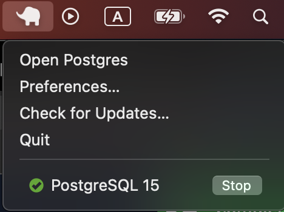
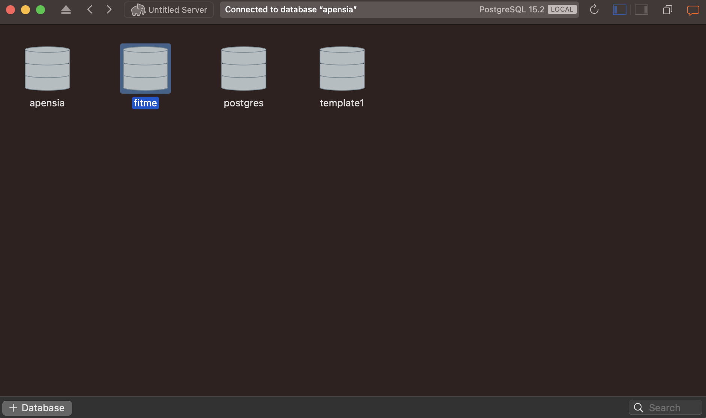

import { Cards, Card } from "@components/card";
import { Tab, Tabs, Steps } from "nextra-theme-docs";

# 데이터베이스 연동

NestJS와 데이터베이스를 연락시키기 위한 수단으로써

1. NodeJS 데이터베이스와 관련된 라이브러리 혹은 
2. TypeORM, Prisma, Sequelize와 같은 ORM

을 사용하는 방법이 있다.

 

## PostgreSQL

<Steps>
### PostgreSQL 설치 
<Tabs items={['MacOS', 'Windows']}>
  <Tab>
      [Postgres.app의 Downloads 탭](https://postgresapp.com/downloads.html)에서 Latest Release 클라이언트를 다운로드 한다.

      > 2023년 3월 30일 기준으로 최신 버전은 PostgreSQL 15.2버전이다.

      이후 설치를 완료하고 "Open Postgres"를 실행한다.

      

  </Tab>
  <Tab>
    Windows 버전 준비 중
  </Tab>
</Tabs>

### PostgreSQL GUI 설치

<Tabs items={["MacOS", "Windows"]}>
  <Tab>
    [Postico](https://eggerapps.at/postico2/)를 다운받아 설치한다. 혹은
    Windows와 같이
    [PgAdmin4](https://www.pgadmin.org/download/pgadmin-4-macos/)를 다운받아
    설치해도 된다.
  </Tab>
  <Tab>
    [PgAdmin4](https://www.pgadmin.org/download/pgadmin-4-windows/)를 다운받아
    설치한다.
  </Tab>
</Tabs>

### 새 데이터베이스 만들기

<Tabs items={["MacOS", "Windows"]}>
  <Tab>
    Postico의 새 서버에서 `+ Database` 버튼을 눌러 새 데이터베이스를 생성한다. **이 때 생성한 데이터베이스의 이름을 확실히 기억해두자.**

    

  </Tab>
  <Tab>
    Windows 버전 준비 중
  </Tab>
</Tabs>

### USER 등록 및 비밀번호 설정

<Tabs items={["MacOS", "Windows"]}>
  <Tab>
    추후에 NestJS에서 데이터베이스와 연결하기 위해 USER 등록 및 비밀번호를 설정해야 한다.
    이번엔 Postgres.app에서 방금 전 만들었던 서버에서 더블클릭하면 Terminal 창이 나오는데 다음 명령어를 통해 비밀번호를 설정한다.

    `ALTER USER {유저명} WITH PASSWORD '{원하는 비밀번호}';`

    

  </Tab>
  <Tab>
    Windows 버전 준비 중
  </Tab>
</Tabs>
</Steps>
