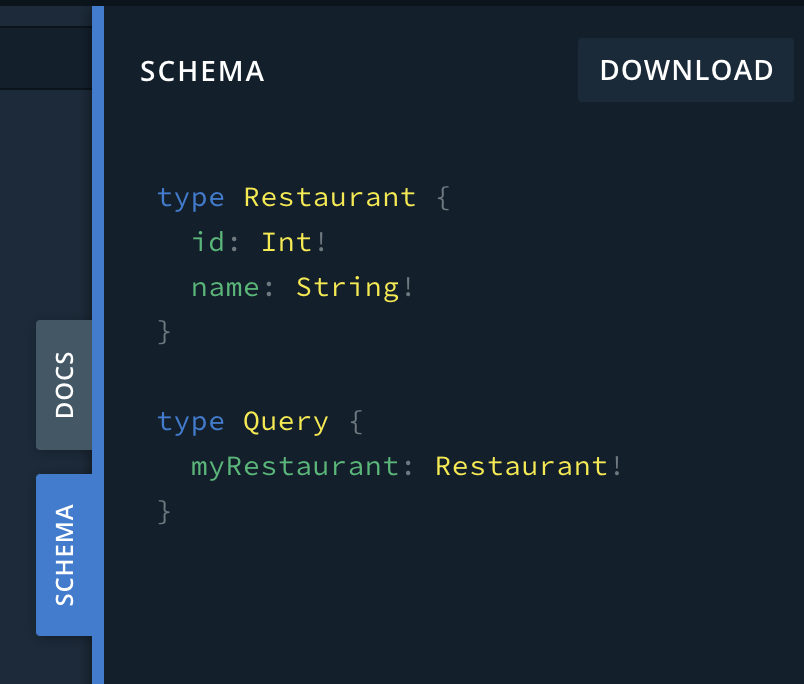
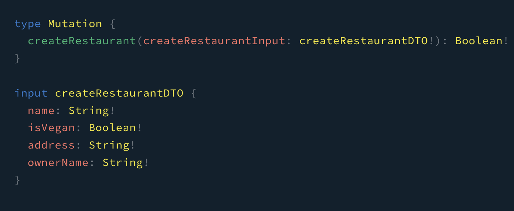

# GraphQL

## 설정

### 필요 패키지 설치

필요한 [패키지를 설치](https://docs.nestjs.com/graphql/quick-start#installation)한다.

```bash bash
npm i @nestjs/graphql @nestjs/apollo @apollo/server graphql
```

### `app.module.ts`에 연동

[공식 문서](https://docs.nestjs.com/graphql/quick-start#getting-started-with-graphql--typescript)에 나온대로 GraphQL를 연결시켜 준다.
`.forRoot()` 메소드는 글자 그대로 GraphQL의 root module를 설정해준다.

```ts src/app.module.ts
import { Module } from "@nestjs/common";
import { GraphQLModule } from "@nestjs/graphql";
import { ApolloDriver, ApolloDriverConfig } from "@nestjs/apollo";

@Module({
  imports: [
    GraphQLModule.forRoot<ApolloDriverConfig>({
      driver: ApolloDriver,
    }),
  ],
})
export class AppModule {}
```

## GraphQL 작성 방식

NestJS에서 GraphQL을 사용하는 법은 크게 다음과 같이 2가지 방식이 있다.

1. Schema First: 본인이 정의하고자 하는 Schema 파일에 따라 각기 다른 GraphQL 파일을 만들어내는 방식
2. Code First: NestJS 및 TypeScript에서 제공해주는 decorator를 통해서 코드 방식으로 GraphQL 파일을 만들어내는 방식

## Resolver 작성

<CH.Scrollycoding>

### 모듈 설치

새로운 NestJS의 모듈을 설치해준다.

```
nest g mo restaurants
```

---

### `resolver.ts` 생성

만들어진 모듈의 폴더 내부에 `resolver.ts` 파일을 생성한다.

```ts src/restaurants/restaurants.resolver.ts
import { Resolver } from "@nestjs/graphql";

@Resolver()
export class RestaurantResolver {}
```

---

### `module.ts`와 연결

만들어진 `resolver.ts` 파일을 `module.ts`와 연결한다.

```ts src/restaurants/restaurants.module.ts
import { Module } from "@nestjs/common";
import { RestaurantResolver } from "./restaurants.resolver";

@Module({
  providers: [RestaurantResolver],
})
export class RestaurantsModule {}
```

</CH.Scrollycoding>

## ObjectType 작성

[`ObjectType`](https://www.apollographql.com/docs/apollo-server/schema/schema/#object-types)은 자동으로 Schema를 빌드하기 위해 사용되는 GraphQL의 decorator이다.
Django의 모델과도 비슷한 개념이라 할 수 있다.

### `model.ts` 파일 만들기

<CH.Section>

```ts src/restaurants/models/restaurant.models.ts
import { Field, Int, ObjectType } from "@nestjs/graphql";

@ObjectType()
export class Restaurant {
  @Field((type) => Int)
  id: number;

  @Field((type) => String)
  name: string;
}
```

1. `@Field()` decorator를 통해 만들고자 하는 필드를 설정해주고 파라미터로 해당 필드의 속성값을 전달해준다. `@Field()` decorator는 전달받을 파라미터 값으로 함수를 넘겨받는데
   이 때 함수의 파라미터는 생략해도 되지만 보통의 경우 좀 더 직관적으로 표현하기 위해 `(type) => 속성값` 형태로 작성하게 된다.
2. 이어 아래에는 원하는 필드명과 그 필드명의 타입을 적어준다.

</CH.Section>

<CH.Section>

### Resolver와 연결하기

앞에서 만들어준 `Restaurant`이라는 entity(혹은 모델)을 Resolver와 연결시켜 준다.

```ts src/restaurants/restaurants.resolver.ts focus=2,4,6
import { Resolver, Query } from "@nestjs/graphql";
import { Restaurant } from "./models/restaurant.model";

@Resolver((of) => Restaurant)
export class RestaurantResolver {
  @Query((returns) => Restaurant)
  myRestaurant() {
    return true;
  }
}
```

</CH.Section>

그럼 아래와 같이 Graphql Playground에 들어간 후 Schema 부분을 확인해보면 다음과 같은 결과를 볼 수 있다.

<br />

<center>
  <figure style={{ width: "500px" }}>
    
  </figure>
</center>

## Argument 작성

Resolver에 Argument를 넣어서 좀 더 세분화된 Resolver를 만들어보겠다.

<CH.Section>

### `Resolver.ts` 파일 변경

```ts src/restaurants/restaurants.resolver.ts
import { Resolver, Query, Args } from "@nestjs/graphql";
import { Restaurant } from "./models/restaurant.model";

@Resolver((of) => Restaurant)
export class RestaurantResolver {
  @Query((returns) => [Restaurant])
  restaurants(@Args("veganOnly") veganOnly: boolean): Restaurant[] {
    return [];
  }
}
```

[`@Args()`](focus://7[14:52]) decorator를 사용하여 `veganOnly`라는 argument를 집어넣을 수 있게 하였다.

</CH.Section>

## `InputTypes` 작성

예를 들어 다음과 같이 `createRestaurant`이라 하는 Mutation이 있다고 가정해보자.

```ts src/restaurants/restaurants.resolver.ts focus=11:14
import { Resolver, Query, Args, Mutation } from "@nestjs/graphql";
import { Restaurant } from "./models/restaurant.model";

@Resolver((of) => Restaurant)
export class RestaurantResolver {
  @Query((returns) => [Restaurant])
  restaurants(@Args("veganOnly") veganOnly: boolean): Restaurant[] {
    return [];
  }

  @Mutation((returns) => Boolean)
  createRestaurant(): boolean {
    return true;
  }
}
```

그리고 [위에서 작성한 `ObjectType`](#objecttype-작성)에서 좀 더 확장을 시켜보자.

```ts src/restaurants/models/restaurant.model.ts focus=11:18
import { Field, Int, ObjectType } from "@nestjs/graphql";

@ObjectType()
export class Restaurant {
  @Field((type) => Int)
  id: number;

  @Field((type) => String)
  name: string;

  @Field((type) => Boolean, { nullable: true })
  isVegan?: boolean;

  @Field((type) => String)
  address: string;

  @Field((type) => String)
  ownerName: string;
}
```

2개 이상의 파라미터들을 argument로 집어넣는 노가다를 하는 것 보다는 여기선 `InputTypes`를 활용하는 것이 좀 더 적절할 수 있다.
`InputTypes`는 모든 것을 객체 통째로 전달할 수 있게 해준다.

<CH.Scrollycoding>

### `dto` 파일 만들기

DTO(Data Transfer Object)는 어떤 데이터들을 넘길지가 들어 있는 하나의 객체라 보면 된다.
위의 예시에서는 `isVegan`, `address`, `ownerName` 이 세 argument들을 전달할 것이기 때문에 이들을 한데로 묶어놓는 작업을 해야 한다.

```ts restaurants/dto/createRestaurant.dto.ts
import { InputType, Field } from "@nestjs/graphql";

@InputType()
export class createRestaurantDTO {
  @Field((type) => String)
  name: string;

  @Field((type) => Boolean)
  isVegan: boolean;

  @Field((type) => String)
  address: string;

  @Field((type) => String)
  ownerName: string;
}
```

---

### 연결

앞서 만든 `createRestaurant` mutation에 연결시켜 준다.

```ts restaurants/restaurants.resolver.ts focus=14
import { Resolver, Query, Args, Mutation } from "@nestjs/graphql";
import { Restaurant } from "./models/restaurant.model";
import { createRestaurantDTO } from "./dtos/createRestaurant.dto";

@Resolver((of) => Restaurant)
export class RestaurantResolver {
  @Query((returns) => [Restaurant])
  restaurants(@Args("veganOnly") veganOnly: boolean): Restaurant[] {
    return [];
  }

  @Mutation((returns) => Boolean)
  createRestaurant(
    @Args("createRestaurantInput") createRestaurantInput: createRestaurantDTO
  ) {
    console.log(createRestaurantInput);
    return true;
  }
}
```

</CH.Scrollycoding>

그럼 아래와 같이 `createRestaurantInput`이라는 파라미터를 받게끔 되어진다.

<br />

<center>
  <figure style={{ width: "500px" }}>
    
  </figure>
</center>

## `ArgsType` 작성

`InputType`의 문제점은 우리가 지정해준 필드에 해당하는 값들을 GraphQL에 일일히 적어서 알려줘야 한다는 점이다.

`ArgsType`는 기본적으로 필드들을 분리된 argument로써 정의할 수 있게 해준다.

<CH.Scrollycoding>

### `ArgsType` 정의

```ts restaurants/dto/createRestaurant.dto.ts
import { ArgsType, Field } from "@nestjs/graphql";

@ArgsType()
export class createRestaurantDTO {
  @Field((type) => String)
  name: string;

  @Field((type) => Boolean)
  isVegan: boolean;

  @Field((type) => String)
  address: string;

  @Field((type) => String)
  ownerName: string;
}
```

---

### 연결

앞서 만든 `createRestaurant` mutation에 연결시켜 준다.

```ts restaurants/restaurants.resolver.ts focus=13
import { Resolver, Query, Args, Mutation } from "@nestjs/graphql";
import { Restaurant } from "./models/restaurant.model";
import { createRestaurantDTO } from "./dtos/createRestaurant.dto";

@Resolver((of) => Restaurant)
export class RestaurantResolver {
  @Query((returns) => [Restaurant])
  restaurants(@Args("veganOnly") veganOnly: boolean): Restaurant[] {
    return [];
  }

  @Mutation((returns) => Boolean)
  createRestaurant(@Args() createRestaurantInput: createRestaurantDTO) {
    console.log(createRestaurantInput);
    return true;
  }
}
```

</CH.Scrollycoding>

그럼 아래와 같이 `createRestaurantInput`이라는 파라미터를 받게끔 되어진다.

<br />

<center>
  <figure style={{ width: "500px" }}>
    
  </figure>
</center>
