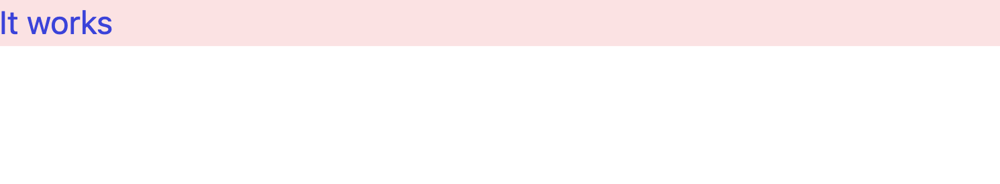

# TailwindCSS

굳이 따로 CSS/SCSS 파일을 만들 필요 없이 손쉽게 클래스 이름만으로도 CSS 스타일링을 가능케 해주는 스타일링 라이브러리이다.
Bootstrap 등을 즐겨 쓰는 개발자라면 더욱 쉽게 느껴질 수도 있겠다.

## 설치

### Package 다운로드

프로젝트의 폴더에 패키지를 [PostCSS 방식으로 설치](https://tailwindcss.com/docs/installation/using-postcss)한다.
물론 설치 방법은 다양하게 있으니 참조하자.

```bash
npm i -D tailwindcss postcss autoprefixer
npx tailwindcss init
```

<div className="steps-container">

<CH.Scrollycoding>

### Config 파일 설정

`npx tailwindcss init` 명령어를 실행하게 되면 프로젝트 루트 경로에 `tailwind.config.js`라는 설정 파일이 자동으로 생성된다.

```js tailwind.config.js
/** @type {import('tailwindcss').Config} */
module.exports = {
  content: [],
  theme: {
    extend: {},
  },
  plugins: [],
};
```

---

### `content` 설정

`content`는 프로젝트 루트 경로 중 어느 파일에 TailwindCSS를 입힐 건지 결정하는 부분이다.
만일 프로젝트 생성 때 `src/` 폴더를 포함하는 것으로 생성했다면 `src/`를 추가하도록 하자.
다음 코드는 폴더의 모든 하위 `.js`, `.jsx`, `.ts`, `.tsx` 파일에 TailwindCSS를 적용시키겠다는 의미이다.

```js tailwind.config.js focus=3:6
/** @type {import('tailwindcss').Config} */
module.exports = {
  content: ["./src/**/*.{js,jsx,ts,tsx}"],
  theme: {
    extend: {},
  },
  plugins: [],
};
```

---

### `global.css` 설정

`global.css`에 다음 코드를 삽입한다.

```css src/styles/globals.css
@tailwind base;
@tailwind components;
@tailwind utilities;
```

</CH.Scrollycoding>

</div>

## 결과

다음과 같이 `index.tsx`를 원하는대로 바꾸는데 성공했다면 설정은 완료된 것이다.

```tsx src/pages/index.tsx
import Head from "next/head";
import Image from "next/image";
import { Inter } from "@next/font/google";
import styles from "@/styles/Home.module.css";

const inter = Inter({ subsets: ["latin"] });

export default function Home() {
  return (
    <div className="bg-red-100">
      <h1 className="text-blue-700">It works</h1>
    </div>
  );
}
```



## 참조

VSCode를 이용한다면 [Tailwind CSS IntelliSense](https://marketplace.visualstudio.com/items?itemName=bradlc.vscode-tailwindcss) 익스텐션을 다운로드 받으면 자동완성 기능을 사용할 수 있다.
