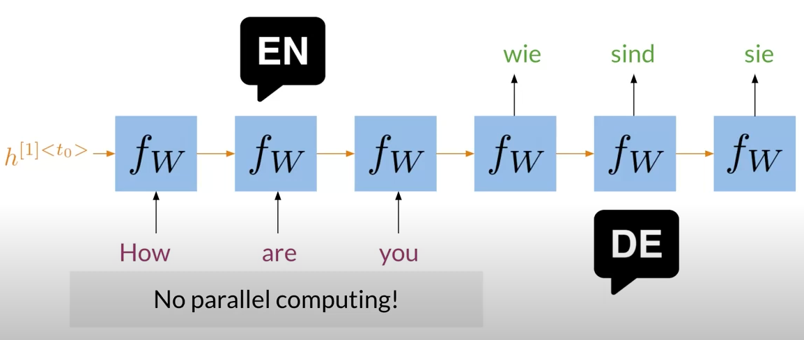
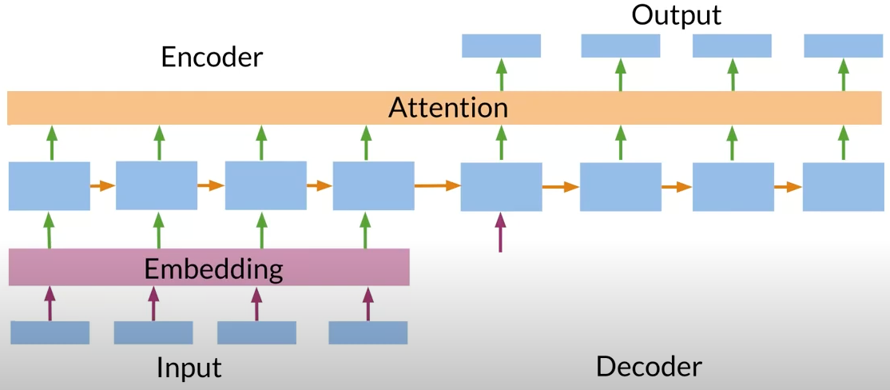

# Transformer

Seq2Seq 및 Seq2Seq with Attention 모델의 한계점을 보완하기 위해 만들어진 모델이며 Attention만을 활용하여 딥러닝 기반의 자연어처리 기술이 가지고 있는
장기 문맥 손실 및 속도 면에서의 단점을 고치고자 하는 목적이 있다.

## 특징

> Since our model contains no recurrence and no convolution, in order for the model to make use of the
> order of the sequence, we must inject some information about the relative or absolute position of the tokens in the sequence.

Transformer의 가장 큰 특징은 [3.5 Positional Encoding](https://arxiv.org/pdf/1706.03762.pdf) 부분에서 볼 수 있듯이 CNN의 Convolution도, RNN의 Recurrence도 사용하지 않는다는 점이다.

RNN이 가지고 있던 고질적인 문제점 중 하나는 바로 [장기 문맥 손실(LSTM)](https://en.wikipedia.org/wiki/Long_short-term_memory) 문제점인데 <ins>_어떤 정보와 다른 정보 사이의 거리가 멀 때 해당 정보를 이용하지 못하는 것_</ins>을 의미한다.
이는 [Attention Mechanism](<https://en.wikipedia.org/wiki/Attention_(machine_learning)>)으로 해결할 수 있었다.
또한, RNN은 이전 hidden state를 사용하여 순차적으로 계산할 수 밖에 없어 병렬화가 불가능했기 때문에 빠른 연산이 불가능했었으나, 이는 행렬 연산을 통한 병렬화가 가능해지면서 속도가 훨씬 개선될 수 있었다.
이처럼, Transformer는 Attention이 가지고 있는 장점을 취하고 RNN이 가지고 있었던 속도의 단점을

## RNN과의 차이점

아래 그림에서 RNN의 Seq2Seq 방식 상에선 각각의 단어들의 의미를 다른 언어로 치환하기 위해서는 문장 내에서의 단어가 가지는 문맥의 정보가 전달이 되어야 한다.

 

  <figure>
    
    <figcaption>
      출처: [Machine Learning TV](https://youtu.be/EFkbT-1VGTQ?t=78)
    </figcaption>
  </figure>

 

하지만 Transformer 상에서는 RNN과 다르게 Multi-Headed Attention을 토대로 하여

 

  <figure>
    
    <figcaption>
      출처: [Machine Learning TV](https://youtu.be/EFkbT-1VGTQ?t=181)
    </figcaption>
  </figure>

 

## 동작 방식

기본적으로 Seq2Seq와 비슷하게

 

  <figure>
    
    <figcaption>
      출처: [Machine Learning TV](https://youtu.be/EFkbT-1VGTQ?t=181)
    </figcaption>
  </figure>

