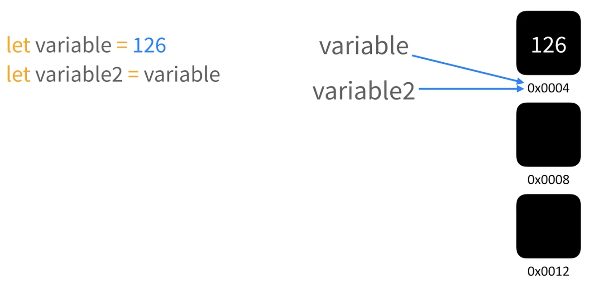

# 리액트 훅

## `useState`

상태(state)란 <ins>**변화할 수 있는 값**</ins>을 의미한다.

### 불변성을 지켜야 하는 이유

상태의 불변성을 지켜야 하는 이유를 살펴보기 전에 자바스크립트의 메모리에 대해서 간략하게 살펴보도록 하자.

자바스크립트에서 변수를 생성할 때에는 변수의 고유 식별자를 생성한 후 그 생성된 식별자의 값이 들어갈 메모리 공간을 할당하여 값을 저장한다. 예컨대 다음과 같이 변수를 하나 지정했다고 가정해보자.
여기서 만일 새로운 변수명 `variable2`를 만들어 `variable1`의 값에 대입을 하게 될 경우 `variable2`는 `variable1`과 동일한 메모리 주소를 가리키게 된다.

```js
let variable1 = 126;
let variable2 = variable1;
```

<br />

<div className="container">
  <div className="image-wrapper">
    
  </div>
</div>

<br />

그렇다면 `variable1`에 새로운 연산을 한 다음 저장하게 되면 `variable2`의 값은 어떻게 변하게 될까?

```js
variable1 = variable1 + 1;
console.log(variable1, variable2);
```

답은 <ins><i>"변경되지 않는다"</i></ins>이다. 즉, `variable1`의 새로운 값인 `127`은 연산이 수행되어 새로운 값을 받게 되면서 새로운 메모리 주소에 값이 할당되게 되고, `variable2`의 값은 변경되지 않는다.
이 이유는 자바스크립트의 원시 타입(Primitive Types)은 변경이 불가능하기 때문이다.

<br />

<div className="container">
  <div className="image-wrapper">
    
  </div>
</div>

<br />

그렇다면 참조 타입의 경우엔 아떻게 될까? 자바스크립트에서 객체 타입은 모두 참조 타입으로 분류가 된다. 가장 간단하게 배열을 예시로 들어보자.

<br />

<div className="container">
  <div className="image-wrapper">
    
  </div>
</div>

불변성(Immutability)이란 글자 그대로 <ins>_변하지 않는 성질_</ins>을 의미한다.

## `useEffect`
