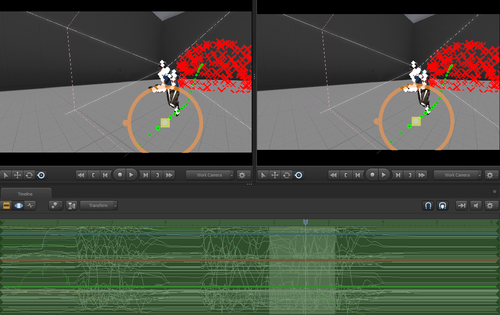
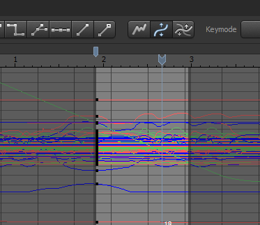
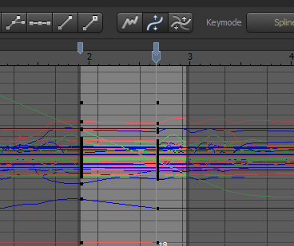
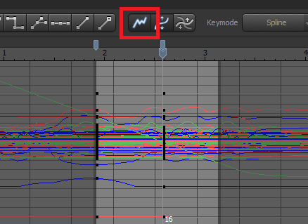

# Modifying Existing Animations

Let's edit existing animations created by recording, sequence or animation with graph editor.

For example, if we set bookmark at certain point of animation for modifying,

 

  

 

animation curve becomes flattened before bookmark.

 

  

 

This breaks our existing animation, turning into loose animation.

## Toggle Offset Mode

The reason why this happens is because offset is NOT included in our existing animation.
To fix this, let's turn on the Toggle offset mode.

 

  

 

By doing this, every time we set bookmark, it won't break the original existing animation by adding offset.
