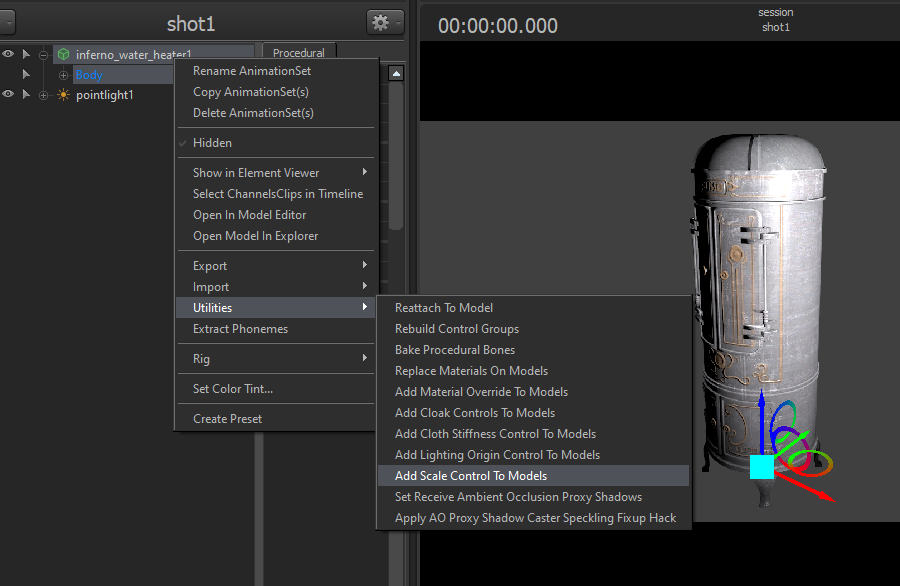
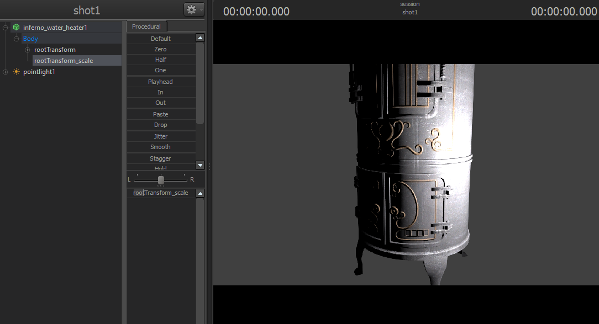
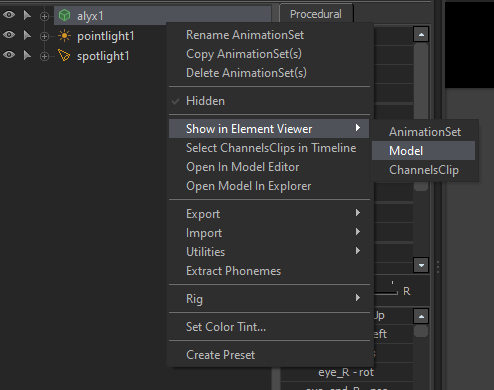
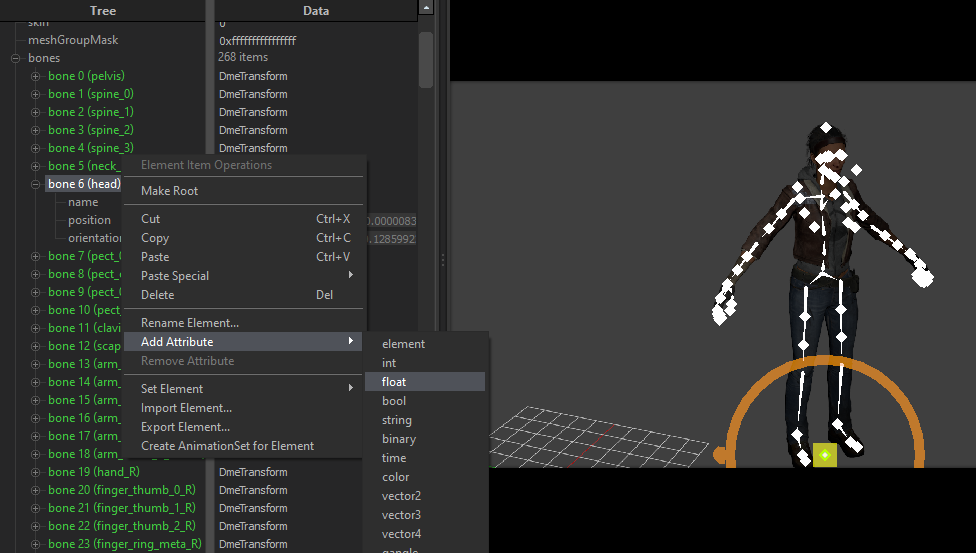
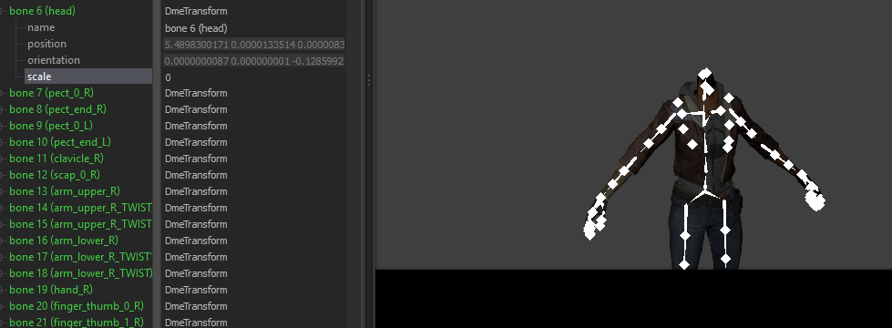
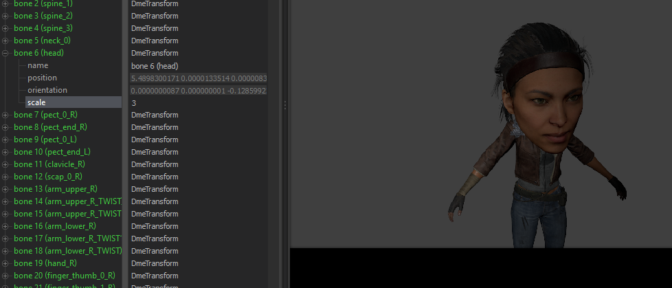

# 모델 사이즈 조절하기

## 전체 사이즈 조절하기

### Scale Control 추가하기

먼저 모델을 불러와준 후, 모델을 마우스 우클릭 후 Utilities &rarr; Add Scale Control To Models 메뉴를 클릭한다.

### rootTransform_scale 조절하기

이후 추가된 rootTransform_scale로 모델의 전체 크기를 자유자재로 조절한다.

 

## 🆕 개별 Bone의 사이즈 조절하기

### Model Element Viewer 들어가기

불러온 모델을 마우스 우클릭한 후 Show in Element Viewer &rarr; Model을 클릭하여 Element Viewer로 들어간다.

 

  

 

### Bone에 float 변수 추가하기

Bone 메뉴를 펼쳐서 크기를 바꾸길 원하는 Bone을 찾은 후 마우스 우클릭하여 Add Attribute &rarr; float을 선택해준다.

 

  

 

### scale 변수 추가하기

이후 `scale`이라는 이름으로 float 타입의 변수를 추가해준다.

 

  

 

### Bone 크기 조절하기

그럼 갑자기 캐릭터의 머리가 없어지는 걸 확인할 수 있다.

 

  

 

이는 초기 설정이 0으로 되어 있기 때문이며, 당황하지 말고 `scale` 변수의 값을 바꿔주도록 하자.
값에 따라서 X배로 크기가 커진다 (예: 2를 기입하면 2배, 10을 기입하면 10배로 증가)

<br/ >

  

